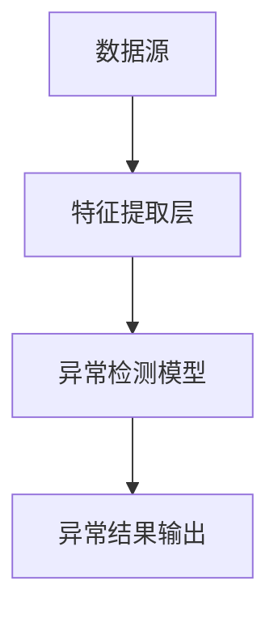

                 


# 如何识别企业的深度学习异常检测优势

## 关键词
深度学习，异常检测，企业应用，模型优势，算法原理，系统架构，项目实战

## 摘要
在企业数据爆炸式增长的今天，异常检测已成为保障企业安全、优化运营效率的关键技术。深度学习作为一种强大的机器学习方法，凭借其出色的特征学习能力和处理复杂数据的能力，正在成为企业异常检测领域的主流技术。本文将从深度学习异常检测的核心概念、算法原理、系统架构到项目实战，全面解析如何识别和应用深度学习在企业异常检测中的优势。通过本文，读者将能够理解深度学习异常检测的技术本质，并掌握在企业场景中如何有效应用这些技术。

---

## 第一部分: 深度学习异常检测的背景与核心概念

### 第1章: 异常检测概述

#### 1.1 异常检测的基本概念
- **1.1.1 什么是异常检测**  
  异常检测（Outlier Detection）是数据分析领域的重要任务，旨在识别数据集中与大多数数据点显著不同的数据点或模式。异常通常对应于潜在的威胁、错误或机会。

- **1.1.2 异常检测的分类**  
  - 单变量异常检测：基于单一特征的异常检测，常用于简单的数据集。  
  - 多变量异常检测：基于多个特征的异常检测，适用于复杂场景。  
  - 时间序列异常检测：基于时间依赖性的异常检测，常用于金融、工业等领域。

- **1.1.3 异常检测在企业中的重要性**  
  在企业中，异常检测广泛应用于 fraud detection（欺诈检测）、network security（网络安全）、system health monitoring（系统健康监控）等领域，能够帮助企业及时发现潜在风险，优化运营效率。

#### 1.2 深度学习与异常检测的结合
- **1.2.1 深度学习的基本概念**  
  深度学习是一种机器学习技术，通过多层非线性变换模拟人脑的神经网络，能够从大量数据中自动提取特征。

- **1.2.2 深度学习在异常检测中的优势**  
  - 强大的特征学习能力：深度学习能够自动提取数据的高层次特征，无需人工特征工程。  
  - 处理非结构化数据：深度学习擅长处理图像、文本、时间序列等非结构化数据。  
  - 鲁棒性高：深度学习模型在面对复杂场景时表现稳定。

- **1.2.3 企业中异常检测的常见场景**  
  - 金融领域的欺诈交易检测。  
  - 网络安全中的入侵检测。  
  - 工业生产中的设备故障预测。

#### 1.3 传统异常检测方法的局限性
- **1.3.1 基于规则的异常检测**  
  - 优点：简单易实现。  
  - 缺点：规则难以覆盖所有可能的异常情况，且难以扩展到复杂场景。

- **1.3.2 基于统计的异常检测**  
  - 优点：适用于简单数据集。  
  - 缺点：在面对高维数据或复杂分布时表现不佳。

- **1.3.3 基于机器学习的传统方法**  
  - 优点：相比规则和统计方法，具有更高的灵活性。  
  - 缺点：特征工程复杂，模型泛化能力有限。

#### 1.4 深度学习在异常检测中的优势
- **1.4.1 高维数据处理能力**  
  深度学习能够有效处理高维数据，避免了传统方法在高维空间中的“维度灾难”问题。

- **1.4.2 自动特征学习**  
  深度学习模型能够自动提取数据中的深层特征，减少了人工特征工程的工作量。

- **1.4.3 鲁棒性和可扩展性**  
  深度学习模型在面对数据分布变化和噪声干扰时表现出更强的鲁棒性，且易于扩展到更大规模的数据集。

---

## 第二部分: 核心概念与联系

### 第2章: 深度学习异常检测的核心概念

#### 2.1 深度学习异常检测的原理
- **2.1.1 自动编码器（Autoencoder）**  
  - 自动编码器是一种无监督学习模型，用于学习数据的低维表示。  
  - 异常检测方法：将正常数据点压缩到低维空间，异常点在重构时会产生较大的误差。

- **2.1.2 变分自编码器（VAE, Variational Autoencoder）**  
  - VAE通过概率建模的方法，学习数据的分布。  
  - 异常检测方法：通过重构概率判断数据点是否异常。

- **2.1.3 生成对抗网络（GAN, Generative Adversarial Network）**  
  - GAN由生成器和判别器组成，通过对抗训练学习数据分布。  
  - 异常检测方法：生成器生成正常数据，判别器区分正常和异常数据。

#### 2.2 深度学习异常检测的模型对比
| 模型类型       | 优势                     | 劣势                     | 适用场景                     |
|----------------|--------------------------|--------------------------|----------------------------|
| 自动编码器（Autoencoder） | 易于实现，适合无监督学习 | 对异常点的定位能力较弱     | 适用于中小型数据集           |
| 变分自编码器（VAE）       | 概率建模能力强           | 训练过程较复杂             | 适用于概率建模需求的场景     |
| 生成对抗网络（GAN）      | 异常检测效果较好         | 训练过程不稳定，难以调试   | 适用于生成式任务             |

#### 2.3 实体关系图（ER图）


---

## 第三部分: 算法原理讲解

### 第3章: 深度学习异常检测的算法原理

#### 3.1 自动编码器（Autoencoder）
- **3.1.1 模型结构**  
  ```mermaid
  graph TD
      Input --> Encoder
      Encoder --> Decoder
      Decoder --> Output
  ```
  - 输入数据经过编码器（Encoder）压缩成低维表示，再通过解码器（Decoder）还原成高维数据。

- **3.1.2 异常检测方法**  
  - 计算输入数据与重构数据之间的重建误差（Reconstruction Error）。  
  - 当重建误差超过阈值时，判断为异常数据。

- **3.1.3 数学公式**  
  $$ \text{重建误差} = ||x - \hat{x}|| $$  
  其中，\( x \) 是输入数据，\( \hat{x} \) 是重构数据。

#### 3.2 变分自编码器（VAE）
- **3.2.1 模型结构**  
  VAE通过概率建模的方法，将数据分布建模为均值和方差的形式。  
  $$ p(x) = \int q(x,z)p(z)dz $$  
  其中，\( q(x,z) \) 是数据和隐变量的联合分布，\( p(z) \) 是隐变量的先验分布。

- **3.2.2 异常检测方法**  
  - 计算数据点的重构概率 \( p(x) \)。  
  - 当 \( p(x) \) 小于阈值时，判断为异常数据。

#### 3.3 生成对抗网络（GAN）
- **3.3.1 模型结构**  
  GAN由生成器和判别器组成，通过对抗训练学习数据分布。  
  $$ \min_{G} \max_{D} \mathbb{E}_{x}[ \log D(x) ] + \mathbb{E}_{z}[ \log (1 - D(G(z))) ] $$  

- **3.3.2 异常检测方法**  
  - 生成器生成正常数据，判别器区分正常和异常数据。  
  - 当判别器判定某数据点为异常时，进一步分析其是否为真实异常。

---

## 第四部分: 系统分析与架构设计方案

### 第4章: 深度学习异常检测的系统架构

#### 4.1 问题场景介绍
- 以金融领域的欺诈交易检测为例，设计一个基于深度学习的异常检测系统。

#### 4.2 系统功能设计
- **领域模型**  
  ```mermaid
  classDiagram
      class 交易数据 {
          用户ID
          交易时间
          交易金额
          交易地点
      }
      class 异常检测模型 {
          输入层
          编码层
          解码层
          输出层
      }
      class 系统输出 {
          正常交易
          可疑交易
      }
      交易数据 --> 异常检测模型
      异常检测模型 --> 系统输出
  ```

- **系统架构**  
  ```mermaid
  architecture
  Client -->> API Gateway: 请求交易数据
  API Gateway -->> 数据库: 查询用户信息
  API Gateway -->> 异常检测服务: 调用深度学习模型
  异常检测服务 -->> 系统输出: 返回检测结果
  ```

---

## 第五部分: 项目实战

### 第5章: 基于深度学习的异常检测实战

#### 5.1 环境配置
- 安装 Python、Keras 和 TensorFlow 环境。

#### 5.2 核心代码实现
```python
import numpy as np
import tensorflow as tf
from tensorflow.keras import layers

# 定义自动编码器模型
class Autoencoder(tf.keras.Model):
    def __init__(self, input_dim):
        super(Autoencoder, self).__init__()
        self.encoder = layers.Dense(64, activation='relu')
        self.decoder = layers.Dense(input_dim, activation='sigmoid')

    def call(self, inputs):
        encoded = self.encoder(inputs)
        decoded = self.decoder(encoded)
        return decoded

# 初始化模型
input_dim = 100
autoencoder = Autoencoder(input_dim)
autoencoder.compile(optimizer='adam', loss='binary_crossentropy')

# 训练模型
x_train = np.random.randn(1000, input_dim)
y_train = x_train  # 监督学习中使用重构任务

autoencoder.fit(x_train, y_train, epochs=100, batch_size=32)
```

#### 5.3 案例分析与结果解读
- 训练完成后，使用测试数据进行异常检测。  
- 计算每个数据点的重建误差，判断是否为异常数据。

---

## 第六部分: 总结与展望

### 第6章: 总结与展望

#### 6.1 最佳实践
- 数据质量是关键：确保数据的完整性和代表性。  
- 模型调优：根据实际场景调整模型参数和架构。  
- 模型部署：结合企业需求选择合适的部署方式。

#### 6.2 未来研究方向
- 更高效的数据处理方法：如图神经网络、强化学习等。  
- 更加鲁棒的模型：如基于对比学习的异常检测方法。  
- 多模态数据融合：结合文本、图像等多种数据源进行异常检测。

---

## 参考文献
1. Goodfellow, I., Bengio, Y., & Courville, A. (2016). *Deep Learning*. MIT Press.  
2. Bishop, C. M. (2006). *Pattern Recognition and Machine Learning*. Springer.  
3. LeCun, Y., Bengio, Y., & Hinton, G. (2015). *Deep Learning*. Nature, 521(7555), 436-444.

---

## 作者
作者：AI天才研究院 & 禅与计算机程序设计艺术

