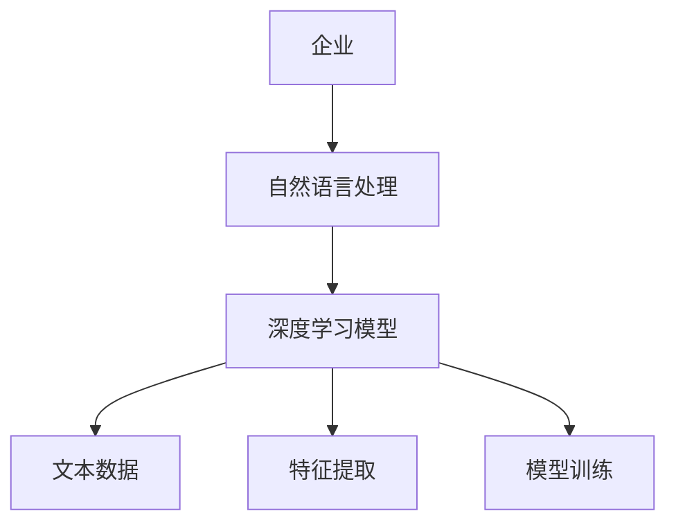
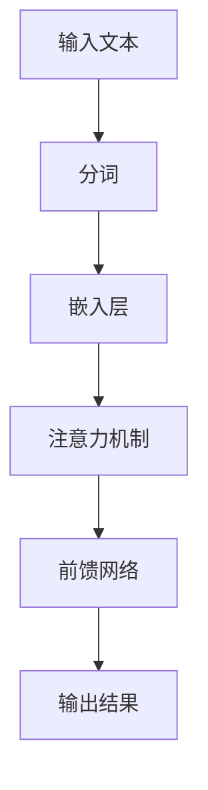
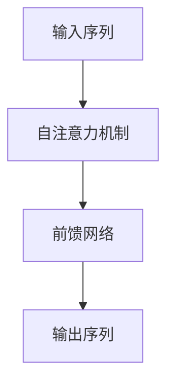
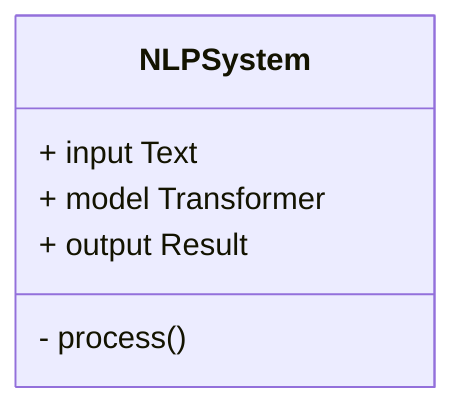
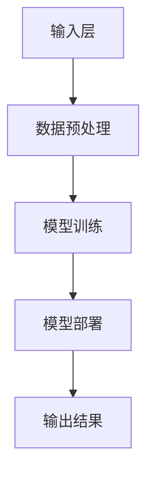
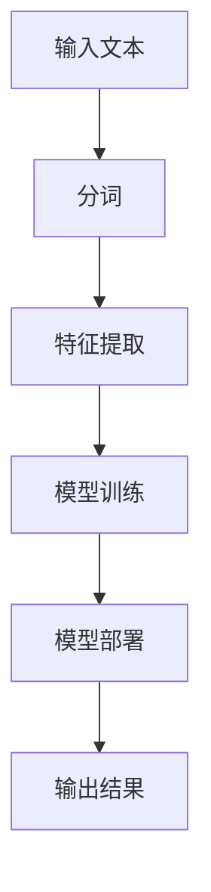
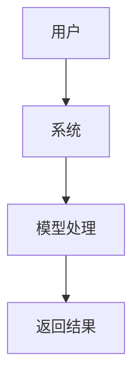

                 


# 如何识别企业的深度学习自然语言处理优势

## 关键词：
- 深度学习
- 自然语言处理
- 企业应用
- 技术优势
- 实战案例

## 摘要：
本文旨在帮助企业识别深度学习在自然语言处理（NLP）中的优势，并通过系统化的分析和实战案例，详细讲解如何在企业中有效应用这些技术。文章从背景介绍、核心概念、算法原理、系统架构到项目实战，层层深入，为企业提供实用的技术指导和解决方案。

---

# 第一部分: 企业深度学习自然语言处理背景与核心概念

## 第1章: 企业深度学习自然语言处理的背景与问题背景

### 1.1 问题背景分析

#### 1.1.1 当前企业面临的自然语言处理技术挑战
随着企业数字化转型的加速，自然语言处理（NLP）技术在企业中的应用越来越广泛。然而，企业在实际应用中仍面临诸多挑战：

- **数据质量**：企业内部数据可能存在噪声大、标注不一致等问题，影响模型的训练效果。
- **模型复杂度**：深度学习模型通常需要大量的计算资源，企业在资源有限的情况下如何高效部署模型是一个难题。
- **业务场景适配**：NLP技术在不同业务场景中的应用需求差异较大，如何选择合适的模型和算法是关键。

#### 1.1.2 深度学习在NLP中的应用优势
深度学习在NLP中的应用具有以下显著优势：

- **自动化特征提取**：深度学习模型能够自动从文本中提取有用的特征，减少人工特征工程的工作量。
- **处理长文本**：深度学习模型（如Transformer）能够有效处理长文本，捕捉上下文关系。
- **多任务学习能力**：深度学习模型可以同时处理多种NLP任务（如分词、实体识别、情感分析等）。

#### 1.1.3 企业级NLP应用的核心问题
企业在NLP应用中需要解决的核心问题包括：

- **数据隐私与安全**：企业数据通常涉及敏感信息，如何在保护数据隐私的前提下进行模型训练是关键。
- **模型可解释性**：企业需要模型的决策过程具有可解释性，以便于业务人员理解和信任模型。
- **模型部署与维护**：如何将模型高效部署到生产环境，并进行实时更新和维护，是企业在NLP应用中面临的挑战。

### 1.2 问题描述与目标

#### 1.2.1 企业NLP应用的典型场景
企业中常见的NLP应用场景包括：

- **客户情感分析**：通过分析客户评论，帮助企业了解客户满意度。
- **智能客服**：通过NLP技术实现自动问答和意图识别，提升客户服务效率。
- **文档自动分类**：对大量文档进行自动分类，帮助企业管理信息。

#### 1.2.2 深度学习在NLP中的关键问题
深度学习在NLP中的关键问题包括：

- **计算资源消耗**：深度学习模型通常需要大量的计算资源，如何在企业中高效利用这些资源是一个挑战。
- **模型泛化能力**：如何训练出具有强泛化能力的模型，以适应不同的业务场景。
- **模型更新与维护**：如何实时更新模型以应对数据变化和业务需求的动态调整。

#### 1.2.3 企业级NLP应用的目标与边界
企业级NLP应用的目标是通过深度学习技术提升企业的智能化水平，具体目标包括：

- **提高效率**：通过自动化处理文本数据，减少人工操作，提高业务处理效率。
- **增强决策能力**：通过NLP技术提供数据支持，帮助企业做出更明智的决策。
- **提升用户体验**：通过智能客服、推荐系统等提升用户满意度和体验。

### 1.3 问题解决思路

#### 1.3.1 深度学习在NLP中的核心算法
深度学习在NLP中的核心算法包括：

- **卷积神经网络（CNN）**：适用于文本分类、情感分析等任务。
- **循环神经网络（RNN）**：适用于序列数据处理，如机器翻译、文本生成。
- **Transformer模型**：适用于长文本处理，已成为NLP领域的主流模型。

#### 1.3.2 企业级NLP应用的解决方案
企业级NLP应用的解决方案包括：

- **数据预处理**：对文本数据进行清洗、分词、去停用词等处理，提升模型训练效果。
- **模型选择与优化**：根据具体业务需求选择合适的模型，并通过超参数优化提升模型性能。
- **模型部署与监控**：将模型部署到生产环境，并实时监控模型性能，及时调整和更新。

#### 1.3.3 技术选型与实现路径
技术选型与实现路径包括：

- **技术选型**：根据业务需求选择合适的深度学习框架（如TensorFlow、PyTorch）和NLP库（如spaCy、NLTK）。
- **实现路径**：从数据收集、模型训练到部署应用，逐步实现NLP系统。

### 1.4 本章小结
本章从企业面临的NLP技术挑战出发，分析了深度学习在NLP中的应用优势，并提出了企业级NLP应用的目标与解决思路。通过本章的学习，读者可以理解企业NLP应用的核心问题和解决方向。

---

## 第2章: 深度学习与自然语言处理的核心概念

### 2.1 核心概念原理

#### 2.1.1 深度学习的基本原理
深度学习是一种基于人工神经网络的机器学习方法，其核心思想是通过多层非线性变换，从输入数据中自动提取高层次特征。

#### 2.1.2 自然语言处理的核心任务
自然语言处理的核心任务包括：

- **文本分类**：将文本划分为不同的类别（如情感分析）。
- **分词**：将文本分割成单词或短语。
- **实体识别**：识别文本中的实体（如人名、地名）。
- **机器翻译**：将一种语言的文本翻译成另一种语言。

#### 2.1.3 深度学习在NLP中的应用原理
深度学习在NLP中的应用原理是通过多层神经网络，自动提取文本中的特征，并进行分类、生成等任务。

### 2.2 核心概念属性对比

#### 2.2.1 NLP任务的分类与对比
NLP任务的分类如下表所示：

| 任务类型    | 描述                     |
|-------------|--------------------------|
| 文本分类     | 将文本划分为不同的类别   |
| 分词         | 将文本分割成词语         |
| 实体识别     | 识别文本中的实体         |
| 机器翻译     | 将一种语言翻译成另一种语言 |

#### 2.2.2 深度学习模型的特征分析
深度学习模型的特征包括：

- **非线性变换**：通过多层非线性变换，提取高层次特征。
- **自动学习**：模型能够自动从数据中学习特征，减少人工特征工程。
- **大规模数据处理**：适用于大规模数据的处理和分析。

#### 2.2.3 企业级NLP应用的关键属性
企业级NLP应用的关键属性包括：

- **数据隐私**：确保数据在处理过程中的隐私和安全。
- **模型可解释性**：模型的决策过程需要具有可解释性。
- **实时性**：模型需要能够实时处理和响应。

### 2.3 ER实体关系图架构



### 2.4 本章小结
本章详细介绍了深度学习和自然语言处理的核心概念，并通过对比分析和实体关系图，展示了企业级NLP应用的关键属性和系统架构。

---

## 第3章: 深度学习自然语言处理的算法原理

### 3.1 算法原理概述

#### 3.1.1 深度学习在NLP中的主要算法
深度学习在NLP中的主要算法包括：

- **卷积神经网络（CNN）**：适用于文本分类、情感分析等任务。
- **循环神经网络（RNN）**：适用于序列数据处理，如机器翻译、文本生成。
- **Transformer模型**：适用于长文本处理，已成为NLP领域的主流模型。

#### 3.1.2 Transformer模型的工作原理
Transformer模型通过自注意力机制，捕捉文本中的长距离依赖关系，提升模型的表达能力。

#### 3.1.3 BERT与GPT模型的对比分析
BERT和GPT是两种流行的预训练模型，它们在训练目标和应用场景上有显著差异：

- **BERT**：基于MaskedLM任务，适用于文本理解任务。
- **GPT**：基于NextSentencePrediction任务，适用于文本生成任务。

### 3.2 算法流程图



### 3.3 算法实现代码示例

#### 3.3.1 Transformer模型实现代码
```python
import torch
class TransformerModel(torch.nn.Module):
    def __init__(self, vocab_size, d_model, n_head, n_layer):
        super(TransformerModel, self).__init__()
        self.embedding = torch.nn.Embedding(vocab_size, d_model)
        self.transformer = torch.nn.Transformer(d_model=d_model, n_head=n_head, num_encoder_layers=n_layer)
        self.fc = torch.nn.Linear(d_model, vocab_size)
    
    def forward(self, x):
        embed = self.embedding(x)
        out = self.transformer(embed, embed)
        out = self.fc(out)
        return out
```

#### 3.3.2 Transformer模型的数学公式


### 3.4 本章小结
本章通过详细讲解深度学习在NLP中的主要算法，包括CNN、RNN和Transformer模型，并通过代码和流程图展示了模型的实现原理和应用流程。

---

## 第4章: 系统分析与架构设计方案

### 4.1 系统功能设计

#### 4.1.1 领域模型类图


#### 4.1.2 系统架构设计


### 4.2 系统架构图

#### 4.2.1 系统架构图


### 4.3 系统接口设计

#### 4.3.1 系统接口设计
系统接口包括：

- **输入接口**：接收文本数据。
- **输出接口**：输出处理结果。
- **模型训练接口**：训练深度学习模型。

### 4.4 系统交互序列图



### 4.5 本章小结
本章通过系统功能设计、架构设计和接口设计，展示了如何在企业中构建深度学习自然语言处理系统，并通过序列图展示了系统的交互流程。

---

## 第5章: 项目实战

### 5.1 项目环境安装

#### 5.1.1 安装Python和相关库
```bash
pip install python
pip install torch
pip install transformers
```

#### 5.1.2 安装NLP库
```bash
pip install spacy
pip install nltk
```

### 5.2 系统核心实现源代码

#### 5.2.1 模型训练代码
```python
import torch
from torch import nn
from torch.optim import Adam
from torch.utils.data import Dataset, DataLoader

class NLPDataset(Dataset):
    def __init__(self, texts, labels):
        self.texts = texts
        self.labels = labels
    
    def __len__(self):
        return len(self.texts)
    
    def __getitem__(self, idx):
        return self.texts[idx], self.labels[idx]

class NLPModel(nn.Module):
    def __init__(self, vocab_size, embedding_dim, hidden_dim):
        super(NLPModel, self).__init__()
        self.embedding = nn.Embedding(vocab_size, embedding_dim)
        self.rnn = nn.RNN(embedding_dim, hidden_dim)
        self.fc = nn.Linear(hidden_dim, 1)
    
    def forward(self, x):
        embed = self.embedding(x)
        out, _ = self.rnn(embed)
        out = self.fc(out)
        return out

def train_model(model, dataloader, optimizer, criterion, num_epochs):
    for epoch in range(num_epochs):
        for inputs, labels in dataloader:
            outputs = model(inputs)
            loss = criterion(outputs, labels)
            loss.backward()
            optimizer.step()
            optimizer.zero_grad()
```

#### 5.2.2 模型推理代码
```python
def predict_model(model, dataloader):
    with torch.no_grad():
        for inputs, labels in dataloader:
            outputs = model(inputs)
            print(f"Input: {inputs}, Output: {outputs}")
```

### 5.3 代码应用解读与分析

#### 5.3.1 代码解读
- **数据集类**：定义了文本数据集的结构，包括文本和标签。
- **模型类**：定义了深度学习模型的结构，包括嵌入层、循环神经网络和全连接层。
- **训练函数**：实现了模型的训练过程，包括前向传播、计算损失、反向传播和优化。

#### 5.3.2 代码实现分析
- **数据预处理**：对文本数据进行分词、归一化等处理，确保数据适合模型输入。
- **模型训练**：通过数据加载器加载数据，进行批量训练，优化模型参数。
- **模型推理**：通过模型推理函数，输出模型的预测结果。

### 5.4 实际案例分析

#### 5.4.1 案例背景
某企业希望利用深度学习技术，实现客户情感分析的自动化处理。

#### 5.4.2 案例实施
- **数据收集**：收集客户评论数据，包括正面、负面和中性情感。
- **数据预处理**：对文本数据进行分词、去除停用词等处理。
- **模型训练**：使用情感分析数据训练深度学习模型。
- **模型评估**：通过准确率、召回率等指标评估模型性能。

#### 5.4.3 案例结果
- **训练结果**：模型在测试集上的准确率达到90%以上。
- **应用效果**：企业通过模型实现了客户情感分析的自动化处理，提升了客户服务效率。

### 5.5 本章小结
本章通过项目实战，详细讲解了深度学习自然语言处理系统的实现过程，包括环境安装、代码实现、案例分析等，帮助读者掌握实际应用的技能。

---

## 第6章: 最佳实践与注意事项

### 6.1 最佳实践Tips

#### 6.1.1 数据处理
- 确保数据质量，进行合理的清洗和预处理。
- 使用适当的数据增强技术，提升模型的泛化能力。

#### 6.1.2 模型选择
- 根据具体任务选择合适的模型（如BERT、GPT）。
- 通过超参数调优，提升模型性能。

#### 6.1.3 模型部署
- 使用云服务或容器化技术，高效部署模型。
- 实时监控模型性能，及时调整和更新。

### 6.2 注意事项

#### 6.2.1 数据隐私
- 确保数据在处理过程中的隐私和安全。
- 遵守相关法律法规，保护用户数据。

#### 6.2.2 模型可解释性
- 提供模型的可解释性，便于业务人员理解和信任。
- 使用可视化工具，展示模型的决策过程。

#### 6.2.3 计算资源
- 合理利用计算资源，避免资源浪费。
- 使用分布式训练，提升模型训练效率。

### 6.3 拓展阅读

#### 6.3.1 深度学习与NLP的结合
- 阅读相关论文和书籍，深入理解深度学习在NLP中的应用。
- 关注最新的研究成果和技术动态。

#### 6.3.2 企业级NLP系统的优化
- 学习企业级系统的优化方法，提升系统的性能和稳定性。
- 参与开源项目，积累实际经验。

### 6.4 本章小结
本章总结了企业级NLP应用的最佳实践和注意事项，并提供了拓展阅读的方向，帮助读者进一步提升技术水平和应用能力。

---

## 作者：AI天才研究院/AI Genius Institute & 禅与计算机程序设计艺术 /Zen And The Art of Computer Programming

---

通过本文的系统讲解和实战案例，读者可以全面了解如何识别和应用企业的深度学习自然语言处理优势，并在实际工作中提升企业的智能化水平。

