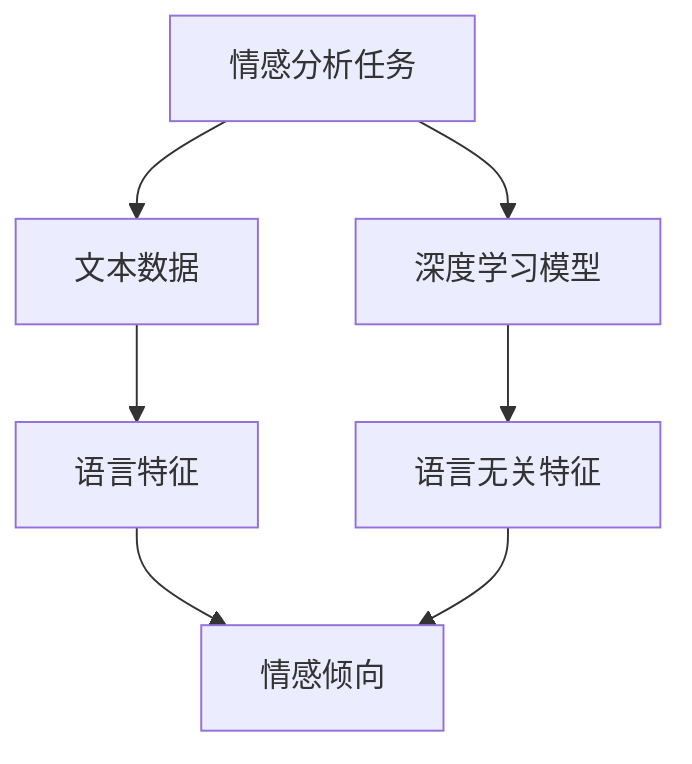
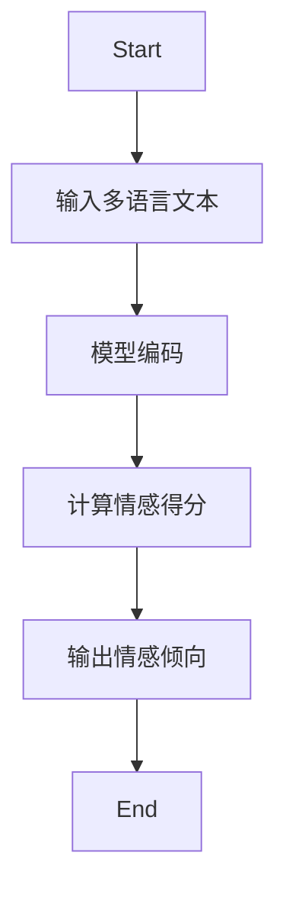
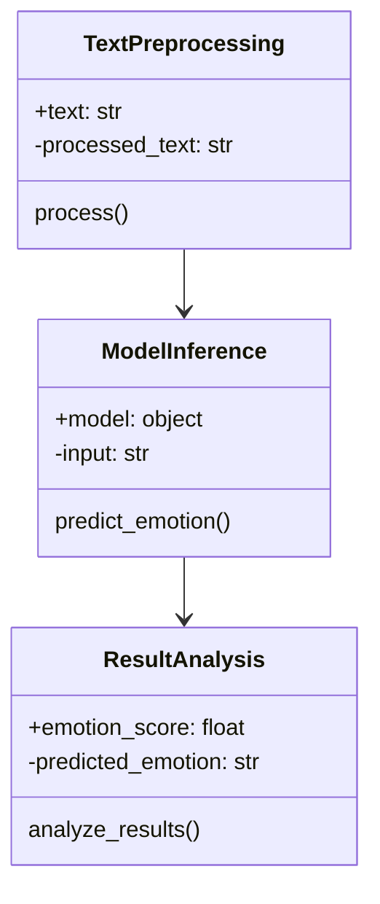
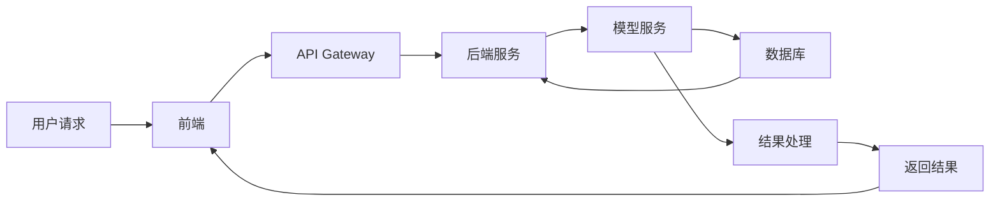
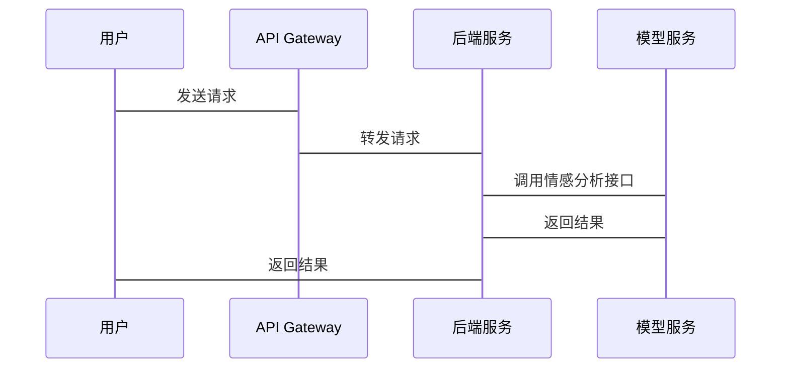

                 


# 如何识别企业的深度学习跨语言情感分析技术优势

> 关键词：深度学习，跨语言情感分析，技术优势，NLP，自然语言处理

> 摘要：本文旨在探讨企业如何识别深度学习跨语言情感分析技术的优势。通过分析情感分析的基本概念、跨语言情感分析的技术原理、算法实现、系统架构设计、实际项目案例以及最佳实践，本文将帮助读者理解如何有效利用深度学习技术提升跨语言情感分析的性能，为企业在多语言环境下的客户情感分析和市场研究提供理论支持和实践指导。

---

## 第一部分：背景介绍

### 第1章：跨语言情感分析的背景与挑战

#### 1.1 问题背景
- **情感分析的定义与应用**：情感分析是自然语言处理（NLP）中的一个核心任务，旨在识别文本中表达的情感倾向（如正面、负面或中性）。它广泛应用于社交媒体分析、客户反馈分析、市场研究等领域。
- **跨语言情感分析的重要性**：随着全球化的发展，企业需要处理多语言数据，跨语言情感分析能够帮助企业更好地理解不同语言客户的反馈，优化产品和服务。

#### 1.2 技术现状
- **深度学习在情感分析中的应用**：深度学习模型（如LSTM、Transformer）在情感分析中表现出色，尤其是在处理复杂语言结构和语义信息方面。
- **跨语言情感分析的技术挑战**：跨语言情感分析面临数据稀缺性、语言差异性以及文化差异性等问题，增加了模型训练和优化的难度。

#### 1.3 企业应用需求
- **企业为何需要跨语言情感分析**：企业在全球化市场中需要处理多种语言的客户反馈，跨语言情感分析能够帮助企业在不同语言市场中统一分析客户情感，提升客户满意度。
- **不同行业的需求差异**：金融、电商、社交媒体等行业对跨语言情感分析的需求不同，金融行业更关注风险预警，而电商行业更关注客户满意度。

#### 1.4 技术优势
- **提高客户满意度**：通过跨语言情感分析，企业可以更精准地理解客户反馈，及时调整产品策略，提升客户满意度。
- **增强市场竞争力**：跨语言情感分析能够帮助企业更好地理解多语言市场的需求，制定更有针对性的市场策略，增强市场竞争力。

#### 1.5 边界与外延
- **跨语言情感分析的适用范围**：适用于需要处理多语言文本数据的企业，尤其是涉及全球化业务的企业。
- **与其他NLP任务的区别**：与单语言情感分析不同，跨语言情感分析需要处理多语言数据，同时需要解决语言间的差异性问题。

#### 1.6 概念结构与核心要素
- **情感分析的基本要素**：包括文本数据、情感倾向（正面、负面、中性）。
- **跨语言情感分析的核心要素**：包括多语言数据处理、语言间的特征提取、文化差异处理。

---

## 第二部分：核心概念与联系

### 第2章：深度学习跨语言情感分析的核心概念与原理

#### 2.1 核心概念原理
- **跨语言情感分析的核心原理**：通过深度学习模型，将不同语言的文本映射到相同的语义空间，进行情感分析。
- **跨语言特征提取**：利用词嵌入（如Word2Vec、GloVe）或跨语言嵌入（如Multilingual BERT）提取语言无关的语义特征。

#### 2.2 核心概念属性对比
| 情感分析属性 | 单语言情感分析 | 跨语言情感分析 |
|--------------|----------------|----------------|
| 数据来源      | 单一语言文本    | 多种语言文本    |
| 模型训练      | 语言内数据      | 跨语言数据      |
| 情感预测      | 单一语言        | 多种语言        |

#### 2.3 ER实体关系图


---

## 第三部分：算法原理讲解

### 第3章：深度学习跨语言情感分析的算法实现

#### 3.1 模型结构
- **多语言BERT模型**：使用预训练的多语言模型（如mBERT）进行情感分析，模型在多种语言数据上进行预训练，能够直接处理多种语言的文本。

#### 3.2 算法流程


#### 3.3 数学模型
- **情感评分公式**：
  $$
  \text{score} = \sum_{i=1}^{n} w_i \cdot x_i
  $$
  其中，$w_i$ 是第i个特征的权重，$x_i$ 是第i个特征的值。
- **注意力机制**：
  $$
  \alpha_i = \frac{\exp(w_i^T x_i)}{\sum_{j=1}^{n} \exp(w_j^T x_j)}
  $$
  其中，$\alpha_i$ 是第i个特征的注意力权重。

#### 3.4 实现代码
```python
import torch
from transformers import AutoTokenizer, AutoModelForSequenceClassification

# 加载预训练的多语言模型
model_name = "bert-base-multilingual-cased"
tokenizer = AutoTokenizer.from_pretrained(model_name)
model = AutoModelForSequenceClassification.from_pretrained(model_name, num_labels=3)

# 定义情感分析函数
def analyze_sentiment(text):
    inputs = tokenizer(text, return_tensors="pt")
    with torch.no_grad():
        outputs = model(**inputs)
    prediction = torch.argmax(outputs.logits).item()
    return ["negative", "neutral", "positive"][prediction]

# 示例
text_zh = "这个产品很好用！"
text_en = "This product is very good!"
print(analyze_sentiment(text_zh))  # 输出：positive
print(analyze_sentiment(text_en))  # 输出：positive
```

---

## 第四部分：系统分析与架构设计方案

### 第4章：深度学习跨语言情感分析的系统架构

#### 4.1 问题场景介绍
- **系统目标**：构建一个支持多种语言的情感分析系统，能够实时处理多语言文本数据，返回情感倾向。

#### 4.2 系统功能设计


#### 4.3 系统架构设计


#### 4.4 系统接口设计
- **API接口**：
  - POST /analyze
  - 输入：text (str)
  - 输出：emotion (str)

#### 4.5 系统交互流程


---

## 第五部分：项目实战

### 第5章：深度学习跨语言情感分析的项目实现

#### 5.1 环境安装
- **Python环境**：安装Python 3.8以上版本。
- **依赖库安装**：
  ```bash
  pip install transformers torch
  ```

#### 5.2 核心实现
```python
# 模型加载
from transformers import AutoTokenizer, AutoModelForSequenceClassification

tokenizer = AutoTokenizer.from_pretrained("bert-base-multilingual-cased")
model = AutoModelForSequenceClassification.from_pretrained("bert-base-multilingual-cased", num_labels=3)

# 模型预测
def predict_emotion(text):
    inputs = tokenizer(text, return_tensors="pt")
    outputs = model(**inputs)
    prediction = torch.argmax(outputs.logits).item()
    return ["negative", "neutral", "positive"][prediction]

# 测试案例
texts = [
    "This product is terrible!",  # English
    "Este producto es horrible!",  # Spanish
    "Ce produit est formidable!",   # French
    "Este produto é incrível!",    # Portuguese
    "这个产品很好用！"            # Chinese
]

for text in texts:
    print(f"{text}: {predict_emotion(text)}")
```

#### 5.3 代码解读与分析
- **模型加载**：使用预训练的多语言BERT模型，加载tokenizer和模型。
- **预测函数**：定义一个函数，接收文本输入，返回情感倾向。
- **测试案例**：对多语言文本进行情感预测，验证模型的跨语言能力。

#### 5.4 实际案例分析
- **案例分析**：分析不同语言的客户反馈，识别情感倾向。
- **结果分析**：比较不同语言的情感分析结果，找出共性和差异。

#### 5.5 项目总结
- **经验总结**：跨语言情感分析的关键在于模型的多语言预训练和数据的多样性。
- **改进建议**：未来可以尝试使用更大规模的预训练模型（如mBert-Large）或结合迁移学习进一步优化模型性能。

---

## 第六部分：最佳实践、小结、注意事项和拓展阅读

### 第6章：深度学习跨语言情感分析的最佳实践

#### 6.1 最佳实践
- **数据多样性**：确保训练数据包含多种语言和情感类别，避免模型偏见。
- **模型选择**：根据具体需求选择合适的模型（如预训练的多语言模型或自定义微调模型）。
- **结果验证**：通过人工验证和自动化测试确保模型的准确性。

#### 6.2 小结
- 本文详细介绍了深度学习跨语言情感分析的背景、核心概念、算法实现、系统架构和项目实战，帮助读者理解如何识别企业的技术优势。

#### 6.3 注意事项
- **数据隐私**：处理多语言数据时需注意数据隐私和合规性。
- **模型可解释性**：情感分析结果需具有可解释性，便于企业理解和应用。

#### 6.4 拓展阅读
- **推荐书籍**：《Deep Learning for NLP》、《Natural Language Processing with PyTorch》
- **推荐论文**：《A Survey on Cross-Lingual Sentiment Analysis》

---

## 作者

作者：AI天才研究院/AI Genius Institute & 禅与计算机程序设计艺术 /Zen And The Art of Computer Programming

---

通过本文，读者可以全面了解深度学习跨语言情感分析的技术优势，掌握从理论到实践的实现方法，为企业在多语言环境下的客户情感分析提供有力支持。

