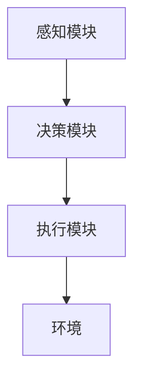
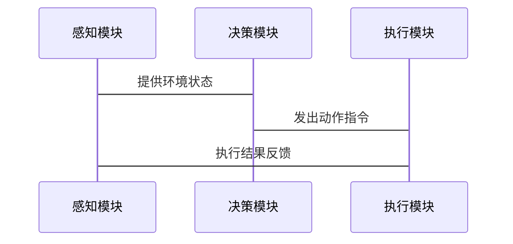

                 


# 如何识别企业的深度强化学习机器人控制优势

> 关键词：深度强化学习、机器人控制、企业优势、算法原理、系统架构、项目实战

> 摘要：本文旨在探讨如何识别企业在深度强化学习机器人控制方面的优势。通过分析深度强化学习的核心概念、算法原理、系统架构以及项目实战，本文详细阐述了企业在该领域的核心竞争力。从基础概念到高级算法，从系统设计到实际应用，本文为读者提供了全面的视角，帮助他们理解并识别企业在深度强化学习机器人控制中的优势。

---

# 第1章: 深度强化学习的基本概念

## 1.1 深度强化学习的定义与特点

### 1.1.1 什么是深度强化学习
深度强化学习（Deep Reinforcement Learning, DRL）是人工智能领域的重要分支，结合了深度学习和强化学习的优势。它通过神经网络来近似最优策略或价值函数，使智能体能够在复杂环境中自主学习并做出最优决策。

**特点：**
1. **端到端学习**：DRL可以直接从原始输入数据（如图像）中学习，无需手动特征提取。
2. **自适应性**：能够根据环境反馈动态调整策略。
3. **高维状态空间处理**：适用于处理高维、复杂的状态空间。

### 1.1.2 深度强化学习与传统机器学习的区别
| **方面** | **传统机器学习** | **深度强化学习** |
|----------|-----------------|------------------|
| **输入** | 特征工程处理后的数据 | 原始数据（如图像、语音） |
| **学习方式** | 监督学习、无监督学习 | 强化学习（基于奖励机制） |
| **应用场景** | 分类、回归等简单任务 | 高复杂度任务（如游戏、机器人控制） |

### 1.1.3 深度强化学习在机器人控制中的应用
- **工业机器人**：优化生产线流程，提高效率。
- **服务机器人**：实现智能交互和任务执行。
- **自动驾驶**：通过深度强化学习实现路径规划和决策控制。

## 1.2 机器人控制的基本原理

### 1.2.1 机器人控制的定义
机器人控制是指通过传感器输入、算法处理和执行机构输出，实现机器人在特定任务中的自主或半自主操作。

### 1.2.2 机器人控制的主要类型
1. **位置控制**：基于位置偏差调整执行机构。
2. **力/力矩控制**：基于力/力矩反馈调整控制。
3. **轨迹跟踪**：通过预设轨迹实现精确控制。
4. **行为控制**：基于行为策略实现目标导向控制。

### 1.2.3 深度强化学习在机器人控制中的优势
- **无需精确模型**：强化学习通过奖励机制，无需精确的环境模型。
- **自适应性**：能够在动态环境中自主调整策略。
- **处理高维状态**：深度神经网络能够处理复杂的高维状态空间。

## 1.3 深度强化学习的核心概念

### 1.3.1 状态、动作与奖励
- **状态（State）**：机器人当前所处的环境信息。
- **动作（Action）**：机器人执行的动作或操作。
- **奖励（Reward）**：环境对机器人行为的反馈，用于指导学习方向。

### 1.3.2 策略与价值函数
- **策略（Policy）**：描述机器人在给定状态下选择动作的概率分布。
- **价值函数（Value Function）**：评估某状态下采取某动作后的期望收益。

### 1.3.3 探索与利用的平衡
- **探索（Exploration）**：尝试新动作以发现更好的策略。
- **利用（Exploitation）**：利用已知的最佳策略以获得最大收益。

## 1.4 深度强化学习的数学基础

### 1.4.1 线性代数与微积分基础
- **矩阵运算**：用于神经网络的权重更新。
- **梯度计算**：用于优化算法（如梯度下降）。

### 1.4.2 概率论与统计基础
- **概率分布**：用于描述机器人动作的选择概率。
- **期望值**：用于评估策略的长期收益。

### 1.4.3 神经网络基础
- **感知器（Perceptron）**：单层神经网络，用于分类任务。
- **多层感知器（MLP）**：多层神经网络，用于复杂函数逼近。

## 1.5 本章小结
本章介绍了深度强化学习的基本概念、特点及其在机器人控制中的应用。通过对比传统机器学习和深度强化学习的区别，明确了DRL在处理高维复杂状态空间方面的优势。

---

# 第2章: 深度强化学习的核心算法

## 2.1 Q-learning算法

### 2.1.1 Q-learning的基本原理
Q-learning是一种基于值函数的强化学习算法，通过更新Q值表来学习最优策略。公式如下：

$$ Q(s,a) \leftarrow Q(s,a) + \alpha [r + \max Q(s',a') - Q(s,a)] $$

其中，$\alpha$是学习率，$r$是奖励，$s'$是下一个状态。

### 2.1.2 Q-learning的数学模型
- **状态转移**：$P(s'|s,a)$
- **奖励函数**：$R(s,a,s')$
- **价值函数**：$Q(s,a)$

### 2.1.3 Q-learning在机器人控制中的应用
例如，在机器人导航任务中，Q-learning可以用于学习避障策略。

## 2.2 Deep Q-Network (DQN) 算法

### 2.2.1 DQN的原理与优势
DQN通过神经网络近似Q值函数，解决高维状态空间下的强化学习问题。

### 2.2.2 DQN的数学模型
- **主网络**：$Q(s,a; \theta)$
- **目标网络**：$Q_{\text{target}}(s,a; \theta^-)$
- **经验回放**：存储$(s,a,r,s')$样本，随机采样训练。

### 2.2.3 DQN在机器人控制中的实现
例如，在机器人臂的抓取任务中，DQN可以用于学习抓取策略。

## 2.3 Actor-Critic算法

### 2.3.1 Actor-Critic的基本原理
Actor-Critic算法同时学习策略（Actor）和价值函数（Critic），通过两者协同优化。

### 2.3.2 Actor-Critic的数学模型
- **策略网络**：$\pi(a|s; \theta)$
- **价值网络**：$V(s; \phi)$

### 2.3.3 Actor-Critic在机器人控制中的应用
例如，在机器人足球比赛中，Actor-Critic可以用于学习复杂的战术策略。

## 2.4 其他强化学习算法简介

### 2.4.1 Policy Gradient方法
Policy Gradient通过直接优化策略，适用于高维动作空间。

### 2.4.2 Advantage Actor-Critic (A2C) 方法
结合Actor-Critic和策略梯度的优势，适用于复杂环境。

---

# 第3章: 深度强化学习在机器人控制中的系统架构

## 3.1 系统分析与设计

### 3.1.1 问题场景介绍
以工业机器人抓取为例，分析系统需求。

### 3.1.2 系统功能设计
- **感知模块**：获取环境信息。
- **决策模块**：基于DRL算法做出决策。
- **执行模块**：执行具体动作。

### 3.1.3 系统架构设计
使用Mermaid图展示系统架构：



## 3.2 系统接口设计

### 3.2.1 感知接口
- **输入**：传感器数据（如深度图像）。
- **输出**：环境状态。

### 3.2.2 决策接口
- **输入**：环境状态。
- **输出**：动作指令。

### 3.2.3 执行接口
- **输入**：动作指令。
- **输出**：执行结果。

## 3.3 系统交互设计

### 3.3.1 交互流程
1. 感知模块获取环境数据。
2. 决策模块基于DRL算法做出决策。
3. 执行模块根据决策执行动作。
4. 环境反馈奖励，进入下一个循环。

### 3.3.2 交互流程图
使用Mermaid序列图展示交互流程：



## 3.4 本章小结
本章通过系统分析与架构设计，明确了深度强化学习在机器人控制中的实现框架，并详细描述了系统接口和交互流程。

---

# 第4章: 深度强化学习机器人控制的项目实战

## 4.1 环境配置与依赖安装

### 4.1.1 环境配置
- **操作系统**：Ubuntu 20.04
- **Python版本**：Python 3.8
- **深度学习框架**：TensorFlow 2.5
- **强化学习库**：OpenAI Gym

### 4.1.2 安装依赖
```bash
pip install gym numpy tensorflow matplotlib
```

## 4.2 核心代码实现

### 4.2.1 神经网络模型
```python
import tensorflow as tf
import numpy as np

class DQNModel(tf.keras.Model):
    def __init__(self, state_dim, action_dim):
        super(DQNModel, self).__init__()
        self.dense1 = tf.keras.layers.Dense(64, activation='relu')
        self.dense2 = tf.keras.layers.Dense(64, activation='relu')
        self.dense3 = tf.keras.layers.Dense(action_dim, activation='linear')
    
    def call(self, x):
        x = self.dense1(x)
        x = self.dense2(x)
        x = self.dense3(x)
        return x
```

### 4.2.2 训练循环
```python
import gym
import numpy as np
import tensorflow as tf

class DQNAgent:
    def __init__(self, state_dim, action_dim, lr=0.001):
        self.model = DQNModel(state_dim, action_dim)
        self.lr = lr
        self.optimizer = tf.keras.optimizers.Adam(learning_rate=self.lr)
    
    def get_action(self, state, epsilon=0.1):
        if np.random.random() < epsilon:
            return np.random.randint(0, action_dim)
        else:
            state = tf.convert_to_tensor([state], dtype=tf.float32)
            q_values = self.model(state)
            return tf.argmax(q_values[0]).numpy()
    
    def train(self, states, actions, rewards, next_states, gamma=0.99):
        states = tf.convert_to_tensor(states, dtype=tf.float32)
        next_states = tf.convert_to_tensor(next_states, dtype=tf.float32)
        actions = tf.convert_to_tensor(actions, dtype=tf.int32)
        rewards = tf.convert_to_tensor(rewards, dtype=tf.float32)
        
        with tf.GradientTape() as tape:
            current_q = self.model(states)
            next_q = self.model(next_states)
            target = rewards + gamma * tf.reduce_max(next_q, axis=1)
            loss = tf.reduce_mean(tf.square(current_q - target))
        
        gradients = tape.gradient(loss, self.model.trainable_weights)
        self.optimizer.apply_gradients(zip(gradients, self.model.trainable_weights))
```

## 4.3 项目实战与案例分析

### 4.3.1 项目实战
以OpenAI Gym中的CartPole环境为例，训练一个DQN智能体。

### 4.3.2 案例分析
- **训练过程**：观察智能体如何通过与环境交互，逐步掌握平衡杆的任务。
- **结果解读**：分析训练曲线，理解奖励机制对学习过程的影响。

## 4.4 本章小结
本章通过项目实战，展示了如何基于深度强化学习算法实现机器人控制。通过具体代码实现和案例分析，帮助读者理解理论在实践中的应用。

---

# 第5章: 深度强化学习机器人控制的优势与挑战

## 5.1 企业优势分析

### 5.1.1 技术优势
- **高效性**：深度强化学习能够快速学习复杂任务。
- **自适应性**：能够在动态环境中自主调整策略。

### 5.1.2 应用优势
- **提升效率**：优化生产流程，降低成本。
- **增强灵活性**：适应不同任务和环境变化。

## 5.2 挑战与解决方案

### 5.2.1 训练效率低下
- **解决方案**：使用经验回放和策略加速方法。

### 5.2.2 环境复杂性
- **解决方案**：结合其他传感器数据，增强环境感知能力。

## 5.3 本章小结
本章分析了企业在深度强化学习机器人控制中的优势，同时探讨了面临的主要挑战及其解决方案。

---

# 作者：AI天才研究院/AI Genius Institute & 禅与计算机程序设计艺术 /Zen And The Art of Computer Programming

---

通过以上内容，本文全面介绍了深度强化学习在机器人控制中的应用，从理论基础到系统架构，从算法实现到项目实战，帮助读者全面理解并识别企业在深度强化学习机器人控制中的优势。

