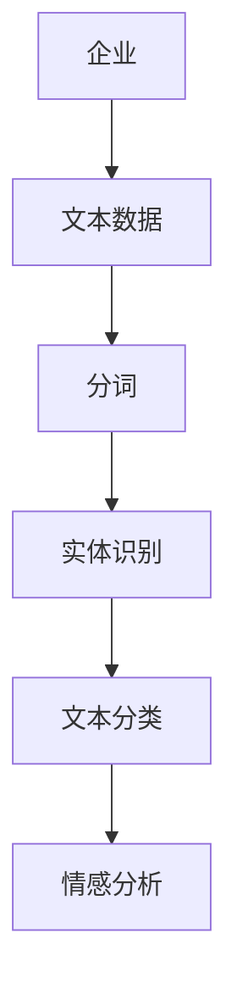
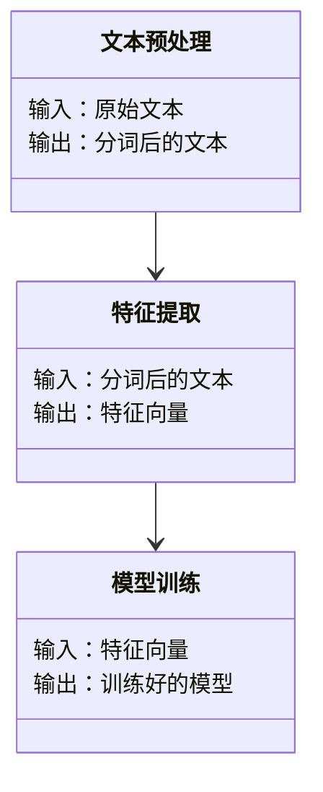

                 


# 如何识别企业的自然语言处理优势

## 关键词：自然语言处理（NLP）、企业优势识别、文本分析、NLP技术、企业应用

## 摘要：
自然语言处理（NLP）是一项复杂但极具潜力的技术，能够帮助企业从海量文本数据中提取有价值的信息。本文将从NLP的核心概念出发，分析其在企业中的应用优势，通过系统化的分析方法和实际案例，帮助企业在实际场景中识别和应用NLP技术，提升竞争力。

---

# 第一部分：自然语言处理（NLP）基础与企业应用背景

## 第1章：自然语言处理（NLP）概述

### 1.1 自然语言处理的基本概念
#### 1.1.1 自然语言处理的定义
自然语言处理（NLP）是计算机科学、人工智能、语言学等领域的交叉学科，旨在帮助计算机理解和处理人类语言。NLP的目标是让计算机能够像人类一样理解和生成自然语言文本。

#### 1.1.2 NLP的核心目标与应用场景
- **核心目标**：理解文本含义、提取信息、生成自然语言文本。
- **应用场景**：文本分类、情感分析、实体识别、机器翻译、对话系统等。

#### 1.1.3 企业中的NLP应用
- 文本挖掘：从企业文档、客户反馈中提取关键信息。
- 情感分析：分析客户评论，优化产品和服务。
- 自动化客服：通过NLP技术实现智能问答和聊天机器人。

### 1.2 企业中的NLP优势识别
#### 1.2.1 企业文本数据的特征与价值
- **特征**：海量性、多样性、复杂性。
- **价值**：辅助决策、提高效率、增强客户体验。

#### 1.2.2 识别NLP优势的关键步骤
1. **数据收集**：获取企业内部和外部的文本数据。
2. **数据清洗**：去除噪声，提取有用信息。
3. **模型训练**：基于NLP算法，构建模型。
4. **模型评估**：验证模型的准确性和实用性。

### 1.3 NLP技术的演进与挑战
#### 1.3.1 NLP技术的发展历程
- **早期阶段**：基于规则的NLP方法。
- **现代阶段**：基于深度学习的NLP模型，如BERT、GPT。

#### 1.3.2 企业NLP应用的常见挑战
- 数据质量问题：数据稀疏性、噪声多。
- 模型训练成本高：需要大量计算资源。
- 技术与业务结合难：技术实现与业务需求脱节。

---

## 第2章：企业NLP应用的核心概念与联系

### 2.1 NLP核心概念的原理
#### 2.1.1 文本预处理
- 分词：将文本分割成词语或短语。
- 停用词去除：移除常见的无意义词汇（如“的”、“是”）。
- 词干提取：将词转换为基本形式（如“running”变为“run”）。

#### 2.1.2 语言模型
- 概率语言模型：计算文本中词语出现的概率。
- 生成式模型：根据上下文生成合理的后续文本。

#### 2.1.3 文本分类
- 监督学习：基于标注数据训练分类器。
- 特征提取：提取文本中的关键词作为分类依据。

### 2.2 NLP核心概念的属性对比
| 概念 | 定义 | 优缺点 | 应用场景 |
|------|------|--------|----------|
| 词袋模型 | 基于词频的文本表示方法 | 简单易实现，但忽视词语顺序 | 文本分类、关键词提取 |
| TF-IDF | 基于词频-逆文档频率的权重计算 | 能够反映关键词的重要性 | 搜索引擎、文本摘要 |
| Word2Vec | 通过上下文预测词义的模型 | 训练速度快，效果好 | 词向量表示、文本相似度计算 |

### 2.3 NLP实体关系图


---

## 第3章：NLP算法原理与数学模型

### 3.1 常见NLP算法概述
#### 3.1.1 词袋模型（Bag of Words）
- **原理**：将文本表示为词语的集合，不考虑词语顺序。
- **公式**：$TF = \frac{\text{词在文档中的出现次数}}{\text{文档总词数}}$

#### 3.1.2 TF-IDF
- **原理**：计算词语在文档中的重要性，公式为 $TF-IDF = TF \times \log(\frac{N}{DF})$，其中$N$是总文档数，$DF$是词语的文档频率。

#### 3.1.3 Word2Vec
- **模型**：分为CBOW（基于上下文预测单词）和Skip-Gram（基于单词预测上下文）。
- **目标函数**：$$\text{损失函数} = -\log(P(w_{i+1}|w_i))$$

---

## 第4章：系统分析与架构设计方案

### 4.1 问题场景介绍
- **背景**：企业需要从海量文本数据中提取有价值的信息。
- **目标**：构建一个NLP系统，实现文本分类、情感分析等功能。

### 4.2 系统功能设计


### 4.3 系统架构设计


---

## 第5章：项目实战

### 5.1 环境安装
- **工具**：Python、TensorFlow、Keras、NLTK
- **代码示例**：
  ```python
  import numpy as np
  from tensorflow.keras import layers
  model = tf.keras.Sequential([
      layers.Embedding(1000, 64),
      layers.Conv1D(64, 5, padding='same'),
      layers.MaxPooling1D(pool_size=4),
      layers.LSTM(32),
      layers.Dense(1, activation='sigmoid')
  ])
  ```

### 5.2 数据预处理
- **数据清洗**：去除特殊字符、填充缺失值。
- **分词**：使用NLTK库进行中文分词。

### 5.3 模型训练与部署
- **训练**：使用训练数据训练模型。
- **部署**：将模型部署到生产环境，提供API接口。

---

## 第6章：结论与展望

### 6.1 最佳实践
- **数据质量**：确保数据的完整性和准确性。
- **模型调优**：通过交叉验证和超参数优化提升模型性能。
- **持续改进**：根据业务需求和技术发展，持续优化NLP系统。

### 6.2 小结
通过系统化的分析和实际案例，本文详细介绍了如何识别和应用企业的自然语言处理优势，为企业在NLP领域的实践提供了理论和实践指导。

### 6.3 注意事项
- NLP模型的泛化能力有限，需要根据具体场景进行调整。
- 数据隐私和安全问题是企业在应用NLP时需要重点关注的。

### 6.4 拓展阅读
- 《自然语言处理实战：基于深度学习的方法》
- 《Python机器学习：基于Scikit-Learn和TensorFlow》

---

## 作者：
作者：AI天才研究院/AI Genius Institute  
作者：禅与计算机程序设计艺术 /Zen And The Art of Computer Programming

