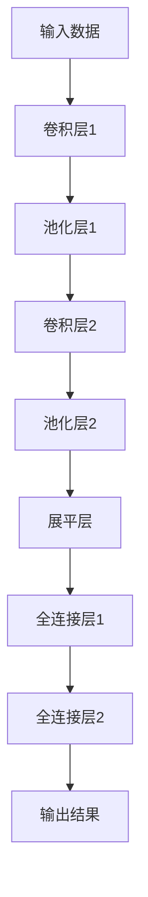
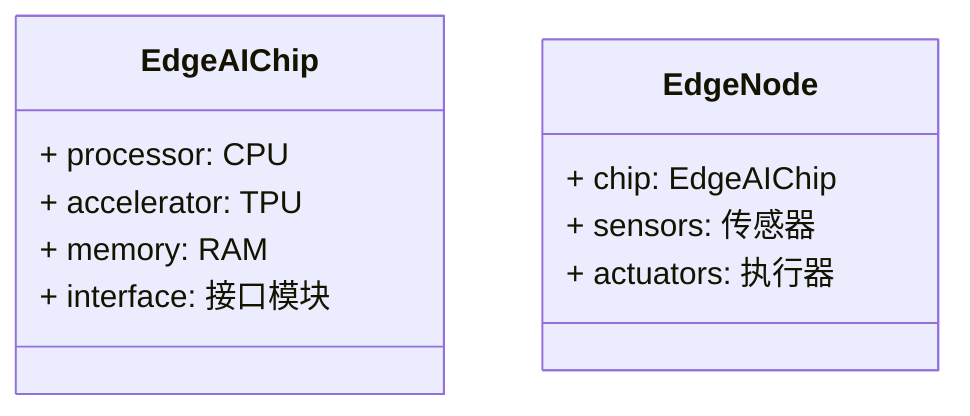
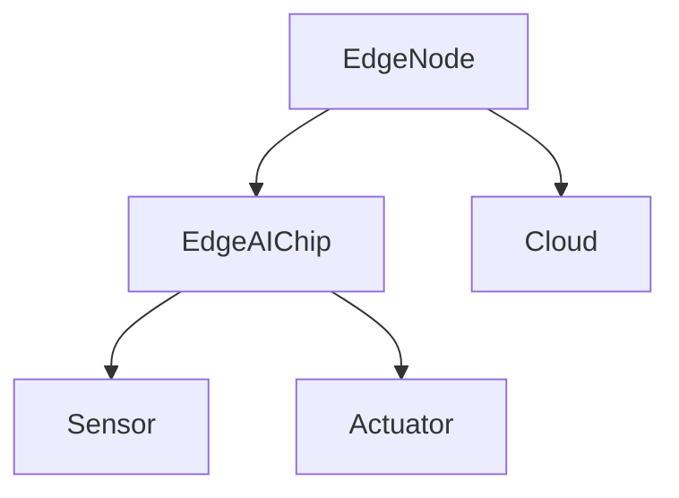
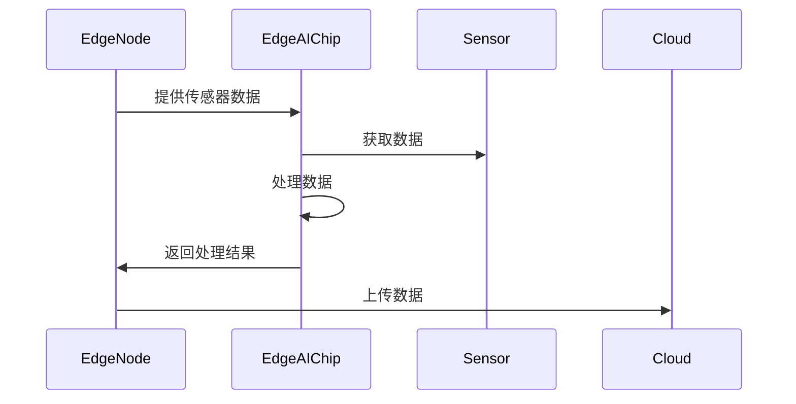
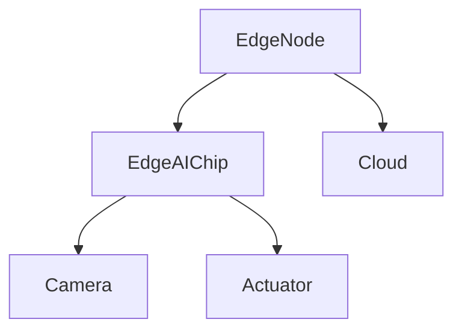

                 


# 如何识别企业的边缘AI芯片优势

> 关键词：边缘AI芯片，优势识别，企业应用，性能优化，技术分析

> 摘要：本文旨在帮助读者识别和评估企业在边缘AI芯片应用中的优势。通过分析边缘AI芯片的核心技术、算法原理、系统架构以及实际案例，本文将详细阐述如何在企业环境中识别和优化边缘AI芯片的优势，从而提升企业的竞争力。

---

## 第1章 边缘AI芯片的背景与概念

### 1.1 边缘AI芯片的定义与背景

#### 1.1.1 什么是边缘AI芯片
边缘AI芯片是指在边缘计算环境中使用的专用集成电路（ASIC），用于在靠近数据源的地方进行高效的AI推理和计算。与传统的云计算不同，边缘AI芯片能够实时处理数据，减少延迟，并提高数据处理的效率。

#### 1.1.2 边缘计算的兴起与趋势
随着物联网（IoT）和实时数据处理需求的增加，边缘计算逐渐成为主流。边缘计算能够在靠近数据源的地方进行数据处理，减少了数据传输到云端的延迟，提高了系统的实时性和响应速度。

#### 1.1.3 边缘AI芯片的行业应用
边缘AI芯片广泛应用于多个行业，如智能制造、自动驾驶、智能安防、智能家居等。这些应用需要实时数据处理和快速决策，边缘AI芯片能够满足这些需求。

### 1.2 边缘AI芯片的核心优势

#### 1.2.1 低延迟与实时性
边缘AI芯片能够在本地进行数据处理，减少了数据传输到云端的时间，从而实现低延迟和实时性。

#### 1.2.2 高能效与低成本
边缘AI芯片通常设计为低功耗、高能效，能够在资源受限的环境中运行，同时成本较低，适合大规模部署。

#### 1.2.3 数据隐私与安全性
边缘AI芯片能够在本地处理数据，减少了数据在传输过程中被截获或泄露的风险，提高了数据的安全性。

### 1.3 边缘AI芯片与云计算的对比

#### 1.3.1 边缘计算与云计算的区别
边缘计算与云计算的主要区别在于数据处理的位置。云计算将数据传输到云端进行集中处理，而边缘计算则在靠近数据源的地方进行处理。

#### 1.3.2 边缘AI芯片的独特价值
边缘AI芯片能够在本地快速处理数据，减少延迟，提高实时性，同时降低数据传输成本和隐私风险。

#### 1.3.3 边缘与云计算的协同工作
边缘AI芯片可以与云计算协同工作，将部分数据处理任务分配到边缘，减轻云端的负担，提高整体系统的效率。

### 1.4 本章小结
本章介绍了边缘AI芯片的定义、背景、行业应用以及其与云计算的区别。边缘AI芯片的独特优势包括低延迟、高能效和数据隐私，使其在多个行业中有广泛的应用潜力。

---

## 第2章 边缘AI芯片的核心技术解析

### 2.1 边缘AI芯片的硬件架构

#### 2.1.1 芯片架构设计
边缘AI芯片的硬件架构通常包括处理器、加速器、存储器和接口模块。这些模块协同工作，以实现高效的AI推理和数据处理。

#### 2.1.2 硬件加速技术
边缘AI芯片通常采用专用的硬件加速技术，如GPU、TPU等，以提高计算效率和降低能耗。

#### 2.1.3 芯片性能指标
边缘AI芯片的性能指标包括计算能力、能效比、延迟和功耗等。这些指标决定了芯片在不同应用场景中的表现。

### 2.2 边缘AI芯片的算法优化

#### 2.2.1 算法适配与优化
边缘AI芯片的算法需要适应芯片的硬件架构，并通过优化算法的计算流程来提高效率。

#### 2.2.2 轻量化模型设计
为了适应边缘环境的资源限制，算法通常采用轻量化模型，如移动Net、YOLO等，以减少计算资源的消耗。

#### 2.2.3 算法与硬件的协同优化
算法和硬件的协同优化是提高边缘AI芯片性能的关键。通过硬件加速和算法优化的结合，可以实现高效的计算和更低的延迟。

### 2.3 边缘AI芯片的通信协议

#### 2.3.1 边缘节点间的通信
边缘节点之间的通信通常采用MQTT、HTTP等协议，用于数据传输和任务协调。

#### 2.3.2 边缘与云端的交互
边缘与云端的交互通常通过RESTful API、WebSocket等协议实现，用于数据同步和任务调度。

#### 2.3.3 通信协议的选择与优化
选择合适的通信协议可以提高边缘AI芯片的性能，减少数据传输的延迟和带宽消耗。

### 2.4 本章小结
本章详细介绍了边缘AI芯片的硬件架构、算法优化和通信协议。通过硬件加速、轻量化模型和协同优化，可以提高边缘AI芯片的性能和效率。

---

## 第3章 边缘AI芯片的算法原理与实现

### 3.1 边缘AI芯片的算法特点

#### 3.1.1 算法的实时性要求
边缘AI芯片需要在本地快速完成数据处理，因此算法必须具有高实时性。

#### 3.1.2 算法的轻量化需求
边缘环境资源有限，算法需要轻量化设计，以适应硬件的限制。

#### 3.1.3 算法的可扩展性
边缘AI芯片的应用场景多样，算法需要具有可扩展性，以适应不同的环境和任务需求。

### 3.2 边缘AI芯片的典型算法

#### 3.2.1 目标检测算法
目标检测算法用于识别图像中的目标物体，如YOLO、Faster R-CNN等。这些算法在边缘AI芯片上实现，能够快速检测和定位目标。

#### 3.2.2 图像分割算法
图像分割算法用于将图像划分为多个区域，识别每个区域的内容，如U-Net、SegNet等。

#### 3.2.3 语音识别算法
语音识别算法用于将语音信号转换为文本，如基于深度学习的模型，如CTC、Transformer等。

### 3.3 算法优化的数学模型

#### 3.3.1 算法性能评估公式
$$ \text{性能指标} = \frac{\text{正确识别率}}{\text{计算资源消耗}} $$

#### 3.3.2 算法优化的数学模型
$$ \text{优化目标} = \min_{x} f(x) \text{，其中 } x \text{ 是算法参数} $$

### 3.4 算法实现的代码示例

#### 3.4.1 Python代码实现
```python
import tensorflow as tf
from tensorflow.keras import layers

# 定义一个简单的卷积神经网络
def create_model():
    model = tf.keras.Sequential([
        layers.Conv2D(32, (3,3), activation='relu', input_shape=(224, 224, 3)),
        layers.MaxPooling2D((2,2)),
        layers.Conv2D(64, (3,3), activation='relu'),
        layers.MaxPooling2D((2,2)),
        layers.Flatten(),
        layers.Dense(64, activation='relu'),
        layers.Dense(10, activation='softmax')
    ])
    return model

# 编译模型
model = create_model()
model.compile(optimizer='adam', loss='sparse_categorical_crossentropy', metrics=['accuracy'])
```

#### 3.4.2 算法优化的流程图


### 3.5 本章小结
本章详细介绍了边缘AI芯片的算法特点、典型算法和优化方法。通过数学模型和代码示例，展示了如何在边缘环境中实现高效的AI算法。

---

## 第4章 边缘AI芯片的系统分析与架构设计

### 4.1 系统功能设计

#### 4.1.1 领域模型


#### 4.1.2 系统架构


### 4.2 系统架构设计

#### 4.2.1 系统架构图


#### 4.2.2 接口设计
- 输入接口：传感器数据输入
- 输出接口：执行器控制输出
- 通信接口：与云端交互

#### 4.2.3 交互流程


### 4.3 本章小结
本章通过系统功能设计和架构设计，展示了边缘AI芯片在企业中的应用架构。通过接口设计和交互流程，明确了系统各部分的功能和协作方式。

---

## 第5章 边缘AI芯片的项目实战与案例分析

### 5.1 项目实战

#### 5.1.1 环境安装
- 操作系统：Ubuntu 20.04
- 开发工具：PyCharm
- 依赖库：TensorFlow、Keras、OpenCV

#### 5.1.2 核心实现
```python
import cv2
import numpy as np
from tensorflow.keras.models import load_model

# 加载预训练模型
model = load_model('edge_model.h5')

# 读取图像
image = cv2.imread('input.jpg')

# 预测结果
prediction = model.predict(image)

# 输出结果
print('Prediction:', prediction)
```

#### 5.1.3 代码应用解读
上述代码展示了如何在边缘环境中加载预训练模型并进行图像识别。模型在本地运行，减少了数据传输的延迟。

### 5.2 案例分析

#### 5.2.1 案例背景
某智能制造企业希望在生产线中部署边缘AI芯片，用于实时检测产品缺陷。

#### 5.2.2 案例实现


#### 5.2.3 实际应用分析
通过部署边缘AI芯片，企业能够实时检测产品缺陷，减少生产中的废品率，提高生产效率。

### 5.3 本章小结
本章通过项目实战和案例分析，展示了边缘AI芯片在实际应用中的优势。通过具体的代码实现和案例分析，帮助读者理解如何在企业中部署和应用边缘AI芯片。

---

## 第6章 边缘AI芯片的最佳实践与小结

### 6.1 最佳实践

#### 6.1.1 硬件选择
选择适合应用场景的边缘AI芯片，考虑计算能力、功耗和成本。

#### 6.1.2 算法优化
根据具体需求优化算法，选择合适的模型和优化方法。

#### 6.1.3 系统设计
设计高效的系统架构，确保各部分协同工作，减少延迟和资源消耗。

### 6.2 小结
边缘AI芯片在企业中的应用具有显著的优势，如低延迟、高能效和数据隐私。通过合理的硬件选择、算法优化和系统设计，可以充分发挥边缘AI芯片的优势，提升企业的竞争力。

### 6.3 注意事项

#### 6.3.1 数据隐私
在边缘环境中处理数据时，必须注意数据的隐私和安全性，防止数据泄露。

#### 6.3.2 环境适应
边缘环境通常资源有限，算法和硬件设计需要适应环境的限制。

#### 6.3.3 系统维护
边缘AI芯片的部署和维护需要考虑硬件故障和软件更新等问题。

### 6.4 拓展阅读
- 《边缘计算：原理与实践》
- 《深度学习与边缘AI芯片》
- 《高效算法设计与优化》

### 6.5 本章小结
本章总结了边缘AI芯片的应用优势和最佳实践，并提供了注意事项和拓展阅读资料，帮助读者进一步了解和应用边缘AI芯片技术。

---

## 附录

### 附录A 边缘AI芯片相关技术资料
- TensorFlow Lite文档
- OpenCV边缘计算应用文档
- 边缘计算标准协议

### 附录B 边缘AI芯片开发工具
- Google Coral
- NVIDIA Jetson
- Xilinx Zynq

---

## 作者信息

作者：AI天才研究院/AI Genius Institute & 禅与计算机程序设计艺术 /Zen And The Art of Computer Programming

---

**完**

