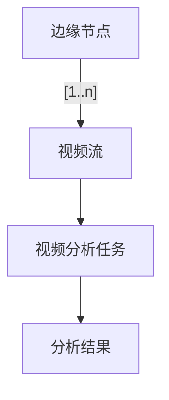
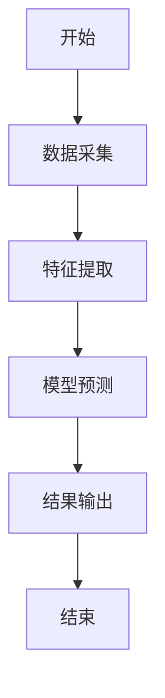
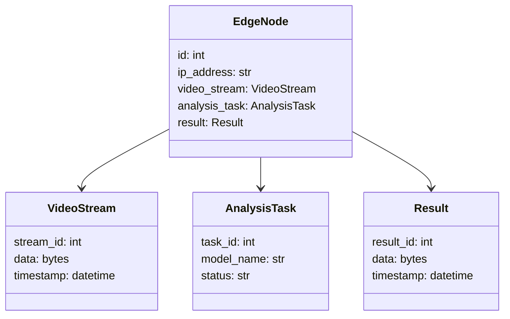
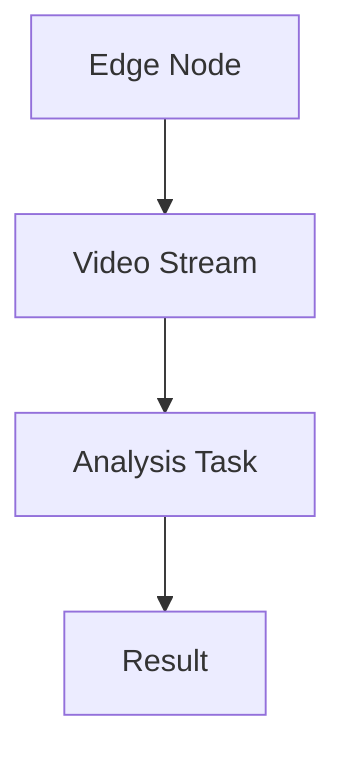
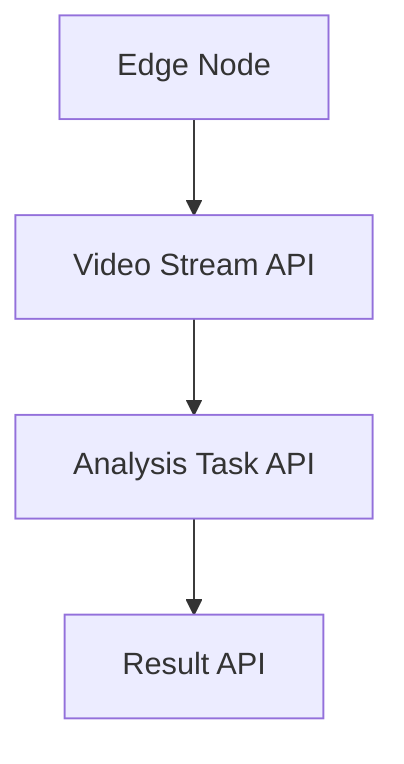

                 


# 如何识别企业的边缘AI视频分析优势

## 关键词：
- 边缘AI
- 视频分析
- 企业优势
- 技术实现
- 应用场景

## 摘要：
本文旨在帮助读者理解如何识别企业在边缘AI视频分析中的优势。通过分析边缘计算与AI视频分析的核心概念、算法原理、系统架构设计、项目实战以及最佳实践，本文深入探讨了企业在边缘AI视频分析中的技术优势和应用场景，为企业的技术决策和实施提供了有价值的参考。

---

# 第一部分: 企业边缘AI视频分析的背景与概念

## 第1章: 边缘AI视频分析的背景与问题定义

### 1.1 边缘计算与AI视频分析的背景

#### 1.1.1 边缘计算的定义与特点
边缘计算是指在靠近数据源的地方进行数据处理和分析，而不是将所有数据上传到云端进行集中处理。其特点包括：

- **低延迟**：边缘计算能够快速响应，减少数据传输到云端的延迟。
- **高实时性**：适用于需要实时处理的场景，如工业监控、自动驾驶等。
- **数据隐私**：边缘计算可以在本地处理数据，减少数据传输过程中的隐私泄露风险。
- **带宽优化**：通过在边缘设备上处理数据，减少对网络带宽的依赖。

#### 1.1.2 AI视频分析的定义与特点
AI视频分析是利用人工智能技术对视频数据进行分析和理解，其特点包括：

- **智能识别**：通过目标检测、图像识别等技术，自动识别视频中的物体、人物或行为。
- **实时监控**：能够实时分析视频流，提供即时反馈。
- **数据驱动**：基于大量数据训练模型，实现高精度的识别和分析。
- **多场景应用**：适用于安防、交通、医疗、工业等多个领域。

#### 1.1.3 边缘计算与AI视频分析的行业背景
随着物联网技术的快速发展，边缘计算在视频分析中的应用越来越广泛。企业通过边缘AI视频分析，可以实现以下目标：

- **提升效率**：通过自动化分析，减少人工干预，提高工作效率。
- **降低成本**：边缘计算可以在本地处理数据，降低云端计算的成本。
- **增强安全性**：通过实时监控和异常检测，提升企业安全水平。
- **优化决策**：通过数据驱动的分析，帮助企业做出更明智的决策。

### 1.2 企业视频分析的痛点与挑战

#### 1.2.1 传统视频分析的局限性
传统视频分析主要依赖于人工监控和简单的视频处理技术，存在以下问题：

- **效率低下**：人工监控需要大量人力资源，且容易出现疲劳和疏忽。
- **实时性差**：传统视频分析无法实现实时处理，导致响应速度较慢。
- **精度不足**：依赖于简单的规则匹配，无法应对复杂的场景。

#### 1.2.2 边缘计算在视频分析中的优势
边缘计算在视频分析中的优势主要体现在以下几个方面：

- **低延迟**：边缘计算可以在本地快速处理视频数据，减少响应时间。
- **高实时性**：通过实时分析视频流，企业能够快速做出决策。
- **数据隐私**：边缘计算可以在本地处理数据，减少数据传输过程中的隐私泄露风险。
- **带宽优化**：边缘计算减少了对云端传输的依赖，降低了网络带宽的消耗。

#### 1.2.3 企业边缘AI视频分析的典型场景
企业边缘AI视频分析的应用场景广泛，以下是一些典型场景：

- **工业监控**：用于设备状态监测、生产线监控等场景。
- **安防监控**：用于园区、办公楼等场所的实时监控和异常检测。
- **交通管理**：用于交通流量监测、违规检测等场景。
- **医疗监控**：用于患者监护、医疗设备监控等场景。

### 1.3 问题背景与目标

#### 1.3.1 边缘AI视频分析的核心问题
企业在进行边缘AI视频分析时，需要解决以下核心问题：

- **数据采集与传输**：如何高效采集和传输视频数据。
- **模型训练与部署**：如何在边缘设备上高效训练和部署AI模型。
- **实时分析与反馈**：如何实现实时视频分析和快速反馈。

#### 1.3.2 问题的边界与外延
边缘AI视频分析的边界主要在于数据处理的范围和实时性要求。外延则包括与边缘计算相关的技术，如物联网、云计算等。

#### 1.3.3 问题解决的目标与价值
边缘AI视频分析的目标是通过自动化技术，实现实时、高效、精准的视频分析，为企业提供以下价值：

- **提高效率**：减少人工干预，提高视频分析的效率。
- **降低成本**：通过边缘计算降低云端计算的成本。
- **增强安全性**：通过实时监控和异常检测，提升企业安全水平。
- **优化决策**：通过数据驱动的分析，帮助企业做出更明智的决策。

### 1.4 核心概念与联系

#### 1.4.1 边缘计算与AI视频分析的关系
边缘计算与AI视频分析的关系如下：

- **边缘计算为AI视频分析提供计算资源**：边缘设备为AI视频分析提供计算资源，使得AI模型能够在本地运行。
- **AI视频分析为边缘计算提供智能能力**：AI视频分析通过在边缘设备上运行模型，为边缘计算提供智能能力。

#### 1.4.2 核心概念的属性特征对比

| **概念**       | **边缘计算**             | **AI视频分析**             |
|----------------|--------------------------|-----------------------------|
| **数据处理**   | 本地处理                | 本地或云端处理              |
| **实时性**     | 高实时性                | 高实时性                    |
| **数据隐私**   | 高隐私性                | 高隐私性                    |
| **带宽依赖**   | 低带宽依赖               | 低带宽依赖                  |

#### 1.4.3 ER实体关系图架构



---

## 第2章: 边缘AI视频分析的核心原理

### 2.1 边缘AI视频分析的算法原理

#### 2.1.1 目标检测算法
目标检测算法是边缘AI视频分析的核心算法之一，常用的算法包括YOLO、Faster R-CNN等。目标检测算法的基本流程如下：

1. **数据采集**：采集视频流数据。
2. **特征提取**：通过卷积神经网络提取视频流的特征。
3. **目标定位**：通过回归算法定位视频中的目标。
4. **目标分类**：通过分类算法识别目标的类型。

#### 2.1.2 视频流处理算法
视频流处理算法用于实现实时视频分析，常用的算法包括基于时序模型的视频流处理算法。时序模型的基本流程如下：

1. **数据采集**：采集视频流数据。
2. **特征提取**：通过卷积神经网络提取视频流的特征。
3. **模型预测**：通过时序模型预测视频流的未来趋势。
4. **结果输出**：输出预测结果。

#### 2.1.3 异常检测算法
异常检测算法用于实现实时异常检测，常用的算法包括基于深度学习的异常检测算法。异常检测算法的基本流程如下：

1. **数据采集**：采集视频流数据。
2. **特征提取**：通过卷积神经网络提取视频流的特征。
3. **异常检测**：通过异常检测模型检测视频流中的异常。
4. **结果输出**：输出异常检测结果。

### 2.2 算法原理的数学模型与公式

#### 2.2.1 目标检测的损失函数
目标检测的损失函数通常包括分类损失和定位损失。分类损失可以使用交叉熵损失函数，定位损失可以使用均方误差损失函数。目标检测的损失函数可以表示为：

$$
\text{损失函数} = \text{分类损失} + \lambda \times \text{定位损失}
$$

其中，$\lambda$ 是平衡参数，用于平衡分类损失和定位损失的影响。

#### 2.2.2 视频流处理的时序模型
视频流处理的时序模型可以使用循环神经网络（RNN）或长短期记忆网络（LSTM）进行建模。时序模型的数学表示如下：

$$
\text{时序模型} = \text{前一帧结果} \times \text{当前帧特征}
$$

其中，$\text{前一帧结果}$ 表示前一帧的预测结果，$\text{当前帧特征}$ 表示当前帧的特征向量。

### 2.3 算法实现的流程图



### 2.4 代码实现与解读

#### 2.4.1 环境安装
以下是环境安装代码：

```python
pip install tensorflow-cpu
pip install opencv-python
```

#### 2.4.2 核心代码实现
以下是目标检测算法的核心代码实现：

```python
import tensorflow as tf
import cv2

# 加载预训练模型
model = tf.keras.models.load_model('model.h5')

# 加载视频流
cap = cv2.VideoCapture(0)

while cap.isOpened():
    ret, frame = cap.read()
    if not ret:
        break
    # 预处理
    frame = cv2.resize(frame, (224, 224))
    frame = frame / 255.0
    frame = tf.expand_dims(frame, axis=0)
    # 预测
    prediction = model.predict(frame)
    # 解析结果
    class_index = tf.argmax(prediction[0]).numpy()
    class_name = class_names[class_index]
    # 绘制结果
    cv2.putText(frame, class_name, (10, 20), cv2.FONT_HERSHEY_SIMPLEX, 1, (255, 0, 0), 2)
    cv2.imshow('result', frame)
    if cv2.waitKey(1) & 0xFF == ord('q'):
        break

cap.release()
cv2.destroyAllWindows()
```

#### 2.4.3 算法实现的详细解释
上述代码实现了一个简单的目标检测算法，以下是详细解释：

1. **环境安装**：安装了TensorFlow和OpenCV库，用于模型训练和视频处理。
2. **数据采集**：使用OpenCV库采集视频流数据。
3. **特征提取**：将视频流数据进行预处理，包括 resizing 和归一化。
4. **模型预测**：使用预训练的模型对视频流进行预测，输出目标的类别。
5. **结果输出**：将预测结果绘制在视频流上，并显示结果。

---

## 第3章: 边缘AI视频分析的系统分析与架构设计

### 3.1 系统功能设计

#### 3.1.1 领域模型设计
以下是领域模型设计的类图：



#### 3.1.2 系统架构设计
以下是系统架构设计的架构图：



#### 3.1.3 系统接口设计
以下是系统接口设计的接口图：



#### 3.1.4 系统交互设计
以下是系统交互设计的序列图：

```mermaid
graph TD
A[用户] --> B[Edge Node]: 发送视频流
B --> C[Video Stream API]: 接收视频流
C --> D[Analysis Task API]: 发起分析任务
D --> E[Result API]: 返回分析结果
E --> A: 显示分析结果
```

### 3.2 系统实现

#### 3.2.1 环境配置
以下是环境配置代码：

```bash
# 系统运行环境
sudo apt-get update
sudo apt-get install python3 python3-pip
pip3 install tensorflow-cpu opencv-python
```

#### 3.2.2 核心代码实现
以下是系统核心代码实现：

```python
import tensorflow as tf
import cv2
import requests

# 初始化边缘节点
class EdgeNode:
    def __init__(self, ip_address):
        self.ip_address = ip_address
        self.video_stream = VideoStream()
        self.analysis_task = AnalysisTask()
        self.result = Result()

# 定义视频流处理类
class VideoStream:
    def __init__(self):
        self.stream_id = 0
        self.data = b''
        self.timestamp = None

# 定义分析任务类
class AnalysisTask:
    def __init__(self):
        self.task_id = 0
        self.model_name = 'yolo_v3'
        self.status = 'pending'

# 定义结果类
class Result:
    def __init__(self):
        self.result_id = 0
        self.data = b''
        self.timestamp = None

# 启动视频流处理
def start_stream_processing():
    edge_node = EdgeNode('192.168.1.1')
    while True:
        # 获取视频流数据
        response = requests.get(f'http://{edge_node.ip_address}/video_stream')
        if response.status_code == 200:
            edge_node.video_stream.data = response.content
            edge_node.video_stream.timestamp = datetime.now()
            # 发起分析任务
            analysis_task = edge_node.analysis_task
            analysis_task.status = 'processing'
            response = requests.post(f'http://{edge_node.ip_address}/analysis_task', json=analysis_task.__dict__)
            if response.status_code == 200:
                # 获取分析结果
                response_result = requests.get(f'http://{edge_node.ip_address}/result?task_id={analysis_task.task_id}')
                if response_result.status_code == 200:
                    edge_node.result.data = response_result.content
                    edge_node.result.timestamp = datetime.now()
                    # 显示分析结果
                    display_analysis_result(edge_node.result.data)
        time.sleep(1)

# 显示分析结果
def display_analysis_result(result_data):
    # 实现结果显示逻辑
    pass

if __name__ == '__main__':
    start_stream_processing()
```

---

## 第4章: 企业边缘AI视频分析的项目实战

### 4.1 项目背景与目标

#### 4.1.1 项目背景
本项目旨在实现一个基于边缘AI的视频分析系统，用于工业监控场景中的设备状态监测。

#### 4.1.2 项目目标
项目的具体目标包括：

1. 实现实时视频流的采集与传输。
2. 在边缘设备上部署AI模型，实现实时视频分析。
3. 输出分析结果，并进行实时显示。

### 4.2 项目实现

#### 4.2.1 环境配置
以下是环境配置代码：

```bash
# 安装必要的库
pip install tensorflow-cpu
pip install opencv-python
pip install requests
```

#### 4.2.2 核心代码实现
以下是项目核心代码实现：

```python
import tensorflow as tf
import cv2
import requests
import datetime

# 定义视频流处理类
class VideoStreamHandler:
    def __init__(self, ip_address):
        self.ip_address = ip_address
        self.stream_id = 0
        self.data = b''
        self.timestamp = None

    def start_stream(self):
        self.stream_id = 1
        self.data = cv2.VideoCapture(0).read()[1]
        self.timestamp = datetime.datetime.now()

    def stop_stream(self):
        self.stream_id = 0
        self.data = b''
        self.timestamp = None

# 定义分析任务类
class AnalysisTaskHandler:
    def __init__(self, ip_address):
        self.ip_address = ip_address
        self.task_id = 0
        self.model_name = 'yolo_v3'
        self.status = 'pending'

    def start_analysis(self):
        self.status = 'processing'
        response = requests.post(f'http://{self.ip_address}/analysis_task', json=self.__dict__)
        if response.status_code == 200:
            self.task_id = response.json()['task_id']
            return True
        return False

# 定义结果处理类
class ResultHandler:
    def __init__(self, ip_address):
        self.ip_address = ip_address
        self.result_id = 0
        self.data = b''
        self.timestamp = None

    def get_result(self, task_id):
        response = requests.get(f'http://{self.ip_address}/result?task_id={task_id}')
        if response.status_code == 200:
            self.data = response.content
            self.timestamp = datetime.datetime.now()
            return True
        return False

# 启动视频流处理
def start_stream_processing():
    edge_node = '192.168.1.1'
    video_stream_handler = VideoStreamHandler(edge_node)
    analysis_task_handler = AnalysisTaskHandler(edge_node)
    result_handler = ResultHandler(edge_node)

    while True:
        # 启动视频流
        video_stream_handler.start_stream()
        # 发起分析任务
        if analysis_task_handler.start_analysis():
            # 获取分析结果
            result_handler.get_result(analysis_task_handler.task_id)
            # 显示分析结果
            display_analysis_result(result_handler.data)
        # 等待下一帧
        time.sleep(1)

# 显示分析结果
def display_analysis_result(result_data):
    # 实现结果显示逻辑
    pass

if __name__ == '__main__':
    start_stream_processing()
```

### 4.3 项目总结

#### 4.3.1 项目小结
通过本项目，我们实现了一个基于边缘AI的视频分析系统，能够实现实时视频流的采集与传输、AI模型的部署与运行，以及分析结果的输出与显示。

#### 4.3.2 项目优化建议
在实际应用中，可以进一步优化以下方面：

1. **模型优化**：优化AI模型的训练和部署，提高分析精度和效率。
2. **系统优化**：优化系统的架构设计，提高系统的扩展性和可维护性。
3. **安全性优化**：增强系统的安全性，防止数据泄露和网络攻击。

---

## 第5章: 企业边缘AI视频分析的最佳实践

### 5.1 小结

#### 5.1.1 核心内容总结
本文详细介绍了企业边缘AI视频分析的核心概念、算法原理、系统架构设计、项目实战以及最佳实践。

#### 5.1.2 核心知识点回顾
- 边缘计算与AI视频分析的核心概念。
- 目标检测、视频流处理和异常检测的算法原理。
- 系统架构设计与实现。
- 项目实战与优化建议。

### 5.2 注意事项

#### 5.2.1 系统设计中的注意事项
1. **数据隐私**：在设计系统时，需要充分考虑数据隐私问题，确保数据的安全性。
2. **系统稳定性**：确保系统的稳定性和可靠性，避免因系统故障导致数据丢失或分析失败。
3. **模型优化**：在模型部署和运行过程中，需要不断优化模型的性能，提高分析精度和效率。

#### 5.2.2 实际应用中的注意事项
1. **环境配置**：在实际应用中，需要根据具体的硬件环境和应用场景进行系统配置。
2. **模型选择**：根据具体的应用需求选择合适的AI模型，避免选择不适合的模型导致分析精度不足。
3. **系统维护**：在系统运行过程中，需要定期进行系统维护和更新，确保系统的稳定性和安全性。

### 5.3 拓展阅读

#### 5.3.1 推荐书籍
1. 《深度学习》—— Ian Goodfellow
2. 《计算机视觉：算法与应用》—— Richard Szeliski

#### 5.3.2 推荐论文
1. YOLO: Real-Time Object Detection（Joseph Redmon等）
2. Mask R-CNN: Instance Segmentation for Caffe2（Facebook AI Research）

#### 5.3.3 推荐博客与技术文章
1. https://pytorch.org/
2. https://tensorflow.org/

---

## 作者：AI天才研究院/AI Genius Institute & 禅与计算机程序设计艺术 /Zen And The Art of Computer Programming

