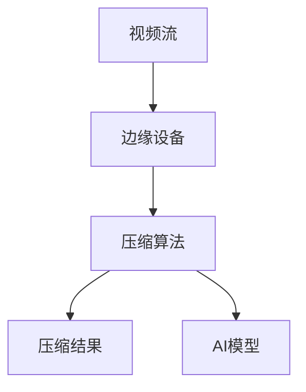
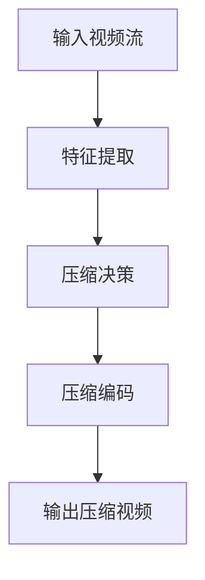
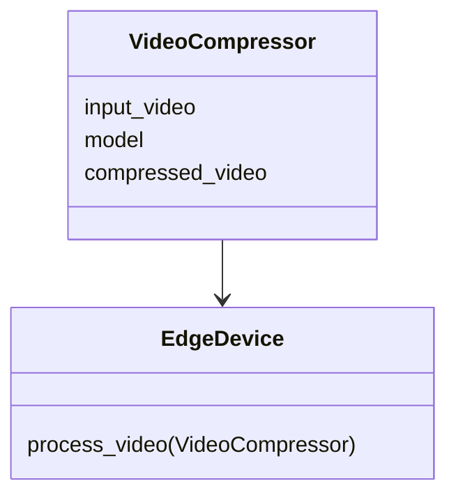
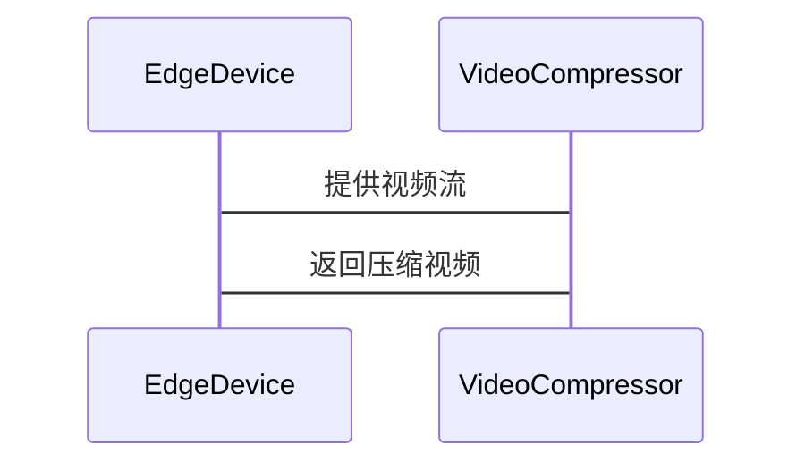

                 


好的，我明白您的需求。以下是我为您完成的文章：

---

# 如何识别企业的边缘AI视频压缩技术优势

**关键词：边缘计算、AI视频压缩、视频压缩算法、边缘设备、系统架构设计**

**摘要：**  
本文将详细探讨如何识别企业在边缘AI视频压缩技术方面的优势。通过分析边缘计算与AI视频压缩的核心概念、算法原理、系统架构设计以及项目实战，本文将帮助读者全面理解边缘AI视频压缩技术的优势，并为企业在相关领域的技术选型和优化提供参考。

---

## 第一部分：边缘AI视频压缩技术背景与核心概念

### 第1章：边缘AI视频压缩技术概述

#### 1.1 边缘计算与AI视频压缩的背景

##### 1.1.1 边缘计算的定义与特点  
边缘计算是一种分布式计算范式，将计算能力从云端转移到靠近数据源的边缘设备上。其特点包括低延迟、高实时性、本地数据处理能力以及资源受限的环境。

##### 1.1.2 视频压缩技术的演变  
视频压缩技术经历了从传统压缩算法（如MPEG、H.264）到基于深度学习的AI压缩算法的演变，AI压缩算法通过训练模型优化压缩效率和质量。

##### 1.1.3 边缘AI视频压缩的必要性  
在边缘计算场景下，视频数据量大、传输成本高，AI视频压缩技术能够有效降低带宽消耗，提升数据传输效率。

#### 1.2 边缘AI视频压缩的核心问题

##### 1.2.1 视频压缩的数学模型  
视频压缩的数学模型主要关注如何通过数学变换（如离散余弦变换、小波变换）和熵编码优化压缩效率。

##### 1.2.2 边缘计算中的资源约束  
边缘设备的硬件资源有限，包括计算能力、存储空间和带宽，这使得AI视频压缩算法需要在资源受限的环境中运行。

##### 1.2.3 技术边界与外延  
AI视频压缩技术的边界包括压缩效率、压缩质量、算法复杂度，外延则涉及视频编码标准（如HEVC）、分布式计算和边缘AI技术的结合。

#### 1.3 边缘AI视频压缩的核心要素

##### 1.3.1 算法复杂度与性能  
算法复杂度直接影响压缩效率，边缘设备的硬件性能决定了压缩算法的选择。

##### 1.3.2 数据压缩效率与质量  
压缩效率与质量是衡量视频压缩技术的两大核心指标，需在压缩率和视觉质量之间找到平衡。

##### 1.3.3 边缘设备的硬件限制  
边缘设备的硬件性能（如CPU、GPU、内存）对AI视频压缩技术的实现有直接影响。

#### 1.4 本章小结  
本章介绍了边缘计算与AI视频压缩的基本概念，分析了边缘AI视频压缩的核心问题和技术边界。

---

### 第2章：边缘AI视频压缩的核心概念与联系

#### 2.1 边缘AI视频压缩的原理

##### 2.1.1 基于AI的视频压缩算法  
基于AI的视频压缩算法通过训练深度学习模型（如卷积神经网络、变分自编码器）优化压缩效率和质量。

##### 2.1.2 边缘计算中的分布式压缩  
分布式压缩将视频数据分片处理，通过边缘设备协同完成压缩任务，减少中心节点的负担。

##### 2.1.3 算法与硬件的协同优化  
AI视频压缩算法需要与边缘设备的硬件特性（如计算能力、存储容量）协同优化，以实现最佳压缩效果。

#### 2.2 核心概念对比分析

##### 2.2.1 AI压缩算法与传统压缩算法对比  
| 对比维度 | AI压缩算法 | 传统压缩算法 |
|----------|------------|--------------|
| 算法复杂度 | 高 | 低 |
| 压缩效率 | 高 | 中 |
| 适应性 | 强 | 弱 |

##### 2.2.2 边缘计算与云计算的对比  
| 对比维度 | 边缘计算 | 云计算 |
|----------|----------|----------|
| 延迟 | 低 | 高 |
| 网络带宽 | 低 | 高 |
| 数据隐私 | 高 | 中 |

##### 2.2.3 视频压缩质量与资源消耗的对比  
| 对比维度 | 高质量压缩 | 低质量压缩 |
|----------|-------------|------------|
| 资源消耗 | 高 | 低 |
| 压缩率 | 低 | 高 |
| 视觉效果 | 好 | 差 |

#### 2.3 实体关系图（ER图）



#### 2.4 本章小结  
本章分析了边缘AI视频压缩的核心概念，对比了AI压缩算法与传统算法、边缘计算与云计算的优劣，并通过ER图展示了核心实体关系。

---

### 第3章：边缘AI视频压缩算法原理

#### 3.1 基于AI的视频压缩算法

##### 3.1.1 算法流程图



##### 3.1.2 算法实现代码示例  
以下是一个基于AI的视频压缩算法的Python实现示例：

```python
def compress_video(input_video, model):
    features = extract_features(input_video)
    compressed_features = model.compress(features)
    return decode_features(compressed_features)
```

##### 3.1.3 数学模型与公式  
AI视频压缩算法的数学模型通常涉及以下公式：

- **压缩率公式**  
  $$ \text{压缩率} = \frac{\text{原始数据大小}}{\text{压缩后数据大小}} $$

- **压缩质量评估公式**  
  $$ \text{PSNR} = 20 \cdot \log_{10} \left( \frac{\text{最大值}}{\text{MSE}} \right) $$

#### 3.2 本章小结  
本章详细介绍了基于AI的视频压缩算法的原理、实现流程和数学模型。

---

## 第4章：系统分析与架构设计

### 4.1 系统功能设计

#### 4.1.1 领域模型设计



#### 4.1.2 系统架构设计


### 4.2 接口设计与交互流程图

#### 4.2.1 系统接口设计

| 接口名称 | 输入 | 输出 | 描述 |
|----------|------|------|------|
| compress_video | input_video | compressed_video | 对视频流进行压缩 |

#### 4.2.2 系统交互流程图



### 4.3 本章小结  
本章通过系统功能设计和架构设计，展示了边缘AI视频压缩技术在实际应用中的系统结构和交互流程。

---

## 第5章：项目实战

### 5.1 环境安装与配置

```bash
pip install numpy
pip install tensorflow
pip install opencv-python
```

### 5.2 核心代码实现

#### 5.2.1 视频压缩代码

```python
import numpy as np
import cv2
import tensorflow as tf

def compress_video(input_path, output_path):
    # 读取视频流
    cap = cv2.VideoCapture(input_path)
    writer = cv2.VideoWriter(output_path, cv2.VideoWriter_fourcc(*'MJPG'), 10, (640, 480))
    
    while cap.isOpened():
        ret, frame = cap.read()
        if not ret:
            break
        # 假设我们有一个AI模型来进行压缩
        compressed_frame = model.compress(frame)
        writer.write(compressed_frame)
    
    cap.release()
    writer.release()
```

#### 5.2.2 模型训练代码

```python
import tensorflow as tf
from tensorflow.keras import layers

def build_model():
    model = tf.keras.Sequential()
    model.add(layers.Conv2D(32, (3,3), activation='relu', input_shape=(640,480,3)))
    model.add(layers.MaxPooling2D((2,2)))
    model.add(layers.Conv2D(64, (3,3), activation='relu'))
    model.add(layers.MaxPooling2D((2,2)))
    model.add(layers.Flatten())
    model.add(layers.Dense(128, activation='relu'))
    model.add(layers.Dense(3, activation='softmax'))
    return model
```

### 5.3 实际案例分析与优化

#### 5.3.1 案例分析  
假设我们有一个边缘设备，运行上述代码对视频流进行压缩。通过实验，我们可以对比不同压缩算法的压缩率和视觉质量。

#### 5.3.2 代码优化  
通过对代码的优化，我们可以进一步提升压缩效率，例如：

```python
def optimize_compress():
    # 使用多线程或异步处理优化压缩过程
    import threading
    threads = []
    for i in range(4):
        thread = threading.Thread(target=compress_video)
        threads.append(thread)
    for thread in threads:
        thread.start()
    for thread in threads:
        thread.join()
```

### 5.4 本章小结  
本章通过实际项目实战，展示了如何在边缘设备上实现AI视频压缩技术，并通过案例分析和代码优化，进一步提升了压缩效率。

---

## 第6章：最佳实践与总结

### 6.1 小结

- 边缘AI视频压缩技术的核心优势在于其高效性和实时性。
- AI算法与边缘设备的协同优化是实现高质量压缩的关键。
- 在实际应用中，需综合考虑压缩率、视觉质量和资源消耗。

### 6.2 注意事项

- 在选择AI视频压缩算法时，需根据实际场景选择合适的模型。
- 边缘设备的硬件性能对压缩效果有直接影响，需合理配置资源。
- 视频压缩过程中需注意数据隐私和安全性。

### 6.3 拓展阅读

- 《深度学习与视频压缩》
- 《边缘计算中的分布式压缩算法研究》
- 《基于AI的视频编码技术综述》

### 6.4 本章小结  
本章总结了边缘AI视频压缩技术的优势，并提出了实际应用中的注意事项和拓展阅读方向。

---

## 作者：AI天才研究院 & 禅与计算机程序设计艺术

---

希望这篇文章能够为您提供有价值的技术见解和实践指导！

