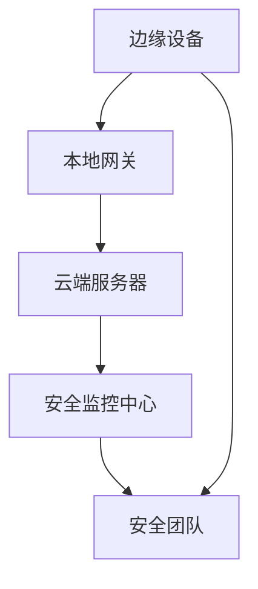
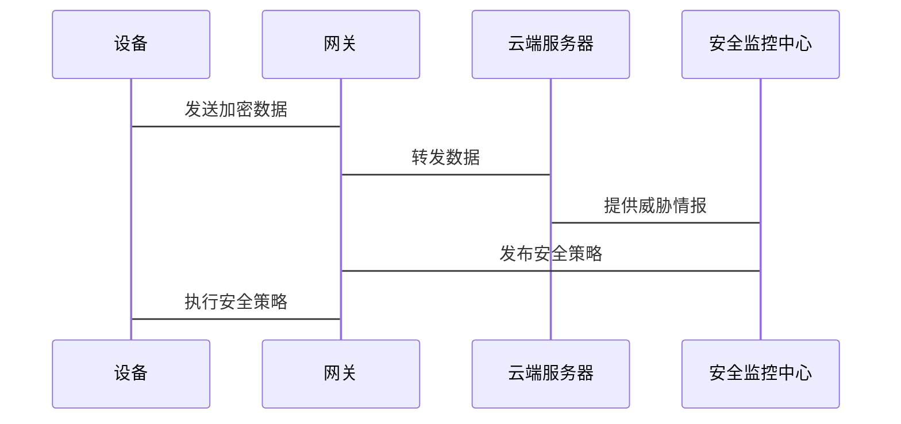

                 


# 如何识别企业的边缘计算安全优势

> 关键词：边缘计算安全、企业安全、安全优势识别、安全评估框架、数据隐私保护

> 摘要：边缘计算作为一种新兴的计算范式，正在迅速改变企业的 IT 架构和业务模式。然而，随之而来的安全挑战也日益严峻。本文将深入探讨如何识别企业在边缘计算中的安全优势，通过系统化的分析和实践案例，帮助企业构建全面的安全策略。

---

# 第1章 边缘计算安全概述

## 1.1 边缘计算的基本概念

### 1.1.1 边缘计算的定义

边缘计算是一种分布式计算范式，将数据处理和计算能力从中心服务器转移到靠近数据源的边缘设备。这种计算方式能够减少延迟、提高数据处理效率，并支持实时决策。

### 1.1.2 边缘计算的核心特点

- **分布式架构**：数据在生成点进行处理，减少对中心服务器的依赖。
- **低延迟**：边缘计算能够实时处理数据，满足实时业务需求。
- **高可用性**：边缘设备的本地计算能力确保在断网情况下的业务连续性。

### 1.1.3 边缘计算的应用场景

- **物联网（IoT）**：智能家居、工业物联网、智慧城市等场景。
- **实时数据分析**：金融交易、医疗监护等领域需要实时数据处理。
- **边缘AI**：智能摄像头、自动驾驶等场景依赖边缘计算的实时性。

## 1.2 边缘计算安全的重要性

### 1.2.1 边缘计算面临的挑战

- **数据隐私**：边缘设备处理的数据可能包含敏感信息，容易成为攻击目标。
- **网络攻击**：边缘设备与中心服务器之间的通信面临被截获或篡改的风险。
- **设备安全**：边缘设备可能被物理篡改，导致安全漏洞。

### 1.2.2 安全在边缘计算中的作用

- **保护数据隐私**：通过加密和访问控制确保数据的安全性。
- **提升系统韧性**：通过多层次的安全防护，增强系统的抗攻击能力。
- **支持合规性**：满足行业法规和数据保护要求。

### 1.2.3 边缘计算安全的优势

- **本地化安全措施**：边缘设备可以部署针对性的安全策略，减少数据传输中的风险。
- **高效的安全响应**：边缘计算能够快速识别和应对安全威胁，降低攻击影响。
- **灵活性和可扩展性**：企业可以根据业务需求灵活调整安全策略。

## 1.3 本书的目标与结构安排

### 1.3.1 本书的目标

本文旨在帮助读者理解边缘计算安全的核心概念，识别企业在边缘计算中的安全优势，并提供系统化的安全评估和优化策略。

### 1.3.2 本书的结构安排

1. 第一部分：边缘计算安全概述。
2. 第二部分：边缘计算安全的核心技术与挑战。
3. 第三部分：安全优势的识别方法论。
4. 第四部分：系统化的安全评估框架。
5. 第五部分：边缘计算安全算法与实现。
6. 第六部分：项目实战与案例分析。
7. 第七部分：总结与展望。

### 1.3.3 本书的读者群体

- IT 架构师、安全工程师。
- 企业决策者和业务管理者。
- 对边缘计算感兴趣的开发者和技术爱好者。

---

# 第2章 边缘计算安全的核心概念

## 2.1 边缘计算安全的核心要素

### 2.1.1 数据安全

- **数据隐私**：确保数据在生成、传输和存储过程中不被未经授权的访问。
- **数据完整性**：防止数据在传输过程中被篡改或损坏。
- **数据可用性**：确保数据在需要时可被访问和处理。

### 2.1.2 网络安全

- **通信加密**：使用SSL/TLS等协议加密设备与云端之间的通信。
- **网络隔离**：通过虚拟专用网络（VPN）或安全子网实现网络隔离。
- **访问控制**：基于角色的访问控制（RBAC）确保只有授权用户可以访问特定资源。

### 2.1.3 设备安全

- **设备认证**：通过数字证书或密钥确保设备身份的真实性。
- **固件安全**：定期更新设备固件，修复安全漏洞。
- **物理安全**：防止设备被物理篡改或盗窃。

## 2.2 边缘计算安全的关键技术

### 2.2.1 加密技术

- **对称加密**：如AES，用于快速加密和解密数据。
- **非对称加密**：如RSA，用于安全通信和数字签名。
- **哈希函数**：如SHA-256，用于数据完整性验证。

### 2.2.2 认证与授权

- **认证协议**：如OAuth 2.0，用于验证用户或设备的身份。
- **授权机制**：基于属性的授权（ABAC）和基于角色的授权（RBAC）。
- **零信任模型**：假设网络内部和外部同样存在威胁，严格控制访问权限。

### 2.2.3 威胁检测与响应

- **入侵检测系统（IDS）**：监控网络流量，识别异常行为。
- **安全态势感知**：通过数据分析，实时了解系统的安全状态。
- **自动响应机制**：如自动断网、数据擦除等，快速应对安全威胁。

## 2.3 边缘计算安全的核心原理

### 2.3.1 数据隐私保护

- **数据加密**：在数据生成时进行加密，确保传输和存储过程中的安全性。
- **隐私计算**：如安全多方计算（MPC）和联邦学习，保护数据隐私的同时进行计算。

### 2.3.2 网络安全隔离

- **网络分段**：将网络划分为多个子网，限制设备之间的通信。
- **虚拟专用网络（VPN）**：通过加密隧道实现安全通信。
- **防火墙**：部署在边缘设备和云端之间，过滤恶意流量。

### 2.3.3 设备身份认证

- **数字证书**：使用X.509证书进行设备身份验证。
- **密钥管理**：使用公钥基础设施（PKI）管理设备密钥。
- **一次性密码**：如时间同步的一次性密码（OTC），增强设备认证的安全性。

---

# 第3章 边缘计算安全的威胁与风险

## 3.1 边缘计算面临的常见威胁

### 3.1.1 数据泄露

- **未授权访问**：攻击者通过漏洞或弱密码访问边缘设备的数据。
- **中间人攻击**：在设备与云端之间拦截和篡改数据。
- **数据窃听**：通过网络嗅探工具窃取传输中的数据。

### 3.1.2 网络攻击

- **DDoS攻击**：利用边缘设备发起分布式拒绝服务攻击。
- **供应链攻击**：通过供应链感染边缘设备，传播恶意软件。
- **零日攻击**：利用尚未公开的安全漏洞进行攻击。

### 3.1.3 设备被篡改

- **硬件篡改**：物理访问设备，修改其固件或硬件。
- **恶意固件**：在设备中预装恶意软件，窃取数据或控制设备。
- **设备伪造**：使用假冒设备，伪装成合法设备，进行间谍活动。

## 3.2 边缘计算安全的风险评估

### 3.2.1 风险评估方法

- **资产识别**：识别企业中所有的边缘设备和数据资产。
- **威胁分析**：分析可能的威胁来源和攻击方式。
- **脆弱性评估**：评估设备、网络和数据的脆弱性，确定潜在风险。

### 3.2.2 风险评估指标

- **资产价值**：设备和数据的重要性。
- **威胁可能性**：威胁发生的概率。
- **影响程度**：威胁对企业造成的损失。

### 3.2.3 风险评估工具

- **NESSUS**：网络漏洞扫描工具。
- **OpenVAS**：开源漏洞扫描系统。
- **Fortify**：静态代码分析工具。

## 3.3 边缘计算安全的挑战

### 3.3.1 技术挑战

- **设备异构性**：不同厂商的设备可能使用不同的协议和接口，增加管理复杂性。
- **资源限制**：边缘设备通常资源有限，难以部署复杂的安全措施。
- **动态环境**：边缘计算环境动态变化，需要灵活的安全策略。

### 3.3.2 管理挑战

- **分布式管理**：管理大量分散的边缘设备需要高效的管理平台。
- **安全策略一致性**：确保所有设备遵循统一的安全策略。
- **团队协作**：需要跨部门的协作，包括IT、安全和业务部门。

### 3.3.3 业务挑战

- **成本控制**：边缘计算的安全投入可能增加企业的运营成本。
- **业务连续性**：在确保安全的前提下，不影响业务的实时性和可用性。
- **法规合规**：满足不同地区的数据保护法规，如GDPR、CCPA等。

---

# 第4章 边缘计算安全优势的识别方法论

## 4.1 边缘计算安全优势的识别框架

### 4.1.1 安全优势识别的定义

通过分析边缘计算环境中的安全措施和技术优势，识别企业在数据保护、网络防护和设备管理等方面的优势。

### 4.1.2 安全优势识别的步骤

1. **资产识别与分类**：识别企业中的边缘设备和数据资产，分类管理。
2. **威胁建模**：分析可能的威胁来源和攻击方式。
3. **脆弱性评估**：评估设备、网络和数据的脆弱性。
4. **安全措施评估**：检查现有安全措施的有效性。
5. **优势识别**：根据评估结果，识别企业的安全优势。

### 4.1.3 安全优势识别的工具

- **资产管理系统**：帮助企业管理和分类边缘设备。
- **威胁建模工具**：如IBM Security QRadar，用于分析威胁。
- **脆弱性扫描工具**：如Nessus，用于评估设备漏洞。

## 4.2 边缘计算安全优势的识别策略

### 4.2.1 技术层面的识别策略

- **数据加密技术**：评估加密算法的有效性和密钥管理机制。
- **认证与授权机制**：检查设备认证和用户授权的流程是否安全。
- **威胁检测能力**：评估设备的入侵检测和响应能力。

### 4.2.2 管理层面的识别策略

- **安全策略制定**：确保所有边缘设备遵循统一的安全策略。
- **人员培训**：提高员工的安全意识和技能。
- **监控与审计**：定期监控安全状态，记录安全事件。

### 4.2.3 业务层面的识别策略

- **业务影响分析**：评估安全威胁对业务的影响。
- **成本效益分析**：评估安全投入的经济效益。
- **供应商选择**：选择安全可靠的边缘计算设备和解决方案。

## 4.3 边缘计算安全优势的识别案例

### 4.3.1 案例一：数据隐私保护

某企业通过在边缘设备上部署端到端加密技术，确保客户数据在传输过程中的隐私性，成功抵御了多次数据窃听攻击。

### 4.3.2 案例二：网络攻击防御

某制造企业通过部署边缘计算安全解决方案，识别并阻止了针对其工业物联网设备的DDoS攻击，保障了生产线的正常运行。

### 4.3.3 案例三：设备安全加固

某金融机构通过实施设备身份认证和固件更新策略，防止了设备被恶意篡改，提升了整体系统的安全性。

---

# 第5章 边缘计算安全优势的系统化评估

## 5.1 边缘计算安全评估的指标体系

### 5.1.1 数据安全评估指标

- **数据加密覆盖率**：加密数据所占的比例。
- **数据完整性保障**：数据在传输过程中是否被篡改。
- **数据访问控制**：是否基于角色的访问控制。

### 5.1.2 网络安全评估指标

- **网络隔离程度**：网络分段的数量和隔离策略的有效性。
- **通信加密强度**：使用的加密算法和密钥长度。
- **入侵检测能力**：检测到威胁的数量和响应时间。

### 5.1.3 设备安全评估指标

- **设备认证方式**：使用的认证机制的安全性。
- **固件更新频率**：定期更新设备固件，修复安全漏洞。
- **物理安全性**：设备是否具备防止物理篡改的措施。

## 5.2 边缘计算安全评估的框架设计

### 5.2.1 评估框架的定义

边缘计算安全评估框架是一个系统化的工具，用于全面评估企业的边缘计算安全能力。

### 5.2.2 评估框架的步骤

1. **资产识别**：识别企业中的边缘设备和数据资产。
2. **威胁建模**：分析可能的威胁和攻击方式。
3. **脆弱性评估**：评估设备、网络和数据的脆弱性。
4. **安全措施评估**：检查现有安全措施的有效性。
5. **优势识别**：识别企业的安全优势。
6. **改进措施**：根据评估结果制定改进计划。

### 5.2.3 评估框架的工具

- **资产管理系统**：帮助企业管理和分类边缘设备。
- **威胁建模工具**：如IBM Security QRadar，用于分析威胁。
- **脆弱性扫描工具**：如Nessus，用于评估设备漏洞。
- **安全评估平台**：如Tenable，提供全面的安全评估服务。

## 5.3 边缘计算安全评估的实施案例

### 5.3.1 案例一：数据隐私保护

某企业通过在边缘设备上部署端到端加密技术，确保客户数据在传输过程中的隐私性，成功抵御了多次数据窃听攻击。

### 5.3.2 案例二：网络攻击防御

某制造企业通过部署边缘计算安全解决方案，识别并阻止了针对其工业物联网设备的DDoS攻击，保障了生产线的正常运行。

### 5.3.3 案例三：设备安全加固

某金融机构通过实施设备身份认证和固件更新策略，防止了设备被恶意篡改，提升了整体系统的安全性。

---

# 第6章 边缘计算安全算法与实现

## 6.1 边缘计算中的加密算法

### 6.1.1 对称加密算法

- **AES（高级加密标准）**：适用于数据加密，速度快，资源消耗低。
- **ChaCha20**：适用于资源受限的设备，加密速度快，安全性高。

### 6.1.2 非对称加密算法

- **RSA（ Rivest-Shamir-Adleman）**：适用于公钥加密和数字签名。
- **ECDSA（椭圆曲线数字签名算法）**：适用于资源受限的设备，安全性高，密钥长度短。

### 6.1.3 密钥管理算法

- **HMAC（哈希消息认证码）**：用于数据完整性和认证。
- **HKDF（哈希基于密钥的导出函数）**：用于密钥扩展和导出。

## 6.2 边缘计算中的安全协议

### 6.2.1 TLS（传输层安全性协议）

- **用途**：用于设备与云端之间的安全通信。
- **实现**：通过SSL/TLS协议实现加密通信，防止数据被窃听或篡改。

### 6.2.2 MQTT（消息队列遥测传输协议）

- **用途**：用于物联网设备之间的通信，支持轻量级协议。
- **实现**：通过MQTT协议实现设备间的消息传输，支持QoS（服务质量）保证。

### 6.2.3 COAP（约束应用协议）

- **用途**：适用于资源受限的设备，如嵌入式系统。
- **实现**：通过COAP协议实现设备间的通信，支持分片和确认机制。

## 6.3 边缘计算中的威胁检测算法

### 6.3.1 基于机器学习的威胁检测

- **算法**：使用监督学习或无监督学习算法，训练模型识别异常行为。
- **实现**：通过收集网络流量数据，训练模型识别DDoS攻击、数据窃听等威胁。

### 6.3.2 基于规则的威胁检测

- **规则**：定义特定的规则，如IP地址黑名单、异常流量模式等。
- **实现**：通过防火墙或入侵检测系统，匹配规则进行威胁检测。

### 6.3.3 基于行为分析的威胁检测

- **算法**：使用时间序列分析或聚类分析，识别异常行为模式。
- **实现**：通过分析设备行为日志，发现异常活动，及时响应。

---

# 第7章 项目实战与案例分析

## 7.1 项目背景与目标

### 7.1.1 项目背景

某智能制造企业希望优化其工业物联网（IIoT）的安全性，确保生产线的实时数据处理和设备安全。

### 7.1.2 项目目标

1. 实现边缘设备与云端的安全通信。
2. 保护设备和数据免受网络攻击。
3. 提供实时的威胁检测和响应能力。

## 7.2 系统设计与实现

### 7.2.1 系统功能设计

- **设备认证**：使用X.509证书进行设备身份认证。
- **数据加密**：在设备与云端之间使用TLS协议加密通信。
- **威胁检测**：部署基于机器学习的入侵检测系统，实时监控网络流量。

### 7.2.2 系统架构设计



### 7.2.3 系统接口设计

- **设备与网关接口**：MQTT协议，主题为"/device telemetry"。
- **网关与云端接口**：HTTPS协议，使用JWT进行认证。
- **云端与监控中心接口**：使用REST API，提供威胁事件通知。

### 7.2.4 系统交互流程



## 7.3 项目实现与代码解读

### 7.3.1 环境安装

- **操作系统**：Ubuntu 20.04
- **工具**：Python 3.8、pip、Mosquitto MQTT Broker
- **库**：paho-mqtt、cryptography

### 7.3.2 核心代码实现

```python
import paho.mqtt.client as mqtt
from cryptography.hazmat.primitives.asymmetric import padding
from cryptography.hazmat.primitives import hashes

# 设备认证函数
def authenticate_device(client, user_data, rc, properties):
    # 验证设备证书
    if rc == 0:
        print("设备已认证")
    else:
        print("设备认证失败")

# 数据加密函数
def encrypt_data(data):
    # 使用ChaCha20加密算法
    key = b'encryption_key'
    nonce = b'unique nonce'
    cipher = ChaCha20.new(key=key, nonce=nonce)
    encrypted_data = cipher.encrypt(data)
    return encrypted_data

# 威胁检测函数
def detect_threat(packet):
    # 使用基于规则的方法检测威胁
    if 'malicious_pattern' in packet:
        return True
    return False
```

### 7.3.3 代码应用解读

- **设备认证**：使用MQTT协议的认证回调函数，验证设备的X.509证书。
- **数据加密**：在设备发送数据前，使用ChaCha20算法加密数据，确保数据在传输过程中的安全性。
- **威胁检测**：通过检测网络流量中的恶意模式，识别潜在的攻击行为。

## 7.4 案例分析与小结

### 7.4.1 案例分析

某制造企业在实施边缘计算安全方案后，成功抵御了多次针对其工业物联网设备的网络攻击，保障了生产线的正常运行。

### 7.4.2 项目小结

通过本项目的实施，企业能够实现边缘设备与云端的安全通信，保护设备和数据免受网络攻击，并提供实时的威胁检测和响应能力。

---

# 第8章 总结与展望

## 8.1 总结

边缘计算作为一种新兴的计算范式，正在改变企业的 IT 架构和业务模式。然而，随之而来的安全挑战也日益严峻。本文通过系统化的分析和实践案例，帮助企业识别边缘计算中的安全优势，并提供全面的安全评估和优化策略。

## 8.2 展望

未来，随着边缘计算的普及和技术的进步，边缘计算安全将更加重要。以下是未来可能的发展方向：

### 8.2.1 更高级别的安全技术

- **零信任架构**：进一步强化设备和数据的安全性，假设网络内部和外部同样存在威胁。
- **自主保护机制**：设备具备自主决策能力，实时响应安全威胁。

### 8.2.2 人工智能与安全的结合

- **AI驱动的威胁检测**：通过机器学习和深度学习技术，提高威胁检测的准确性和效率。
- **自适应安全策略**：根据实时威胁情况，动态调整安全策略。

### 8.2.3 标准化与协作

- **行业标准**：制定边缘计算安全的行业标准，促进技术的统一和协作。
- **生态系统建设**：构建开放的安全生态系统，推动边缘计算的安全发展。

---

# 作者信息

作者：AI天才研究院/AI Genius Institute & 禅与计算机程序设计艺术 /Zen And The Art of Computer Programming

--- 

感谢您的耐心阅读，希望本文能够帮助企业识别边缘计算中的安全优势，并为企业的安全策略提供有价值的参考。

