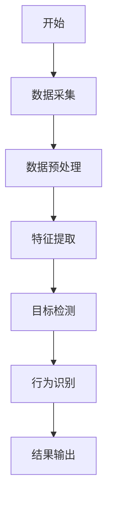
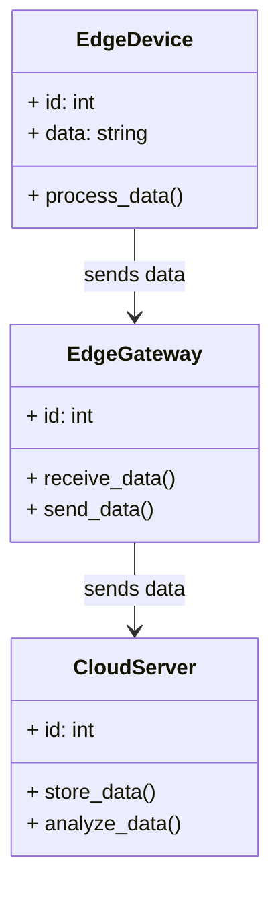
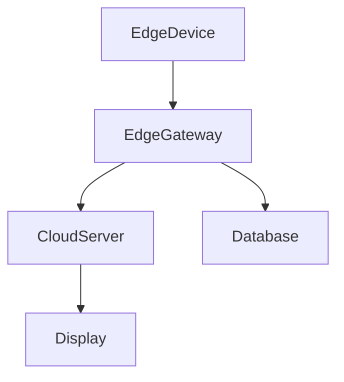
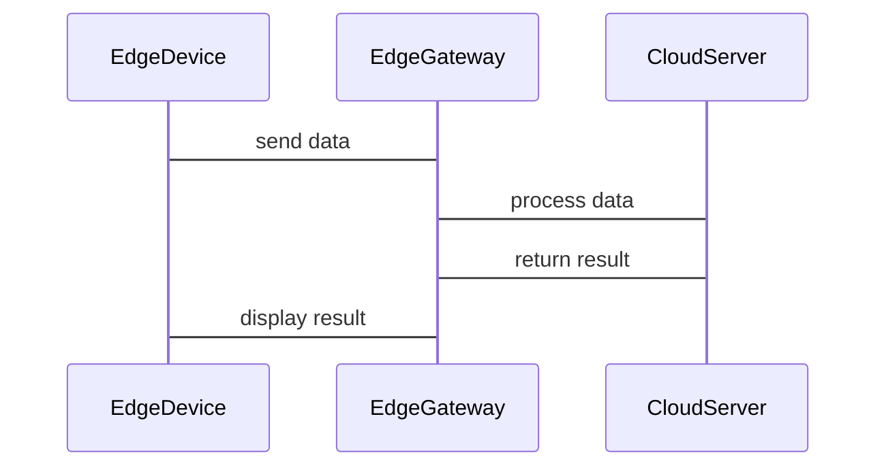

                 


# 如何识别企业的边缘计算实时视频分析优势

> 关键词：边缘计算，实时视频分析，企业优势，技术博客，系统架构

> 摘要：边缘计算在实时视频分析中的应用为企业带来了显著的优势，本文将从背景、核心概念、算法原理、系统架构、项目实战到最佳实践，全面解析如何识别和利用这些优势。

---

## 第1章: 边缘计算与实时视频分析概述

### 1.1 边缘计算的基本概念
#### 1.1.1 什么是边缘计算
边缘计算是一种分布式计算范式，将数据处理从中心服务器转移到靠近数据源的边缘设备。这种方式减少了数据传输延迟，提高了实时性。

#### 1.1.2 边缘计算的特点与优势
- **低延迟**：数据在边缘设备上实时处理，减少传输到云端的时间。
- **高可用性**：边缘设备可以在断开云端连接时继续提供服务。
- **隐私保护**：数据在边缘设备上处理，减少了数据在传输过程中被截获的风险。

#### 1.1.3 边缘计算在企业中的应用背景
随着物联网技术的发展，企业需要处理的数据量急剧增加。边缘计算在企业中的应用背景包括工业自动化、智慧城市、智能家居等领域。

### 1.2 实时视频分析的核心概念
#### 1.2.1 什么是实时视频分析
实时视频分析是指对视频流进行实时处理，提取有用信息，如目标检测、行为识别等。

#### 1.2.2 实时视频分析的关键技术
- **目标检测**：使用深度学习模型检测视频中的目标。
- **行为识别**：识别视频中的人体行为，如挥手、跑步等。
- **视频压缩**：减少视频数据量，降低传输带宽。

#### 1.2.3 边缘计算与实时视频分析的结合
边缘计算为实时视频分析提供了低延迟、高实时性的处理环境，使得视频分析可以在边缘设备上高效完成。

### 1.3 本章小结
本章介绍了边缘计算和实时视频分析的基本概念，以及它们在企业中的应用背景。通过本章，读者可以理解边缘计算和实时视频分析的核心概念及其重要性。

---

## 第2章: 边缘计算在企业中的优势分析

### 2.1 边缘计算的业务价值
#### 2.1.1 提高数据处理效率
边缘计算将数据处理从云端转移到边缘设备，减少了数据传输的距离，提高了处理效率。

#### 2.1.2 降低数据传输成本
通过在边缘设备上处理数据，减少了需要传输到云端的数据量，从而降低了数据传输成本。

#### 2.1.3 提升实时响应能力
边缘计算能够在边缘设备上实时处理数据，提升了系统的实时响应能力。

### 2.2 实时视频分析的业务场景
#### 2.2.1 智慧安防
实时视频分析在智慧安防中的应用包括异常行为检测、人脸识别等。

#### 2.2.2 工业自动化
在工业自动化中，实时视频分析可以用于设备状态监测、生产线监控等。

#### 2.2.3 零售业的实时监控
实时视频分析可以帮助零售商进行顾客行为分析、库存管理等。

### 2.3 边缘计算与实时视频分析的结合优势
#### 2.3.1 数据实时性
边缘计算能够在边缘设备上实时处理视频数据，确保数据的实时性。

#### 2.3.2 本地化处理能力
边缘计算将数据处理能力分布到边缘设备，减少了对云端的依赖，提高了系统的可用性。

#### 2.3.3 高可用性
边缘计算能够在边缘设备上独立运行，即使在云端服务不可用时，系统仍能继续提供服务。

### 2.4 本章小结
本章分析了边缘计算在企业中的优势，包括提高数据处理效率、降低数据传输成本、提升实时响应能力等。同时，介绍了实时视频分析在智慧安防、工业自动化、零售业等业务场景中的应用。

---

## 第3章: 边缘计算与实时视频分析的核心概念

### 3.1 边缘计算的定义与特点
#### 3.1.1 边缘计算的定义
边缘计算是一种分布式计算范式，将数据处理从中心服务器转移到靠近数据源的边缘设备。

#### 3.1.2 边缘计算的核心特点
- **分布式计算**：数据处理在边缘设备上进行。
- **低延迟**：边缘设备实时处理数据，减少延迟。
- **高实时性**：边缘计算能够快速响应数据变化。

#### 3.1.3 边缘计算的架构模型
边缘计算的架构模型包括边缘设备、边缘网关、云端服务器等模块。

### 3.2 实时视频分析的定义与技术特点
#### 3.2.1 实时视频分析的定义
实时视频分析是对视频流进行实时处理，提取有用信息，如目标检测、行为识别等。

#### 3.2.2 实时视频分析的关键技术
- **目标检测**：使用深度学习模型检测视频中的目标。
- **行为识别**：识别视频中的人体行为。
- **视频压缩**：减少视频数据量，降低传输带宽。

#### 3.2.3 边缘计算与实时视频分析的结合
边缘计算为实时视频分析提供了低延迟、高实时性的处理环境。

### 3.3 边缘计算与实时视频分析的系统架构
#### 3.3.1 系统架构概述
边缘计算与实时视频分析的系统架构包括边缘设备、边缘网关、云端服务器等模块。

#### 3.3.2 边缘节点的功能模块
边缘节点的功能模块包括数据采集、数据处理、数据存储等。

#### 3.3.3 云端协同的机制
云端协同的机制包括数据同步、模型更新等，确保边缘设备与云端服务器的数据一致性和模型一致性。

### 3.4 本章小结
本章详细讲解了边缘计算和实时视频分析的核心概念，包括边缘计算的定义与特点、实时视频分析的技术特点以及边缘计算与实时视频分析的系统架构。

---

## 第4章: 边缘计算实时视频分析的算法原理

### 4.1 实时视频分析的算法流程
#### 4.1.1 数据采集与预处理
数据采集是实时视频分析的第一步，预处理包括去噪、调整亮度等。

#### 4.1.2 数据特征提取
使用深度学习模型提取视频中的特征，如目标检测中的边界框、分类标签等。

#### 4.1.3 数据分类与识别
根据提取的特征，对视频中的目标进行分类和识别，如人脸识别、行为识别等。

#### 4.1.4 结果输出与反馈
将识别结果输出到应用系统，并根据反馈调整算法参数。

### 4.2 使用 Mermaid 绘制算法流程图


### 4.3 实时视频分析的 Python 代码实现
```python
import cv2

def detect_edges(image):
    # 边缘检测算法
    edges = cv2.Canny(image, 100, 200)
    return edges

def main():
    video_capture = cv2.VideoCapture(0)
    while video_capture.isOpened():
        ret, frame = video_capture.read()
        if not ret:
            break
        edges = detect_edges(frame)
        cv2.imshow('实时视频分析', edges)
        if cv2.waitKey(1) & 0xFF == ord('q'):
            break
    video_capture.release()
    cv2.destroyAllWindows()

if __name__ == "__main__":
    main()
```

### 4.4 算法原理的数学模型与公式
实时视频分析的算法通常基于深度学习模型，如卷积神经网络（CNN）。模型的损失函数可以表示为：
$$ \mathcal{L} = \mathcal{L}_1 + \mathcal{L}_2 $$
其中，$\mathcal{L}_1$ 是目标检测的损失，$\mathcal{L}_2$ 是行为识别的损失。

### 4.5 本章小结
本章详细讲解了实时视频分析的算法流程，包括数据采集、预处理、特征提取、分类识别等步骤。通过 Mermaid 流程图和 Python 代码示例，展示了算法的实现过程。

---

## 第5章: 边缘计算实时视频分析的系统架构设计

### 5.1 系统架构概述
边缘计算实时视频分析的系统架构包括边缘设备、边缘网关、云端服务器等模块。

### 5.2 系统功能设计
#### 5.2.1 领域模型设计
使用 Mermaid 绘制领域模型类图：


#### 5.2.2 系统架构设计
使用 Mermaid 绘制系统架构图：


#### 5.2.3 系统接口设计
系统接口设计包括边缘设备与边缘网关之间的接口、边缘网关与云端服务器之间的接口等。

#### 5.2.4 系统交互设计
使用 Mermaid 绘制系统交互序列图：


### 5.3 本章小结
本章详细讲解了边缘计算实时视频分析的系统架构设计，包括系统功能设计、系统架构图、系统接口设计和系统交互设计。

---

## 第6章: 边缘计算实时视频分析的项目实战

### 6.1 环境安装
#### 6.1.1 安装 Python 和相关库
```bash
pip install numpy
pip install opencv-python
```

#### 6.1.2 安装深度学习框架
```bash
pip install tensorflow
```

### 6.2 系统核心实现源代码
```python
import cv2
import tensorflow as tf

def load_model():
    # 加载预训练模型
    model = tf.keras.models.load_model('model.h5')
    return model

def preprocess_image(image):
    # 图像预处理
    image = cv2.resize(image, (224, 224))
    image = image / 255.0
    return image

def main():
    model = load_model()
    video_capture = cv2.VideoCapture(0)
    while video_capture.isOpened():
        ret, frame = video_capture.read()
        if not ret:
            break
        preprocessed = preprocess_image(frame)
        prediction = model.predict(preprocessed.reshape(1, 224, 224, 3))
        cv2.imshow('实时视频分析', frame)
        if cv2.waitKey(1) & 0xFF == ord('q'):
            break
    video_capture.release()
    cv2.destroyAllWindows()

if __name__ == "__main__":
    main()
```

### 6.3 代码应用解读与分析
本代码实现了一个简单的实时视频分析系统，使用了 OpenCV 进行图像采集和预处理，使用 TensorFlow 进行模型加载和预测。

### 6.4 实际案例分析
以智慧安防为例，实时视频分析可以用于异常行为检测、人脸识别等。

### 6.5 项目小结
通过本章的项目实战，读者可以了解边缘计算实时视频分析的实现过程，包括环境安装、代码实现、案例分析等。

---

## 第7章: 边缘计算实时视频分析的最佳实践

### 7.1 小结
边缘计算实时视频分析为企业带来了显著的优势，包括提高数据处理效率、降低数据传输成本、提升实时响应能力等。

### 7.2 注意事项
在实际应用中，需要注意边缘设备的计算能力、网络带宽限制、数据隐私保护等问题。

### 7.3 拓展阅读
推荐读者阅读相关书籍和论文，深入了解边缘计算和实时视频分析的技术细节。

### 7.4 本章小结
本章总结了边缘计算实时视频分析的优势和注意事项，为读者提供了实际应用的参考。

---

## 作者：AI天才研究院/AI Genius Institute & 禅与计算机程序设计艺术 /Zen And The Art of Computer Programming

---

以上就是《如何识别企业的边缘计算实时视频分析优势》的技术博客文章内容，希望对您有所帮助！

