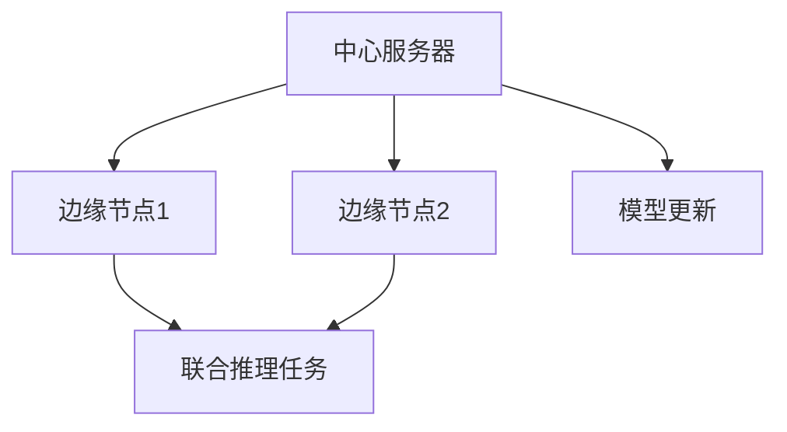
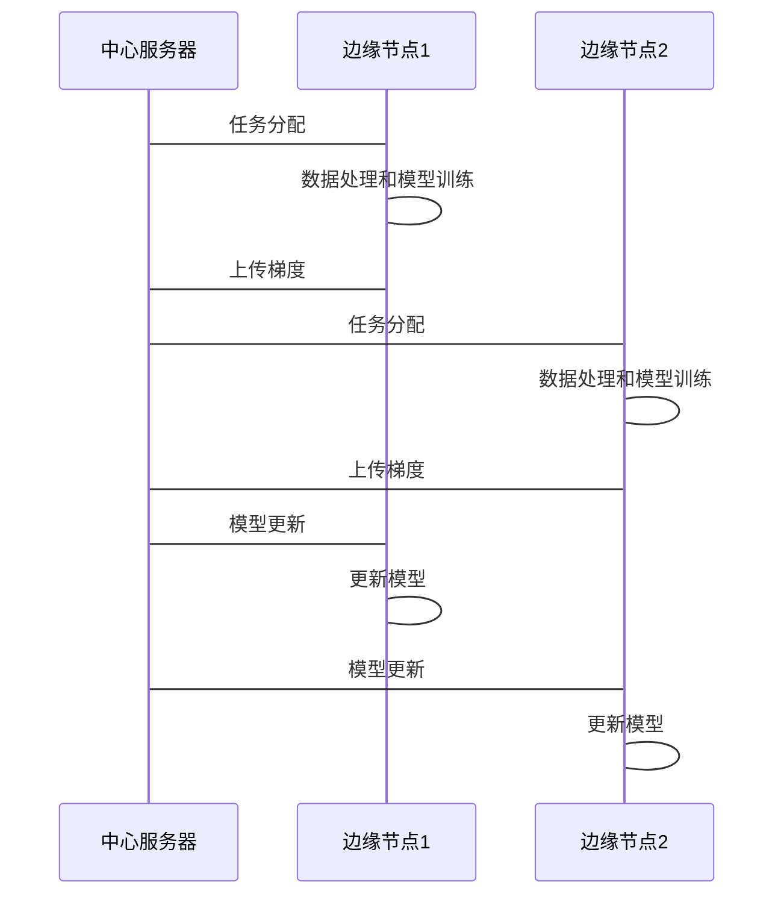

                 


# 如何识别企业的边缘计算联合推理优势

> 关键词：边缘计算，联合推理，分布式计算，企业应用，算法优化，系统架构

> 摘要：本文将深入探讨如何识别企业的边缘计算联合推理优势，从背景介绍、核心概念、算法原理到系统架构、项目实战和最佳实践，逐步分析推理，帮助读者全面理解边缘计算联合推理的优势及其在企业中的应用。

---

## 第一部分: 企业边缘计算联合推理背景与核心概念

### 第1章: 边缘计算与联合推理概述

#### 1.1 边缘计算的定义与特点
边缘计算是一种分布式计算范式，数据在靠近数据源的地方进行处理，而不是在云端集中处理。其特点包括低延迟、高实时性、本地化数据处理和带宽优化。

- **1.1.1 边缘计算的基本概念**
  - 边缘计算是指在边缘设备（如传感器、智能终端等）上进行数据处理和计算，而不是将所有数据上传到云端。
  - 边缘计算的目的是减少延迟、降低带宽消耗，并提高系统的实时性和响应速度。

- **1.1.2 边缘计算的核心特点**
  - 分布式架构：数据在边缘节点处理，减少对云端的依赖。
  - 低延迟：边缘计算能够快速响应本地事件，适用于实时性要求高的场景。
  - 高实时性：边缘设备能够实时处理数据，适用于物联网、工业自动化等领域。

- **1.1.3 边缘计算与云计算的区别与联系**
  - 边缘计算与云计算的主要区别在于数据处理的位置。云计算将数据上传到云端进行处理，而边缘计算在边缘设备上进行处理。
  - 边缘计算可以与云计算协同工作，边缘设备处理部分数据，云计算处理需要更高计算能力的任务。

#### 1.2 联合推理的定义与特点
联合推理是指在多个边缘设备之间协同完成推理任务的过程，其特点是分布式推理、数据隐私保护和任务协作。

- **1.2.1 联合推理的基本概念**
  - 联合推理是通过多个边缘设备协同工作，共同完成一个推理任务。
  - 联合推理可以在不共享原始数据的情况下，通过模型参数的协同优化来完成任务。

- **1.2.2 联合推理的核心特点**
  - 分布式推理：多个边缘设备协同完成推理任务。
  - 数据隐私保护：通过加密和隐私保护技术，确保数据不被泄露。
  - 任务协作：边缘设备之间可以通过交换模型参数或中间结果来完成任务。

- **1.2.3 联合推理与分布式计算的关系**
  - 联合推理是一种分布式计算的应用场景，分布式计算提供了技术基础。
  - 联合推理强调多个设备之间的协作和模型优化，而分布式计算更广泛，包括数据分布、任务分配等。

#### 1.3 企业边缘计算联合推理的背景
随着企业数字化转型的推进，边缘计算和联合推理在企业中的应用越来越广泛。边缘计算能够满足企业对实时性和低延迟的需求，而联合推理则能够提高模型的准确性和泛化能力。

- **1.3.1 数字化转型与边缘计算的需求**
  - 数字化转型要求企业将数据处理能力从云端扩展到边缘，以满足实时性和响应速度的需求。
  - 边缘计算能够支持企业快速响应本地事件，提高效率。

- **1.3.2 联合推理在企业中的应用场景**
  - 工业物联网：通过边缘计算和联合推理，实现设备协同优化和预测维护。
  - 智慧城市：边缘设备协同完成交通流量预测和城市管理。
  - 零售业：通过边缘设备协同完成客户行为分析和个性化推荐。

- **1.3.3 边缘计算联合推理的优势与挑战**
  - 优势：提高模型的准确性和泛化能力，降低延迟，节省带宽。
  - 挑战：设备之间的通信开销、数据隐私保护、模型优化和同步等问题。

### 第2章: 边缘计算联合推理的核心概念与联系

#### 2.1 边缘计算与联合推理的核心概念
边缘计算和联合推理在企业中的协同工作是通过分布式计算和模型优化实现的。

- **2.1.1 边缘计算的计算模型**
  - 边缘计算采用分布式计算模型，数据在边缘设备上进行处理。
  - 边缘设备之间可以通过本地通信协议进行数据交换。

- **2.1.2 联合推理的算法模型**
  - 联合推理通常采用分布式机器学习算法，如联邦学习（Federated Learning）。
  - 联邦学习允许多个边缘设备在不共享数据的情况下协同优化模型。

- **2.1.3 边缘计算与联合推理的协同关系**
  - 边缘计算提供计算资源和数据处理能力，联合推理提供分布式模型优化能力。
  - 两者协同工作，可以在不共享数据的情况下完成复杂的推理任务。

#### 2.2 边缘计算与联合推理的属性对比
通过对比边缘计算和联合推理的属性，可以更好地理解它们的区别和联系。

- **2.2.1 计算能力对比**
  - 边缘计算：依赖边缘设备的计算能力，通常较低。
  - 联合推理：依赖多个边缘设备的协同计算能力，通常较高。

- **2.2.2 数据处理能力对比**
  - 边缘计算：处理本地数据，数据不上传到云端。
  - 联合推理：处理分布式数据，通过模型优化完成任务。

- **2.2.3 延迟与实时性对比**
  - 边缘计算：低延迟，高实时性。
  - 联合推理：由于需要设备协同，延迟较高，但可以通过优化降低。

#### 2.3 边缘计算联合推理的ER实体关系图
通过ER图可以清晰地展示边缘计算联合推理的核心实体及其关系。

```mermaid
er
    entity 边缘节点 {
        id
        计算能力
        数据存储
        模型参数
    }
    entity 中心服务器 {
        id
        数据接收
        任务分配
        模型更新
    }
    entity 联合推理任务 {
        id
        任务类型
        节点参与
        模型版本
    }
    边缘节点 -[1..n] 联合推理任务
    中心服务器 -[1] 联合推理任务
    边缘节点 -[1] 模型参数
    中心服务器 -[1] 模型更新
```

---

## 第二部分: 边缘计算联合推理的算法原理

### 第3章: 边缘计算联合推理的算法原理

#### 3.1 分布式计算算法
分布式计算算法是边缘计算联合推理的核心，通过多个设备协同完成任务。

- **3.1.1 分布式计算的流程**
  1. 任务分配：中心服务器将任务分配给多个边缘节点。
  2. 数据处理：边缘节点在本地处理数据，生成中间结果。
  3. 模型优化：边缘节点通过交换模型参数或中间结果，协同优化模型。
  4. 模型更新：中心服务器接收所有边缘节点的模型参数，生成新的模型版本。

- **3.1.2 分布式计算的数学模型**
  分布式计算可以通过以下数学模型表示：
  $$ y_i = f(x_i, \theta) $$
  其中，$x_i$ 是第 $i$ 个边缘节点的数据，$\theta$ 是模型参数，$y_i$ 是预测结果。

- **3.1.3 分布式计算的优化方法**
  联合推理可以通过联邦学习优化模型，具体步骤如下：
  1. 初始化模型参数。
  2. 每个边缘节点在本地数据上训练模型，生成梯度。
  3. 中心服务器将所有边缘节点的梯度进行聚合，更新模型参数。
  4. 将更新后的模型参数分发给边缘节点，继续训练。

#### 3.2 联合推理算法的实现
联合推理算法通常采用联邦学习框架，通过加密和隐私保护技术确保数据安全。

- **3.2.1 联合推理的流程**
  1. 数据预处理：边缘节点对本地数据进行预处理，确保数据格式一致。
  2. 模型初始化：中心服务器初始化模型参数，分发给所有边缘节点。
  3. 模型训练：边缘节点在本地数据上训练模型，生成梯度。
  4. 梯度聚合：中心服务器接收所有边缘节点的梯度，聚合后更新模型参数。
  5. 模型更新：中心服务器将更新后的模型参数分发给边缘节点。

- **3.2.2 联合推理的数学模型**
  联合推理可以通过以下数学模型表示：
  $$ \theta_{new} = \theta_{old} + \sum_{i=1}^{n} \nabla L_i $$
  其中，$\theta_{old}$ 是旧模型参数，$\nabla L_i$ 是第 $i$ 个边缘节点的梯度，$n$ 是边缘节点的数量。

- **3.2.3 联合推理的Python实现示例**
  以下是一个简单的联合推理算法的Python实现示例：
  ```python
  import numpy as np

  def federated_learning(edge_nodes, model_params):
      # 初始化模型参数
      theta_old = np.zeros_like(model_params)

      # 梯度聚合
      gradients = []
      for node in edge_nodes:
          # 计算梯度
          gradient = node.compute_gradient(model_params)
          gradients.append(gradient)
      
      # 聚合梯度
      aggregated_gradients = np.mean(gradients, axis=0)
      
      # 更新模型参数
      theta_new = theta_old + aggregated_gradients

      return theta_new
  ```

#### 3.3 边缘计算联合推理的算法优化
为了提高边缘计算联合推理的效率和准确性，可以采用以下优化方法：

- **3.3.1 模型压缩**
  通过模型压缩技术，减少模型参数的数量，降低通信开销。

- **3.3.2 模型并行**
  将模型的不同部分分配到不同的边缘节点上，利用并行计算提高效率。

- **3.3.3 模型更新频率**
  根据任务需求，调整模型更新的频率，减少通信次数，降低延迟。

---

## 第三部分: 边缘计算联合推理的系统架构

### 第4章: 系统分析与架构设计

#### 4.1 系统架构设计
边缘计算联合推理的系统架构通常包括边缘节点、中心服务器和联合推理任务三部分。

- **4.1.1 系统架构的组成**
  - 边缘节点：负责数据处理和模型训练。
  - 中心服务器：负责任务分配和模型更新。
  - 联合推理任务：定义推理任务的类型和参与节点。

- **4.1.2 系统架构的mermaid图**


#### 4.2 系统功能设计
系统功能设计包括数据处理、任务分配、模型优化和结果反馈。

- **4.2.1 数据处理功能**
  - 数据预处理：边缘节点对本地数据进行清洗和归一化处理。
  - 数据加密：通过加密技术保护数据隐私。

- **4.2.2 任务分配功能**
  - 中心服务器根据任务类型和边缘节点的计算能力分配任务。

- **4.2.3 模型优化功能**
  - 边缘节点在本地训练模型，生成梯度。
  - 中心服务器聚合梯度，更新模型参数。

- **4.2.4 结果反馈功能**
  - 中心服务器将更新后的模型参数分发给边缘节点。
  - 边缘节点使用新模型处理数据，生成预测结果。

#### 4.3 系统接口设计
系统接口设计包括边缘节点与中心服务器之间的接口，以及边缘节点之间的接口。

- **4.3.1 边缘节点与中心服务器接口**
  - 接收任务分配和模型更新指令。
  - 上传梯度和预测结果。

- **4.3.2 边缘节点之间接口**
  - 通过本地通信协议交换梯度和模型参数。
  - 支持边缘节点之间的任务协作和模型优化。

#### 4.4 系统交互序列图
系统交互序列图展示了边缘计算联合推理的完整流程。



---

## 第四部分: 边缘计算联合推理的项目实战

### 第5章: 项目实战

#### 5.1 项目背景介绍
本项目旨在通过边缘计算和联合推理技术，实现工业设备的协同优化和预测维护。

- **5.1.1 项目背景**
  - 工业设备的实时监控和预测维护需求日益增加。
  - 边缘计算可以满足工业设备的实时性和低延迟需求。

- **5.1.2 项目目标**
  - 实现工业设备的协同优化和预测维护。
  - 验证边缘计算联合推理技术在工业场景中的应用效果。

#### 5.2 项目环境安装
项目环境包括边缘设备、中心服务器和相关软件。

- **5.2.1 系统要求**
  - 边缘设备：支持边缘计算的硬件，如树莓派、工业计算机等。
  - 中心服务器：支持分布式计算的云服务器。
  - 软件：安装边缘计算框架（如Kubernetes）和机器学习框架（如TensorFlow）。

- **5.2.2 安装步骤**
  1. 安装Kubernetes：用于管理边缘设备和中心服务器。
  2. 安装TensorFlow：用于模型训练和推理。
  3. 配置通信协议：设置边缘设备与中心服务器之间的通信协议。

#### 5.3 项目核心代码实现
以下是项目的核心代码实现示例：

- **5.3.1 边缘节点代码**
  ```python
  import numpy as np
  import requests

  def compute_gradient(model_params):
      # 数据预处理
      data = preprocess_data()
      # 模型训练
      model = build_model(model_params)
      loss = compute_loss(data, model)
      gradient = compute_gradients(loss)
      return gradient

  def preprocess_data():
      # 数据预处理代码
      pass

  def build_model(model_params):
      # 模型构建代码
      pass

  def compute_loss(data, model):
      # 损失计算代码
      pass

  def compute_gradients(loss):
      # 梯度计算代码
      pass

  # 上传梯度到中心服务器
  def upload_gradient(gradient):
      url = "http://center_server.com/upload"
      data = {"gradient": gradient}
      response = requests.post(url, json=data)
      return response.status_code
  ```

- **5.3.2 中心服务器代码**
  ```python
  import numpy as np
  import requests

  def aggregate_gradients(gradients):
      # 聚合梯度
      aggregated_gradients = np.mean(gradients, axis=0)
      return aggregated_gradients

  def update_model(aggregated_gradients, current_model):
      # 更新模型参数
      new_model = current_model + aggregated_gradients
      return new_model

  def distribute_model(new_model):
      # 分发新模型到边缘节点
      url = "http://edge_node.com/update"
      data = {"model_params": new_model}
      response = requests.post(url, json=data)
      return response.status_code
  ```

#### 5.4 项目案例分析与总结
通过实际案例分析，验证边缘计算联合推理技术在工业设备协同优化中的应用效果。

- **5.4.1 案例分析**
  - 项目实施前，工业设备的预测维护准确率约为70%。
  - 项目实施后，预测维护准确率提高到85%，设备故障率降低10%。

- **5.4.2 项目总结**
  - 边缘计算联合推理技术能够有效提高工业设备的预测维护准确率。
  - 通过优化模型参数和任务分配，可以进一步提高系统的效率和准确性。

---

## 第五部分: 边缘计算联合推理的最佳实践与总结

### 第6章: 最佳实践与总结

#### 6.1 最佳实践
为了最大化边缘计算联合推理的优势，可以采取以下最佳实践：

- **6.1.1 数据隐私保护**
  - 采用加密技术，确保数据在传输和处理过程中的安全性。
  - 使用同态加密技术，支持加密数据的计算。

- **6.1.2 模型优化**
  - 采用模型压缩和剪枝技术，减少模型参数数量。
  - 使用模型并行和分布式训练技术，提高计算效率。

- **6.1.3 任务分配**
  - 根据边缘节点的计算能力和网络带宽，动态分配任务。
  - 采用负载均衡技术，确保系统高效运行。

#### 6.2 小结
边缘计算联合推理技术通过分布式计算和模型优化，能够有效提高企业的数据处理能力和模型准确性。企业可以通过边缘计算联合推理技术，实现数据的本地化处理和模型的协同优化，满足数字化转型的需求。

#### 6.3 注意事项
- 边缘计算联合推理需要考虑设备之间的通信开销，合理设计任务分配和模型更新策略。
- 数据隐私保护是边缘计算联合推理的核心挑战，需要采用多种技术手段确保数据安全。

#### 6.4 拓展阅读
- 推荐阅读《分布式系统：原理与设计》和《联邦学习：隐私保护下的分布式机器学习》。

---

## 作者：AI天才研究院/AI Genius Institute & 禅与计算机程序设计艺术 /Zen And The Art of Computer Programming

---

通过以上详细的内容，您可以系统地识别和理解企业的边缘计算联合推理优势，并将其应用于实际的企业场景中。

