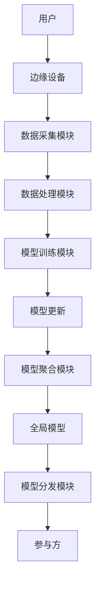
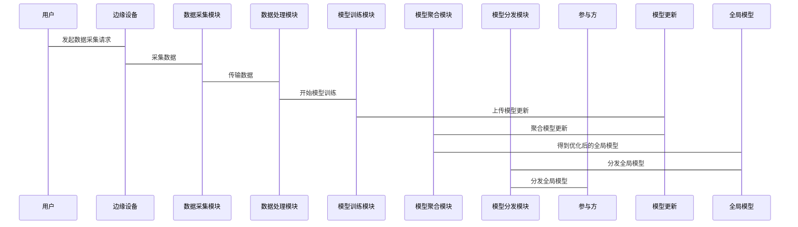

                 


# 如何识别企业的边缘计算联邦学习优势

> 关键词：边缘计算、联邦学习、企业优势、数据隐私、分布式计算、协同学习

> 摘要：本文旨在深入探讨如何识别企业在边缘计算与联邦学习结合中的优势。通过分析边缘计算与联邦学习的核心概念、算法原理、系统架构以及实际案例，揭示这些技术如何帮助企业提升数据隐私保护、解决数据孤岛问题并优化业务流程。文章内容涵盖从理论到实践的全过程，帮助读者全面理解边缘计算与联邦学习在企业中的应用价值。

---

# 第一部分: 边缘计算与联邦学习背景介绍

## 第1章: 边缘计算与联邦学习概述

### 1.1 边缘计算的基本概念
#### 1.1.1 边缘计算的定义
边缘计算是一种分布式计算范式，将数据处理和计算能力从云端移到靠近数据源的边缘设备上。边缘计算的核心思想是“计算靠近数据”，从而减少延迟、提升效率。

#### 1.1.2 边缘计算的核心特点
- **分布式架构**：数据在边缘设备上直接处理，减少对云端的依赖。
- **低延迟**：边缘计算能够快速响应本地事件，适用于实时性要求高的场景。
- **数据隐私保护**：边缘设备可以本地处理数据，减少数据传输到云端的过程，降低数据泄露风险。

#### 1.1.3 边缘计算与云计算的区别
- **计算位置**：边缘计算将计算能力部署在边缘设备，而云计算依赖于中心化的云端服务器。
- **延迟**：边缘计算具有低延迟优势，而云计算在某些场景下可能会面临高延迟。
- **数据处理方式**：边缘计算强调本地化数据处理，云计算依赖于集中式数据存储和处理。

### 1.2 联邦学习的基本概念
#### 1.2.1 联邦学习的定义
联邦学习（Federated Learning）是一种分布式机器学习技术，允许多个参与方在不共享原始数据的情况下协作训练模型。通过将模型更新分发到各个参与方，联邦学习能够在保护数据隐私的前提下，共同优化一个全局模型。

#### 1.2.2 边缘计算与联邦学习的核心特点
- **数据隐私保护**：联邦学习通过局部模型更新和通信，避免直接传输原始数据，从而保护数据隐私。
- **分布式协作**：联邦学习允许多个边缘设备或节点协同训练模型，充分利用分布式计算的优势。
- **模型优化**：通过联邦学习，可以在不共享数据的情况下，优化全局模型，提升模型性能。

### 1.3 边缘计算与联邦学习的结合
#### 1.3.1 边缘计算与联邦学习的协同优势
- **数据隐私保护**：边缘计算将数据处理和计算能力部署在边缘设备，联邦学习通过模型更新协同优化全局模型，两者结合能够进一步增强数据隐私保护。
- **分布式协作**：边缘计算提供了分布式数据处理能力，联邦学习提供了分布式模型训练机制，两者结合能够实现端到端的分布式协作。
- **高效性与安全性**：边缘计算通过本地数据处理减少延迟，联邦学习通过模型更新协同优化全局模型，两者结合能够实现高效且安全的分布式计算。

---

## 第2章: 企业边缘计算联邦学习的优势

### 2.1 企业数据隐私保护
#### 2.1.1 数据隐私的重要性
在数字化转型的背景下，企业数据隐私保护变得尤为重要。企业数据可能包含敏感信息，如客户数据、业务数据等，一旦泄露可能导致严重后果。

#### 2.1.2 边缘计算在数据隐私保护中的作用
边缘计算通过将数据处理能力部署在边缘设备，可以在本地完成数据处理和分析，避免将敏感数据传输到云端，从而降低数据泄露风险。

#### 2.1.3 联邦学习在数据隐私保护中的作用
联邦学习通过局部模型更新和通信，可以在不共享原始数据的情况下优化全局模型，进一步保护数据隐私。

### 2.2 企业数据孤岛问题
#### 2.2.1 数据孤岛的定义与影响
数据孤岛指的是数据分散在不同的系统或部门中，彼此之间无法有效共享和协同，导致数据利用率低下，影响企业整体效率。

#### 2.2.2 边缘计算如何解决数据孤岛问题
边缘计算通过将数据处理能力部署在边缘设备，可以在本地完成数据的处理和分析，减少数据孤岛问题。

#### 2.2.3 联邦学习如何解决数据孤岛问题
联邦学习通过分布式模型训练机制，允许多个边缘设备或节点协同优化全局模型，从而解决数据孤岛问题，实现数据的高效利用。

### 2.3 企业边缘计算联邦学习的效率提升
#### 2.3.1 边缘计算对数据处理效率的提升
边缘计算通过将数据处理能力部署在边缘设备，可以在本地完成数据的实时处理和分析，提升数据处理效率。

#### 2.3.2 联邦学习对模型训练效率的提升
联邦学习通过分布式模型训练机制，允许多个边缘设备或节点协同优化全局模型，提升模型训练效率。

#### 2.3.3 边缘计算与联邦学习协同提升效率
边缘计算与联邦学习的结合，可以在保护数据隐私的前提下，实现端到端的分布式协作，进一步提升数据处理和模型训练的效率。

---

## 第3章: 边缘计算联邦学习的核心概念与联系

### 3.1 边缘计算与联邦学习的核心概念
#### 3.1.1 边缘计算的核心概念
边缘计算是一种分布式计算范式，将数据处理和计算能力部署在边缘设备上，减少延迟、提升效率。

#### 3.1.2 联邦学习的核心概念
联邦学习是一种分布式机器学习技术，允许多个参与方在不共享原始数据的情况下协作训练模型。

#### 3.1.3 边缘计算与联邦学习的结合点
边缘计算提供了分布式数据处理能力，联邦学习提供了分布式模型训练机制，两者结合可以在保护数据隐私的前提下，实现端到端的分布式协作。

### 3.2 边缘计算与联邦学习的属性特征对比
| 特性                | 边缘计算                      | 联邦学习                     |
|---------------------|------------------------------|------------------------------|
| 计算位置            | 边缘设备                     | 多个边缘设备或节点           |
| 数据处理方式        | 本地数据处理                 | 分布式模型训练               |
| 数据隐私保护        | 本地数据处理，避免数据传输   | 模型更新协同，避免数据共享   |
| 模型训练方式        | 本地模型训练                 | 分布式模型训练               |
| 通信机制            | 边缘设备与云端通信            | 边缘设备之间或与云端通信     |

### 3.3 边缘计算与联邦学习的ER实体关系图

```mermaid
erDiagram
    user 用户 {
        string 用户ID
        string 用户名
        string 用户密码
    }
    device 边缘设备 {
        string 设备ID
        string 设备类型
        string 设备状态
    }
    node 联邦节点 {
        string 节点ID
        string 节点类型
        string 节点状态
    }
    user --> device : 使用
    device --> node : 参与联邦学习
    node --> user : 提供模型更新
```

---

## 第4章: 边缘计算联邦学习的算法原理

### 4.1 边缘计算的算法原理
#### 4.1.1 边缘计算的基本流程
1. 数据采集：从边缘设备采集数据。
2. 数据处理：在边缘设备上进行数据预处理和特征提取。
3. 本地模型训练：在边缘设备上训练本地模型。
4. 模型更新：将本地模型的更新上传到云端或分布式节点。

#### 4.1.2 边缘计算的数学模型
$$ y = f(x) $$
其中，$x$ 是输入数据，$f$ 是边缘设备上的本地模型。

### 4.2 联邦学习的算法原理
#### 4.2.1 联邦学习的基本流程
1. 初始化：在所有参与方初始化模型参数。
2. 模型训练：每个参与方在本地训练模型，并将模型更新上传到云端或分布式节点。
3. 模型聚合：云端或分布式节点将所有参与方的模型更新聚合，得到全局模型。
4. 模型分发：将优化后的全局模型分发给所有参与方。

#### 4.2.2 联邦学习的数学模型
$$ \theta_{\text{global}} = \arg\min_{\theta} \sum_{i=1}^N \mathcal{L}_i(\theta) $$
其中，$\theta_{\text{global}}$ 是全局模型参数，$\mathcal{L}_i$ 是第 $i$ 个参与方的损失函数。

---

## 第5章: 边缘计算联邦学习的系统架构

### 5.1 系统架构设计
#### 5.1.1 系统功能模块
- 数据采集模块：负责从边缘设备采集数据。
- 数据处理模块：对采集的数据进行预处理和特征提取。
- 模型训练模块：在边缘设备上训练本地模型，并将模型更新上传到云端或分布式节点。
- 模型聚合模块：将所有参与方的模型更新聚合，得到全局模型。
- 模型分发模块：将优化后的全局模型分发给所有参与方。

#### 5.1.2 系统架构图



### 5.2 系统接口设计
- 数据采集接口：负责从边缘设备采集数据。
- 模型训练接口：在边缘设备上训练本地模型，并将模型更新上传到云端或分布式节点。
- 模型聚合接口：将所有参与方的模型更新聚合，得到全局模型。
- 模型分发接口：将优化后的全局模型分发给所有参与方。

### 5.3 系统交互序列图



---

## 第6章: 边缘计算联邦学习的项目实战

### 6.1 环境配置
- 操作系统：Ubuntu 20.04
- Python版本：3.8
- 依赖库：numpy、pandas、tensorflow、flaml

### 6.2 系统核心实现源代码

```python
import numpy as np
import pandas as pd
import tensorflow as tf
from flaml import FlamlModel

# 数据预处理
def preprocess_data(data):
    # 假设data是原始数据
    # 这里进行特征提取和数据标准化
    processed_data = data.drop(columns=['id', 'timestamp'])
    processed_data = processed_data.fillna(0)
    return processed_data

# 模型训练
def train_model(x, y):
    model = tf.keras.Sequential([
        tf.keras.layers.Dense(64, activation='relu'),
        tf.keras.layers.Dense(1, activation='sigmoid')
    ])
    model.compile(optimizer='adam', loss='binary_crossentropy')
    model.fit(x, y, epochs=10, batch_size=32)
    return model

# 模型更新
def update_model(model, x, y):
    model.trainable = True
    model.optimizer = tf.keras.optimizers.Adam(learning_rate=0.01)
    model.fit(x, y, epochs=5, batch_size=16)
    return model

# 模型聚合
def aggregate_models(models):
    # 假设models是多个模型
    # 这里进行模型参数的平均聚合
    average_model = FlamlModel()
    for model in models:
        average_model.add_model(model)
    return average_model

# 主程序
def main():
    # 数据加载
    data = pd.read_csv('edge_data.csv')
    x, y = preprocess_data(data)
    # 模型训练
    local_model = train_model(x, y)
    # 模型更新
    updated_model = update_model(local_model, x, y)
    # 模型聚合
    global_model = aggregate_models([updated_model])
    # 模型分发
    global_model.save('global_model.h5')

if __name__ == '__main__':
    main()
```

---

## 第7章: 边缘计算联邦学习的最佳实践

### 7.1 注意事项
- **数据隐私保护**：在边缘计算和联邦学习中，数据隐私保护是核心问题，需要严格控制数据的访问和传输。
- **模型更新策略**：在联邦学习中，模型更新策略直接影响全局模型的性能，需要合理设计模型更新的频率和方式。
- **系统架构设计**：在系统架构设计中，需要充分考虑边缘设备的计算能力和网络条件，确保系统的高效运行。

### 7.2 小结
边缘计算与联邦学习的结合为企业提供了高效、安全、隐私保护的分布式计算方案。通过边缘计算，企业可以实现本地数据处理和实时响应；通过联邦学习，企业可以在不共享数据的前提下，优化全局模型，提升业务性能。

### 7.3 拓展阅读
- 《Distributed Machine Learning with Federated Learning》
- 《Edge Computing: A Technical Report》
- 《Federated Learning in Practice》

---

# 作者：AI天才研究院/AI Genius Institute & 禅与计算机程序设计艺术/Zen And The Art of Computer Programming

