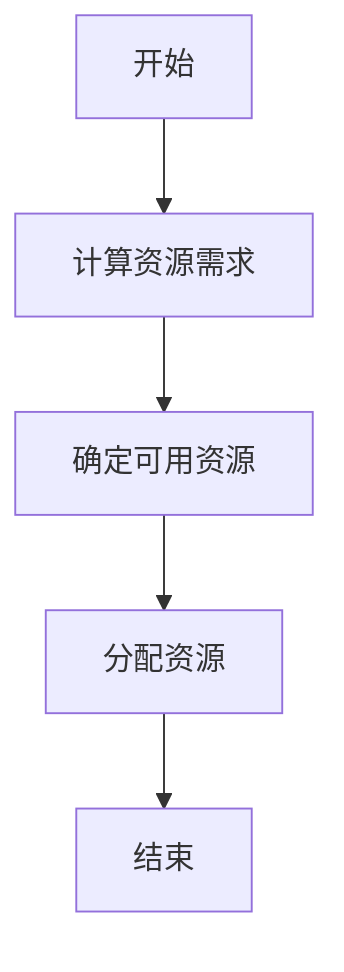
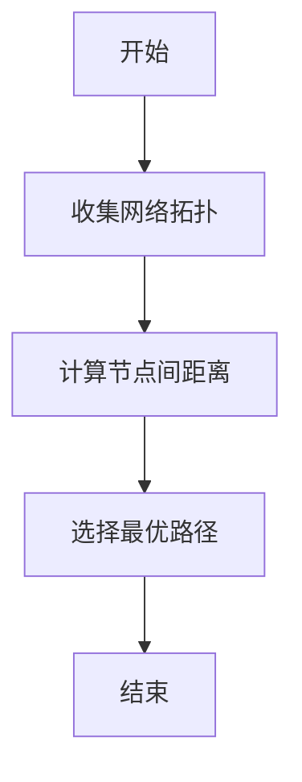
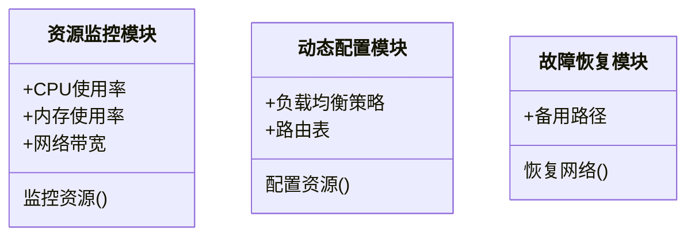

                 


# 如何识别企业的边缘计算自适应网络优势

> 关键词：边缘计算、自适应网络、企业网络优化、动态资源分配、低延迟优化

> 摘要：本文深入探讨了企业在边缘计算环境中如何识别和利用自适应网络的优势。通过分析边缘计算的核心概念、自适应网络的原理、算法实现以及系统架构，帮助读者理解如何在企业中优化网络性能，提高资源利用率，并降低延迟。文章还提供了实际案例和最佳实践，帮助企业在数字化转型中更好地应用边缘计算自适应网络技术。

---

# 第一部分: 边缘计算自适应网络概述

## 第1章: 边缘计算自适应网络的背景与概念

### 1.1 边缘计算的基本概念

#### 1.1.1 边缘计算的定义与特点
边缘计算是一种分布式计算范式，将数据处理和存储从传统的中心化云端转移到靠近数据源的边缘设备。其特点包括：
- **分布式架构**：数据在边缘端进行处理，减少对云端的依赖。
- **低延迟**：边缘计算能够快速响应本地数据，降低延迟。
- **本地化处理**：数据在生成源附近处理，减少数据传输距离。

#### 1.1.2 边缘计算的发展背景
随着物联网（IoT）、5G和人工智能（AI）的快速发展，边缘计算的需求日益增长。企业需要在本地快速处理数据，以支持实时决策和高效业务流程。

#### 1.1.3 边缘计算与传统云计算的区别
边缘计算与传统云计算的主要区别在于数据处理的位置和方式：
- **云计算**：数据集中处理，适用于非实时任务。
- **边缘计算**：数据在边缘端实时处理，适用于需要快速响应的场景。

### 1.2 自适应网络的核心理念

#### 1.2.1 自适应网络的定义
自适应网络是一种能够根据网络环境动态调整自身配置和资源分配的网络架构。它能够自动适应网络负载、故障和变化的业务需求。

#### 1.2.2 边缘计算与自适应网络的结合
边缘计算自适应网络结合了边缘计算的分布式特性与自适应网络的动态优化能力，能够在复杂多变的环境中保持网络性能的最优状态。

#### 1.2.3 企业网络优化的新趋势
随着企业数字化转型的深入，边缘计算自适应网络成为企业优化网络性能、降低成本和提升用户体验的重要手段。

### 1.3 企业边缘计算自适应网络的优势

#### 1.3.1 提高网络性能
通过动态资源分配和智能路由，边缘计算自适应网络能够显著提高网络的吞吐量和响应速度。

#### 1.3.2 降低延迟
边缘计算将数据处理转移到靠近数据源的位置，减少了数据传输的距离，从而降低了延迟。

#### 1.3.3 提高资源利用率
自适应网络能够根据实时需求动态分配资源，避免资源浪费，提高整体资源利用率。

### 1.4 本章小结
本章介绍了边缘计算的基本概念、自适应网络的核心理念以及边缘计算自适应网络在企业中的优势，为后续章节的深入分析奠定了基础。

---

# 第二部分: 边缘计算自适应网络的核心概念与联系

## 第2章: 边缘计算自适应网络的核心原理

### 2.1 边缘计算自适应网络的原理

#### 2.1.1 动态资源分配
动态资源分配是边缘计算自适应网络的核心机制之一。通过实时监控网络负载，系统能够动态调整资源分配，确保每个节点的资源利用达到最优状态。

#### 2.1.2 网络流量优化
网络流量优化是通过智能路由算法和负载均衡技术，确保数据在边缘网络中的高效传输，减少网络拥塞和延迟。

#### 2.1.3 自动故障恢复
边缘计算自适应网络具备自动故障恢复能力，在检测到网络故障时，能够快速切换到备用路径，保证业务的连续性。

### 2.2 自适应网络的关键技术

#### 2.2.1 动态负载均衡
动态负载均衡是一种根据当前网络负载动态调整资源分配的技术。它通过将高负载节点的流量转移到低负载节点，避免网络瓶颈。

#### 2.2.2 智能路由算法
智能路由算法是一种基于实时网络状态的路由技术。它能够根据网络拓扑和节点负载动态调整路由路径，确保数据传输的高效性。

#### 2.2.3 边缘数据管理
边缘数据管理是针对边缘设备数据的高效管理和存储的技术。它能够确保数据在边缘端的完整性、一致性和安全性。

### 2.3 核心概念对比分析

#### 2.3.1 边缘计算与云计算的对比
| 特性         | 边缘计算                     | 云计算                       |
|--------------|------------------------------|------------------------------|
| 数据处理位置 | 边缘端                       | 云端                        |
| 延迟          | 低                          | 较高                        |
| 网络带宽      | 低                          | 高                          |

#### 2.3.2 自适应网络与传统网络的对比
| 特性         | 自适应网络                   | 传统网络                   |
|--------------|------------------------------|------------------------------|
| 资源分配      | 动态                        | 固定                        |
| 故障恢复      | 自动                        | 手动                        |
| 网络优化      | 实时                        | 定期                        |

#### 2.3.3 企业网络优化的对比分析
通过对比分析边缘计算与传统云计算、自适应网络与传统网络的差异，可以帮助企业在选择网络架构时做出更明智的决策。

### 2.4 本章小结
本章详细分析了边缘计算自适应网络的核心原理和关键技术，并通过对比分析帮助企业更好地理解其优势和适用场景。

---

# 第三部分: 边缘计算自适应网络的算法原理

## 第3章: 自适应网络算法的数学模型与公式

### 3.1 动态负载均衡算法

#### 3.1.1 负载均衡的数学模型
$$ \text{负载分配} = \frac{\text{资源需求}}{\text{总资源}} $$

#### 3.1.2 算法流程图


#### 3.1.3 Python实现示例
```python
def dynamic_load_balancing(nodes, resources):
    node_load = [node['load'] for node in nodes]
    total_resources = sum(resources)
    load_ratio = [load / total_resources for load in node_load]
    return load_ratio
```

### 3.2 智能路由算法

#### 3.2.1 最短路径算法
$$ \text{路径长度} = \sum_{i=1}^{n} d_i $$

#### 3.2.2 算法流程图


#### 3.2.3 Python实现示例
```python
import heapq

def dijkstra(graph, start, end):
    distances = {node: float('infinity') for node in graph}
    distances[start] = 0
    heap = [(0, start)]
    
    while heap:
        current_dist, current_node = heapq.heappop(heap)
        if current_node == end:
            break
        for neighbor, weight in graph[current_node].items():
            if distances[neighbor] > current_dist + weight:
                distances[neighbor] = current_dist + weight
                heapq.heappush(heap, (distances[neighbor], neighbor))
    return distances[end]
```

### 3.3 本章小结
本章通过数学模型和Python代码示例，详细讲解了动态负载均衡和智能路由算法的实现原理，帮助读者理解边缘计算自适应网络的算法基础。

---

# 第四部分: 边缘计算自适应网络的系统架构与设计

## 第4章: 系统架构设计方案

### 4.1 系统功能设计

#### 4.1.1 资源监控模块
资源监控模块负责实时监控网络中的资源使用情况，包括CPU、内存、带宽等。

#### 4.1.2 动态配置模块
动态配置模块根据资源监控结果动态调整网络配置，包括负载均衡和路由优化。

#### 4.1.3 故障恢复模块
故障恢复模块负责检测网络故障，并在检测到故障时自动切换到备用路径，确保业务连续性。

### 4.2 系统架构设计

#### 4.2.1 领域模型


#### 4.2.2 系统架构图


### 4.3 本章小结
本章通过系统功能设计和架构图展示了边缘计算自适应网络的整体设计，帮助读者理解系统的各个组成部分及其相互关系。

---

# 第五部分: 边缘计算自适应网络的项目实战

## 第5章: 项目实战与案例分析

### 5.1 环境安装

#### 5.1.1 安装Kubernetes
```bash
sudo apt-get update && sudo apt-get install docker.io kubelet kubeadm kubectl
```

#### 5.1.2 安装边缘计算框架
```bash
git clone https://github.com/kubeflow/kfctl.git
cd kfctl && ./install.sh
```

### 5.2 核心代码实现

#### 5.2.1 动态负载均衡实现
```python
def load_balance(nodes):
    max_load = max(node['load'] for node in nodes)
    return [node for node in nodes if node['load'] == max_load]
```

#### 5.2.2 智能路由实现
```python
def smart_route(nodes, destination):
    shortest_distance = min(node['distance'][destination] for node in nodes)
    return [node for node in nodes if node['distance'][destination] == shortest_distance]
```

### 5.3 案例分析

#### 5.3.1 智能工厂案例
某智能工厂通过部署边缘计算自适应网络，将设备数据实时处理，提高了生产效率和产品质量。

#### 5.3.2 智慧交通案例
某城市交通系统通过边缘计算自适应网络优化了信号灯控制，降低了交通拥堵。

### 5.4 本章小结
本章通过项目实战和案例分析，展示了边缘计算自适应网络在实际应用中的优势和效果，帮助读者更好地理解其实际价值。

---

# 第六部分: 边缘计算自适应网络的最佳实践

## 第6章: 最佳实践与总结

### 6.1 小结
边缘计算自适应网络通过动态资源分配、低延迟优化和智能路由算法，显著提高了企业的网络性能和用户体验。

### 6.2 注意事项
- 确保网络设备的硬件性能能够支持边缘计算。
- 定期更新网络设备的固件和软件，确保系统的安全性和稳定性。
- 建立完善的监控和日志系统，及时发现和解决问题。

### 6.3 拓展阅读
- 《边缘计算：架构与实践》
- 《自适应网络：算法与实现》

### 6.4 本章小结
本章总结了边缘计算自适应网络的优势，并提出了实际应用中的注意事项和拓展阅读建议，帮助读者进一步提升技术水平。

---

# 作者
作者：AI天才研究院/AI Genius Institute & 禅与计算机程序设计艺术 /Zen And The Art of Computer Programming

