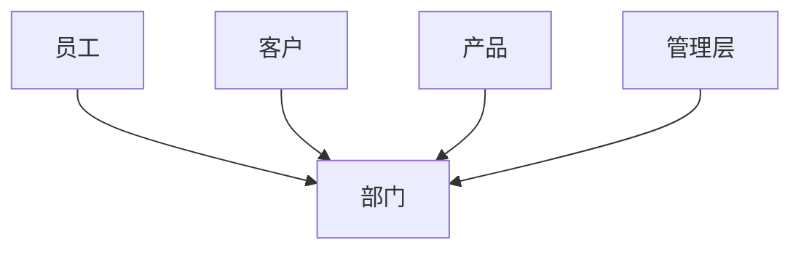
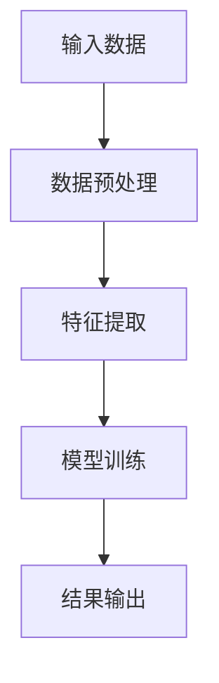
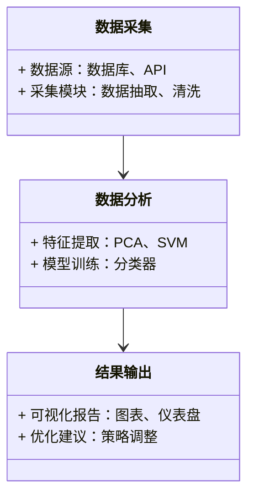
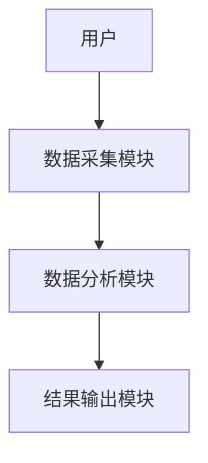

                 


# 如何识别企业的隐藏成长动力

## 关键词：企业成长、隐藏动力、数据分析、绩效评估、管理策略、系统优化、可持续发展

## 摘要：  
识别企业的隐藏成长动力是企业在复杂市场环境中实现可持续发展的关键。通过数据分析和绩效评估模型，我们可以发现那些不易察觉但对企业成长至关重要的因素。本文系统地分析了隐藏成长动力的核心概念，提供了算法原理和系统架构设计，并通过实际案例展示了如何在企业中应用这些方法。文章最后总结了最佳实践和注意事项，为读者提供了全面的指导。

---

## 目录大纲：如何识别企业的隐藏成长动力

1. **背景介绍**  
   - 1.1 问题背景与概念结构  
     - 1.1.1 问题背景：企业增长的常见挑战  
     - 1.1.2 问题描述：隐藏成长动力的定义与重要性  
     - 1.1.3 解决思路与概念结构：如何构建识别模型  

2. **核心概念与联系**  
   - 2.1 核心概念原理  
     - 隐藏成长动力的定义与属性特征对比  
     - ER实体关系图：企业各部门之间的关系分析  

3. **算法原理讲解**  
   - 3.1 算法流程图与Python代码实现  
     - 使用 Mermaid 绘制算法流程图  
     - 通过 Python 代码实现隐藏成长动力识别算法  

4. **系统分析与架构设计**  
   - 4.1 问题场景介绍  
     - 企业绩效评估中的隐藏因素分析  
   - 4.2 系统功能设计：领域模型类图  
     - 使用 Mermaid 绘制领域模型类图  
   - 4.3 系统架构设计：架构图与交互序列图  
     - 使用 Mermaid 绘制系统架构图和交互序列图  

5. **项目实战**  
   - 5.1 环境安装与代码实现  
     - 数据分析工具安装与配置  
   - 5.2 实际案例分析：某企业的隐藏成长动力识别  
   - 5.3 项目总结与经验分享  

6. **总结与展望**  
   - 关键点回顾与最佳实践  
   - 小结与注意事项  
   - 拓展阅读与进一步学习方向  

---

## 正文内容

### 第一部分：背景介绍

#### 1.1 问题背景与概念结构

##### 1.1.1 问题背景：企业增长的常见挑战
企业在成长过程中常常面临外部环境和内部管理的双重挑战。外部环境的不确定性（如市场竞争加剧、政策变化等）和内部管理的复杂性（如资源分配不均、员工效率低下）使得企业难以实现可持续增长。隐藏的成长动力往往隐藏在企业的日常运营中，如员工的工作效率、客户满意度、产品创新潜力等，这些因素对企业的发展至关重要，但却容易被忽视。

##### 1.1.2 问题描述：隐藏成长动力的定义与重要性
隐藏成长动力是指那些能够为企业创造额外价值，但在表面上不易被察觉的因素。这些因素可能包括员工的创新能力、客户忠诚度、内部流程优化等。识别这些隐藏动力可以帮助企业制定更有效的战略，优化资源配置，提升整体竞争力。

##### 1.1.3 解决思路与概念结构：如何构建识别模型
为了识别隐藏成长动力，我们需要构建一个系统化的模型。该模型应包括数据采集、分析、评估和优化四个阶段。通过数据分析技术，我们可以从企业内部和外部数据中提取关键指标，进而识别隐藏动力。

---

### 第二部分：核心概念与联系

#### 2.1 核心概念原理

##### 隐藏成长动力的定义与属性特征对比
隐藏成长动力可以通过以下几个关键属性进行定义：

| 属性 | 特征描述 |
|------|----------|
| 隐秘性 | 不易被察觉，通常隐藏在日常运营中 |
| 可量化 | 可以通过数据进行测量和评估 |
| 战略性 | 对企业长期发展具有重要影响 |
| 可优化 | 通过调整管理策略可以增强其作用 |

##### ER实体关系图：企业各部门之间的关系分析
以下是企业各部门之间的关系 ER 图：



---

### 第三部分：算法原理讲解

#### 3.1 算法流程图与Python代码实现

##### 使用 Mermaid 绘制算法流程图
以下是隐藏成长动力识别算法的流程图：



##### 通过 Python 代码实现算法
以下是实现隐藏成长动力识别的 Python 代码示例：

```python
import pandas as pd
from sklearn.preprocessing import StandardScaler
from sklearn.decomposition import PCA

# 数据预处理
def preprocess(data):
    # 删除缺失值
    data = data.dropna()
    # 标准化处理
    scaler = StandardScaler()
    data = scaler.fit_transform(data)
    return data

# 特征提取
def extract_features(data):
    # 使用 PCA 降维
    pca = PCA(n_components=3)
    features = pca.fit_transform(data)
    return features

# 模型训练
def train_model(features, labels):
    from sklearn.svm import SVC
    model = SVC()
    model.fit(features, labels)
    return model

# 主函数
def main():
    # 加载数据
    data = pd.read_csv('growth_data.csv')
    # 预处理
    processed_data = preprocess(data)
    # 特征提取
    features = extract_features(processed_data)
    # 训练模型
    labels = data['label']
    model = train_model(features, labels)
    # 预测结果
    predictions = model.predict(features)
    print("预测结果：", predictions)

if __name__ == '__main__':
    main()
```

##### 数学模型与公式
隐藏成长动力识别模型可以基于主成分分析（PCA）和支持向量机（SVM）进行构建。以下是PCA的数学公式：

$$
\text{PCA的目标是找到数据的主要成分，公式为} \sum (\lambda_i)^2
$$

SVM 的目标函数为：

$$
\text{minimize} \quad \frac{1}{2} ||\mathbf{w}||^2 + C \sum_{i=1}^{n} \xi_i
$$

其中，$\mathbf{w}$ 是超平面的法向量，$C$ 是惩罚参数，$\xi_i$ 是松弛变量。

---

### 第四部分：系统分析与架构设计

#### 4.1 问题场景介绍
在企业绩效评估中，隐藏成长动力往往被忽视。例如，某企业的员工创新能力可能未被充分挖掘，导致企业错失市场机会。通过系统分析，我们可以识别这些隐藏因素，并优化企业战略。

#### 4.2 系统功能设计：领域模型类图
以下是领域模型类图：



#### 4.3 系统架构设计：架构图与交互序列图
以下是系统架构图：


交互序列图：



---

### 第五部分：项目实战

#### 5.1 环境安装与代码实现
为了运行上述代码，您需要安装以下库：
- `pandas`
- `scikit-learn`
- `mermaid`

安装命令：
```bash
pip install pandas scikit-learn mermaid
```

#### 5.2 实际案例分析：某企业的隐藏成长动力识别
以某制造企业为例，我们可以通过数据分析识别其隐藏成长动力。以下是具体步骤：
1. 数据采集：收集员工绩效数据、客户反馈数据。
2. 数据预处理：清洗数据，去除缺失值。
3. 特征提取：使用PCA降维。
4. 模型训练：训练SVM分类器。
5. 结果输出：生成优化建议报告。

#### 5.3 项目总结与经验分享
通过项目实战，我们发现隐藏成长动力识别的关键在于数据的质量和模型的准确性。企业应定期进行数据分析，及时调整管理策略。

---

### 第六部分：总结与展望

#### 关键点回顾与最佳实践
- 数据质量是隐藏成长动力识别的基础。
- 模型的选择应根据企业实际情况灵活调整。
- 定期评估和优化是确保模型有效性的关键。

#### 小结与注意事项
- 隐藏成长动力识别是一个系统工程，需要企业内外部数据的结合。
- 在实施过程中，应注重数据隐私和安全。

#### 拓展阅读与进一步学习
- 推荐阅读《数据分析实战》和《机器学习算法详解》。
- 参加相关技术培训和研讨会，提升数据分析能力。

---

## 作者：AI天才研究院  
文章来源：[禅与计算机程序设计艺术](https://github.com/Genius-Programming-Art)

