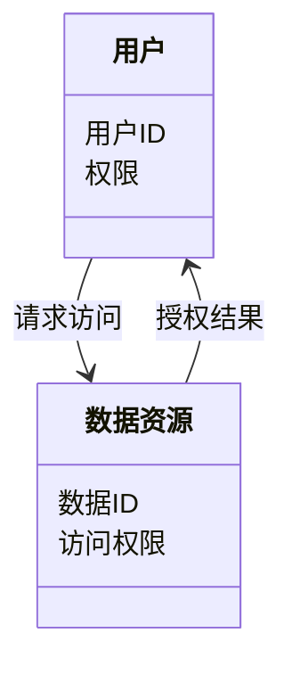
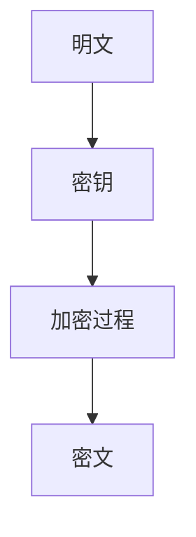
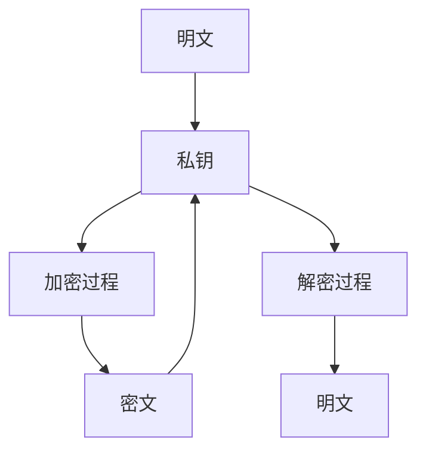
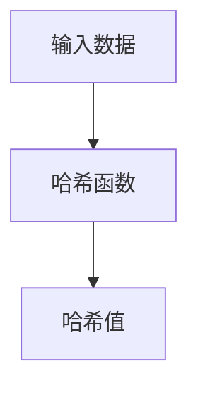
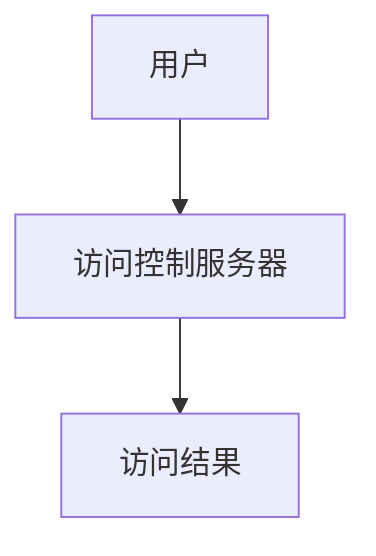
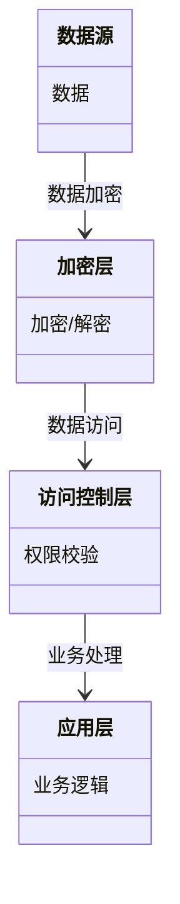

                 


# 安全性与数据隐私

> 关键词：数据隐私，安全性，加密算法，访问控制，数据保护，系统架构

> 摘要：本文深入探讨了数据隐私与安全性的重要性和核心概念，分析了数据加密算法、身份认证与访问控制等关键技术，详细讲解了数据隐私保护的系统架构设计，并通过实际案例展示了如何在项目中实现数据隐私保护。文章最后总结了数据隐私与安全的未来发展趋势和挑战。

---

# 第一部分: 数据隐私与安全的背景与概念

## 第1章: 数据隐私与安全概述

### 1.1 数据隐私的定义与重要性

#### 1.1.1 数据隐私的基本概念
数据隐私指的是对个人或组织的数据进行保护，防止未经授权的访问、泄露或滥用。在当今数字化时代，数据隐私已经成为个人权利的重要组成部分，也是企业合规性的重要指标。

#### 1.1.2 数据隐私的法律与伦理要求
数据隐私的法律要求主要体现在《通用数据保护条例》（GDPR）等法规中，要求企业在处理个人数据时必须获得明确的授权，并采取措施保护数据不被滥用。伦理上，数据隐私保护也是企业社会责任的重要体现。

#### 1.1.3 数据隐私对个人和企业的影响
- 对个人的影响：保护个人隐私，防止身份盗窃、欺诈等安全风险。
- 对企业的影响：合规性要求、品牌形象维护、法律责任避免等。

### 1.2 数据安全的核心概念

#### 1.2.1 数据安全的定义与范围
数据安全是指通过技术手段保护数据的机密性、完整性和可用性。数据安全的范围包括数据的存储、传输和处理等全生命周期。

#### 1.2.2 数据安全的关键属性
- 机密性：防止未经授权的访问。
- 完整性：确保数据在存储和传输过程中不被篡改。
- 可用性：确保合法用户能够访问和使用数据。

#### 1.2.3 数据安全与隐私保护的边界与外延
数据安全是隐私保护的基础，而隐私保护是数据安全的目的。两者的边界在于：数据安全关注技术手段，而隐私保护关注最终结果。

### 1.3 数据隐私与安全的关联性

#### 1.3.1 数据隐私与安全的内在联系
数据隐私的核心是防止未经授权的访问，而数据安全则是实现这一目标的技术手段。

#### 1.3.2 数据隐私与安全的相互影响
- 数据隐私要求数据安全技术的支持。
- 数据安全技术的进步推动数据隐私保护能力的提升。

#### 1.3.3 数据隐私与安全的系统性特征
数据隐私与安全是系统工程，涉及技术、法律、伦理等多个方面。

---

## 第2章: 数据隐私与安全的核心概念

### 2.1 数据隐私与安全的核心要素

#### 2.1.1 数据分类与分级
数据分类是根据数据的重要性和敏感程度进行分类，分级是根据分类结果制定不同的保护策略。

#### 2.1.2 数据生命周期管理
数据从产生、存储、使用到销毁的全生命周期管理是数据隐私保护的重要环节。

#### 2.1.3 数据访问控制策略
通过访问控制策略，确保只有授权用户能够访问特定数据。

### 2.2 数据隐私与安全的核心原理

#### 2.2.1 数据隐私保护的数学模型
数据隐私保护可以通过数学模型来描述，例如：
$$ \text{隐私保护} = f(\text{数据}, \text{访问权限}) $$

#### 2.2.2 数据安全的加密原理
加密是保护数据机密性的核心手段，通过对数据进行加密，确保只有授权用户能够解密。

#### 2.2.3 数据访问控制的逻辑结构
数据访问控制的逻辑结构可以通过类图表示：



### 2.3 数据隐私与安全的关联性分析

#### 2.3.1 数据隐私与安全的依赖关系
数据隐私依赖于数据安全技术，数据安全是实现数据隐私的手段。

#### 2.3.2 数据隐私与安全的协同机制
通过加密、访问控制等技术手段，实现数据隐私保护。

#### 2.3.3 数据隐私与安全的系统架构
数据隐私与安全的系统架构可以通过架构图表示：


---

# 第二部分: 数据隐私与安全的核心技术

## 第3章: 加密算法与数据保护

### 3.1 对称加密算法

#### 3.1.1 AES算法原理与流程
AES（高级加密标准）是一种常用的对称加密算法，其流程如下：



- 加密过程：明文通过AES算法和密钥生成密文。
- 解密过程：密文通过AES算法和密钥还原为明文。

#### 3.1.2 AES算法的数学模型
AES算法的核心是基于有限域的数学运算，例如：
$$ \text{加密} = f(\text{明文}, \text{密钥}) $$

#### 3.1.3 AES算法的应用场景
- 数据存储加密
- 数据传输加密

### 3.2 公钥加密算法

#### 3.2.1 RSA算法的原理与流程
RSA（ Rivest–Shamir–Adleman）是一种公钥加密算法，其流程如下：



- 加密过程：使用公钥加密明文生成密文。
- 解密过程：使用私钥解密密文还原为明文。

#### 3.2.2 RSA算法的数学模型
RSA算法的核心是基于大整数分解的数学问题，例如：
$$ \text{加密} = f(\text{明文}, \text{公钥}) $$
$$ \text{解密} = f(\text{密文}, \text{私钥}) $$

#### 3.2.3 RSA算法的应用场景
- 数字签名
- 密钥交换

### 3.3 数据哈希函数

#### 3.3.1 哈希函数的原理与流程
哈希函数是一种将任意长度的输入映射为固定长度输出的函数，其流程如下：



#### 3.3.2 哈希函数的数学模型
哈希函数可以通过数学模型表示为：
$$ \text{哈希值} = h(\text{输入数据}) $$

#### 3.3.3 哈希函数的应用场景
- 数据完整性校验
- 密码存储（存储哈希值而非明文）

---

## 第4章: 身份认证与访问控制

### 4.1 身份认证的原理与技术

#### 4.1.1 身份认证的定义与流程
身份认证是通过验证用户身份来确认其合法性，流程如下：


#### 4.1.2 常见的身份认证技术
- 基于密码的身份认证
- 基于令牌的身份认证
- 基于生物特征的身份认证

### 4.2 访问控制的实现与策略

#### 4.2.1 访问控制的定义与流程
访问控制是指通过策略限制用户对资源的访问权限，流程如下：



#### 4.2.2 常见的访问控制策略
- 基于角色的访问控制（RBAC）
- 基于属性的访问控制（ABAC）
- 基于规则的访问控制（RBAC）

---

## 第5章: 数据隐私保护的系统架构设计

### 5.1 数据隐私保护的系统架构

#### 5.1.1 数据隐私保护的分层架构
数据隐私保护的分层架构可以通过类图表示：



#### 5.1.2 数据隐私保护的模块化设计
- 数据加密模块
- 数据访问控制模块
- 数据完整性校验模块

---

## 第6章: 数据隐私保护的法律与合规

### 6.1 数据隐私保护的法律框架

#### 6.1.1 GDPR（通用数据保护条例）
GDPR是欧盟的数据保护法规，要求企业在处理个人数据时必须获得用户的明确授权，并采取措施保护数据不被滥用。

#### 6.1.2 CCPA（加州消费者隐私法案）
CCPA是美国加州的隐私保护法规，要求企业向用户公开数据收集和使用的情况，并允许用户访问和删除其数据。

### 6.2 数据隐私保护的合规要求

#### 6.2.1 数据收集与处理的合规性
- 数据收集必须明确告知用户
- 数据处理必须符合授权范围

#### 6.2.2 数据存储与传输的合规性
- 数据存储必须加密
- 数据传输必须使用安全通道

#### 6.2.3 数据删除的合规性
- 用户有权要求删除其数据
- 数据删除必须符合法律规定

---

## 第7章: 数据隐私保护的项目实战

### 7.1 项目背景与需求分析

#### 7.1.1 项目背景
某企业需要保护其用户的敏感数据，防止数据泄露和滥用。

#### 7.1.2 项目需求
- 数据加密存储
- 数据访问控制
- 数据完整性校验

### 7.2 项目系统设计

#### 7.2.1 系统功能设计
- 数据加密模块：实现数据的加密和解密
- 数据访问控制模块：实现基于角色的访问控制
- 数据完整性校验模块：实现数据的完整性校验

#### 7.2.2 系统架构设计
- 数据源层：原始数据存储
- 加密层：数据加密
- 访问控制层：权限校验
- 应用层：业务逻辑处理

### 7.3 项目实现与代码

#### 7.3.1 数据加密模块实现
```python
def encrypt(data, key):
    # 加密算法实现
    return encrypted_data
```

#### 7.3.2 数据访问控制模块实现
```python
def access_control(user, resource):
    # 权限校验逻辑
    return authorized
```

#### 7.3.3 数据完整性校验模块实现
```python
def checksum(data):
    # 校验码计算
    return checksum_value
```

### 7.4 项目测试与优化

#### 7.4.1 系统测试
- 加密测试
- 解密测试
- 权限校验测试
- 完整性校验测试

#### 7.4.2 性能优化
- 加密算法优化
- 访问控制优化
- 系统架构优化

---

## 第8章: 数据隐私与安全的未来趋势

### 8.1 数据隐私与安全的新兴技术

#### 8.1.1 基于AI的数据隐私保护
AI技术可以用于数据隐私保护，例如通过联邦学习实现数据隐私保护。

#### 8.1.2 基于区块链的数据隐私保护
区块链技术可以用于数据隐私保护，例如通过零知识证明实现隐私保护。

### 8.2 数据隐私与安全的挑战与应对

#### 8.2.1 新兴技术带来的挑战
- AI技术的双刃剑效应
- 区块链技术的安全性问题

#### 8.2.2 数据隐私与安全的应对策略
- 技术创新
- 法规完善
- 用户教育

---

## 第9章: 总结与展望

### 9.1 本章总结
- 数据隐私与安全是数字化时代的核心问题
- 数据加密、访问控制等技术是实现数据隐私保护的关键手段
- 系统架构设计和法律合规是数据隐私保护的重要保障

### 9.2 未来展望
- 新兴技术将推动数据隐私保护的创新
- 数据隐私保护将更加注重技术与法律的结合
- 数据隐私保护将更加注重用户体验

---

# 作者：AI天才研究院/AI Genius Institute & 禅与计算机程序设计艺术 /Zen And The Art of Computer Programming

