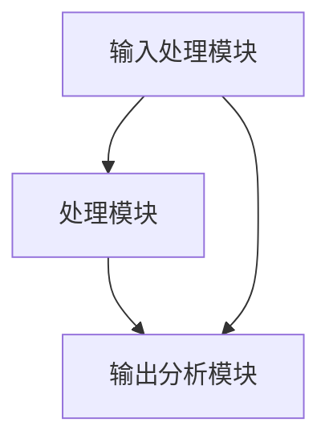

                 


# 安全性测试：防范AI Agent的潜在风险

---

## 关键词：  
安全性测试、AI Agent、潜在风险、算法原理、系统架构、项目实战、最佳实践  

---

## 摘要：  
随着AI Agent技术的快速发展，其潜在的安全风险也在不断增加。本文从AI Agent的基本概念出发，详细探讨其安全性测试的方法论、算法原理、系统架构设计以及实际项目中的应用场景。通过分析AI Agent的安全漏洞、测试模型和测试流程，结合具体案例，提出防范AI Agent潜在风险的最佳实践。  

---

## 第一部分：AI Agent的背景与核心概念  

### 第2章：AI Agent的基本概念与技术背景  

#### 2.1 AI Agent的定义与分类  
AI Agent（人工智能代理）是指能够感知环境、自主决策并执行任务的智能体。根据功能和应用场景，AI Agent可以分为以下几类：  
- **反应式AI Agent**：基于当前环境输入做出实时反应，常用于实时控制任务。  
- **认知式AI Agent**：具备推理、规划和学习能力，适用于复杂决策任务。  
- **混合式AI Agent**：结合反应式和认知式的特点，适用于复杂且动态的环境。  

#### 2.2 AI Agent的核心技术与应用场景  
AI Agent的核心技术包括自然语言处理（NLP）、机器学习（ML）、计算机视觉（CV）和知识图谱等。其应用场景广泛，如智能客服、自动驾驶、智能助手等。  

#### 2.3 AI Agent的潜在风险与挑战  
AI Agent的安全风险主要体现在以下方面：  
1. **数据泄露**：AI Agent可能在交互过程中泄露敏感信息。  
2. **恶意攻击**：攻击者可能通过漏洞操纵AI Agent的行为。  
3. **算法偏见**：训练数据中的偏见可能导致决策错误。  
4. **不可解释性**：复杂的AI模型可能导致决策过程难以追溯。  

---

### 第3章：AI Agent的安全性测试概述  

#### 3.1 安全性测试的基本概念  
安全性测试是指通过模拟攻击、漏洞扫描和行为分析等方法，验证AI Agent在各种场景下的安全性。  

#### 3.2 AI Agent的安全风险分类  
AI Agent的安全风险可以分为以下几类：  
- **输入攻击**：通过输入非法数据导致系统崩溃或泄露信息。  
- **逻辑漏洞**：由于算法设计不合理导致的决策错误。  
- **身份验证漏洞**：未充分验证用户身份导致的权限滥用。  

#### 3.3 安全性测试的目标与方法  
安全性测试的目标是发现并修复AI Agent中的潜在漏洞。常用方法包括黑盒测试、白盒测试和灰盒测试。  

---

## 第二部分：AI Agent的安全性测试框架  

### 第4章：AI Agent的安全性测试模型  

#### 4.1 测试模型的框架与核心要素  
AI Agent的安全性测试模型通常包括以下要素：  
- **输入层**：模拟不同类型的输入数据。  
- **处理层**：分析AI Agent的处理逻辑。  
- **输出层**：验证输出结果的安全性。  

#### 4.2 AI Agent的安全性测试流程  
1. **需求分析**：明确测试目标和范围。  
2. **测试用例设计**：根据风险点设计测试用例。  
3. **测试执行**：运行测试用例并记录结果。  
4. **结果分析**：分析测试结果并修复漏洞。  

#### 4.3 测试模型的优缺点与优化方向  
- **优点**：系统化、结构化的测试方法。  
- **缺点**：可能无法覆盖所有潜在风险。  
- **优化方向**：结合动态风险评估，动态调整测试策略。  

---

### 第5章：AI Agent的安全性测试方法论  

#### 5.1 基于黑盒的测试方法  
黑盒测试不考虑系统内部逻辑，仅通过输入输出进行测试。  
- **优点**：简单易行，适用于复杂系统。  
- **缺点**：可能遗漏内部逻辑漏洞。  

#### 5.2 基于白盒的测试方法  
白盒测试需要了解系统内部逻辑，通常用于验证特定功能。  
- **优点**：能够发现内部逻辑漏洞。  
- **缺点**：实施成本较高。  

#### 5.3 混合测试方法的应用  
混合测试结合黑盒和白盒测试的优点，适用于复杂场景。  

---

## 第三部分：AI Agent的安全性测试技术与算法  

### 第6章：AI Agent的安全性测试算法原理  

#### 6.1 异常检测算法  
异常检测算法用于识别异常行为。常用算法包括：  
- **基于统计的方法**：如马氏距离算法。  
- **基于机器学习的方法**：如孤立林算法。  

#### 6.2 风险评估算法  
风险评估算法用于量化风险程度。常用算法包括：  
- **层次分析法（AHP）**：用于多因素综合评估。  
- **模糊综合评价法**：适用于模糊风险评估。  

#### 6.3 基于图论的测试路径优化算法  
基于图论的算法用于优化测试路径。例如，使用Dijkstra算法优化测试路径长度。  

---

### 第7章：数学模型与公式解析  

#### 7.1 异常检测的概率模型  
异常检测的概率模型可以表示为：  
$$ P(x) = P(x | \text{异常}) + P(x | \text{正常}) $$  

#### 7.2 风险评估的数学公式  
风险评分公式可以表示为：  
$$ R = \sum_{i=1}^{n} w_i \cdot r_i $$  
其中，$w_i$是风险因子的权重，$r_i$是风险因子的评分。  

---

## 第四部分：系统分析与架构设计  

### 第8章：AI Agent安全性测试的系统架构  

#### 8.1 系统功能设计  
系统功能包括：  
- **输入处理模块**：接收测试输入。  
- **处理模块**：分析AI Agent的行为。  
- **输出分析模块**：验证输出结果。  

#### 8.2 系统架构图（Mermaid）  


#### 8.3 系统接口设计  
系统接口包括：  
- **输入接口**：接收测试用例。  
- **输出接口**：返回测试结果。  

---

## 第五部分：项目实战  

### 第9章：AI Agent安全性测试的项目实战  

#### 9.1 项目背景与目标  
本项目旨在通过安全性测试发现AI Agent中的潜在漏洞。  

#### 9.2 环境搭建  
- **工具安装**：安装Python、Jupyter Notebook等工具。  
- **数据准备**：准备测试用例数据。  

#### 9.3 核心实现源代码  
```python  
import numpy as np  
from sklearn.ensemble import IsolationForest  

# 初始化异常检测模型  
model = IsolationForest(random_state=42)  

# 训练模型  
model.fit(X_train)  

# 预测异常点  
y_pred = model.predict(X_test)  
```

#### 9.4 代码解读与分析  
- **异常检测模型**：使用Isolation Forest算法检测异常点。  
- **风险评估**：通过层次分析法评估风险。  

#### 9.5 实际案例分析  
通过具体案例分析，验证模型的有效性。  

---

## 第六部分：总结与展望  

### 第10章：总结与展望  

#### 10.1 本书的核心内容回顾  
本文详细探讨了AI Agent的安全性测试方法，包括测试模型、算法原理和系统架构设计。  

#### 10.2 未来的研究方向  
未来的研究方向包括：  
- 更高效的异常检测算法。  
- 更准确的风险评估模型。  

#### 10.3 最佳实践的建议  
- **测试工具选择**：根据需求选择合适的测试工具。  
- **测试流程优化**：结合动态风险评估优化测试流程。  

---

## 作者：AI天才研究院 & 禅与计算机程序设计艺术  

---

以上是《安全性测试：防范AI Agent的潜在风险》的完整目录和文章内容大纲。通过系统化的分析和具体案例的讲解，本文为AI Agent的安全性测试提供了理论和实践指导。

