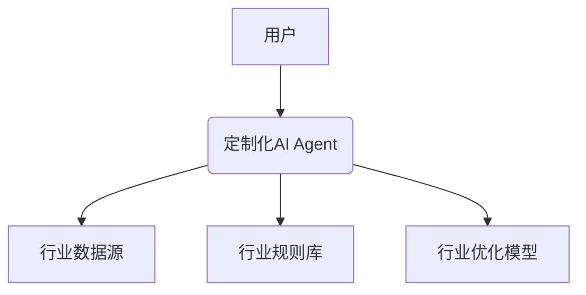
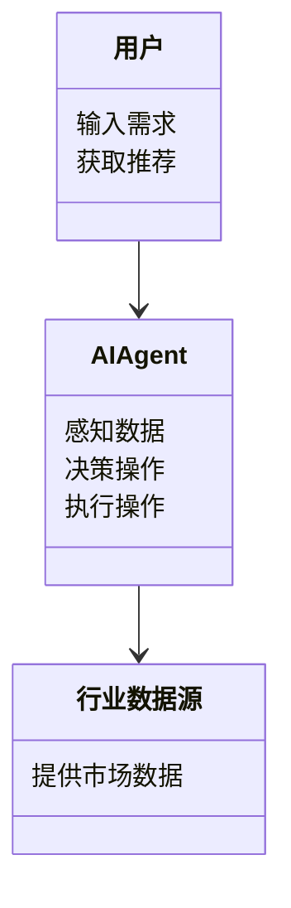
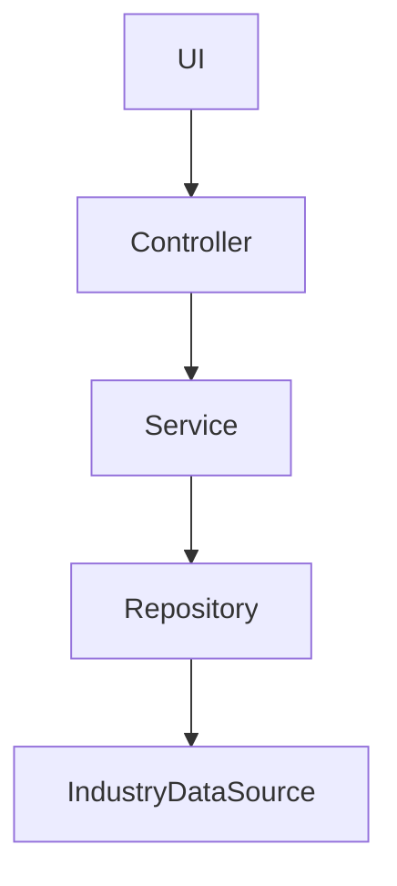
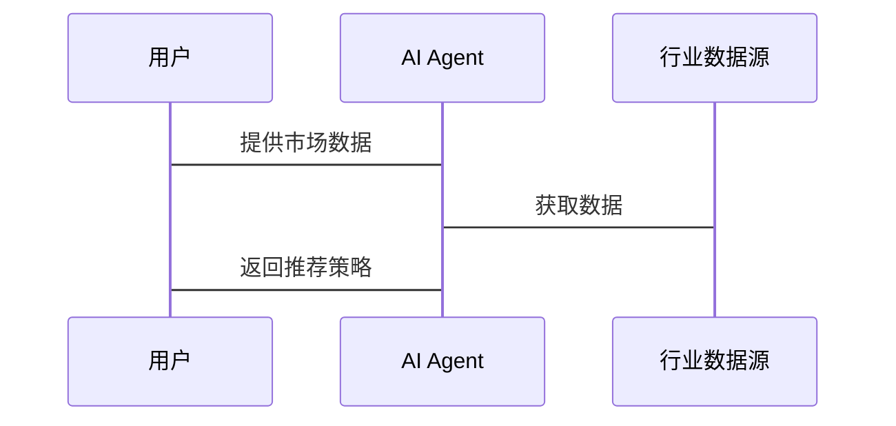

                 


# 定制化AI Agent：满足特定行业需求

---

## 关键词
- AI Agent  
- 定制化  
- 人工智能  
- 机器学习  
- 行业应用  

---

## 摘要  
随着人工智能技术的快速发展，AI Agent（智能体）在各个行业的应用日益广泛。然而，不同行业对AI Agent的需求千差万别，通用AI Agent往往无法满足特定场景的复杂需求。定制化AI Agent应运而生，它通过深度理解和优化特定行业的痛点，提供更高效、更精准的解决方案。本文将从背景、原理、算法、系统架构到项目实战，全面解析定制化AI Agent的核心技术与实际应用。

---

## 第一部分: 定制化AI Agent的背景与概念

### 第1章: AI Agent的基本概念与定制化需求

#### 1.1 AI Agent的定义与核心功能  
AI Agent是一种智能体，能够感知环境、自主决策并执行任务。它具备以下核心功能：  
1. **感知**：通过传感器或数据源获取环境信息。  
2. **决策**：基于感知信息进行推理和选择最优动作。  
3. **执行**：通过执行器将决策转化为实际操作。  

#### 1.2 定制化AI Agent的背景与问题背景  
- **传统AI Agent的局限性**：通用AI Agent难以适应特定行业的复杂需求。  
- **特定行业需求的多样性**：金融、医疗、制造等行业对AI Agent的要求各不相同。  
- **定制化AI Agent的解决方案**：通过深度定制，满足特定场景的需求。  

#### 1.3 定制化AI Agent的应用场景  
- **金融行业**：智能投顾、风险控制。  
- **医疗行业**：疾病诊断、药物研发。  
- **其他行业**：智能制造、物流调度。  

---

### 第2章: 定制化AI Agent的核心概念与联系

#### 2.1 定制化AI Agent的核心原理  
- **感知模块**：通过特定数据源获取行业相关数据。  
- **决策模块**：基于行业规则和模型进行决策。  
- **执行模块**：根据决策结果执行具体操作。  

#### 2.2 核心概念的对比分析  
| 模块       | 通用AI Agent | 定制化AI Agent      |  
|------------|---------------|----------------------|  
| 感知       | 多样化数据源  | 行业专用数据源      |  
| 决策       | 预设规则      | 行业优化规则        |  
| 执行       | 标准化动作    | 行业定制动作        |  

#### 2.3 定制化AI Agent的实体关系图  


---

## 第二部分: 定制化AI Agent的核心算法与数学模型

### 第3章: 定制化AI Agent的算法原理

#### 3.1 强化学习算法  
**Q-learning算法**  
Q-learning是一种经典的强化学习算法，适用于离散动作空间的决策问题。其核心公式为：  
$$ Q(s, a) = Q(s, a) + \alpha [r + \max_{a'} Q(s', a') - Q(s, a)] $$  

**应用场景**：适用于需要策略优化的场景，如金融投资组合优化。  

#### 3.2 生成对抗网络（GAN）  
GAN由生成器和判别器组成，通过对抗训练生成高质量数据。其损失函数为：  
$$ \mathcal{L} = \mathbb{E}_{z}[ \log D(G(z))] + \mathbb{E}_{x}[ \log(1 - D(x))] $$  

**应用场景**：适用于需要生成行业特定数据的场景，如医疗数据生成。  

---

### 第4章: 定制化AI Agent的数学模型与公式

#### 4.1 强化学习模型  
- **状态空间**：表示环境的状态，如金融市场中的股票价格。  
- **动作空间**：表示AI Agent可执行的操作，如买入或卖出。  
- **奖励函数**：定义AI Agent的决策优劣，如收益最大化。  

#### 4.2 GAN模型  
- **生成器**：通过全连接层和激活函数生成数据。  
- **判别器**：通过卷积层和损失函数判断数据真伪。  

---

## 第三部分: 定制化AI Agent的系统分析与架构设计

### 第5章: 系统分析与架构设计方案

#### 5.1 问题场景介绍  
以金融行业为例，设计一个定制化AI Agent用于股票交易决策。  

#### 5.2 系统功能设计  
- **领域模型图**：展示系统功能模块及其交互关系。  


#### 5.3 系统架构设计  
- **架构图**：展示系统的分层架构。  


#### 5.4 接口设计与交互流程  
- **交互流程图**：展示用户与AI Agent的交互流程。  


---

## 第四部分: 定制化AI Agent的项目实战

### 第6章: 项目实战

#### 6.1 环境安装  
- **安装Python**：`python --version`  
- **安装依赖库**：`pip install numpy tensorflow`  

#### 6.2 核心代码实现  

##### 6.2.1 强化学习代码示例  
```python
import numpy as np

class AIAgent:
    def __init__(self, state_space, action_space):
        self.state_space = state_space
        self.action_space = action_space
        self.Q = np.zeros((state_space, action_space))

    def perceive(self, state):
        return state

    def decide(self, state):
        return np.argmax(self.Q[state, :])

    def learn(self, state, action, reward):
        self.Q[state, action] += 0.1 * (reward + np.max(self.Q[state, :]) - self.Q[state, action])
```

##### 6.2.2 GAN代码示例  
```python
import tensorflow as tf

def generator(z, out_dim):
    model = tf.keras.Sequential()
    model.add(tf.keras.layers.Dense(128, activation='relu', input_dim=z))
    model.add(tf.keras.layers.Dense(out_dim, activation='sigmoid'))
    return model

def discriminator(x, hidden_dim):
    model = tf.keras.Sequential()
    model.add(tf.keras.layers.Dense(hidden_dim, activation='relu', input_dim=x))
    model.add(tf.keras.layers.Dense(1, activation='sigmoid'))
    return model
```

#### 6.3 案例分析与项目小结  
- **案例分析**：以金融行业的股票交易为例，展示AI Agent的决策过程。  
- **项目小结**：定制化AI Agent在特定行业中的优势与挑战。

---

## 第五部分: 最佳实践与总结

### 第7章: 最佳实践

#### 7.1 小结  
定制化AI Agent通过深度理解行业需求，提供更高效的解决方案。  

#### 7.2 注意事项  
- 数据质量对AI Agent性能影响巨大。  
- 需要平衡模型复杂度与计算资源。  

#### 7.3 未来趋势  
- 行业深度定制化将成为主流。  
- 多模态AI Agent将更加普及。  

#### 7.4 拓展阅读  
推荐书籍：《深度学习》、《强化学习实战》。

---

## 作者信息  
作者：AI天才研究院/AI Genius Institute  
联系邮箱：contact@ai-genius.com  

---

希望这篇文章能满足您的需求！如果需要进一步修改或补充，请随时告知。

