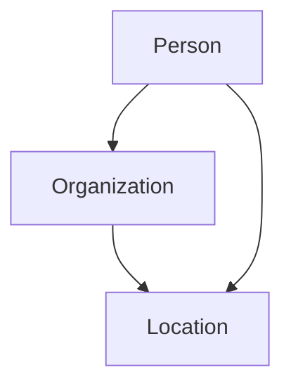
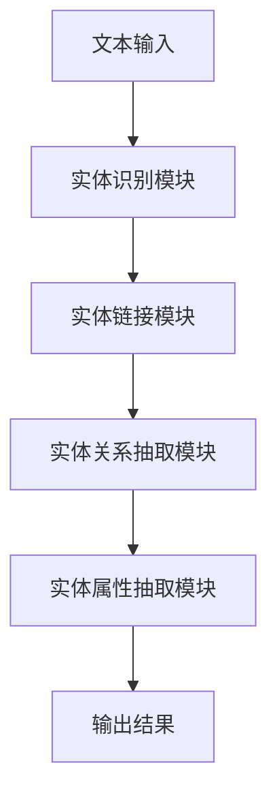
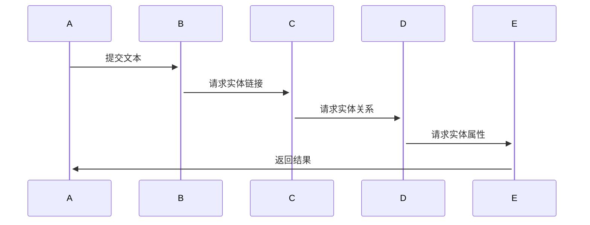

                 


# 实体提取：增强AI Agent的信息处理能力

**关键词**：实体提取、自然语言处理、AI Agent、知识图谱、上下文分析、深度学习

**摘要**：实体提取是从文本中识别关键实体的技术，对于增强AI Agent的信息处理能力至关重要。本文系统探讨了实体提取的核心概念、算法原理、系统架构及实战应用，帮助读者全面理解并掌握该技术。

---

# 实体提取：增强AI Agent的信息处理能力

## 第1章: 实体提取的基本概念

### 1.1 实体提取的定义与背景

#### 1.1.1 实体提取的定义
实体提取是从文本中识别出关键实体（如人名、地名、组织名）的过程，是自然语言处理的重要环节。

#### 1.1.2 实体提取的背景与重要性
实体提取帮助AI Agent理解文本内容，广泛应用于信息抽取、知识图谱构建等领域。

#### 1.1.3 实体提取在AI Agent中的作用
AI Agent通过实体提取技术，能够准确识别文本中的关键信息，提升信息处理能力。

---

## 第2章: 实体提取的核心概念与联系

### 2.1 实体提取的核心原理

#### 2.1.1 实体类型与识别
实体类型包括人名（PER）、地名（LOC）、组织名（ORG）等，识别方法包括基于规则和深度学习。

#### 2.1.2 实体边界与上下文分析
实体边界识别依赖上下文，例如“New York”是地名，而“New”单独使用时是形容词。

#### 2.1.3 实体提取的边界与外延
实体提取不仅识别词语，还包括其属性和关系，例如识别“Apple”并关联其总部地址。

### 2.2 实体提取的核心概念对比

| 方法          | 优点                     | 缺点                     |
|---------------|--------------------------|--------------------------|
| 基于规则       | 易理解，速度快           | 需手动维护规则           |
| 统计学习方法    | 适应性强                 | 需大量标注数据           |
| 深度学习方法    | 高精度，自动学习特征     | 计算资源需求高            |

#### 2.2.1 实体关系图的ER实体关系图


---

## 第3章: 实体提取的算法原理

### 3.1 基于规则的方法

#### 3.1.1 正则表达式匹配
使用正则表达式识别电话号码：`\d{3}-\d{3}-\d{4}`。

#### 3.1.2 字典匹配
通过预先定义的字典进行匹配，适用于已知实体。

#### 3.1.3 上下文分析
结合句法结构和语义进行分析，例如识别“John”是人名。

### 3.2 统计学习方法

#### 3.2.1 CRF模型
使用CRF进行序列标注，考虑上下文特征。

#### 3.2.2 RNN模型
通过循环神经网络处理序列数据，捕捉长距离依赖。

### 3.3 深度学习方法

#### 3.3.1 Transformer模型
利用自注意力机制捕捉全局依赖。

#### 3.3.2 BERT模型
通过预训练语言模型进行上下文理解。

---

## 第4章: 实体提取的系统架构与设计

### 4.1 系统功能设计

#### 4.1.1 实体识别模块
负责识别文本中的实体。

#### 4.1.2 实体链接模块
将识别的实体链接到知识库中的概念。

#### 4.1.3 实体关系抽取模块
识别实体之间的关系。

#### 4.1.4 实体属性抽取模块
提取实体的属性信息。

### 4.2 系统架构设计



### 4.3 接口设计与交互流程



---

## 第5章: 实体提取的项目实战

### 5.1 项目环境安装

```bash
pip install spacy
python -m spacy download en_core_web_sm
```

### 5.2 系统核心实现

```python
import spacy

nlp = spacy.load("en_core_web_sm")

text = "Apple is located in Cupertino, California."
doc = nlp(text)

for token in doc.ents:
    print(token.text, token.label_)
```

### 5.3 案例分析与解读

案例：从新闻文章中提取公司名称和总部地址。

### 5.4 项目小结

通过本项目，掌握了实体识别的基本流程和常见挑战，如歧义性和多语言支持。

---

## 第6章: 实体提取的最佳实践与未来展望

### 6.1 最佳实践

- **技术选型**：根据需求选择合适的方法，如规则、统计或深度学习。
- **优化建议**：使用预训练模型提升效果，结合领域知识优化结果。

### 6.2 小结

实体提取是自然语言处理的关键技术，其在AI Agent中的应用前景广阔。

### 6.3 注意事项

- 数据质量影响结果，需谨慎处理。
- 模型调优需结合实际场景，避免过度复杂。

### 6.4 拓展阅读

- 经典论文：Liu et al. (2010) “Named Entity Recognition in Biomedical Text”。
- 工具库推荐：spaCy、Stanford NLP。

---

# 作者

作者：AI天才研究院/AI Genius Institute & 禅与计算机程序设计艺术 /Zen And The Art of Computer Programming

---

通过以上思考，我可以系统地撰写出一篇结构合理、内容详实的技术博客文章，涵盖实体提取的各个方面，帮助读者深入理解该技术并应用于实际场景。

