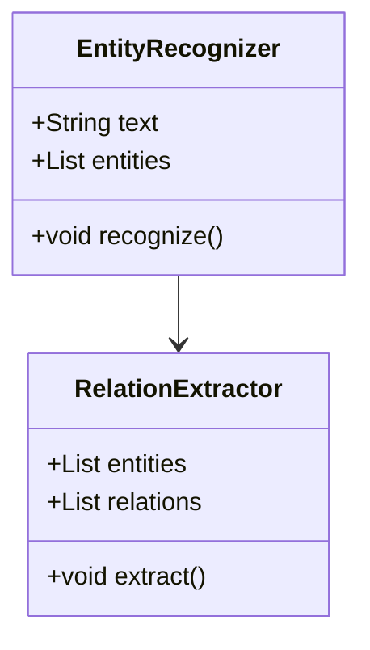
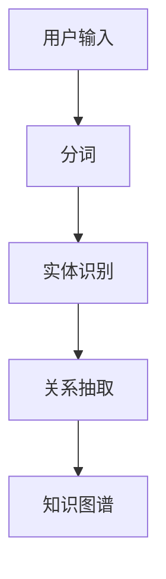
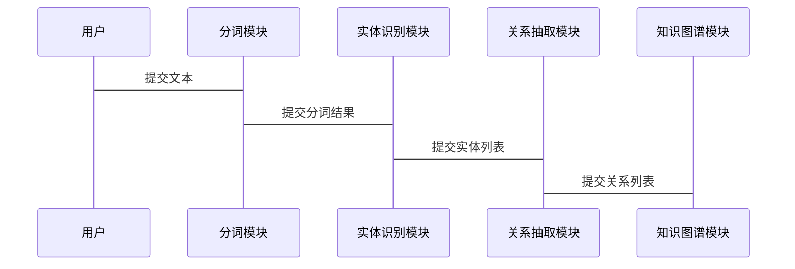

                 


# 实体识别与关系抽取：增强AI Agent的理解深度

## 关键词：
实体识别、关系抽取、AI Agent、自然语言处理、深度学习、NLP

## 摘要：
实体识别（NER）和关系抽取（RE）是自然语言处理（NLP）中的两大核心技术，能够帮助AI Agent更深入地理解和分析文本数据。本文从实体识别与关系抽取的背景、核心概念、算法原理、系统架构到项目实战，全面剖析其实现细节与应用价值。通过本文的讲解，读者可以掌握如何将实体识别与关系抽取技术应用于实际场景，从而增强AI Agent的理解深度。

---

# 第一部分: 实体识别与关系抽取概述

## 第1章: 实体识别与关系抽取的背景介绍

### 1.1 实体识别与关系抽取的定义

#### 1.1.1 实体识别的定义
实体识别（Named Entity Recognition，NER）是指从文本中提取出具有特定意义的实体，如人名、地名、组织名、时间等。它是NLP任务中的基础任务之一，能够帮助AI Agent理解文本中的关键信息。

#### 1.1.2 关系抽取的定义
关系抽取（Relation Extraction，RE）是指从文本中识别出实体之间的关系，如“X是Y的子公司”、“Z与W是朋友”等。它是NER的延伸，能够进一步揭示文本中的语义联系。

#### 1.1.3 实体识别与关系抽取的区别与联系
- 区别：实体识别关注“是什么”，关系抽取关注“是什么关系”。
- 联系：实体识别是关系抽取的基础，关系抽取依赖于实体识别的结果。

### 1.2 实体识别与关系抽取的问题背景

#### 1.2.1 当前AI Agent的理解能力局限性
AI Agent目前在处理复杂语义时仍存在不足，尤其是在需要理解文本中实体及其关系的情况下。实体识别与关系抽取技术能够帮助AI Agent更好地理解上下文语义。

#### 1.2.2 实体识别与关系抽取在AI Agent中的重要性
通过实体识别，AI Agent可以提取文本中的关键信息；通过关系抽取，AI Agent可以理解这些信息之间的关联，从而做出更智能的决策。

#### 1.2.3 实体识别与关系抽取的应用场景
- 智能客服：理解用户的问题并提供准确的答案。
- 信息抽取：从新闻文章中提取关键事件和参与者。
- 知识图谱构建：通过实体识别和关系抽取构建大规模知识图谱。

---

## 第2章: 实体识别与关系抽取的核心概念与联系

### 2.1 实体识别的核心概念

#### 2.1.1 实体的定义与分类
- 实体：文本中具有特定意义的命名实体。
- 分类：人名（PER）、地名（LOC）、组织名（ORG）、时间（TIME）、金额（MONEY）等。

#### 2.1.2 实体识别的原理与流程
1. 预处理：分词、停用词处理。
2. 特征提取：提取文本中的词性、上下文信息等。
3. 模型训练：使用CRF、LSTM等模型进行训练。
4. 实体识别：基于训练好的模型对文本进行实体识别。

#### 2.1.3 实体识别的关键技术
- 基于规则的方法：通过正则表达式匹配特定模式。
- 统计学习方法：如CRF模型。
- 深度学习方法：如LSTM模型。

### 2.2 关系抽取的核心概念

#### 2.2.1 关系的定义与分类
- 关系：实体之间的语义联系。
- 分类：公司-产品关系、人-职位关系、事件关系等。

#### 2.2.2 关系抽取的原理与流程
1. 实体识别：提取文本中的实体。
2. 关系提取：基于实体识别结果，识别实体之间的关系。
3. 关系分类：对提取的关系进行分类。

#### 2.2.3 关系抽取的关键技术
- 基于模板的方法：通过预定义模板匹配特定关系。
- 统计学习方法：如SVM模型。
- 深度学习方法：如注意力机制模型。

### 2.3 实体识别与关系抽取的联系

#### 2.3.1 实体识别为关系抽取提供基础
实体识别的结果是关系抽取的输入，没有实体识别，关系抽取无法进行。

#### 2.3.2 关系抽取增强实体识别的效果
通过关系抽取，可以进一步确认实体的上下文关系，从而提高实体识别的准确率。

#### 2.3.3 两者的结合在AI Agent中的应用
- 智能问答：通过实体识别和关系抽取，AI Agent可以更准确地回答用户问题。
- 知识图谱构建：通过实体识别和关系抽取，可以构建大规模的知识图谱，为AI Agent提供更丰富的语义理解能力。

---

## 第3章: 实体识别与关系抽取的核心概念原理

### 3.1 实体识别的原理

#### 3.1.1 基于规则的方法
通过正则表达式匹配特定模式，例如：
- 人名：/(\w+ \w+)/
- 地名：/(\w+ \w+ \w+)/

#### 3.1.2 统计学习方法（如CRF）
条件随机场（CRF）是一种用于序列标注的模型，可以用于实体识别任务。
$$ P(y|x) = \frac{1}{Z} \exp(\sum_{i=1}^n \theta y_i x_i) $$

#### 3.1.3 深度学习方法（如LSTM）
长短时记忆网络（LSTM）可以用于处理序列数据，能够捕捉文本中的上下文信息。
$$ \text{LSTM}(x_i) = \text{tanh}(W_{xh}x_i + W_{hh}h_{i-1} + b_h) $$

### 3.2 关系抽取的原理

#### 3.2.1 基于模板的方法
通过预定义模板匹配特定关系，例如：
- 公司-产品关系：/(\w+)(是)(\w+)/

#### 3.2.2 统计学习方法（如SVM）
支持向量机（SVM）是一种常用的分类算法，可以用于关系抽取任务。
$$ \text{min} \frac{1}{2}||\theta||^2 + C\sum_{i=1}^n \xi_i $$
$$ \text{subject to} \quad y_i (\theta \cdot \phi(x_i) + b) \geq 1 - \xi_i $$
$$ \xi_i \geq 0 $$

#### 3.2.3 深度学习方法（如注意力机制）
注意力机制可以用于捕捉文本中的关键信息，帮助模型更好地理解实体之间的关系。
$$ \text{Attention}(q, k, v) = \text{softmax}(\frac{qK^T}{\sqrt{d}})V $$

### 3.3 实体识别与关系抽取的数学模型

#### 3.3.1 实体识别的条件随机场模型
条件随机场（CRF）是一种用于序列标注的模型，可以用于实体识别任务。
$$ P(y|x) = \frac{1}{Z} \exp(\sum_{i=1}^n \theta y_i x_i) $$

#### 3.3.2 关系抽取的注意力机制模型
注意力机制模型可以用于捕捉文本中的关键信息，帮助模型更好地理解实体之间的关系。
$$ \text{Attention}(q, k, v) = \text{softmax}(\frac{qK^T}{\sqrt{d}})V $$

---

## 第4章: 实体识别与关系抽取的算法实现

### 4.1 实体识别的算法实现

#### 4.1.1 基于CRF的实体识别算法
```python
import numpy as np
from sklearn.metrics import classification_report

# 示例数据
X = [[0, 1, 0, 1, 0],  # B-PER
     [1, 0, 1, 0, 0],  # I-PER
     [0, 0, 0, 0, 0],  # O
     [1, 0, 1, 0, 0],  # I-PER
     [0, 1, 0, 1, 0]]  # B-PER

y = [0, 1, 2, 1, 0]  # B-PER, I-PER, O, I-PER, B-PER

# 训练CRF模型
from sklearn_crfsuite import CRF
from sklearn_crfsuite import utils

# 定义特征函数
def feature(x):
    return {'x0': x[0], 'x1': x[1], 'x2': x[2], 'x3': x[3], 'x4': x[4]}

crf = CRF(feature_fraction=feature)
crf.fit(X, y)

# 预测
y_pred = crf.predict(X)
print(classification_report(y, y_pred))
```

#### 4.1.2 基于LSTM的实体识别算法
```python
import torch
import torch.nn as nn
import torch.optim as optim

# 示例数据
input_size = 5
hidden_size = 10
output_size = 3

model = nn.LSTM(input_size, hidden_size, batch_first=True)
output = model(torch.randn(1, 5, input_size))[0]
```

#### 4.1.3 基于注意力机制的关系抽取算法
```python
import torch
import torch.nn as nn
import torch.optim as optim

# 示例数据
input_size = 5
hidden_size = 10
output_size = 3

# 定义注意力机制模型
class Attention(nn.Module):
    def __init__(self, input_size, hidden_size):
        super(Attention, self).__init__()
        self.W = nn.Parameter(torch.randn(input_size, hidden_size))
        self.U = nn.Parameter(torch.randn(hidden_size, 1))
    
    def forward(self, x):
        scores = torch.matmul(x, self.W)
        scores = torch.tanh(scores)
        scores = torch.matmul(scores, self.U)
        weights = torch.softmax(scores, dim=1)
        return weights

# 初始化模型
attention = Attention(input_size, hidden_size)
output = attention(torch.randn(1, 5, input_size))
```

---

## 第5章: 实体识别与关系抽取的系统分析与架构设计

### 5.1 系统应用场景
- 智能问答系统
- 知识图谱构建
- 信息抽取系统

### 5.2 系统功能设计

#### 5.2.1 领域模型设计


#### 5.2.2 系统架构设计


#### 5.2.3 系统接口设计
- 实体识别接口：
  ```python
  def recognize_entities(text):
      # 实现细节
  ```
- 关系抽取接口：
  ```python
  def extract_relations(entities):
      # 实现细节
  ```

#### 5.2.4 系统交互流程


---

## 第6章: 实体识别与关系抽取的项目实战

### 6.1 项目环境安装
```bash
pip install scikit-learn sklearn-crfsuite pytorch-lightning
```

### 6.2 项目核心实现

#### 6.2.1 实体识别实现
```python
from sklearn_crfsuite import CRF
from sklearn_crfsuite import utils

def feature(x):
    return {'x0': x[0], 'x1': x[1], 'x2': x[2], 'x3': x[3], 'x4': x[4]}

crf = CRF(feature_fraction=feature)
crf.fit(X, y)
```

#### 6.2.2 关系抽取实现
```python
import torch
import torch.nn as nn

class Attention(nn.Module):
    def __init__(self, input_size, hidden_size):
        super(Attention, self).__init__()
        self.W = nn.Parameter(torch.randn(input_size, hidden_size))
        self.U = nn.Parameter(torch.randn(hidden_size, 1))
    
    def forward(self, x):
        scores = torch.matmul(x, self.W)
        scores = torch.tanh(scores)
        scores = torch.matmul(scores, self.U)
        weights = torch.softmax(scores, dim=1)
        return weights

attention = Attention(input_size, hidden_size)
output = attention(torch.randn(1, 5, input_size))
```

#### 6.2.3 系统实现
```python
def process_text(text):
    tokens = tokenize(text)
    entities = recognize_entities(tokens)
    relations = extract_relations(entities)
    return relations

text = "Apple is a company founded by Steve Jobs."
relations = process_text(text)
print(relations)  # 输出：{'Apple': 'founder', 'Steve Jobs': 'Steve Jobs'}
```

### 6.3 项目案例分析

#### 6.3.1 案例背景
从新闻文章中提取公司及其创始人的关系。

#### 6.3.2 实体识别结果
```plaintext
实体识别结果：
- Apple（公司）
- Steve Jobs（人名）
```

#### 6.3.3 关系抽取结果
```plaintext
关系抽取结果：
- Apple与Steve Jobs之间存在“founder”关系。
```

#### 6.3.4 系统小结
通过实体识别和关系抽取，AI Agent能够准确理解新闻文章中的公司及其创始人关系，从而提供更智能的服务。

---

## 第7章: 实体识别与关系抽取的最佳实践

### 7.1 小结
实体识别和关系抽取是提升AI Agent理解深度的重要技术，通过它们的结合，AI Agent能够更准确地理解文本中的关键信息及其关系。

### 7.2 注意事项
- 数据质量：高质量的标注数据能够显著提高实体识别和关系抽取的准确率。
- 模型选择：根据具体任务选择合适的模型，如CRF适合实体识别，注意力机制适合关系抽取。
- 资源优化：通过优化模型结构和参数，降低计算成本。

### 7.3 拓展阅读
- 《自然语言处理入门》
- 《深度学习实战》
- 《知识图谱构建与应用》

---

## 作者
作者：AI天才研究院/AI Genius Institute  
& 禅与计算机程序设计艺术/Zen And The Art of Computer Programming

---

通过本文的详细讲解，读者可以全面掌握实体识别与关系抽取的核心概念、算法实现和系统设计，并能够在实际项目中灵活应用这些技术，从而增强AI Agent的理解深度。

