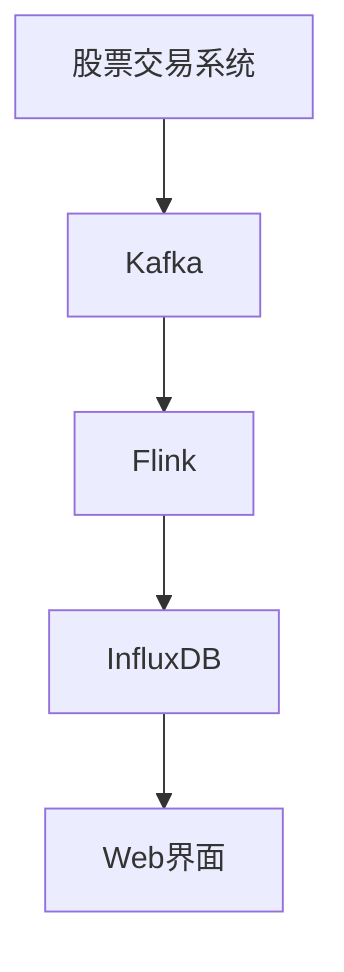

                 


# 实时金融数据接入与处理：技术与挑战

> 关键词：实时金融数据、数据采集、流数据处理、分布式存储、金融系统架构

> 摘要：实时金融数据的处理是金融行业中的关键任务，涉及数据的实时采集、处理、分析和应用。本文详细探讨了实时金融数据处理的核心概念、技术实现、系统架构设计以及实际项目中的应用，分析了其中的技术挑战和解决方案，并展望了未来的发展趋势。

---

# 第一部分：实时金融数据接入与处理的背景与重要性

## 第1章：实时金融数据处理的背景与挑战

### 1.1 金融数据的实时性需求

#### 1.1.1 金融数据的特点与重要性

金融数据通常具有高频性、实时性和强关联性。高频性意味着金融数据需要在极短时间内完成处理，以应对市场的快速变化。实时性要求数据能够及时反映市场动态，确保决策的准确性。强关联性则体现在数据之间的相互影响，例如股价波动可能由多种因素引起，如市场新闻、交易量变化等。

#### 1.1.2 实时数据处理的必要性

在金融行业中，实时数据处理是不可或缺的。例如，股票交易系统需要实时更新股价，银行系统需要实时监控交易状态以防范风险，基金管理系统需要实时调整投资策略。实时数据处理能够帮助金融机构快速响应市场变化，降低潜在风险，提高收益。

#### 1.1.3 金融行业中的实时数据应用场景

实时金融数据处理广泛应用于多个场景，包括：

- **高频交易**：依赖实时数据进行快速买卖决策。
- **风险管理**：实时监控市场波动，评估并控制风险。
- **实时监控与预警**：及时发现异常交易行为或市场波动，提前预警。
- **实时报告与分析**：生成实时报告，支持管理层的决策。

### 1.2 数据处理的技术挑战

#### 1.2.1 数据实时性的定义与衡量

数据实时性是指数据从生成到处理并可用的时间间隔。在金融领域，实时性通常要求数据处理延迟在毫秒级别。衡量实时性通常涉及以下几个方面：

1. **数据采集延迟**：从数据生成到采集的时间。
2. **数据处理延迟**：从数据采集到处理完成的时间。
3. **数据传输延迟**：数据从处理节点传送到应用节点的时间。

#### 1.2.2 数据源的多样性与复杂性

金融数据来源多样，包括：

- **市场数据**：如股票、期货、外汇等市场行情。
- **交易数据**：如订单、成交记录等。
- **新闻数据**：如财经新闻、公司公告等。
- **社交媒体数据**：如投资者在社交媒体上的讨论。

这些数据来源的多样性增加了数据采集和处理的复杂性，需要开发灵活的采集机制和处理流程。

#### 1.2.3 网络延迟与数据一致性问题

在实时数据处理中，网络延迟是一个关键挑战。数据源可能分布在不同的地理位置，数据传输过程中可能会受到网络延迟的影响，导致数据处理的延迟。此外，数据一致性也是一个重要问题，特别是在分布式系统中，如何保证数据的准确性是需要重点解决的问题。

---

## 第2章：实时数据处理的基本概念

### 2.1 流数据与批量数据的定义

#### 2.1.1 流数据的特征与处理方式

流数据是指以连续、实时的方式产生的数据流。其特点包括：

- **实时性**：数据不断生成，需要及时处理。
- **不可预知性**：数据的生成和模式难以预测。
- **连续性**：数据流是连续的，没有明确的边界。

流数据处理通常采用流处理框架，如Apache Flink，能够实时处理数据流，生成实时结果。

#### 2.1.2 批量数据的特征与处理方式

批量数据是指在固定时间段内生成的大量数据，通常以批量的方式进行处理。其特点包括：

- **周期性**：数据在特定时间点生成，如每天的交易记录。
- **批量处理**：数据在生成后进行批量处理，生成汇总结果。
- **延迟性**：处理结果通常有一定的延迟，但精度较高。

#### 2.1.3 流数据与批量数据的对比

| 特性          | 流数据             | 批量数据           |
|---------------|--------------------|--------------------|
| 数据生成方式  | 实时生成           | 定期批量生成       |
| 处理方式      | 实时处理           | 批处理             |
| 数据量        | 高频且持续         | 大批量             |
| 处理延迟      | 低                 | 高                 |
| 适用场景      | 实时监控、高频交易 | 日志分析、报表生成 |

### 2.2 时序数据的定义与特点

#### 2.2.1 时序数据的特征分析

时序数据是指按照时间顺序生成的数据，具有以下特点：

- **时间戳**：每个数据点都有明确的时间属性。
- **连续性**：数据按时间顺序排列，通常以固定的时间间隔生成。
- **趋势性**：数据往往表现出一定的趋势性或周期性。

#### 2.2.2 时序数据在金融中的应用

时序数据在金融中的应用非常广泛，例如：

- **股价预测**：通过分析历史股价数据，预测未来股价走势。
- **市场波动分析**：通过分析市场指数的时序数据，识别市场波动的规律。
- **风险管理**：通过分析交易数据的时间序列，识别潜在的市场风险。

### 2.3 数据流模型与数据处理模型

#### 2.3.1 数据流模型的定义与分类

数据流模型描述了数据从生成到消费的流程。常见的数据流模型包括：

- **生产者-消费者模型**：数据由生产者生成，通过中间媒介（如消息队列）传递给消费者。
- **发布-订阅模型**：数据生产者发布数据到主题，消费者订阅主题以获取数据。

#### 2.3.2 数据处理模型的分类与选择

数据处理模型决定了数据的处理方式，常见的处理模型包括：

- **批处理模型**：适合需要精确计算且对延迟不敏感的场景。
- **流处理模型**：适合需要实时处理且对延迟敏感的场景。
- **混合处理模型**：结合批处理和流处理，适用于复杂场景。

#### 2.3.3 数据流模型与处理模型的结合

数据流模型和处理模型的选择需要根据具体的业务需求和数据特点进行权衡。例如，对于需要实时处理的金融数据，通常选择流处理模型结合生产者-消费者模型进行数据的实时采集和处理。

---

## 第3章：实时数据处理的核心技术

### 3.1 数据采集与接入技术

#### 3.1.1 数据采集的挑战与解决方案

数据采集是实时数据处理的第一步，面临以下挑战：

- **数据源多样性**：需要支持多种数据源，如数据库、API、文件等。
- **网络延迟**：数据采集过程中可能会受到网络延迟的影响。
- **数据格式多样性**：不同数据源的数据格式可能不同，需要进行格式转换。

解决方案包括使用多种数据采集工具和技术，如：

- **API接口**：通过HTTP或WebSocket接口实时获取数据。
- **消息队列**：使用Kafka、RabbitMQ等消息队列进行数据传输。
- **数据库连接**：通过JDBC等连接器实时读取数据库中的数据。

#### 3.1.2 常见的数据采集技术

- **Kafka**：一个分布式流处理平台，适用于高吞吐量和低延迟的实时数据传输。
- **Flume**：一个分布式日志采集工具，适用于大量日志数据的采集。
- **HTTP API**：通过调用API接口获取实时数据，如股票价格、市场行情等。

#### 3.1.3 数据预处理与清洗

数据预处理是确保数据质量的重要步骤，包括：

- **数据清洗**：去除无效数据，如重复数据、错误数据。
- **数据转换**：将数据转换为适合后续处理的格式，如将字符串类型转换为数值类型。
- **数据标准化**：统一数据的格式和命名规范，确保数据的一致性。

### 3.2 数据流处理与计算框架

#### 3.2.1 流处理与批处理的对比

| 特性          | 流处理           | 批处理           |
|---------------|------------------|------------------|
| 数据生成方式  | 实时生成         | 定期批量生成     |
| 处理方式      | 实时处理         | 批量处理         |
| 处理延迟      | 低               | 高               |
| 适用场景      | 实时监控、高频交易 | 日志分析、报表生成 |

#### 3.2.2 常见的流处理框架

- **Apache Flink**：一个分布式流处理框架，支持事件时间、处理时间等多种时间语义，适用于复杂的实时数据处理。
- **Apache Spark Streaming**：基于Spark的流处理框架，适合需要与Spark生态集成的场景。

#### 3.2.3 窗口机制与状态管理

窗口机制是流处理中的一个重要概念，用于将无限的流数据划分为有限的窗口进行处理。常见的窗口类型包括：

- **时间窗口**：基于时间范围定义窗口，如5分钟内的数据。
- **事件窗口**：基于事件发生的时间顺序定义窗口。
- **滑动窗口**：窗口可以向前滑动，处理最新的数据。

状态管理是流处理中用于维护处理状态的关键技术，例如：

- **检查点**：用于容错和恢复。
- **状态存储**：将处理状态存储在可靠的存储系统中，如Hadoop、云存储等。

### 3.3 数据存储与管理

#### 3.3.1 数据存储的选择

实时金融数据通常具有以下特点：

- 高并发写入
- 低延迟查询
- 高扩展性

因此，需要选择适合实时数据存储的系统，如：

- **时序数据库**：如InfluxDB、Prometheus，适用于存储和查询时间序列数据。
- **分布式数据库**：如HBase、Cassandra，适用于大规模分布式存储。
- **内存数据库**：如Redis，适用于需要快速读写的应用场景。

#### 3.3.2 数据存储的优化

- **分区策略**：将数据按时间、空间等维度进行分区，提高存储效率和查询性能。
- **索引优化**：为常用查询字段建立索引，加快查询速度。
- **压缩与归档**：对历史数据进行压缩归档，减少存储空间占用。

---

## 第4章：实时金融数据处理的系统架构设计

### 4.1 系统架构概述

实时金融数据处理系统的架构设计需要考虑以下因素：

- **高可用性**：确保系统的稳定运行，避免单点故障。
- **高扩展性**：能够根据业务需求灵活扩展。
- **低延迟**：确保数据处理和查询的延迟在可接受范围内。

### 4.2 模块划分

一个典型的实时金融数据处理系统可以划分为以下几个模块：

- **数据采集模块**：负责实时采集数据。
- **数据处理模块**：负责对数据进行实时处理。
- **数据存储模块**：负责存储处理后的数据。
- **数据查询模块**：负责根据用户请求返回数据。
- **用户界面模块**：提供用户交互界面，展示数据处理结果。

### 4.3 系统接口与交互设计

- **数据采集接口**：提供API接口供数据源进行数据推送。
- **数据处理接口**：提供API接口供其他系统调用处理后的数据。
- **数据查询接口**：提供API接口供用户查询实时数据。

---

## 第5章：实时金融数据处理的项目实战

### 5.1 项目背景与目标

#### 5.1.1 项目背景

假设我们正在开发一个实时股票价格监控系统，目标是实现对多个股票市场的实时价格监控，并根据设定的阈值发出预警。

### 5.2 项目环境搭建

#### 5.2.1 系统架构设计

- **数据采集模块**：使用Kafka接收股票价格数据。
- **数据处理模块**：使用Apache Flink进行实时流处理。
- **数据存储模块**：使用InfluxDB存储时序数据。
- **数据查询模块**：提供一个Web界面供用户查询实时数据。

#### 5.2.2 系统模块设计

- **数据采集模块**：通过WebSocket接口从股票交易系统获取实时价格数据，并将数据推送至Kafka消息队列。
- **数据处理模块**：使用Flink消费Kafka中的数据，计算股票价格的均线、波动率等指标，并将结果存储至InfluxDB。
- **数据存储模块**：InfluxDB用于存储股票价格的时序数据，支持高效的时间序列查询。
- **数据查询模块**：提供一个Web界面，用户可以通过输入股票代码查询实时价格和历史数据。

#### 5.2.3 数据流设计



### 5.3 核心代码实现

#### 5.3.1 数据采集模块

使用Python编写WebSocket客户端，接收股票价格数据并推送至Kafka。

```python
import websockets
import json
from kafka import KafkaProducer

async def send_data():
    async with websockets.connect('ws://localhost:8000') as websocket:
        while True:
            message = await websocket.recv()
            data = json.loads(message)
            producer.send('stock_price', data)
            await asyncio.sleep(1)

asyncio.get_event_loop().run_until_complete(send_data())
```

#### 5.3.2 数据处理模块

使用Flink进行实时流处理，计算股票价格的均线和波动率。

```python
from pyflink.datastream import StreamExecutionEnvironment
from pyflink.table import *

env = StreamExecutionEnvironment.get_execution_environment()
env.set_parallelism(1)

table = Table(env.from_source('stock_price').select('timestamp, price'))

# 计算均线
均线 = table.window(TumblingWindow('5', 'PTM')).select('timestamp, avg(price) as moving_average')

# 计算波动率
波动率 = table.window(TumblingWindow('5', 'PTM')).select('timestamp, stddev(price) as volatility')

均线.to_sink('moving_average')
波动率.to_sink('volatility')

env.execute('计算均线和波动率')
```

#### 5.3.3 数据存储模块

使用InfluxDB存储股票价格的时序数据。

```python
import influxdb

client = influxdb.InfluxDBClient('localhost', 8086, database='stock_prices')

points = [
    {
        'measurement': 'stock_price',
        'time': current_time,
        'fields': {'price': current_price}
    }
]

client.write_points(points)
```

#### 5.3.4 数据查询模块

提供一个Web界面，供用户查询实时价格和历史数据。

```python
from flask import Flask, render_template, request

app = Flask(__name__)

@app.route('/query', methods=['GET'])
def query_stock():
    stock_code = request.args.get('code')
    # 查询InfluxDB
    result = client.query(f"SELECT * FROM stock_price WHERE code = '{stock_code}'")
    return render_template('result.html', data=result)
```

### 5.4 项目小结

通过本项目，我们实现了一个实时股票价格监控系统，能够实时采集股票价格数据，进行实时处理，并存储和查询数据。整个系统架构清晰，模块划分合理，能够满足实际业务需求。

---

## 第6章：总结与展望

### 6.1 本章总结

实时金融数据处理是金融行业中的关键任务，涉及数据的实时采集、处理、存储和查询。本文详细探讨了实时金融数据处理的核心概念、技术实现和系统架构设计，并通过一个具体的项目案例展示了实际应用。通过对数据采集、处理和存储技术的深入分析，我们能够更好地理解实时金融数据处理的挑战和解决方案。

### 6.2 未来展望

随着金融行业的不断发展，实时数据处理技术也将面临新的挑战和机遇。未来的发展趋势包括：

- **边缘计算**：在数据源附近进行实时处理，减少数据传输延迟。
- **人工智能**：利用AI技术提高数据处理的智能化水平，例如使用机器学习模型进行实时预测和决策。
- **分布式计算**：进一步优化分布式系统的性能和扩展性，支持更大规模的数据处理。

---

# 作者：AI天才研究院/AI Genius Institute & 禅与计算机程序设计艺术 /Zen And The Art of Computer Programming

