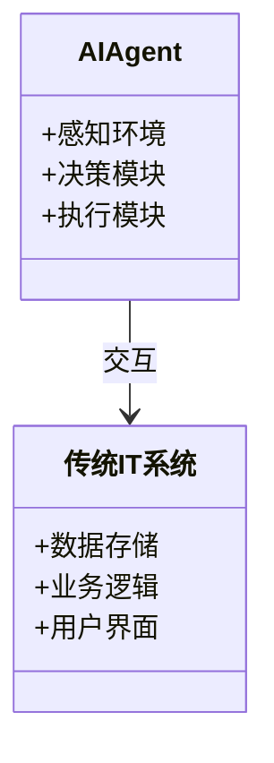
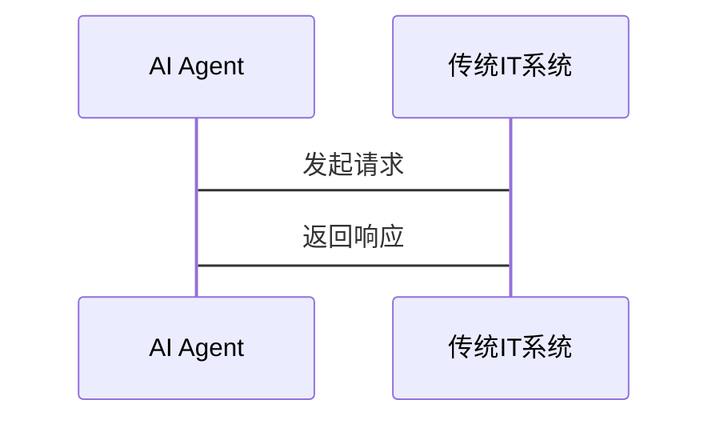

                 


# 实现AI Agent与传统IT系统的无缝集成

## 关键词
AI Agent, 传统IT系统, 无缝集成, 人工智能, 系统架构, 智能化转型, 技术融合

## 摘要
本文详细探讨了AI Agent与传统IT系统无缝集成的核心原理、技术实现和应用场景。通过对比分析AI Agent与传统IT系统的区别与联系，结合实际案例，阐述了如何通过系统架构设计、算法实现和项目实战来实现智能化转型。本文内容涵盖从基础概念到高级算法，再到实际应用的全链条，旨在为IT系统开发者和AI技术爱好者提供理论支持和实践指导。

---

# 第一部分: AI Agent与传统IT系统集成的背景与基础

# 第1章: AI Agent与传统IT系统概述

## 1.1 AI Agent的基本概念

### 1.1.1 AI Agent的定义
AI Agent（人工智能代理）是指能够感知环境、自主决策并执行任务的智能实体。它能够通过传感器获取信息，利用算法进行分析和推理，然后通过执行器完成操作。

### 1.1.2 AI Agent的核心特征
- **自主性**：无需外部干预，自主决策。
- **反应性**：能够实时感知环境变化并做出反应。
- **学习能力**：通过数据和经验不断优化性能。
- **社交能力**：能够与其他系统或人类进行交互协作。

### 1.1.3 AI Agent与传统IT系统的区别

| 特性          | AI Agent                  | 传统IT系统              |
|---------------|---------------------------|--------------------------|
| 智能水平      | 高                         | 低或无                  |
| 自主性        | 高                         | 低或无                  |
| 学习能力      | 高                         | 无或低                  |
| 交互方式      | 多样化，包括语言和动作     | 单一，通常为数据处理    |

## 1.2 传统IT系统的构成与特点

### 1.2.1 传统IT系统的组成
- **硬件**：服务器、PC、网络设备等。
- **软件**：操作系统、数据库、应用系统等。
- **数据**：结构化数据，如数据库中的表结构。
- **接口**：API、数据库连接等。

### 1.2.2 传统IT系统的优缺点

| 优点          | 缺点                      |
|---------------|---------------------------|
| 稳定性高       | 创新能力不足              |
| 易维护性       | 难以应对复杂场景          |
| 可扩展性       | 数据处理能力有限          |

### 1.2.3 传统IT系统的演进趋势
- **智能化**：逐步引入AI技术，提升系统自动化水平。
- **云化**：向云计算和边缘计算方向发展。
- **数据驱动**：更加依赖数据处理和分析能力。

## 1.3 AI Agent与传统IT系统的融合趋势

### 1.3.1 人工智能技术的发展
AI技术的快速发展为传统IT系统的升级提供了新的可能性。通过AI Agent，传统系统能够更好地适应动态变化的环境。

### 1.3.2 传统IT系统的智能化需求
企业希望通过智能化改造，提升系统效率和用户体验，降低运营成本。

### 1.3.3 AI Agent在企业中的应用前景
- **自动化运维**：AI Agent可以自动处理系统故障。
- **智能客服**：通过自然语言处理技术提供更智能的服务。
- **数据驱动决策**：利用AI分析数据，辅助决策。

## 1.4 本章小结
本章介绍了AI Agent和传统IT系统的定义、特点及其区别，分析了传统IT系统的优缺点和演进趋势，并探讨了AI Agent在企业中的应用前景。

---

# 第二部分: AI Agent与传统IT系统集成的核心概念

# 第2章: AI Agent与传统IT系统的融合原理

## 2.1 AI Agent的决策机制

### 2.1.1 基于规则的决策
通过预定义的规则进行判断，适用于场景简单、规则明确的场景。

### 2.1.2 基于机器学习的决策
利用训练好的模型进行预测和分类，适用于场景复杂、规则动态变化的场景。

### 2.1.3 基于强化学习的决策
通过不断试错和奖励机制，优化决策策略，适用于需要长期策略优化的场景。

## 2.2 传统IT系统的调用机制

### 2.2.1 函数调用
通过函数接口调用系统功能，适用于简单的操作。

### 2.2.2 进程间通信
通过消息队列或共享内存进行通信，适用于需要异步处理的场景。

### 2.2.3 RESTful API
通过HTTP协议调用API，适用于微服务架构中的跨系统调用。

## 2.3 AI Agent与传统IT系统的交互模式

### 2.3.1 请求-响应模式
AI Agent发起请求，系统返回响应，适用于实时性要求高的场景。

### 2.3.2 订阅-发布模式
AI Agent订阅事件，系统发布事件时通知代理，适用于需要实时监控的场景。

### 2.3.3 事件驱动模式
通过事件触发执行操作，适用于需要处理多种异步事件的场景。

## 2.4 核心概念对比表

| 概念       | AI Agent                          | 传统IT系统                      |
|------------|-----------------------------------|----------------------------------|
| 决策机制    | 基于规则、机器学习、强化学习    | 基于预定义规则或固定逻辑         |
| 调用机制    | RESTful API、消息队列            | 函数调用、进程间通信             |
| 交互模式    | 请求-响应、订阅-发布、事件驱动  | 请求-响应、队列通信             |

## 2.5 本章小结
本章分析了AI Agent与传统IT系统的决策机制和调用机制，并通过对比表展示了两者在核心概念上的差异。

---

# 第三部分: AI Agent与传统IT系统集成的算法原理

# 第3章: AI Agent的算法实现

## 3.1 AI Agent的核心算法

### 3.1.1 监督学习
通过标记数据进行训练，预测结果。

### 3.1.2 无监督学习
通过数据聚类、降维等技术发现数据内在结构。

### 3.1.3 强化学习
通过试错和奖励机制优化决策策略。

## 3.2 AI Agent的决策流程

### 3.2.1 数据采集
通过传感器或其他接口获取数据。

### 3.2.2 数据处理
对数据进行清洗、转换和特征提取。

### 3.2.3 模型推理
利用训练好的模型进行预测或分类。

### 3.2.4 执行操作
根据推理结果执行相应的操作。

## 3.3 算法实现的数学模型

### 3.3.1 损失函数
$$L(y, y_{\text{pred}}) = \frac{1}{n}\sum_{i=1}^{n}(y_i - y_{\text{pred},i})^2$$

### 3.3.2 优化器
$$\theta_{\text{new}} = \theta - \eta \frac{\partial L}{\partial \theta}$$

## 3.4 本章小结
本章详细介绍了AI Agent的核心算法及其数学模型，分析了决策流程中的关键步骤。

---

# 第四部分: AI Agent与传统IT系统的系统架构设计

# 第4章: 系统架构设计

## 4.1 问题场景介绍

### 4.1.1 问题背景
企业现有IT系统需要集成AI Agent以提升智能化水平。

### 4.1.2 问题描述
现有系统功能单一，难以应对复杂场景。

## 4.2 系统功能设计

### 4.2.1 领域模型设计
使用mermaid类图展示系统功能模块之间的关系。



## 4.3 系统架构设计

### 4.3.1 分层架构
- **感知层**：负责数据采集。
- **决策层**：负责模型推理。
- **执行层**：负责操作执行。

### 4.3.2 微服务架构
通过服务化设计，提高系统的可扩展性和可维护性。

## 4.4 系统接口设计

### 4.4.1 API接口
定义RESTful API接口，实现AI Agent与传统系统之间的数据交互。

### 4.4.2 消息队列
使用Kafka等消息队列实现异步通信。

## 4.5 系统交互流程

### 4.5.1 请求-响应流程
使用mermaid序列图展示交互过程。



## 4.6 本章小结
本章从系统架构的角度，详细设计了AI Agent与传统IT系统的集成方案，包括功能模块、接口设计和交互流程。

---

# 第五部分: AI Agent与传统IT系统的项目实战

# 第5章: 项目实战

## 5.1 环境安装

### 5.1.1 安装Python
```bash
# 安装Python
sudo apt-get install python3
```

### 5.1.2 安装机器学习库
```bash
pip install numpy scikit-learn
```

## 5.2 系统核心实现

### 5.2.1 AI Agent实现
```python
class AIAgent:
    def __init__(self):
        self.model = self.load_model()

    def感知环境(self, data):
        return self.model.predict(data)

    def 执行操作(self, action):
        # 执行相应的操作
        pass
```

### 5.2.2 传统IT系统实现
```python
class TraditionalSystem:
    def __init__(self):
        self.data = []

    def 处理请求(self, request):
        # 处理请求并返回响应
        return "响应"
```

## 5.3 代码解读与分析

### 5.3.1 AI Agent代码解读
- `__init__`方法：初始化模型。
- `感知环境`方法：利用模型进行预测。
- `执行操作`方法：根据预测结果执行操作。

### 5.3.2 传统IT系统代码解读
- `__init__`方法：初始化数据。
- `处理请求`方法：接收请求并返回响应。

## 5.4 实际案例分析

### 5.4.1 案例背景
企业需要自动处理客户投诉，提升客户满意度。

### 5.4.2 案例实现
通过AI Agent分析客户投诉内容，分类并生成回复，交由传统IT系统执行。

## 5.5 项目小结
本章通过实际项目案例，详细展示了AI Agent与传统IT系统集成的实现过程，包括环境安装、代码实现和案例分析。

---

# 第六部分: AI Agent与传统IT系统集成的最佳实践

# 第6章: 最佳实践

## 6.1 关键点总结

### 6.1.1 系统设计
- 明确系统功能模块。
- 设计合理的接口和交互流程。

### 6.1.2 算法选择
- 根据场景选择合适的算法。
- 确保算法的可解释性和可维护性。

## 6.2 注意事项

### 6.2.1 数据安全
确保数据在传输和存储过程中的安全性。

### 6.2.2 系统稳定性
设计完善的容错机制，确保系统稳定运行。

### 6.2.3 性能优化
通过缓存、并行计算等技术提升系统性能。

## 6.3 未来展望

### 6.3.1 技术发展
AI Agent将更加智能化和自动化。

### 6.3.2 应用场景
更多行业将引入AI Agent，推动智能化转型。

## 6.4 本章小结
本章总结了AI Agent与传统IT系统集成的关键点和注意事项，并展望了未来的发展方向。

---

# 第七部分: 结语

## 7.1 作者总结
AI Agent与传统IT系统的无缝集成是未来技术发展的重要趋势。通过理论与实践的结合，企业可以更好地实现智能化转型。

## 7.2 致谢
感谢读者的支持和关注。

---

# 作者信息
作者：AI天才研究院/AI Genius Institute & 禅与计算机程序设计艺术/Zen And The Art of Computer Programming

