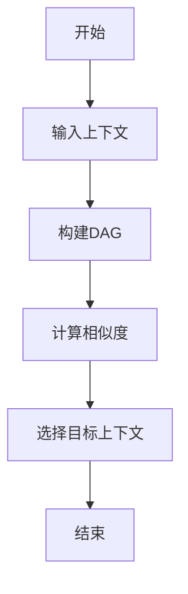
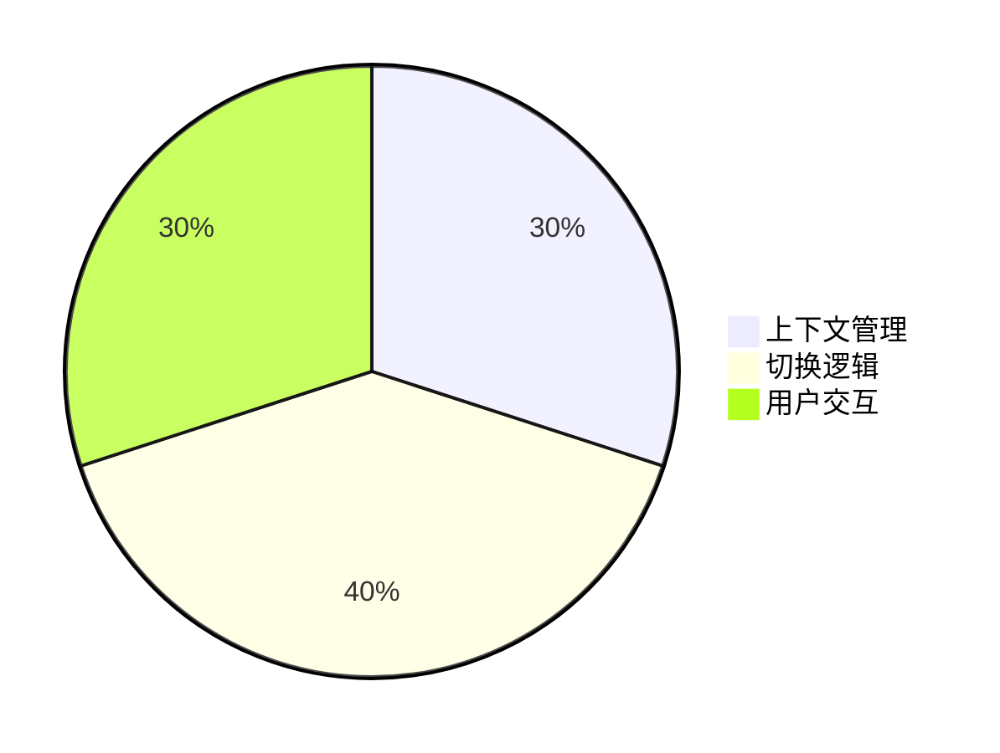
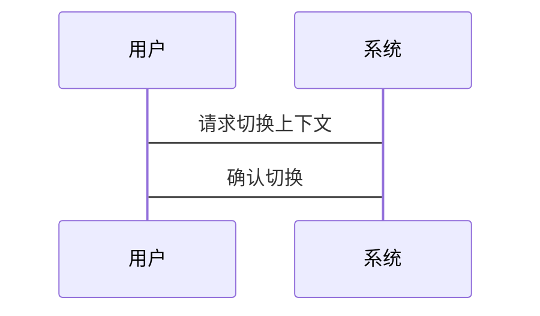

                 


# 实现AI Agent的上下文切换能力

> 关键词：上下文切换，AI Agent，多任务处理，算法实现，系统架构

> 摘要：本文详细探讨了实现AI Agent的上下文切换能力的关键技术，从核心概念到算法实现，从系统架构到项目实战，全面解析了如何构建具备高效上下文切换能力的AI Agent。文章结合理论分析和实践案例，深入阐述了上下文表示、切换算法、系统设计等核心内容，为AI Agent的开发提供了系统化的指导。

---

# 第1章: AI Agent与上下文切换概述

## 1.1 AI Agent的基本概念
### 1.1.1 AI Agent的定义与分类
AI Agent（人工智能代理）是指能够感知环境、自主决策并执行任务的智能实体。根据功能和应用场景，AI Agent可以分为简单反射型Agent、基于模型的反射型Agent、目标驱动型Agent和效用驱动型Agent。上下文切换能力是目标驱动型Agent的重要特征之一。

### 1.1.2 上下文切换的定义
上下文切换是指AI Agent在执行不同任务或应对不同场景时，能够快速切换当前处理的上下文环境，确保任务之间的连贯性和高效性。这种能力使得AI Agent能够更好地适应动态变化的环境。

### 1.1.3 上下文切换的重要性
在多任务处理场景中，上下文切换能力可以显著提升AI Agent的效率和用户体验。例如，在智能助手应用中，用户可能在不同时间点要求AI Agent切换任务，如从处理邮件切换到安排日程。

---

## 1.2 上下文切换的背景与需求
### 1.2.1 多任务处理的挑战
现代应用场景中，AI Agent需要同时处理多个任务，例如智能客服系统需要在处理客户咨询的同时，同步更新知识库。这种多任务处理对上下文切换能力提出了更高要求。

### 1.2.2 上下文切换的场景分析
常见场景包括：
1. **任务切换**：从处理邮件切换到安排会议。
2. **环境变化**：从处理中文任务切换到处理英文任务。
3. **用户需求变化**：用户在与AI Agent对话过程中突然改变需求。

### 1.2.3 用户需求与技术实现的结合
用户希望AI Agent能够在不同任务之间无缝切换，同时保持上下文的连贯性。这需要技术实现能够快速响应用户需求变化，并确保上下文切换的准确性和高效性。

---

## 1.3 本章小结
本章介绍了AI Agent的基本概念和上下文切换的重要性，分析了多任务处理场景中上下文切换的挑战和需求。通过这些背景知识的铺垫，为后续的技术实现奠定了基础。

---

# 第2章: 上下文切换的核心概念与原理

## 2.1 上下文的表示与存储
### 2.1.1 上下文数据结构的设计
上下文通常以树状结构或图结构表示。树状结构适用于简单的层次化上下文，而图结构（如DAG）更适合复杂场景。

### 2.1.2 上下文存储的实现方式
常用存储方式包括：
1. **内存存储**：适用于实时性要求高的场景。
2. **数据库存储**：适用于需要持久化存储的场景。

### 2.1.3 上下文表示的优化策略
通过引入权重和相似度计算，可以优化上下文表示的准确性和效率。

---

## 2.2 上下文切换的算法原理
### 2.2.1 基于DAG的上下文表示方法
DAG（有向无环图）是一种有效的上下文表示方法。通过构建任务之间的依赖关系，可以更好地管理上下文切换。

### 2.2.2 上下文切换的决策树模型
决策树模型通过预定义的规则，实现上下文切换的自动化决策。例如，当任务A需要切换到任务B时，系统会根据任务优先级和资源占用情况自动选择最优切换路径。

### 2.2.3 上下文相似度计算公式
相似度计算公式如下：
$$
\text{相似度} = \frac{\sum_{i=1}^{n} w_i \cdot s_i}{\sum_{i=1}^{n} w_i}
$$
其中，$w_i$是第i个特征的权重，$s_i$是第i个特征的相似度评分。

---

## 2.3 上下文切换的实现步骤
### 2.3.1 上下文识别与提取
通过自然语言处理技术，识别用户需求中的上下文信息。

### 2.3.2 上下文切换的决策逻辑
基于预定义的规则和实时反馈，生成上下文切换的决策。

### 2.3.3 上下文切换的结果验证
通过测试和验证，确保上下文切换的准确性和高效性。

---

## 2.4 本章小结
本章详细介绍了上下文切换的核心概念和算法原理，为后续的系统实现提供了理论基础。

---

# 第3章: 基于DAG的上下文表示方法

## 3.1 DAG的基本概念与性质
### 3.1.1 有向无环图的定义
DAG是由节点和有向边组成的无环图，用于表示任务之间的依赖关系。

### 3.1.2 DAG的拓扑排序算法
拓扑排序算法可以确保任务的执行顺序符合依赖关系。

### 3.1.3 DAG在上下文表示中的应用
通过构建DAG，可以清晰地表示任务之间的依赖关系，从而优化上下文切换的效率。

---

## 3.2 基于DAG的上下文切换算法
### 3.2.1 算法流程图（Mermaid）


---

## 3.3 算法优化策略
### 3.3.1 上下文相似度的动态更新
通过实时更新相似度评分，提升上下文切换的准确性。

### 3.3.2 基于权重的DAG优化
引入权重机制，优化任务切换的优先级。

### 3.3.3 并行计算优化
通过并行计算，提升上下文切换的效率。

---

## 3.4 本章小结
本章通过DAG方法详细探讨了上下文表示和切换的实现策略，为后续的系统实现提供了具体的指导。

---

# 第4章: 系统架构设计

## 4.1 系统功能模块划分
### 4.1.1 上下文管理模块
负责上下文的存储、管理和切换。

### 4.1.2 切换逻辑模块
负责生成上下文切换的决策。

### 4.1.3 用户交互模块
负责与用户的交互和反馈。

---

## 4.2 系统架构图（Mermaid）


---

## 4.3 接口设计与交互流程
### 4.3.1 系统接口定义
- `switch_context(source, target)`：切换上下文的接口。
- `get_context_info()`：获取当前上下文信息的接口。

### 4.3.2 切换流程图（Mermaid）


---

## 4.4 本章小结
本章通过系统架构设计，详细探讨了上下文切换的实现方式，为后续的项目实现提供了具体的指导。

---

# 第5章: 项目实战——上下文切换的实现

## 5.1 项目环境配置
- **开发工具**：Python 3.8+
- **框架选择**：Django或Flask
- **依赖库**：networkx、numpy

---

## 5.2 核心代码实现
### 5.2.1 上下文管理模块
```python
class ContextManager:
    def __init__(self):
        self.contexts = {}

    def add_context(self, context_id, context_data):
        self.contexts[context_id] = context_data

    def switch_context(self, source_id, target_id):
        # 切换上下文逻辑
        pass
```

### 5.2.2 切换逻辑模块
```python
from networkx import DAG
class ContextSwitcher:
    def __init__(self):
        self.dag = DAG()

    def calculate_similarity(self, source, target):
        # 计算相似度
        return 0.9

    def switch_context(self, source_id, target_id):
        if self.dag.has_edge(source_id, target_id):
            return True
        return False
```

---

## 5.3 代码应用解读
通过上述代码，我们可以实现上下文的存储、管理和切换功能。代码逻辑清晰，便于扩展和优化。

---

## 5.4 本章小结
本章通过项目实战，详细探讨了上下文切换的具体实现方式，为读者提供了实践指导。

---

# 第6章: 总结与展望

## 6.1 本章总结
本文详细探讨了实现AI Agent上下文切换能力的关键技术，从核心概念到算法实现，从系统架构到项目实战，全面解析了如何构建具备高效上下文切换能力的AI Agent。

## 6.2 未来展望
未来的研究方向包括：
1. **更高效的上下文表示方法**：探索新的数据结构，提升上下文切换的效率。
2. **智能化的上下文切换算法**：结合机器学习技术，实现更智能的上下文切换。
3. **多模态上下文处理**：支持文本、图像等多种形式的上下文表示。

---

# 作者：AI天才研究院/AI Genius Institute & 禅与计算机程序设计艺术 /Zen And The Art of Computer Programming

---

通过本文的详细讲解和实践案例，读者可以全面掌握实现AI Agent上下文切换能力的核心技术和实现方法。

