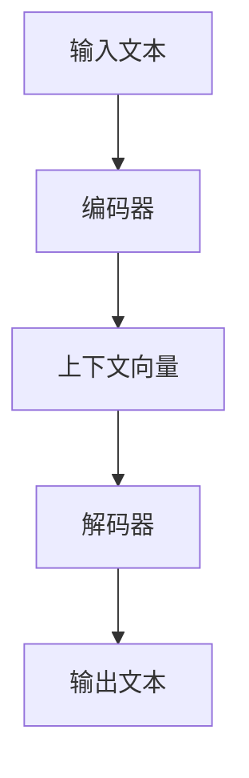
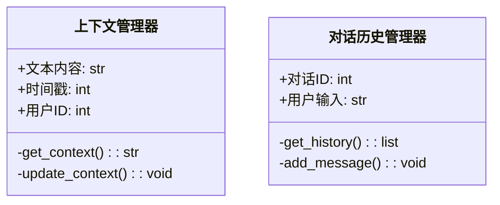

                 


```markdown
# 实现AI Agent的上下文理解与管理

## 关键词：
AI Agent、上下文理解、知识图谱、对话状态管理、自然语言处理

## 摘要：
本文详细探讨了AI Agent的上下文理解与管理的核心概念、算法原理、系统架构以及项目实战。从基础理论到实际应用，逐步解析如何实现高效的上下文管理，涵盖Seq2Seq模型、知识图谱构建等关键技术，结合实际案例，为读者提供全面的技术指导。

---

# 第一部分: AI Agent的上下文理解与管理基础

# 第1章: 上下文理解与管理概述

## 1.1 问题背景与描述
### 1.1.1 AI Agent的核心问题
AI Agent需要能够理解用户意图、上下文信息，并根据这些信息进行推理和决策。

### 1.1.2 上下文理解的重要性
上下文理解是AI Agent实现智能交互的基础，能够帮助AI Agent更好地理解用户需求。

### 1.1.3 管理上下文的必要性
通过管理上下文信息，AI Agent能够保持对话的连贯性，并提供更精准的服务。

## 1.2 核心概念与问题解决
### 1.2.1 上下文理解的定义
上下文理解是指AI Agent对当前对话内容、用户意图和相关知识的综合理解。

### 1.2.2 管理上下文的方法
通过知识图谱和对话状态管理等技术，AI Agent可以有效管理上下文信息。

### 1.2.3 边界与外延分析
上下文理解的边界在于对话内容和相关知识的范围，外延则涉及多轮对话和复杂场景。

## 1.3 核心要素与概念结构
### 1.3.1 上下文表示的维度
包括文本内容、时间戳、用户ID等维度。

### 1.3.2 知识图谱的作用
知识图谱用于表示实体之间的关系，帮助AI Agent理解上下文中的知识。

### 1.3.3 对话状态管理的流程
包括初始化、更新、查询和清除四个步骤。

## 1.4 本章小结
本章介绍了AI Agent上下文理解与管理的核心概念和基本方法。

---

# 第二部分: 上下文理解的核心概念与联系

# 第2章: 上下文理解的原理与模型

## 2.1 核心概念原理
### 2.1.1 基于向量的上下文表示
通过向量表示上下文信息，能够更好地捕捉语义关系。

### 2.1.2 知识图谱的构建与应用
构建知识图谱并将其应用于上下文理解，能够增强AI Agent的知识推理能力。

### 2.1.3 对话状态管理的机制
通过维护对话历史和状态，AI Agent可以更好地理解和回应用户的输入。

## 2.2 概念属性对比表
### 表2-1: 不同上下文表示方法的对比
| 表示方法 | 优点 | 缺点 |
|----------|------|------|
| 向量表示 | 高效、语义丰富 | 对计算资源要求较高 |
| 知识图谱 | 知识推理能力强 | 构建复杂 |
| 对话历史 | 连贯性好 | 知识覆盖有限 |

## 2.3 ER实体关系图
```mermaid
er
    entity 上下文 {
        关键属性: 文本内容, 时间戳, 用户ID
        外键关系: [FK] -> 用户表
    }
    entity 对话历史 {
        关键属性: 对话ID, 时间戳, 用户输入
        外键关系: [FK] -> 对话上下文
    }
```

## 2.4 本章小结
本章详细探讨了上下文理解的核心概念和实现方法，通过对比和图示帮助读者更好地理解相关原理。

---

# 第三部分: 上下文管理的算法原理与实现

# 第3章: 上下文理解的算法原理

## 3.1 算法原理概述
### 3.1.1 基于Seq2Seq模型的上下文理解
Seq2Seq模型通过编码器和解码器结构实现上下文的理解和生成。

### 3.1.2 基于图神经网络的知识图谱构建
图神经网络能够有效地捕捉实体之间的复杂关系。

## 3.2 算法流程图


## 3.3 算法实现代码
```python
def seq2seq_mode(input_text):
    encoder_input = input_text
    decoder_input = encoder_input
    output = decoder(decoder_input)
    return output
```

## 3.4 数学模型与公式
### 3.4.1 交叉熵损失函数
$$ \text{loss} = -\frac{1}{N} \sum_{i=1}^{N} \sum_{j=1}^{M} y_{ij} \log p(y_{ij}) $$

### 3.4.2 注意力机制
$$ \text{注意力权重} = \text{softmax}(\frac{\text{查询} \cdot \text{键}}{\text{维度}}) $$

## 3.5 本章小结
本章通过算法原理和代码实现，详细介绍了上下文理解的实现方法。

---

# 第四部分: 系统分析与架构设计

# 第4章: 系统分析与架构设计

## 4.1 问题场景介绍
AI Agent需要处理多轮对话，实时理解并管理上下文信息。

## 4.2 系统功能设计
### 4.2.1 领域模型类图


### 4.2.2 系统架构设计


## 4.3 系统接口设计
### 4.3.1 API接口
- GET /context
- POST /update_context

### 4.3.2 接口交互流程
1. 客户端发送请求
2. API网关路由请求
3. 服务层处理请求
4. 数据库存储或更新

## 4.4 本章小结
本章通过系统架构设计和接口设计，详细介绍了AI Agent上下文管理的实现方案。

---

# 第五部分: 项目实战与案例分析

# 第5章: 项目实战

## 5.1 环境安装
```bash
pip install transformers
pip install networkx
```

## 5.2 核心实现
```python
from transformers import AutoTokenizer, AutoModelForSeq2Seq
import networkx as nx

def build_knowledge_graph():
    G = nx.Graph()
    G.add_edge("苹果", "公司")
    G.add_edge("苹果", "产品")
    return G

def process_context(input_text):
    model = AutoModelForSeq2Seq.from_pretrained("facebook/mbart-large-50")
    tokenizer = AutoTokenizer.from_pretrained("facebook/mbart-large-50")
    inputs = tokenizer(input_text, return_tensors="pt")
    outputs = model.generate(inputs.input_ids)
    return tokenizer.decode(outputs[0], skip_special_tokens=True)
```

## 5.3 案例分析
### 5.3.1 案例一：客服对话
用户输入：我需要取消订单。
AI Agent理解上下文：订单ID、用户ID、时间戳。
AI Agent响应：确认取消订单。

### 5.3.2 案例二：产品咨询
用户输入：这个产品的功能是什么？
AI Agent理解上下文：产品ID、用户ID、时间戳。
AI Agent响应：产品功能介绍。

## 5.4 本章小结
本章通过项目实战和案例分析，详细展示了AI Agent上下文管理的实现过程。

---

# 第六部分: 总结与展望

# 第6章: 总结与展望

## 6.1 最佳实践
- 使用知识图谱增强上下文理解
- 结合对话状态管理提升交互体验

## 6.2 小结
本文详细探讨了AI Agent上下文理解与管理的核心概念、算法原理和系统架构，结合实际案例进行了深入分析。

## 6.3 注意事项
- 确保上下文信息的安全性
- 定期更新知识图谱

## 6.4 拓展阅读
- 《Neural Networks and Deep Learning》
- 《Knowledge Graphs: Theory and Applications》

---

# 作者：AI天才研究院 & 禅与计算机程序设计艺术

---

通过以上目录，读者可以系统地了解AI Agent上下文理解与管理的核心内容，从理论到实践，逐步掌握相关技术。

