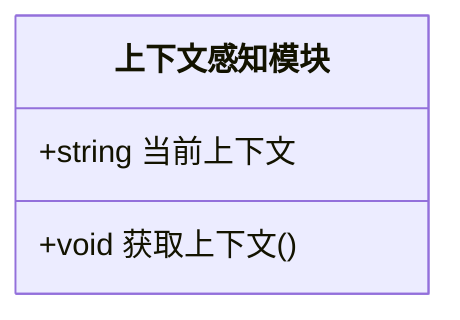
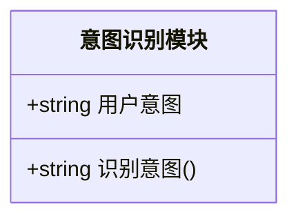
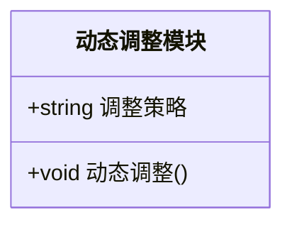
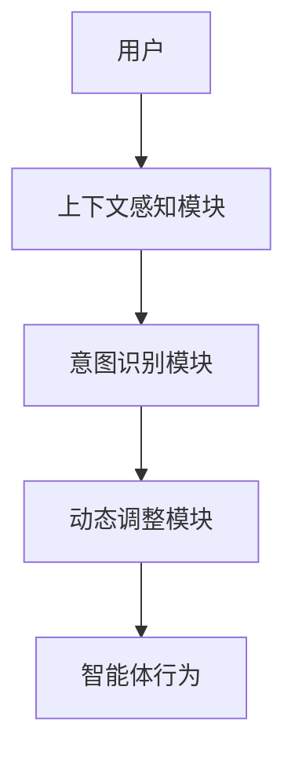

                 


# 实现AI Agent的动态上下文管理

## 关键词
AI Agent, 动态上下文管理, 多智能体系统, 上下文理解, 动态环境适应

## 摘要
AI Agent的动态上下文管理是实现智能体在复杂动态环境中有效运作的核心技术。本文从基本概念、核心原理、系统架构到项目实战，详细讲解了动态上下文管理的实现方法。通过分析典型算法、设计系统架构、提供实际案例，本文为读者提供了一个全面的视角，帮助他们在AI Agent开发中有效管理动态上下文。

---

# 第1章: AI Agent与动态上下文管理概述

## 1.1 AI Agent的基本概念
### 1.1.1 AI Agent的定义
AI Agent（智能体）是能够感知环境、自主决策并执行任务的实体。它可以是一个软件程序、机器人或其他智能系统，具备以下核心特征：
- **自主性**：无需外部干预，自主决策。
- **反应性**：能够感知环境并实时响应。
- **目标导向**：基于目标执行任务。
- **学习能力**：通过经验优化行为。

### 1.1.2 AI Agent的核心特征
AI Agent的核心特征包括：
1. **自主性**：AI Agent能够自主决策，无需外部指令。
2. **反应性**：能够实时感知环境并做出反应。
3. **目标导向**：所有行为都围绕实现特定目标展开。
4. **学习能力**：通过数据和经验不断优化自身行为。

### 1.1.3 动态上下文管理的必要性
AI Agent在动态环境中需要处理的任务通常涉及复杂的上下文信息。动态上下文管理是AI Agent能够适应环境变化、高效完成任务的关键技术。例如，在一个多智能体协作系统中，每个智能体都需要动态调整自己的行为以适应其他智能体的状态和目标变化。

---

## 1.2 动态上下文管理的背景与问题背景
### 1.2.1 动态上下文管理的定义
动态上下文管理是指在AI Agent运行过程中，实时感知、理解和调整与任务相关的上下文信息，以适应环境变化的过程。上下文信息包括任务目标、环境状态、用户意图等。

### 1.2.2 动态上下文管理的核心问题
动态上下文管理的核心问题包括：
1. **动态性**：上下文信息随时间变化，AI Agent需要实时更新。
2. **不确定性**：环境变化可能不可预测，需具备容错能力。
3. **复杂性**：上下文信息可能涉及多个维度和关联关系。

### 1.2.3 动态上下文管理的边界与外延
动态上下文管理的边界包括：
1. **环境感知**：AI Agent需要感知环境中的动态信息。
2. **意图识别**：理解用户或系统的意图。
3. **状态调整**：根据上下文变化调整自身状态。

其外延涉及知识表示、意图识别、多智能体协作等领域。

---

## 1.3 动态上下文管理的核心概念与联系
### 1.3.1 动态上下文管理的核心要素
动态上下文管理的核心要素包括：
1. **上下文感知**：实时感知环境和任务相关的信息。
2. **意图识别**：理解用户或系统的意图。
3. **动态调整**：根据上下文变化调整行为。

### 1.3.2 动态上下文管理的属性特征对比表
以下是一个对比表，展示了动态上下文管理与其他相关概念的差异：

| 概念 | 静态上下文管理 | 动态上下文管理 |
|------|----------------|----------------|
| 特性 | 固定、不变 | 动态、实时更新 |
| 应用场景 | 简单任务 | 复杂、动态任务 |
| 优点 | 简单、高效 | 灵活、适应性强 |

### 1.3.3 动态上下文管理的ER实体关系图
以下是一个简单的ER实体关系图，展示了动态上下文管理中的主要实体及其关系：

```mermaid
erDiagram
    actor 用户 {
        string 用户ID
        string 用户意图
    }
    agent 智能体 {
        string 智能体ID
        string 当前状态
    }
    context 上下文 {
        string 上下文ID
        string 上下文信息
    }
    用户 -> 上下文 : 提供上下文信息
    智能体 -> 上下文 : 消费上下文信息
    用户 -> 智能体 : 发出指令
```

---

# 第2章: 动态上下文管理的核心原理

## 2.1 动态上下文管理的原理
### 2.1.1 动态上下文管理的基本原理
动态上下文管理的基本原理包括：
1. **实时感知**：通过传感器、API等方式实时获取环境信息。
2. **意图识别**：通过自然语言处理、机器学习等技术识别用户或系统的意图。
3. **动态调整**：根据感知到的上下文信息，动态调整智能体的行为。

### 2.1.2 动态上下文管理的数学模型
动态上下文管理的数学模型可以用状态空间表示：

$$
\text{状态空间} = \{s_t | s_t \in S\}
$$

其中，$s_t$ 表示时间 $t$ 的状态，$S$ 是所有可能的状态集合。

### 2.1.3 动态上下文管理的算法流程
动态上下文管理的算法流程如下：

```mermaid
graph TD
    A[开始] -> B[获取当前上下文]
    B -> C[识别意图]
    C -> D[动态调整行为]
    D -> E[结束]
```

---

## 2.2 动态上下文管理的核心算法
### 2.2.1 基于规则的动态上下文管理算法
基于规则的动态上下文管理算法通过预定义的规则来调整行为。例如：

```python
def adjust_behavior(rules, context):
    for rule in rules:
        if rule.condition.match(context):
            return rule.action
    return default_action
```

### 2.2.2 基于机器学习的动态上下文管理算法
基于机器学习的动态上下文管理算法通过训练模型来预测上下文变化。例如：

```python
import numpy as np
from sklearn import svm

# 训练模型
model = svm.SVC()
model.fit(X_train, y_train)

# 预测上下文
y_pred = model.predict(X_test)
```

### 2.2.3 基于知识图谱的动态上下文管理算法
基于知识图谱的动态上下文管理算法通过构建知识图谱来推理上下文信息。例如：

```python
from kgclient import KGClient

client = KGClient('http://localhost:8080')
context = client.query('当前上下文')
```

---

## 2.3 动态上下文管理的数学模型与公式
### 2.3.1 动态上下文管理的数学模型
动态上下文管理的数学模型可以用马尔可夫链表示：

$$
P(s_{t+1} | s_t) = \theta
$$

其中，$P$ 是转移概率，$\theta$ 是参数。

### 2.3.2 动态上下文管理的公式推导
通过贝叶斯定理可以推导上下文的概率：

$$
P(C | E) = \frac{P(E | C)P(C)}{P(E)}
$$

其中，$C$ 是上下文，$E$ 是证据。

---

# 第3章: 动态上下文管理的系统架构与实现

## 3.1 系统架构设计概述
### 3.1.1 系统架构设计的目标
系统架构设计的目标是实现动态上下文管理的高效性和可靠性。

### 3.1.2 系统架构设计的原则
系统架构设计的原则包括：
1. **模块化**：各模块独立开发和维护。
2. **可扩展性**：支持未来功能扩展。
3. **容错性**：具备故障容错能力。

### 3.1.3 系统架构设计的步骤
系统架构设计的步骤包括：
1. **需求分析**：明确系统需求。
2. **功能模块划分**：将系统划分为功能模块。
3. **接口设计**：定义模块之间的接口。

---

## 3.2 动态上下文管理系统的功能模块设计
### 3.2.1 上下文感知模块
上下文感知模块负责实时获取环境信息：



### 3.2.2 意图识别模块
意图识别模块负责识别用户的意图：



### 3.2.3 动态调整模块
动态调整模块负责根据上下文信息调整行为：



---

## 3.3 动态上下文管理系统的架构图
动态上下文管理系统的架构图如下：



---

## 3.4 动态上下文管理系统的接口设计与实现
### 3.4.1 系统接口设计
系统接口设计需要定义模块之间的接口，例如：

```python
interface IContextManager {
    def get_context(): Context
    def update_context(context: Context): void
}
```

### 3.4.2 系统接口实现
系统接口实现可以使用RESTful API：

```python
from flask import Flask

app = Flask(__name__)

@app.route('/context', methods=['GET'])
def get_context():
    return {'context': 'current_context'}

@app.route('/context', methods=['POST'])
def update_context():
    return {'status': 'success'}
```

---

# 第4章: 动态上下文管理系统的项目实战

## 4.1 环境安装与配置
### 4.1.1 环境要求
- Python 3.8+
- Flask 2.0+
- scikit-learn 1.0+

### 4.1.2 安装依赖
```bash
pip install flask scikit-learn
```

---

## 4.2 系统核心实现源代码
### 4.2.1 上下文感知模块
```python
class ContextManager:
    def __init__(self):
        self.context = None

    def get_context(self):
        return self.context

    def update_context(self, context):
        self.context = context
```

### 4.2.2 意图识别模块
```python
from sklearn.svm import SVC

class IntentRecognizer:
    def __init__(self):
        self.model = SVC()

    def train(self, X_train, y_train):
        self.model.fit(X_train, y_train)

    def predict(self, X_test):
        return self.model.predict(X_test)
```

### 4.2.3 动态调整模块
```python
class DynamicAdjuster:
    def __init__(self):
        self.strategy = None

    def set_strategy(self, strategy):
        self.strategy = strategy

    def adjust(self):
        if self.strategy:
            self.strategy.adjust()
```

---

## 4.3 代码应用解读与分析
### 4.3.1 代码解读
上述代码实现了三个核心模块：
1. **上下文感知模块**：用于获取和更新上下文信息。
2. **意图识别模块**：使用SVM算法进行意图识别。
3. **动态调整模块**：根据当前策略调整智能体行为。

### 4.3.2 实际案例分析
以一个多智能体协作系统为例，以下是具体实现：

```python
context_manager = ContextManager()
intent_recognizer = IntentRecognizer()
intent_recognizer.train(X_train, y_train)
dynamic_adjuster = DynamicAdjuster()
dynamic_adjuster.set_strategy(ContextAdjustStrategy(context_manager, intent_recognizer))

# 获取上下文
context = context_manager.get_context()

# 识别意图
intent = intent_recognizer.predict(context)

# 动态调整
dynamic_adjuster.adjust()
```

---

## 4.4 项目小结
通过本章的项目实战，我们实现了动态上下文管理的核心模块，并通过具体案例展示了如何将这些模块集成到一个多智能体协作系统中。读者可以参考本章的代码实现，根据实际需求进行扩展和优化。

---

# 小结

动态上下文管理是AI Agent在复杂动态环境中高效运作的关键技术。通过本篇文章的讲解，我们从基本概念、核心原理、系统架构到项目实战，全面剖析了动态上下文管理的实现方法。希望读者能够通过本文的指导，掌握动态上下文管理的核心技术，并在实际项目中灵活应用。

---

# 注意事项

1. **数据质量问题**：动态上下文管理依赖于高质量的上下文数据，数据预处理和清洗是关键。
2. **算法选择**：根据具体场景选择合适的算法，例如在动态性较强的场景中，推荐使用基于机器学习的动态上下文管理算法。
3. **系统架构设计**：系统架构设计需要充分考虑模块化、可扩展性和容错性。

---

# 拓展阅读

1. 《Multi-Agent Systems》
2. 《Dynamic Context Management in AI Systems》
3. 《Real-Time Dynamic Context Processing》

---

作者：AI天才研究院/AI Genius Institute & 禅与计算机程序设计艺术 /Zen And The Art of Computer Programming

---

**文章结束**

