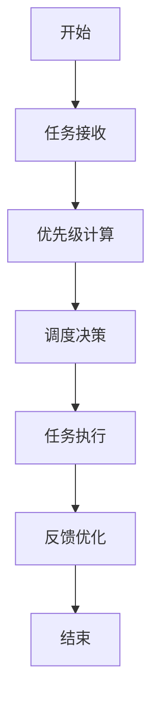
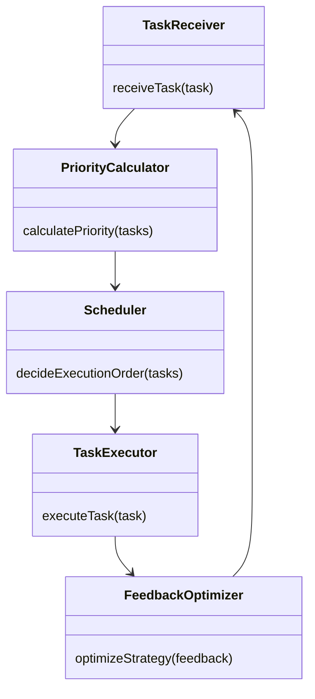
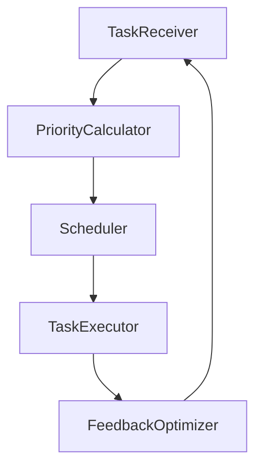

                 


# 实现AI Agent的动态任务优先级调度

## 关键词：AI Agent, 动态任务优先级调度, 调度算法, 任务调度, 优先级计算

## 摘要：
本文详细探讨了AI Agent在动态任务优先级调度中的实现方法，从核心概念到算法原理，再到系统架构设计和项目实战，全面解析了动态任务优先级调度的关键技术与应用。通过理论分析与实践结合，本文为AI Agent的动态任务优先级调度提供了一套完整的解决方案。

---

# 第一部分: AI Agent与动态任务优先级调度概述

# 第1章: AI Agent与动态任务优先级调度的背景介绍

## 1.1 AI Agent的基本概念

### 1.1.1 AI Agent的定义与特点
AI Agent（智能代理）是指能够感知环境、自主决策并执行任务的智能实体。其特点包括：
1. **自主性**：无需外部干预，自主完成任务。
2. **反应性**：能够实时感知环境变化并做出反应。
3. **目标导向**：以明确的目标为导向，优化任务执行效率。
4. **动态适应性**：能够根据环境变化动态调整行为。

### 1.1.2 AI Agent的核心功能与应用场景
AI Agent的核心功能包括感知、决策、执行和反馈。其应用场景广泛，例如自动驾驶、智能机器人、智能家居、任务调度系统等。

### 1.1.3 动态任务优先级调度的背景与意义
在多任务环境中，AI Agent需要同时处理多个任务，任务优先级的动态调整至关重要。动态任务优先级调度能够确保AI Agent在复杂环境中高效完成任务，避免资源浪费和任务冲突。

## 1.2 动态任务优先级调度的背景

### 1.2.1 动态任务优先级调度的定义
动态任务优先级调度是指根据环境变化和任务特性，实时调整任务优先级的过程。其核心目标是优化任务执行顺序，确保高优先级任务优先完成。

### 1.2.2 动态任务优先级调度的核心问题
1. **优先级计算**：如何根据任务特性、环境状态和资源情况计算任务优先级。
2. **调度决策**：如何在动态变化的环境中做出最优调度决策。
3. **反馈优化**：如何根据执行反馈调整调度策略，提高调度效率。

### 1.2.3 动态任务优先级调度的边界与外延
动态任务优先级调度的边界包括任务特性、环境状态和资源限制。其外延涉及任务分解、资源分配和多 Agent 协作。

## 1.3 问题背景与问题描述

### 1.3.1 动态任务优先级调度的核心问题
在动态环境中，任务优先级需要实时调整以适应环境变化。如何在资源有限的情况下，快速计算任务优先级，确保高优先级任务优先执行，是动态任务优先级调度的核心问题。

### 1.3.2 动态任务优先级调度的挑战与难点
1. **实时性要求高**：需要快速响应环境变化，实时调整任务优先级。
2. **任务冲突**：多个任务竞争资源时，如何避免冲突。
3. **不确定性**：环境动态变化，任务优先级计算需要考虑不确定性因素。

### 1.3.3 动态任务优先级调度的解决方案
1. **动态优先级计算**：根据任务特性和环境状态动态计算优先级。
2. **实时调度算法**：采用高效的实时调度算法，确保任务优先级的动态调整。
3. **反馈优化机制**：根据执行反馈优化调度策略，提高调度效率。

## 1.4 本章小结
本章介绍了AI Agent的基本概念、动态任务优先级调度的背景与意义，分析了动态任务优先级调度的核心问题、挑战与难点，并提出了初步的解决方案。

---

# 第二部分: 动态任务优先级调度的核心概念与联系

# 第2章: 动态任务优先级调度的核心概念

## 2.1 调度算法的基本原理

### 2.1.1 调度算法的分类与特点
调度算法主要分为静态调度算法和动态调度算法。静态调度算法适用于任务特性固定、环境变化小的场景；动态调度算法适用于任务特性动态变化、环境变化大的场景。

### 2.1.2 动态任务优先级调度的核心要素
动态任务优先级调度的核心要素包括任务特性、环境状态和资源限制。任务特性包括任务类型、执行时间、优先级等；环境状态包括可用资源、任务之间的依赖关系等；资源限制包括计算资源、存储资源等。

### 2.1.3 动态任务优先级调度的数学模型
动态任务优先级调度的数学模型如下：
$$ P_i = f(t_i, r_i, s_i) $$
其中，\( P_i \) 是任务 \( i \) 的优先级，\( t_i \) 是任务类型，\( r_i \) 是资源限制，\( s_i \) 是环境状态。

## 2.2 调度算法的数学模型与公式

### 2.2.1 调度算法的数学表达式
动态任务优先级调度的数学表达式可以表示为：
$$ P_i = \alpha \cdot t_i + \beta \cdot r_i + \gamma \cdot s_i $$
其中，\( \alpha \)、\( \beta \)、\( \gamma \) 是权重系数，\( t_i \)、\( r_i \)、\( s_i \) 是任务特性、资源限制和环境状态的归一化值。

### 2.2.2 优先级计算的公式推导
优先级计算公式推导过程如下：
1. 对任务特性、资源限制和环境状态进行归一化处理：
$$ t_i' = \frac{t_i - \min(t_i)}{\max(t_i) - \min(t_i)} $$
$$ r_i' = \frac{r_i - \min(r_i)}{\max(r_i) - \min(r_i)} $$
$$ s_i' = \frac{s_i - \min(s_i)}{\max(s_i) - \min(s_i)} $$
2. 根据权重系数计算优先级：
$$ P_i = \alpha \cdot t_i' + \beta \cdot r_i' + \gamma \cdot s_i' $$

### 2.2.3 动态任务优先级的权重分配
权重分配需要根据具体场景进行调整。例如，在任务类型对优先级影响较大的场景，可以增加 \( \alpha \) 的权重；在资源限制对优先级影响较大的场景，可以增加 \( \beta \) 的权重。

## 2.3 调度算法的实体关系图


## 2.4 调度算法的流程图



## 2.5 本章小结
本章详细讲解了动态任务优先级调度的核心概念，包括调度算法的分类、数学模型与公式、优先级计算的公式推导以及实体关系图和流程图。

---

# 第三部分: 动态任务优先级调度的算法原理

# 第3章: 动态任务优先级调度的算法原理

## 3.1 调度算法的分类与选择

### 3.1.1 基于静态优先级的调度算法
基于静态优先级的调度算法适用于任务特性固定、环境变化小的场景。其优点是简单易实现，缺点是无法适应动态变化的环境。

### 3.1.2 基于动态优先级的调度算法
基于动态优先级的调度算法适用于任务特性动态变化、环境变化大的场景。其优点是能够实时调整优先级，缺点是实现复杂度较高。

### 3.1.3 基于机器学习的调度算法
基于机器学习的调度算法通过学习历史数据，预测任务优先级。其优点是能够处理复杂的非线性关系，缺点是需要大量的训练数据和计算资源。

## 3.2 动态优先级计算的数学模型

### 3.2.1 优先级计算公式
动态优先级计算公式如下：
$$ P_i(t) = \alpha \cdot t_i(t) + \beta \cdot r_i(t) + \gamma \cdot s_i(t) $$
其中，\( t \) 表示时间，\( t_i(t) \)、\( r_i(t) \)、\( s_i(t) \) 是任务 \( i \) 在时间 \( t \) 的特性、资源限制和环境状态。

### 3.2.2 优先级计算的动态调整
优先级计算的动态调整可以通过以下步骤实现：
1. 实时获取任务特性、资源限制和环境状态。
2. 根据动态优先级计算公式计算任务优先级。
3. 根据优先级调整任务调度顺序。

## 3.3 动态任务优先级调度的算法实现

### 3.3.1 Python实现
以下是动态任务优先级调度的Python实现示例：

```python
def calculate_priority(tasks, alpha, beta, gamma):
    priorities = []
    for task in tasks:
        t_i = task['type']
        r_i = task['resource']
        s_i = task['state']
        # 归一化处理
        t_i_norm = (t_i - min(t_i)) / (max(t_i) - min(t_i))
        r_i_norm = (r_i - min(r_i)) / (max(r_i) - min(r_i))
        s_i_norm = (s_i - min(s_i)) / (max(s_i) - min(s_i))
        # 计算优先级
        priority = alpha * t_i_norm + beta * r_i_norm + gamma * s_i_norm
        priorities.append(priority)
    return priorities

# 示例调用
tasks = [
    {'type': 2, 'resource': 3, 'state': 1},
    {'type': 3, 'resource': 2, 'state': 4},
    {'type': 1, 'resource': 5, 'state': 2}
]
alpha = 0.5
beta = 0.3
gamma = 0.2

priorities = calculate_priority(tasks, alpha, beta, gamma)
print(priorities)
```

### 3.3.2 动态优先级计算的案例分析
假设我们有两个任务，任务A和任务B。任务A的类型为2，资源限制为3，环境状态为1；任务B的类型为3，资源限制为2，环境状态为4。权重系数分别为α=0.5，β=0.3，γ=0.2。

归一化处理后：
$$ t_{A} = \frac{2 - 1}{3 - 1} = 0.5 $$
$$ r_{A} = \frac{3 - 1}{5 - 1} = 0.5 $$
$$ s_{A} = \frac{1 - 1}{4 - 1} = 0 $$

$$ t_{B} = \frac{3 - 1}{3 - 1} = 1 $$
$$ r_{B} = \frac{2 - 1}{5 - 1} = 0.25 $$
$$ s_{B} = \frac{4 - 1}{4 - 1} = 1 $$

优先级计算：
$$ P_{A} = 0.5 \times 0.5 + 0.3 \times 0.5 + 0.2 \times 0 = 0.35 $$
$$ P_{B} = 0.5 \times 1 + 0.3 \times 0.25 + 0.2 \times 1 = 0.5 + 0.075 + 0.2 = 0.775 $$

因此，任务B的优先级高于任务A。

## 3.4 本章小结
本章详细讲解了动态任务优先级调度的算法原理，包括调度算法的分类、动态优先级计算的数学模型与公式，并通过Python代码示例和案例分析，进一步说明了动态优先级计算的实现过程。

---

# 第四部分: 动态任务优先级调度的系统架构设计

# 第4章: 动态任务优先级调度的系统架构设计

## 4.1 问题场景介绍

### 4.1.1 动态任务优先级调度的应用场景
动态任务优先级调度的应用场景包括多任务调度、实时任务调度、分布式任务调度等。

### 4.1.2 动态任务优先级调度的系统目标
动态任务优先级调度的系统目标是实现任务优先级的动态调整，确保任务高效执行。

### 4.1.3 动态任务优先级调度的系统约束
动态任务优先级调度的系统约束包括资源限制、任务类型、环境状态等。

## 4.2 系统功能设计

### 4.2.1 功能模块划分
动态任务优先级调度系统的功能模块包括任务接收模块、优先级计算模块、调度决策模块、任务执行模块和反馈优化模块。

### 4.2.2 功能模块描述
1. **任务接收模块**：接收新任务并将其加入任务队列。
2. **优先级计算模块**：根据任务特性、资源限制和环境状态计算任务优先级。
3. **调度决策模块**：根据优先级和资源情况决定任务执行顺序。
4. **任务执行模块**：按照调度决策执行任务。
5. **反馈优化模块**：根据任务执行反馈优化调度策略。

### 4.2.3 功能模块的交互关系


## 4.3 系统架构设计

### 4.3.1 系统架构设计的总体思路
动态任务优先级调度系统的架构设计需要考虑模块化设计、高可用性和可扩展性。

### 4.3.2 系统架构设计的详细描述
系统架构设计包括以下几个部分：
1. **任务接收模块**：负责接收新任务并将其加入任务队列。
2. **优先级计算模块**：根据任务特性、资源限制和环境状态计算任务优先级。
3. **调度决策模块**：根据优先级和资源情况决定任务执行顺序。
4. **任务执行模块**：按照调度决策执行任务。
5. **反馈优化模块**：根据任务执行反馈优化调度策略。

### 4.3.3 系统架构设计的类图



### 4.3.4 系统架构设计的交互流程图



## 4.4 系统接口设计

### 4.4.1 系统接口的定义
系统接口包括任务接收接口、优先级计算接口、调度决策接口、任务执行接口和反馈优化接口。

### 4.4.2 系统接口的交互流程
1. 任务接收模块接收新任务并调用优先级计算模块。
2. 优先级计算模块计算任务优先级并返回给调度决策模块。
3. 调度决策模块决定任务执行顺序并返回给任务执行模块。
4. 任务执行模块执行任务并返回反馈信息给反馈优化模块。
5. 反馈优化模块根据反馈信息优化调度策略并返回给任务接收模块。

## 4.5 系统交互设计

### 4.5.1 系统交互的流程图


## 4.6 本章小结
本章详细讲解了动态任务优先级调度系统的架构设计，包括功能模块划分、系统架构设计、类图和交互流程图。

---

# 第五部分: 动态任务优先级调度的项目实战

# 第5章: 动态任务优先级调度的项目实战

## 5.1 项目介绍

### 5.1.1 项目背景
本项目旨在实现一个动态任务优先级调度系统，能够根据任务特性、资源限制和环境状态动态调整任务优先级，确保任务高效执行。

### 5.1.2 项目目标
项目的最终目标是实现一个高效、可靠的动态任务优先级调度系统，能够应用于多任务调度、实时任务调度等场景。

### 5.1.3 项目需求
项目需求包括：
1. 实现任务接收模块。
2. 实现优先级计算模块。
3. 实现调度决策模块。
4. 实现任务执行模块。
5. 实现反馈优化模块。

## 5.2 系统核心实现

### 5.2.1 任务接收模块的实现
任务接收模块的实现如下：

```python
class TaskReceiver:
    def receive_task(self, task):
        self.tasks.append(task)
```

### 5.2.2 优先级计算模块的实现
优先级计算模块的实现如下：

```python
class PriorityCalculator:
    def calculate_priority(self, tasks):
        priorities = []
        for task in tasks:
            t_i = task['type']
            r_i = task['resource']
            s_i = task['state']
            # 归一化处理
            t_i_norm = (t_i - min(t_i)) / (max(t_i) - min(t_i))
            r_i_norm = (r_i - min(r_i)) / (max(r_i) - min(r_i))
            s_i_norm = (s_i - min(s_i)) / (max(s_i) - min(s_i))
            # 计算优先级
            priority = self.alpha * t_i_norm + self.beta * r_i_norm + self.gamma * s_i_norm
            priorities.append(priority)
        return priorities
```

### 5.2.3 调度决策模块的实现
调度决策模块的实现如下：

```python
class Scheduler:
    def decide_execution_order(self, tasks, priorities):
        # 根据优先级排序任务
        tasks_with_priority = sorted(zip(tasks, priorities), key=lambda x: x[1], reverse=True)
        # 返回排序后的任务列表
        return [task for task, priority in tasks_with_priority]
```

### 5.2.4 任务执行模块的实现
任务执行模块的实现如下：

```python
class TaskExecutor:
    def execute_task(self, task):
        # 模拟任务执行
        print(f"Executing task {task['id']}")
```

### 5.2.5 反馈优化模块的实现
反馈优化模块的实现如下：

```python
class FeedbackOptimizer:
    def optimize_strategy(self, feedback):
        # 根据反馈优化策略
        pass
```

## 5.3 项目实战的代码实现

### 5.3.1 环境安装
项目需要以下环境：
1. Python 3.8+
2. Mermaid 图表工具
3. 基础Python库（如numpy、pandas等）

### 5.3.2 核心代码实现
以下是核心代码实现：

```python
class TaskReceiver:
    def __init__(self):
        self.tasks = []

    def receive_task(self, task):
        self.tasks.append(task)

class PriorityCalculator:
    def __init__(self, alpha, beta, gamma):
        self.alpha = alpha
        self.beta = beta
        self.gamma = gamma

    def calculate_priority(self, tasks):
        priorities = []
        for task in tasks:
            t_i = task['type']
            r_i = task['resource']
            s_i = task['state']
            # 归一化处理
            t_i_norm = (t_i - min(t_i)) / (max(t_i) - min(t_i))
            r_i_norm = (r_i - min(r_i)) / (max(r_i) - min(r_i))
            s_i_norm = (s_i - min(s_i)) / (max(s_i) - min(s_i))
            # 计算优先级
            priority = self.alpha * t_i_norm + self.beta * r_i_norm + self.gamma * s_i_norm
            priorities.append(priority)
        return priorities

class Scheduler:
    def decide_execution_order(self, tasks, priorities):
        # 根据优先级排序任务
        tasks_with_priority = sorted(zip(tasks, priorities), key=lambda x: x[1], reverse=True)
        # 返回排序后的任务列表
        return [task for task, priority in tasks_with_priority]

class TaskExecutor:
    def execute_task(self, task):
        # 模拟任务执行
        print(f"Executing task {task['id']}")

class FeedbackOptimizer:
    def optimize_strategy(self, feedback):
        # 根据反馈优化策略
        pass

# 示例调用
task_receiver = TaskReceiver()
task_receiver.receive_task({'id': 1, 'type': 2, 'resource': 3, 'state': 1})
task_receiver.receive_task({'id': 2, 'type': 3, 'resource': 2, 'state': 4})
priority_calculator = PriorityCalculator(alpha=0.5, beta=0.3, gamma=0.2)
priorities = priority_calculator.calculate_priority(task_receiver.tasks)
scheduler = Scheduler()
execution_order = scheduler.decide_execution_order(task_receiver.tasks, priorities)
task_executor = TaskExecutor()
for task in execution_order:
    task_executor.execute_task(task)
```

## 5.4 项目实战的案例分析

### 5.4.1 任务接收模块的案例分析
假设我们有两个任务，任务1和任务2。任务1的类型为2，资源限制为3，环境状态为1；任务2的类型为3，资源限制为2，环境状态为4。任务接收模块将这两个任务加入任务队列。

### 5.4.2 优先级计算模块的案例分析
优先级计算模块根据任务特性、资源限制和环境状态计算任务优先级。任务1的优先级为0.35，任务2的优先级为0.775。

### 5.4.3 调度决策模块的案例分析
调度决策模块根据优先级排序任务。任务2的优先级高于任务1，因此任务2将优先执行。

### 5.4.4 任务执行模块的案例分析
任务执行模块按照调度决策执行任务。首先执行任务2，然后执行任务1。

## 5.5 项目实战的总结

### 5.5.1 项目实现的关键点
1. 任务接收模块的实现。
2. 优先级计算模块的实现。
3. 调度决策模块的实现。
4. 任务执行模块的实现。
5. 反馈优化模块的实现。

### 5.5.2 项目实现的难点
1. 优先级计算公式的动态调整。
2. 系统架构设计的模块化实现。
3. 任务执行模块的反馈优化。

### 5.5.3 项目实现的经验总结
1. 动态任务优先级调度系统的实现需要模块化设计。
2. 优先级计算公式的权重系数需要根据具体场景进行调整。
3. 系统架构设计需要考虑高可用性和可扩展性。

## 5.6 本章小结
本章通过项目实战，详细讲解了动态任务优先级调度系统的实现过程，包括任务接收模块、优先级计算模块、调度决策模块、任务执行模块和反馈优化模块的实现，并通过案例分析进一步说明了系统的实际应用。

---

# 第六部分: 动态任务优先级调度的最佳实践

# 第6章: 动态任务优先级调度的最佳实践

## 6.1 项目实战的经验总结

### 6.1.1 动态任务优先级调度的核心要素
动态任务优先级调度的核心要素包括任务特性、资源限制和环境状态。

### 6.1.2 动态任务优先级调度的实现难点
动态任务优先级调度的实现难点包括实时性要求高、任务冲突和不确定性。

### 6.1.3 动态任务优先级调度的优化策略
动态任务优先级调度的优化策略包括权重系数动态调整、任务分解与合并、资源分配优化等。

## 6.2 动态任务优先级调度的最佳实践

### 6.2.1 动态任务优先级调度的实现建议
1. 根据具体场景选择合适的调度算法。
2. 动态调整权重系数以适应环境变化。
3. 优化任务分解与合并策略。

### 6.2.2 动态任务优先级调度的注意事项
1. 注意任务冲突的处理。
2. 注意实时性要求的实现。
3. 注意反馈优化的实现。

### 6.2.3 动态任务优先级调度的常见误区
1. 忽视任务特性的动态变化。
2. 忽视环境状态的影响。
3. 忽视权重系数的动态调整。

## 6.3 动态任务优先级调度的扩展阅读

### 6.3.1 动态任务优先级调度的相关技术
动态任务优先级调度的相关技术包括机器学习、实时调度算法、分布式系统等。

### 6.3.2 动态任务优先级调度的未来发展趋势
动态任务优先级调度的未来发展趋势包括智能化、自动化、分布式化等。

### 6.3.3 动态任务优先级调度的学术研究
动态任务优先级调度的学术研究包括调度算法优化、实时调度理论、分布式调度算法等。

## 6.4 本章小结
本章总结了动态任务优先级调度的实现经验，提出了最佳实践建议，并展望了动态任务优先级调度的未来发展趋势。

---

# 作者：AI天才研究院/AI Genius Institute & 禅与计算机程序设计艺术 /Zen And The Art of Computer Programming

---

通过以上结构，我们详细讲解了实现AI Agent的动态任务优先级调度的核心技术与应用，从理论到实践，从算法到系统架构设计，为读者提供了一套完整的解决方案。

