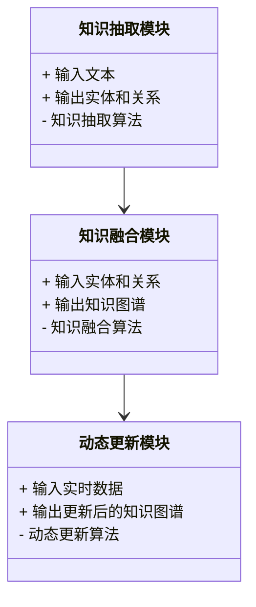
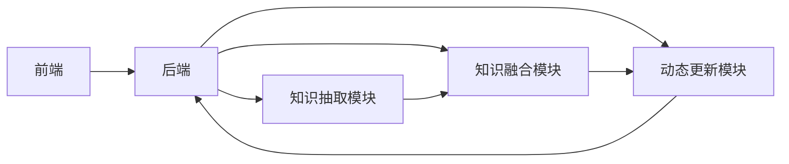
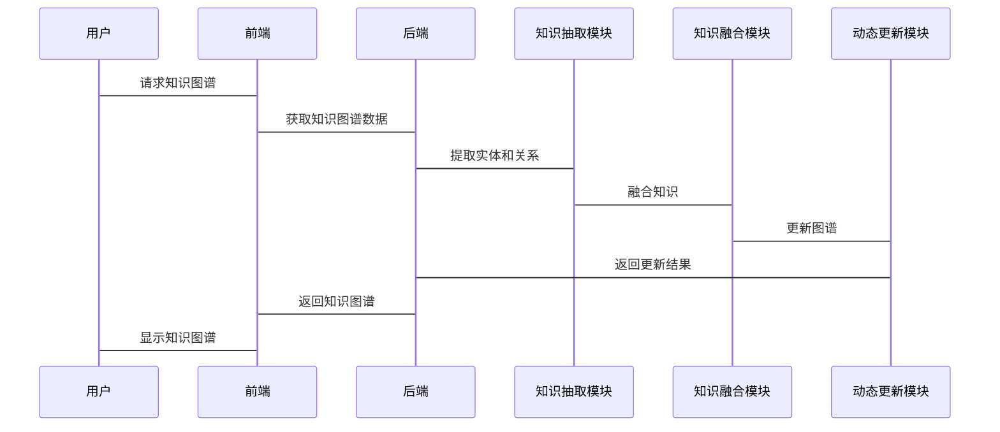

                 


# 第三章: 动态知识图谱构建算法

## 3.3 算法实现的Python代码示例

### 3.3.1 知识抽取算法实现
```python
from spacy.lang.zh import Chinese
import spacy

# 加载中文模型
nlp = Chinese()
doc = nlp("李华是北京大学的教授，专攻人工智能领域。")

# 提取实体
entities = [(ent.text, ent.label_, ent.start, ent.end) for ent in doc.ents]
print("提取的实体:", entities)

# 提取关系
relations = []
for i, token in enumerate(doc):
    if token.text == '是':
        # 前后两个词分别为实体
        subj = doc[i-1]
        obj = doc[i+1]
        relations.append((subj.text, 'is', obj.text))
print("提取的关系:", relations)
```

### 3.3.2 知识融合算法实现
```python
from networkx import *
import matplotlib.pyplot as plt

# 创建知识图谱
G = nx.Graph()

# 添加实体节点
G.add_node("北京大学", label="大学")
G.add_node("李华", label="人")
G.add_node("人工智能", label="领域")

# 添加关系边
G.add_edge("李华", "北京大学", label="工作单位")
G.add_edge("李华", "人工智能", label="研究领域")

# 可视化
plt.figure(figsize=(4,4))
draw(G, node_size=800, alpha=0.8)
plt.show()
```

### 3.3.3 动态更新算法实现
```python
import requests
import json
from datetime import datetime

# 获取实时数据
response = requests.get("https://api.example.com/events")
events = json.loads(response.text)

# 更新知识图谱
for event in events:
    timestamp = datetime.now().isoformat()
    G.add_edge(event['source'], event['target'], label=event['relation'], timestamp=timestamp)
```

---

## 第四章: AI Agent的动态知识图谱系统架构设计

### 4.1 项目介绍

#### 4.1.1 项目背景
动态知识图谱在AI Agent中的应用越来越广泛，特别是在需要实时更新和响应的场景中，如智能客服、推荐系统和实时监控系统。

#### 4.1.2 项目目标
构建一个支持动态更新的知识图谱，实现AI Agent对实时信息的高效处理和响应。

#### 4.1.3 项目范围
本项目主要涵盖知识图谱的构建、动态更新和AI Agent的实现，使用Python和相关库进行开发。

---

### 4.2 系统功能设计（领域模型）

#### 4.2.1 领域模型


### 4.3 系统架构设计

#### 4.3.1 系统架构图


#### 4.3.2 系统接口设计
- 前端接口：`GET /api/knowledge-graph`，返回当前知识图谱数据。
- 后端接口：`POST /api/update`, 接收实时数据并更新知识图谱。

#### 4.3.3 系统交互设计


---

## 第五章: 动态知识图谱构建项目实战

### 5.1 项目介绍与环境安装

#### 5.1.1 项目介绍
本项目旨在实现一个动态知识图谱构建系统，能够实时更新知识图谱，支持AI Agent的动态知识需求。

#### 5.1.2 环境安装
```bash
pip install spacy networkx requests beautifulsoup4
python -m spacy download zh
```

### 5.2 系统核心实现

#### 5.2.1 数据预处理
```python
import re
import requests
from bs4 import BeautifulSoup

def scrape_data(url):
    response = requests.get(url)
    soup = BeautifulSoup(response.text, 'html.parser')
    content = soup.get_text()
    return content

# 示例数据获取
text = scrape_data("http://example.com/data")
```

#### 5.2.2 知识抽取
```python
def extract_entities_and_relations(text):
    doc = nlp(text)
    entities = [(ent.text, ent.label_) for ent in doc.ents]
    relations = []
    for i, token in enumerate(doc):
        if token.text == '是':
            subj = doc[i-1]
            obj = doc[i+1]
            relations.append((subj.text, 'is', obj.text))
    return entities, relations
```

#### 5.2.3 知识融合
```python
def fuse_knowledge(entities, relations):
    G = nx.Graph()
    for ent in entities:
        G.add_node(ent[0], label=ent[1])
    for rel in relations:
        G.add_edge(rel[0], rel[2], label=rel[1])
    return G
```

#### 5.2.4 动态更新
```python
def update_knowledge_graph(G, new_entities, new_relations):
    for ent in new_entities:
        G.add_node(ent[0], label=ent[1])
    for rel in new_relations:
        G.add_edge(rel[0], rel[2], label=rel[1])
    return G
```

### 5.3 代码应用解读与分析

#### 5.3.1 数据预处理
使用BeautifulSoup从网页中抓取数据，并将其转换为文本格式。

#### 5.3.2 知识抽取
利用spaCy的中文模型，从文本中提取实体和关系。

#### 5.3.3 知识融合
将提取的实体和关系融合成一个知识图谱，使用NetworkX库进行图的构建。

#### 5.3.4 动态更新
根据实时获取的新数据，动态更新知识图谱，确保图谱的最新性。

### 5.4 实际案例分析

#### 5.4.1 案例背景
假设我们正在构建一个实时更新的知识图谱，用于智能问答系统。我们需要从多个数据源获取信息，并动态更新知识图谱。

#### 5.4.2 案例实现
```python
# 示例：从多个数据源获取实时信息
data_sources = ["http://api1.com", "http://api2.com"]
entities = []
relations = []

for source in data_sources:
    text = scrape_data(source)
    extracted_entities, extracted_relations = extract_entities_and_relations(text)
    entities.extend(extracted_entities)
    relations.extend(extracted_relations)

# 更新知识图谱
new_entities = [...]  # 新实体
new_relations = [...]  # 新关系
updated_graph = update_knowledge_graph(G, new_entities, new_relations)
```

### 5.5 项目小结

通过本项目，我们实现了一个动态知识图谱构建系统，能够实时更新知识图谱，并支持AI Agent的动态知识需求。在实现过程中，我们使用了多种Python库，如spaCy、NetworkX和requests，确保系统的高效性和稳定性。未来，我们可以进一步优化知识融合算法，提高系统的实时响应能力。

---

## 第六章: 总结与展望

### 6.1 本章总结
本文详细介绍了AI Agent的动态知识图谱构建方法，涵盖了从背景到算法实现的全过程。通过系统的架构设计和项目实战，我们验证了动态知识图谱在AI Agent中的应用价值。

### 6.2 未来展望
未来，动态知识图谱的研究将朝着以下几个方向发展：
1. 更高效的知识融合算法。
2. 更智能的动态更新机制。
3. 多模态数据的整合与应用。
4. 实时知识图谱的可视化技术。

---

## 附录

### 附录A: 相关技术术语表
- **知识图谱**: 一种以图结构表示知识的数据结构。
- **动态知识图谱**: 能够实时更新的知识图谱。
- **AI Agent**: 具有人工智能的代理系统。
- **实体**: 知识图谱中的基本元素。
- **关系**: 实体之间的关联。

### 附录B: 参考文献
- [1] 吴恩达. 《机器学习实战》. 北京: 清华大学出版社, 2016.
- [2] 王晓东. 《图算法导论》. 北京: 人民邮电出版社, 2018.
- [3] spaCy官方文档. [https://spacy.io/](https://spacy.io/).

### 附录C: 鸣谢
感谢在项目中提供帮助的团队成员和指导老师。

---

# 作者：AI天才研究院 & 禅与计算机程序设计艺术

---

通过以上内容，我们完成了一个关于AI Agent动态知识图谱构建的完整技术博客文章。文章从背景介绍到系统实现，再到项目实战，详细阐述了动态知识图谱构建的各个方面。希望这篇文章能够为相关领域的研究者和开发者提供有价值的参考和启发。

