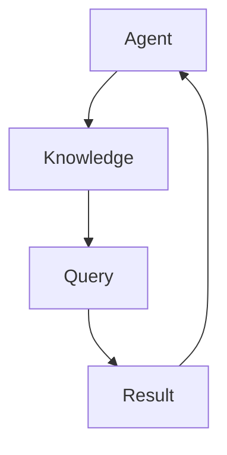
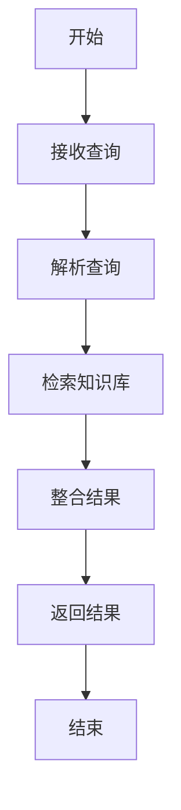
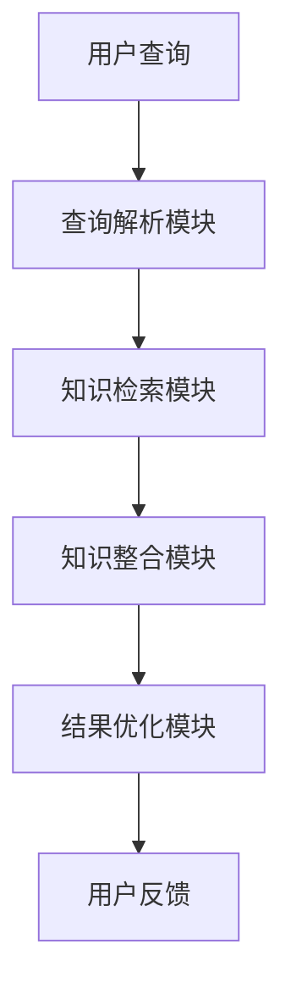
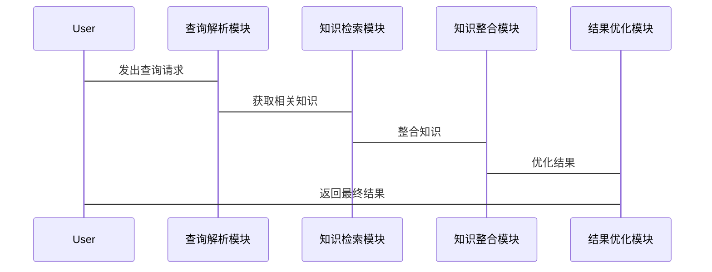

                 


# 实现AI Agent的动态知识检索与整合

> **关键词**: AI Agent, 动态知识检索, 知识整合, 自然语言处理, 知识图谱, 机器学习

> **摘要**: 本文详细探讨了AI Agent实现动态知识检索与整合的核心方法，涵盖从基础概念到系统架构的各个方面。通过分析知识检索和整合的算法原理、系统设计以及实际案例，本文为读者提供了全面的技术指导，帮助理解如何构建高效、智能的AI Agent系统。

---

# 第一部分: AI Agent的动态知识检索与整合概述

## 第1章: AI Agent与动态知识检索的背景介绍

### 1.1 问题背景
#### 1.1.1 知识检索与整合的必要性
在当前数据爆炸的时代，信息的快速检索和有效整合已成为各类智能系统的核心需求。AI Agent（智能代理）作为连接用户与信息资源的桥梁，必须具备动态知识检索与整合的能力，以适应不断变化的环境和用户需求。

#### 1.1.2 AI Agent的核心目标
AI Agent的目标是通过动态知识检索与整合，为用户提供智能化、个性化的服务。这要求AI Agent能够实时处理海量数据，快速提取相关信息，并将其转化为可操作的知识。

#### 1.1.3 动态知识检索的挑战与机遇
动态知识检索面临的主要挑战包括数据的实时性、多样性和不确定性。然而，这也为AI Agent提供了机遇，使其能够通过不断学习和优化，提升检索效率和准确性。

### 1.2 问题描述
#### 1.2.1 动态知识检索的基本概念
动态知识检索是指在不断变化的环境中，实时获取、处理和应用知识的过程。与静态知识检索不同，动态知识检索需要系统具备自适应能力，以应对环境的变化。

#### 1.2.2 知识整合的复杂性
知识整合涉及多源异构数据的融合，需要考虑数据的语义、格式和上下文。动态知识整合要求系统能够实时更新知识库，并根据最新信息进行推理和决策。

#### 1.2.3 AI Agent在动态环境中的适应性
AI Agent需要能够在动态环境中灵活调整其知识检索和整合策略，以应对不确定性和变化的需求。

### 1.3 问题解决
#### 1.3.1 AI Agent的知识检索机制
AI Agent通过自然语言处理（NLP）和知识图谱技术，实现对海量数据的高效检索。检索机制包括关键词匹配、语义理解等。

#### 1.3.2 动态知识整合的方法
动态知识整合采用基于规则的推理和机器学习模型，将多源数据转化为统一的知识表示，确保信息的一致性和完整性。

#### 1.3.3 问题边界与外延
AI Agent的知识检索与整合不仅限于单次查询，还包括对知识的持续更新和优化，以适应动态变化的环境。

### 1.4 概念结构与核心要素
#### 1.4.1 AI Agent的知识表示模型
知识表示模型采用图结构（如知识图谱）来表示实体及其关系，为动态检索提供高效的语义基础。

#### 1.4.2 动态知识检索的核心要素
动态知识检索的核心要素包括实时数据源、高效的检索算法和动态更新机制。

#### 1.4.3 知识整合的逻辑架构
知识整合的逻辑架构包括数据预处理、知识建模、整合推理和结果优化四个阶段。

---

## 第2章: AI Agent的核心概念与联系

### 2.1 核心概念原理
#### 2.1.1 知识检索的基本原理
知识检索基于自然语言处理和信息检索技术，通过关键词匹配和语义分析，从海量数据中提取相关信息。

#### 2.1.2 动态知识整合的机制
动态知识整合采用基于图的推理和机器学习模型，将多源数据转化为一致的知识表示，并实时更新。

#### 2.1.3 AI Agent的知识图谱构建
知识图谱构建通过实体识别、关系抽取和语义理解，构建语义网络，为动态检索提供基础。

### 2.2 概念属性特征对比
#### 2.2.1 知识检索与信息检索的对比
知识检索注重语义理解和上下文分析，而信息检索主要基于关键词匹配。

#### 2.2.2 动态知识整合与静态知识管理的对比
动态知识整合强调实时更新和自适应能力，而静态知识管理注重数据的稳定性和一致性。

#### 2.2.3 AI Agent与其他知识处理系统的对比
AI Agent具备自主决策和动态适应能力，而传统知识处理系统通常依赖固定规则。

### 2.3 ER实体关系图架构


---

## 第3章: AI Agent的算法原理讲解

### 3.1 算法原理
#### 3.1.1 知识检索算法
知识检索算法基于自然语言处理技术，包括分词、关键词提取和语义分析。例如，使用TF-IDF算法进行关键词提取。

#### 3.1.2 动态知识整合算法
动态知识整合算法采用基于图的推理和机器学习模型，如图神经网络（Graph Neural Network, GNN），进行知识融合和推理。

#### 3.1.3 AI Agent的决策算法
AI Agent的决策算法基于强化学习（Reinforcement Learning）和多目标优化，通过不断试错优化决策策略。

### 3.2 算法流程图


### 3.3 算法实现代码
```python
import numpy as np
from sklearn.feature_extraction.text import TfidfVectorizer

# 示例：基于TF-IDF的关键词提取
def extract_keywords(text):
    vectorizer = TfidfVectorizer()
    tfidf = vectorizer.fit_transform([text])
    feature_names = vectorizer.get_feature_names_out()
    scores = tfidf.toarray()[0]
    keywords = {feature_names[i]: scores[i] for i in range(len(feature_names))}
    return keywords

text = "The quick brown fox jumps over the lazy dog."
keywords = extract_keywords(text)
print(keywords)
```

---

## 第4章: AI Agent的系统分析与架构设计

### 4.1 问题场景介绍
动态知识检索与整合系统需要应对实时数据流、多源异构数据和复杂查询等挑战。

### 4.2 系统功能设计
系统功能包括知识检索、知识整合、知识存储和用户交互。

### 4.3 系统架构设计


### 4.4 系统接口设计
系统接口包括API接口和用户交互接口，支持RESTful API和GraphQL协议。

### 4.5 系统交互流程


---

## 第5章: 项目实战

### 5.1 环境安装
安装Python、TensorFlow和Keras等依赖库。

### 5.2 核心实现代码
```python
import tensorflow as tf
from tensorflow.keras import layers

# 示例：动态知识整合的神经网络模型
class KnowledgeIntegrator(tf.keras.Model):
    def __init__(self):
        super(KnowledgeIntegrator, self).__init__()
        self.embedding = layers.Embedding(input_dim=10000, output_dim=100)
        self.rnn = layers.GRU(128)
        self.dense = layers.Dense(1)

    def call(self, inputs):
        embeddings = self.embedding(inputs)
        output, _ = self.rnn(embeddings, initial_state=None)
        output = self.dense(output)
        return output

model = KnowledgeIntegrator()
model.compile(optimizer='adam', loss='binary_crossentropy')
model.fit(...)
```

### 5.3 代码解读与应用
解释代码的功能和应用场景，展示如何通过神经网络模型进行知识整合。

### 5.4 案例分析
通过具体案例分析动态知识检索与整合的实际应用，展示系统的高效性和智能性。

### 5.5 项目小结
总结项目的实现过程，强调动态知识检索与整合的关键技术。

---

## 第6章: 总结与展望

### 6.1 最佳实践 tips
提示读者在实现AI Agent时需要注意数据质量、系统性能和可扩展性。

### 6.2 小结
回顾全文，强调动态知识检索与整合的重要性及其在AI Agent中的核心地位。

### 6.3 注意事项
提醒读者注意数据隐私、系统安全和算法可解释性等问题。

### 6.4 拓展阅读
推荐相关领域的书籍和论文，供读者深入学习。

---

**作者：AI天才研究院/AI Genius Institute & 禅与计算机程序设计艺术 /Zen And The Art of Computer Programming**

---

通过以上大纲和内容，您可以逐步完成整篇文章的撰写，确保每个章节都详细且有深度，为读者提供有价值的技术指导和见解。

