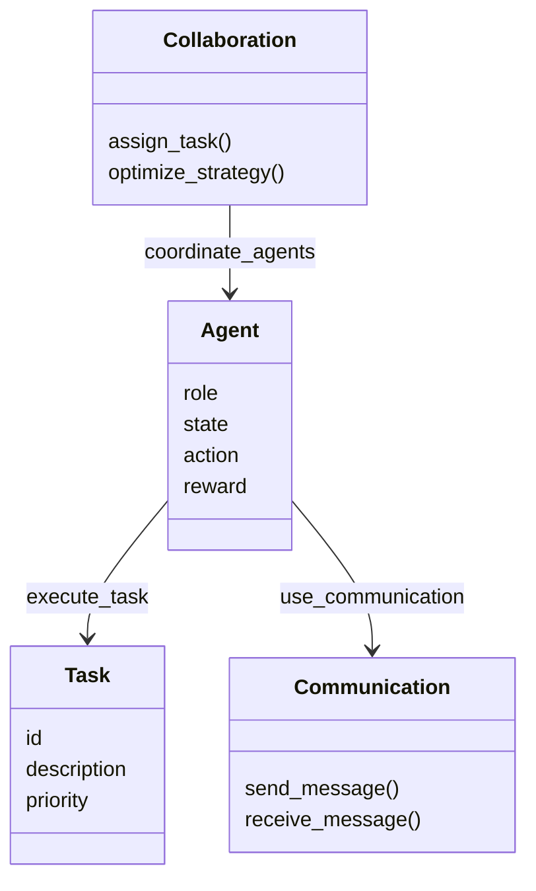
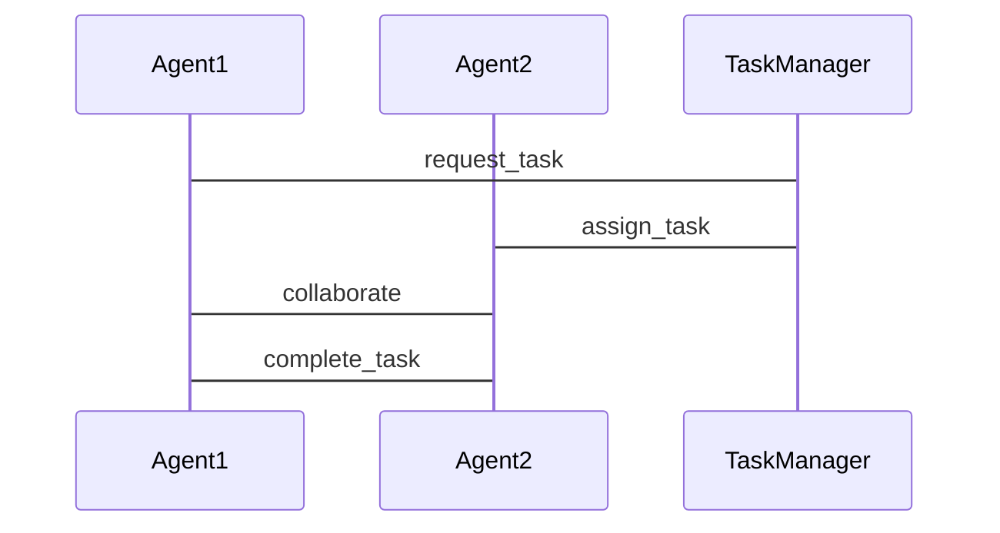

                 


# 实现AI Agent的多Agent协作能力

## 关键词：AI Agent, 多Agent协作, 通信协议, 任务分配, 机器学习

## 摘要：  
随着人工智能技术的快速发展，AI Agent（智能体）在各个领域的应用越来越广泛。然而，单个AI Agent的能力是有限的，为了更好地解决复杂问题，多Agent协作变得至关重要。本文将详细探讨如何实现AI Agent的多Agent协作能力，包括核心概念、算法原理、数学模型、系统架构设计以及实际项目案例。通过本文，读者可以全面理解多Agent协作的原理和实现方法，并掌握实际应用中的关键技巧。

---

## 第一部分: 多Agent协作能力的背景与基础

### 第1章: 多Agent系统概述

#### 1.1 多Agent系统的基本概念

- **1.1.1 什么是AI Agent**
  - AI Agent是指具有感知环境、自主决策和执行任务能力的智能实体。
  - AI Agent可以是软件程序、机器人或其他智能设备。

- **1.1.2 多Agent系统的定义与特点**
  - 多Agent系统是由多个相互协作或竞争的智能体组成的系统。
  - 多Agent系统的特征：分布式、协作性、自主性、反应性。

- **1.1.3 多Agent协作的重要性**
  - 单个AI Agent的能力有限，通过协作可以完成复杂任务。
  - 多Agent协作能够提高系统的整体效率和灵活性。

#### 1.2 多Agent协作的背景与问题背景

- **1.2.1 当前AI Agent的发展现状**
  - AI Agent技术在各个领域（如自动驾驶、智能家居、机器人协作）得到广泛应用。
  - 随着技术进步，AI Agent的智能化和协作能力不断提升。

- **1.2.2 多Agent协作的必要性**
  - 单一AI Agent难以应对复杂多变的环境。
  - 多Agent协作能够通过分工合作提高任务完成效率。

- **1.2.3 多Agent协作的应用场景**
  - 智能交通系统：多辆自动驾驶汽车协作完成交通调度。
  - 智能制造：多个机器人协作完成生产任务。
  - 联合推荐系统：多个推荐算法协作提供更精准的推荐结果。

#### 1.3 本章小结

- 本章介绍了多Agent系统的基本概念和多Agent协作的重要性，为后续内容打下基础。

---

## 第二部分: 多Agent协作的核心概念与联系

### 第2章: 多Agent协作的核心概念

#### 2.1 多Agent协作的基本原理

- **2.1.1 多Agent协作的定义**
  - 多Agent协作是指多个智能体通过通信和协调，共同完成任务的过程。

- **2.1.2 多Agent协作的核心要素**
  - 通信：智能体之间通过某种协议进行信息交换。
  - 协调：智能体根据共享信息做出决策。
  - 任务分配：根据环境动态调整任务分工。

- **2.1.3 多Agent协作的实现方式**
  - 基于规则的协作：通过预定义规则进行协作。
  - 基于规划的协作：通过动态规划进行协作。
  - 基于学习的协作：通过机器学习模型实现协作。

#### 2.2 多Agent协作的通信协议

- **2.2.1 通信协议的定义**
  - 通信协议是智能体之间进行信息交换的规则和格式。

- **2.2.2 常见的通信协议类型**
  - 基于消息的通信：智能体通过发送消息进行信息交换。
  - 基于订阅-发布模型的通信：智能体通过订阅主题接收信息。

- **2.2.3 通信协议的选择与设计**
  - 根据任务需求选择合适的通信协议。
  - 设计通信协议时需要考虑安全性、实时性和可靠性。

#### 2.3 多Agent协作的任务分配机制

- **2.3.1 任务分配的基本概念**
  - 任务分配是将任务分解为多个子任务，并分配给不同的智能体。

- **2.3.2 常见的任务分配算法**
  - 基于角色的分配：根据智能体的擅长领域分配任务。
  - 基于优先级的分配：根据任务的优先级分配任务。

- **2.3.3 任务分配的优缺点对比**
  - 基于角色的分配优点：任务分配合理，缺点：灵活性差。
  - 基于优先级的分配优点：灵活性高，缺点：可能优先级冲突。

#### 2.4 本章小结

- 本章详细介绍了多Agent协作的核心概念，包括通信协议和任务分配机制，为后续的算法实现奠定了基础。

---

## 第三部分: 多Agent协作的算法原理

### 第3章: 多Agent协作算法概述

#### 3.1 基于规则的协作算法

- **3.1.1 基于规则的协作算法的定义**
  - 基于规则的协作算法通过预定义的规则进行协作。

- **3.1.2 基于规则的协作算法的实现**
  - 示例：多个AI Agent通过预定义规则完成任务分配。

```python
def rule_based_collaboration(agent_role, task):
    if agent_role == 'navigator':
        return 'navigate_task'
    elif agent_role == 'tracker':
        return 'track_task'
```

- **3.1.3 基于规则的协作算法的优缺点**
  - 优点：实现简单，可解释性强。
  - 缺点：灵活性差，难以应对复杂动态环境。

#### 3.2 基于规划的协作算法

- **3.2.1 基于规划的协作算法的定义**
  - 基于规划的协作算法通过动态规划进行任务分配。

- **3.2.2 基于规划的协作算法的实现**
  - 示例：使用动态规划算法分配任务。

```python
def dynamic_planning_collaboration(tasks, agents):
    # 计算每个任务的最优分配方案
    for task in tasks:
        assign_task_to_agent(task, agents)
```

- **3.2.3 基于规划的协作算法的优缺点**
  - 优点：灵活性高，能够应对复杂任务。
  - 缺点：计算复杂度高，实现难度大。

#### 3.3 基于机器学习的协作算法

- **3.3.1 基于机器学习的协作算法的定义**
  - 基于机器学习的协作算法通过训练模型实现协作。

- **3.3.2 基于机器学习的协作算法的实现**
  - 示例：使用强化学习训练多Agent协作模型。

```python
def multi_agent_reinforcement_learning():
    # 初始化多个智能体
    agents = [Agent() for _ in range(n_agents)]
    # 训练过程
    for episode in episodes:
        for agent in agents:
            agent.train()
```

- **3.3.3 基于机器学习的协作算法的优缺点**
  - 优点：能够自适应复杂环境，协作能力强。
  - 缺点：实现复杂，需要大量数据和计算资源。

#### 3.4 本章小结

- 本章介绍了三种主要的多Agent协作算法：基于规则、基于规划和基于机器学习的协作算法，并分析了它们的优缺点。

---

## 第四部分: 多Agent协作的数学模型与公式

### 第4章: 多Agent协作的数学模型

#### 4.1 多Agent协作的基本模型

- **4.1.1 多Agent协作的状态空间**
  - 状态空间：所有可能的状态集合。
  - 示例：在多智能体协作中，每个智能体的状态包括位置、任务进度等。

- **4.1.2 多Agent协作的动作空间**
  - 动作空间：所有可能的动作集合。
  - 示例：每个智能体可以执行的任务动作。

- **4.1.3 多Agent协作的奖励函数**
  - 奖励函数：定义智能体在协作过程中的奖励机制。
  - 示例：当任务完成时，智能体获得正向奖励。

  $$ R(s, a) = \begin{cases}
  1 & \text{if任务完成} \\
  0 & \text{否则}
  \end{cases} $$

- **4.1.4 多Agent协作的目标函数**
  - 目标函数：定义协作的优化目标。
  - 示例：最大化整体奖励。

  $$ \text{目标函数} = \max_{a_1, a_2, ..., a_n} \sum_{i=1}^{n} R(s_i, a_i) $$

#### 4.2 基于强化学习的多Agent协作模型

- **4.2.1 多Agent协作的策略网络**
  - 策略网络：定义智能体的决策策略。
  - 示例：使用深度神经网络作为策略网络。

  $$ \pi(a|s) = \text{softmax}(W s + b) $$

- **4.2.2 多Agent协作的价值函数**
  - 价值函数：评估当前状态的值。
  - 示例：使用Q-learning算法进行价值评估。

  $$ Q(s, a) = Q(s, a) + \alpha (r + \gamma \max Q(s', a') - Q(s, a)) $$

- **4.2.3 多Agent协作的联合优化**
  - 联合优化：多个智能体协同优化。
  - 示例：使用纳什均衡进行策略优化。

  $$ \text{纳什均衡} = \{a_i^*\} \text{ 满足} a_i^* = \arg\max_{a_i} \sum_{j} Q(s_j, a_j) $$

#### 4.3 本章小结

- 本章通过数学模型和公式详细解释了多Agent协作的实现机制，包括状态空间、动作空间、奖励函数和价值函数等。

---

## 第五部分: 系统分析与架构设计

### 第5章: 多Agent协作系统的分析与设计

#### 5.1 问题场景分析

- **5.1.1 问题背景**
  - 现实中的多Agent协作场景：如自动驾驶、智能制造等。

- **5.1.2 系统目标**
  - 实现多个AI Agent的协作，完成复杂任务。

- **5.1.3 功能需求**
  - 通信与信息共享
  - 任务分配与协调
  - 协作策略优化

#### 5.2 系统功能设计

- **5.2.1 系统功能模块**
  - 通信模块：负责智能体之间的信息交换。
  - 任务分配模块：负责任务的分解和分配。
  - 协作控制模块：负责协作策略的制定和优化。

- **5.2.2 领域模型图**



#### 5.3 系统架构设计

- **5.3.1 系统架构类型**
  - 分层架构：将系统分为感知层、决策层和执行层。
  - 分布式架构：多个智能体分布式协作。

- **5.3.2 系统架构图**


#### 5.4 系统接口设计

- **5.4.1 接口定义**
  - 通信接口：`send(message)` 和 `receive(message)`
  - 任务分配接口：`assign_task(agent, task)` 和 `complete_task(agent, task)`

- **5.4.2 接口交互序列图**



#### 5.5 本章小结

- 本章详细分析了多Agent协作系统的架构设计和功能模块，为实际项目提供了理论支持。

---

## 第六部分: 项目实战

### 第6章: 多Agent协作项目实战

#### 6.1 环境安装与配置

- **6.1.1 环境要求**
  - Python 3.8+
  - 安装必要的库：如`numpy`, `tensorflow`, `scikit-learn`

- **6.1.2 安装步骤**

```bash
pip install numpy tensorflow scikit-learn
```

#### 6.2 系统核心功能实现

- **6.2.1 通信模块实现**

```python
class Communication:
    def __init__(self):
        self.agents = []

    def send_message(self, sender, message):
        for agent in self.agents:
            if agent.id != sender.id:
                agent.receive_message(message)

    def receive_message(self, message):
        pass
```

- **6.2.2 任务分配模块实现**

```python
class TaskAllocator:
    def __init__(self):
        self.tasks = []
        self.agents = []

    def assign_task(self, task, agent):
        agent.current_task = task
        self.tasks.remove(task)
```

- **6.2.3 协作控制模块实现**

```python
class CollaborationController:
    def __init__(self):
        self.agents = []
        self.strategy = 'rule-based'

    def coordinate_agents(self):
        if self.strategy == 'rule-based':
            for agent in self.agents:
                agent.execute_task()
        elif self.strategy == 'learning-based':
            # 使用强化学习策略
            pass
```

#### 6.3 实际案例分析与实现

- **6.3.1 案例背景**
  - 实现一个多Agent协作的智能推荐系统。

- **6.3.2 系统实现**

```python
class Agent:
    def __init__(self, id, role):
        self.id = id
        self.role = role
        self.current_task = None

    def execute_task(self):
        if self.current_task:
            print(f"Agent {self.id}完成任务{self.current_task}")
            self.current_task = None

class RecommenderSystem:
    def __init__(self, agents):
        self.agents = agents
        self.communication = Communication()

    def start_collaboration(self):
        # 分配任务
        for agent in self.agents:
            agent.current_task = "推荐用户A"
        # 开始协作
        for agent in self.agents:
            agent.execute_task()
```

#### 6.4 项目小结

- 本章通过实际项目案例，详细展示了多Agent协作系统的实现过程，包括环境配置、功能实现和案例分析。

---

## 第七部分: 最佳实践与总结

### 第7章: 最佳实践与总结

#### 7.1 最佳实践

- **7.1.1 系统设计建议**
  - 明确任务需求，合理设计系统架构。
  - 选择合适的通信协议和任务分配算法。

- **7.1.2 实现建议**
  - 使用模块化设计，便于维护和扩展。
  - 选择合适的开发框架和库，提高开发效率。

#### 7.2 小结

- 本文详细探讨了多Agent协作的能力实现，从核心概念到算法原理，再到系统设计和项目实战，为读者提供了全面的指导。

#### 7.3 注意事项

- 在实际应用中，需要考虑系统的实时性、安全性和可扩展性。
- 多Agent协作系统的实现需要团队协作，建议分工明确，各司其职。

#### 7.4 拓展阅读

- 推荐阅读《Multi-Agent Systems: Algorithm and Applications》
- 参考GitHub上的多Agent协作项目，学习实际实现方法。

---

## 作者：AI天才研究院/AI Genius Institute & 禅与计算机程序设计艺术 /Zen And The Art of Computer Programming

---

以上是《实现AI Agent的多Agent协作能力》的完整目录大纲和内容概要，文章详细讲解了多Agent协作的核心概念、算法原理、数学模型、系统架构设计以及实际项目案例，为读者提供了全面的指导。

