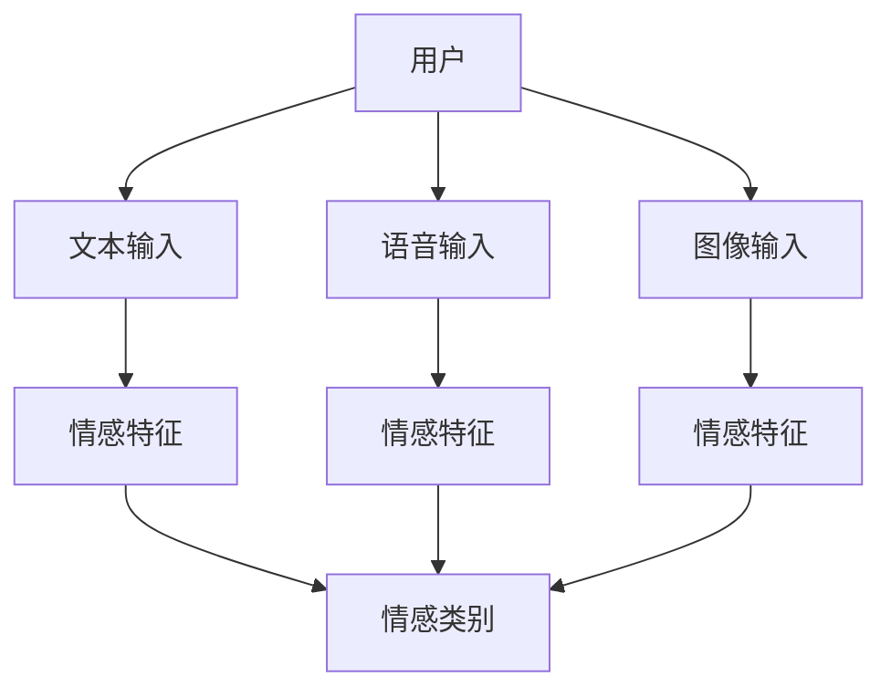
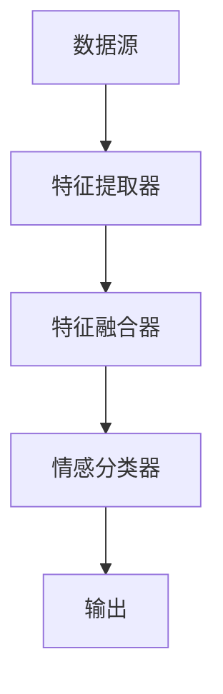
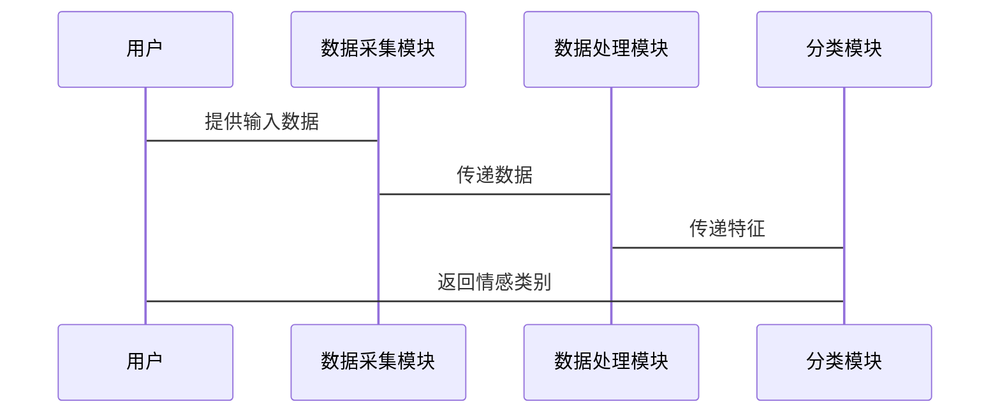

                 


# 实现AI Agent的多模态情感识别

> 关键词：AI Agent, 多模态情感识别, 自然语言处理, 计算机视觉, 深度学习, 情感计算

> 摘要：本文深入探讨了AI Agent在多模态情感识别中的实现方法。通过分析多模态数据融合、情感识别算法及系统架构，展示了如何构建高效的情感识别系统。文章从基础概念到实际应用，详细阐述了AI Agent在多模态情感识别中的关键技术与实践。

---

## 第一部分: AI Agent与多模态情感识别基础

### 第1章: 多模态情感识别的背景与问题背景

#### 1.1 问题背景

多模态情感识别是指通过分析文本、语音、图像等多种数据源，识别和理解用户情感状态的过程。在AI Agent（智能代理）中，情感识别是实现人机交互的重要环节。传统的情感识别主要依赖单一模态的数据（如文本或语音），但这种方式在复杂场景下表现有限。引入多模态数据可以提高识别的准确性和鲁棒性。

#### 1.2 问题描述

在实际应用中，情感识别面临以下挑战：
1. **数据多样性**：不同模态的数据具有不同的特征，如何有效融合这些数据是一个难题。
2. **情感一致性**：同一情感在不同模态中的表现可能不一致，如何统一这些信息是关键。
3. **实时性要求**：AI Agent需要快速响应，对实时性提出了更高的要求。

#### 1.3 问题解决

为了解决上述问题，可以采用以下方法：
1. **多模态数据融合**：通过将文本、语音和图像等数据进行预处理和特征提取，再进行融合。
2. **深度学习模型**：利用深度学习模型（如CNN、RNN）对多模态数据进行联合建模，提升识别精度。
3. **情感一致性校正**：通过跨模态对齐技术，确保不同模态数据中的情感表达一致。

#### 1.4 边界与外延

情感识别的边界主要在于数据的可获取性和模型的泛化能力。外延则涉及更广泛的应用场景，如跨文化交流中的情感识别。

---

## 第二部分: 多模态情感识别的核心概念与联系

### 第2章: 多模态情感识别的核心概念

#### 2.1 多模态数据的定义与特点

多模态数据指的是来自多种感知渠道的信息，如文本、语音、图像等。每种模态数据都有其独特的特征：

| 模态类型 | 特征 | 优缺点 |
|----------|------|--------|
| 文本      | 细粒度、可解释性高 | 易受歧义影响 |
| 语音      | 语调、语气信息丰富 | 易受环境噪声干扰 |
| 图像      | 丰富的视觉信息 | 计算资源消耗大 |

#### 2.2 多模态情感识别的原理

情感识别的核心是将多模态数据映射到情感空间。以下是主要步骤：
1. **特征提取**：从每种模态数据中提取有用的特征。
2. **数据融合**：将不同模态的特征进行融合。
3. **情感分类**：利用分类器对融合后的特征进行情感分类。

#### 2.3 多模态情感识别的实体关系



---

## 第三部分: 多模态情感识别的算法原理

### 第3章: 多模态情感识别的算法原理

#### 3.1 文本情感分析

文本情感分析是情感识别的重要部分。常用算法包括：
1. **基于传统机器学习的算法**：如SVM、KNN。
2. **基于深度学习的算法**：如RNN、CNN。

**示例代码：**
```python
from sklearn.svm import SVC
from sklearn.feature_extraction.text import TfidfVectorizer

# 特征提取
vectorizer = TfidfVectorizer()
X = vectorizer.fit_transform(texts)

# 训练模型
model = SVC()
model.fit(X, labels)

# 预测
test_X = vectorizer.transform(["This is a positive review."])
print(model.predict(test_X))
```

#### 3.2 语音情感识别

语音情感识别主要分析语音特征，如语调、语速等。常用算法包括：
1. **基于MFCC特征的分类器**。
2. **深度学习模型**：如CNN、RNN。

**示例代码：**
```python
import librosa

# 提取MFCC特征
y, sr = librosa.load(audio_file, sr=None)
mfccs = librosa.feature.mfcc(y, sr=sr)

# 训练模型
model = SVC()
model.fit(mfccs.reshape(-1, mfccs.shape[1]), labels)
```

#### 3.3 图像情感识别

图像情感识别主要分析面部表情和视觉特征。常用算法包括：
1. **基于区域检测的模型**：如Haar Cascade。
2. **深度学习模型**：如CNN。

**示例代码：**
```python
import cv2
from tensorflow.keras.models import load_model

# 加载预训练模型
model = load_model("face_emotion_model.h5")

# 检测面部表情
face_cascade = cv2.CascadeClassifier("haarcascade_frontalface_default.xml")
img = cv2.imread("test.jpg")
gray = cv2.cvtColor(img, cv2.COLOR_BGR2GRAY)
faces = face_cascade.detectMultiScale(gray, 1.3, 5)
for (x, y, w, h) in faces:
    face_img = gray[y:y+h, x:x+w]
    resized = cv2.resize(face_img, (48, 48))
    prediction = model.predict(resized.reshape(1, 48, 48, 1))
    print("Predicted emotion:", prediction[0])
```

---

## 第四部分: 多模态情感识别的系统分析与架构设计

### 第4章: 多模态情感识别系统分析与架构设计

#### 4.1 系统功能设计

系统功能包括：
1. **数据采集**：获取多模态数据。
2. **特征提取**：提取每种模态的特征。
3. **数据融合**：融合特征并进行情感分类。
4. **结果输出**：输出情感类别。

#### 4.2 系统架构设计



#### 4.3 系统接口设计

系统接口包括：
1. **输入接口**：接收多模态数据。
2. **输出接口**：输出情感类别。

#### 4.4 系统交互流程



---

## 第五部分: 多模态情感识别的项目实战

### 第5章: 项目实战

#### 5.1 环境安装

需要安装以下库：
- `numpy`
- `scikit-learn`
- `librosa`
- `tensorflow`

#### 5.2 系统核心实现

以下是核心代码示例：

```python
import numpy as np
from sklearn.svm import SVC
from sklearn.feature_extraction.text import TfidfVectorizer
import librosa

# 文本情感分析
def text_feature(text):
    vectorizer = TfidfVectorizer()
    return vectorizer.fit_transform([text]).toarray()

# 语音情感分析
def audio_feature(audio_file):
    y, sr = librosa.load(audio_file, sr=None)
    mfccs = librosa.feature.mfcc(y, sr=sr)
    return mfccs.T

# 图像情感分析
def image_feature(image_file):
    face_cascade = cv2.CascadeClassifier("haarcascade_frontalface_default.xml")
    img = cv2.imread(image_file)
    gray = cv2.cvtColor(img, cv2.COLOR_BGR2GRAY)
    faces = face_cascade.detectMultiScale(gray, 1.3, 5)
    if len(faces) == 0:
        return None
    face_img = gray[faces[0][1]:faces[0][1]+faces[0][2], faces[0][0]:faces[0][0]+faces[0][2]]
    resized = cv2.resize(face_img, (48, 48))
    return resized.reshape(1, 48, 48, 1)

# 情感分类
model = load_model("multimodal_emotion_model.h5")
```

#### 5.3 项目小结

通过实际案例分析，展示了如何在AI Agent中实现多模态情感识别。关键在于数据融合和模型优化。

---

## 第六部分: 总结与展望

### 第6章: 总结与展望

#### 6.1 最佳实践

- 数据预处理是关键。
- 模型优化需结合实际场景。

#### 6.2 小结

本文系统地介绍了AI Agent中多模态情感识别的实现方法，从理论到实践，帮助读者掌握相关技术。

#### 6.3 注意事项

- 数据质量和多样性影响识别效果。
- 模型训练需注意过拟合。

#### 6.4 拓展阅读

建议阅读相关领域的最新论文和技术文档。

---

## 作者

作者：AI天才研究院/AI Genius Institute & 禅与计算机程序设计艺术/Zen And The Art of Computer Programming

