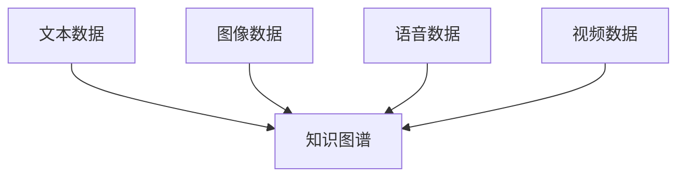
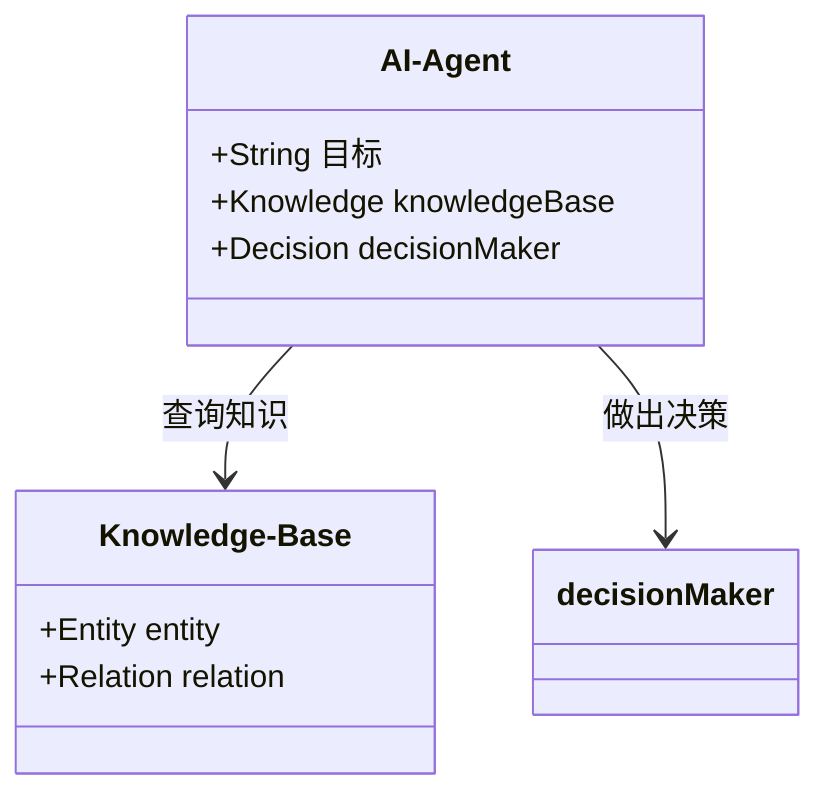
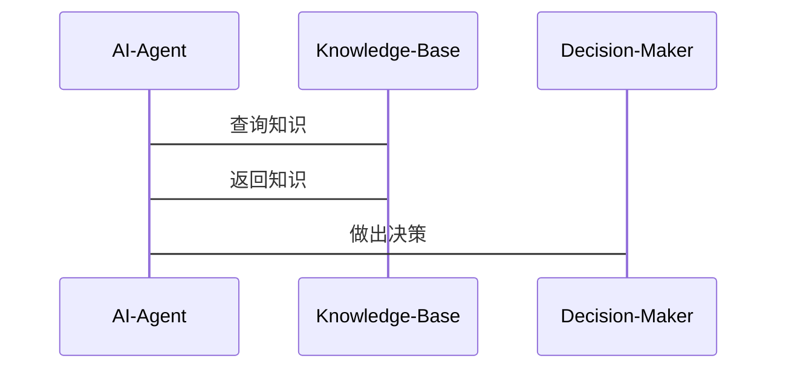

                 


# 实现AI Agent的多模态知识融合

> 关键词：AI Agent，多模态知识融合，知识图谱，深度学习，自然语言处理

> 摘要：  
本文详细探讨了实现AI Agent的多模态知识融合的核心技术和方法。通过分析多模态数据的特点，结合知识图谱的构建与表示，提出了基于深度学习的多模态融合模型。文章从理论到实践，逐步引导读者理解如何将文本、图像、语音等多种模态数据有效整合，提升AI Agent的智能决策能力。通过具体案例分析和代码实现，展示了多模态知识融合在实际应用中的潜力和价值。

---

# 第一部分: 引言

## 第1章: AI Agent与多模态知识融合概述

### 1.1 AI Agent的基本概念

#### 1.1.1 AI Agent的定义与特点
- **定义**：AI Agent（智能体）是指能够感知环境、自主决策并执行任务的智能系统。
- **特点**：
  - **自主性**：无需外部干预，自主完成任务。
  - **反应性**：能够实时感知环境并做出反应。
  - **目标导向**：基于目标进行决策和规划。
  - **学习能力**：通过学习提升自身的智能水平。

#### 1.1.2 多模态知识融合的必要性
- **背景**：AI Agent需要处理多种类型的数据，如文本、图像、语音、视频等。
- **必要性**：多模态数据能够提供更全面的信息，帮助AI Agent做出更准确的决策。
- **应用场景**：如智能客服、自动驾驶、智能助手等。

#### 1.1.3 AI Agent在现实中的应用案例
- **智能客服**：通过文本和语音交互，提供更高效的客户服务。
- **自动驾驶**：结合视觉、激光雷达等多种传感器数据，实现精准的环境感知。
- **智能助手**：如Siri、Alexa，通过多模态数据提供更智能的服务。

### 1.2 多模态知识融合的核心思想

#### 1.2.1 多模态数据的定义与分类
- **定义**：多模态数据指的是来自不同感官渠道的数据，如文本、图像、语音、视频等。
- **分类**：
  - **结构化数据**：如数据库中的表格数据。
  - **非结构化数据**：如文本、图像、语音等。

#### 1.2.2 知识融合的目标与意义
- **目标**：将不同模态的数据进行整合，提取共同语义信息，提升AI Agent的理解能力。
- **意义**：通过多模态数据的融合，AI Agent能够更全面地理解环境，做出更智能的决策。

#### 1.2.3 多模态知识融合的挑战与解决方案
- **挑战**：
  - 数据异构性：不同模态的数据格式和语义差异大。
  - 计算复杂性：多模态数据的处理需要大量的计算资源。
- **解决方案**：
  - 使用深度学习模型（如Transformer）进行跨模态对齐。
  - 结合知识图谱进行语义融合。

### 1.3 本章小结
本章介绍了AI Agent的基本概念和多模态知识融合的必要性，强调了多模态数据在提升AI Agent智能水平中的重要作用。

---

# 第二部分: 核心概念与联系

## 第2章: AI Agent的知识表示与推理

### 2.1 知识表示的基本原理

#### 2.1.1 知识图谱的构建与表示
- **知识图谱**：一种结构化的知识表示方法，由节点和边组成，节点表示实体，边表示实体之间的关系。
- **构建方法**：
  - 从文本中提取实体和关系（如基于NLP技术）。
  - 从数据库中抽取结构化数据。

#### 2.1.2 多模态数据的表示方法
- **文本表示**：使用词向量（如Word2Vec、BERT）。
- **图像表示**：使用CNN提取图像特征。
- **语音表示**：使用语音识别技术提取文本或直接提取音频特征。

#### 2.1.3 知识图谱的存储与管理
- **存储**：使用图数据库（如Neo4j）或关系型数据库。
- **管理**：通过元数据管理知识图谱的版本和更新。

#### 2.1.4 本节小结
知识图谱是多模态知识融合的重要工具，能够有效地表示和管理多模态数据。

### 2.2 知识推理的算法与模型

#### 2.2.1 基于符号逻辑的推理
- **符号逻辑**：使用逻辑规则进行推理，如命题逻辑和谓词逻辑。
- **应用**：适用于规则明确的场景，如专家系统。

#### 2.2.2 基于概率论的推理
- **贝叶斯网络**：通过概率分布进行推理，适用于不确定性较高的场景。
- **应用**：如医疗诊断、风险评估。

#### 2.2.3 神经网络中的推理机制
- **深度学习中的推理**：通过神经网络模型（如Transformer）进行语义理解。
- **注意力机制**：在多模态数据中提取关键信息，提升推理能力。

#### 2.2.4 本节小结
知识推理是多模态知识融合的核心部分，不同的推理方法适用于不同的场景。

### 2.3 多模态知识融合的实体关系图



#### 2.3.1 实体关系图的构建
- **实体识别**：从多模态数据中提取实体。
- **关系抽取**：识别实体之间的关系。
- **图谱构建**：将实体和关系整合到知识图谱中。

#### 2.3.2 本节小结
通过实体关系图，可以清晰地展示多模态数据之间的关联关系。

---

# 第三部分: 算法原理讲解

## 第3章: 多模态知识融合的算法原理

### 3.1 多模态数据的融合方法

#### 3.1.1 基于特征融合的方法
- **线性组合**：将不同模态的特征向量进行线性组合。
- **非线性组合**：使用神经网络进行非线性变换。

#### 3.1.2 基于注意力机制的融合
- **注意力机制**：通过计算不同模态的重要性，动态调整特征权重。
- **实现方法**：
  $$ \alpha_i = \text{softmax}(q^T k_i) $$

#### 3.1.3 基于图神经网络的融合
- **图神经网络**：通过图结构进行特征传播和聚合。
- **应用**：如社交网络分析、推荐系统。

### 3.2 知识融合的数学模型

#### 3.2.1 线性组合模型
$$ y = \sum_{i=1}^{n} \alpha_i x_i $$

#### 3.2.2 注意力机制模型
$$ \alpha_i = \text{softmax}(q^T k_i) $$

### 3.3 算法实现的Python代码示例

```python
import numpy as np

def multi_modal_fusion(features):
    alpha = np.random.randn(1, features.shape[1])
    output = np.dot(alpha, features)
    return output
```

---

# 第四部分: 系统分析与架构设计方案

## 第4章: 系统分析与架构设计方案

### 4.1 问题场景介绍

#### 4.1.1 系统功能设计
- **需求分析**：AI Agent需要处理多种模态数据，进行知识融合。
- **功能模块**：
  - 数据采集模块：采集多模态数据。
  - 数据处理模块：对数据进行预处理和特征提取。
  - 知识融合模块：将不同模态的特征进行融合。
  - 决策模块：基于融合后的知识进行决策。

#### 4.1.2 领域模型mermaid类图



### 4.2 系统架构设计

#### 4.2.1 系统架构mermaid架构图

```mermaid
iframe https://mermaid-js.github.io/mermaid-live-editor/#/edit/EjJpZi0xOTk3LTEyMjIyMjI2NjQ2OTc5LXJvb3RlLXJ2aXN1YWxpemVleF9jdG9y?from=github&to=gist
```

#### 4.2.2 系统接口设计
- **输入接口**：接收多模态数据。
- **输出接口**：输出决策结果。
- **知识库接口**：与知识图谱进行交互。

#### 4.2.3 系统交互mermaid序列图



### 4.3 本章小结
本章通过系统架构设计和接口设计，详细描述了AI Agent多模态知识融合系统的实现方式。

---

# 第五部分: 项目实战

## 第5章: 项目实战与案例分析

### 5.1 环境安装

#### 5.1.1 安装Python环境
- 使用Anaconda安装Python 3.8及以上版本。

#### 5.1.2 安装依赖库
- `pip install numpy`
- `pip install matplotlib`
- `pip install transformers`

### 5.2 系统核心实现源代码

#### 5.2.1 数据预处理代码

```python
import pandas as pd
import numpy as np

def preprocess_data(data):
    # 假设data是一个包含文本、图像特征的DataFrame
    processed_data = data.dropna()
    processed_data['text'] = processed_data['text'].apply(lambda x: x.lower())
    return processed_data
```

#### 5.2.2 知识融合代码

```python
import torch
import torch.nn as nn

class MultiModalFusion(nn.Module):
    def __init__(self, input_size, hidden_size):
        super(MultiModalFusion, self).__init__()
        self.fc = nn.Linear(input_size, hidden_size)
        self.dropout = nn.Dropout(0.5)
        self.relu = nn.ReLU()

    def forward(self, x):
        x = self.fc(x)
        x = self.dropout(x)
        x = self.relu(x)
        return x

model = MultiModalFusion(input_size=100, hidden_size=50)
```

#### 5.2.3 训练代码

```python
model = MultiModalFusion(input_size=100, hidden_size=50)
criterion = nn.MSELoss()
optimizer = torch.optim.Adam(model.parameters(), lr=0.001)

for epoch in range(100):
    inputs = torch.randn(100, 100)
    outputs = model(inputs)
    loss = criterion(outputs, torch.randn(100, 50))
    loss.backward()
    optimizer.step()
```

### 5.3 代码应用解读与分析

#### 5.3.1 数据预处理
- **功能**：清洗和格式化数据，确保数据的一致性和可用性。
- **实现**：使用Pandas和Numpy进行数据清洗和转换。

#### 5.3.2 知识融合
- **模型选择**：使用深度学习模型进行多模态特征融合。
- **训练过程**：通过反向传播和优化器进行模型训练。

### 5.4 实际案例分析和详细讲解剖析

#### 5.4.1 案例背景
- **应用场景**：智能客服系统。
- **数据来源**：文本、语音、用户行为数据。

#### 5.4.2 案例实现
- **需求分析**：识别用户情绪，提供个性化的服务。
- **实现步骤**：
  1. 数据预处理：清洗文本和语音数据。
  2. 知识融合：将文本、语音特征与用户行为数据进行融合。
  3. 模型训练：训练情绪识别模型。
  4. 应用测试：测试模型的准确率和召回率。

#### 5.4.3 代码实现细节
- **文本特征提取**：使用BERT模型提取文本特征。
- **语音特征提取**：使用语音识别技术提取语音特征。
- **用户行为分析**：通过聚类分析识别用户行为模式。

### 5.5 项目小结
本章通过实际案例，详细讲解了AI Agent多模态知识融合的实现过程，从数据预处理到模型训练，再到系统应用，全面展示了多模态知识融合的实际应用价值。

---

# 第六部分: 总结与展望

## 第6章: 总结与展望

### 6.1 最佳实践 tips
- **数据质量**：确保多模态数据的高质量，减少噪声。
- **模型选择**：根据具体场景选择合适的融合方法。
- **性能优化**：通过模型压缩和分布式计算优化性能。

### 6.2 小结
本文详细探讨了实现AI Agent的多模态知识融合的核心技术和方法，从理论到实践，全面展示了多模态知识融合的实现过程。

### 6.3 注意事项
- **数据隐私**：注意数据隐私保护，遵守相关法律法规。
- **计算资源**：多模态数据处理需要大量的计算资源，需做好资源规划。

### 6.4 拓展阅读
- **推荐书籍**：
  - 《Deep Learning》
  - 《Knowledge Graphs: Theory and Application》
- **推荐论文**：
  - “Attention Is All You Need”
  - “Graph Neural Networks: A Review of Methods, Applications, and Open Challenges”

### 6.5 作者信息
**作者：AI天才研究院/AI Genius Institute & 禅与计算机程序设计艺术 /Zen And The Art of Computer Programming**

---

# 附录

## 附录A: 术语表
- **AI Agent**：人工智能智能体。
- **多模态数据**：多种感官数据的集合，如文本、图像、语音等。

## 附录B: 工具与库
- **Python**：编程语言。
- **TensorFlow**：深度学习框架。
- **Neo4j**：图数据库。

---

# 结束语

通过本文的详细讲解，读者可以全面了解实现AI Agent的多模态知识融合的核心技术和方法。从理论到实践，逐步掌握了多模态知识融合的实现过程。希望本文能为相关领域的研究和应用提供有价值的参考。

---

