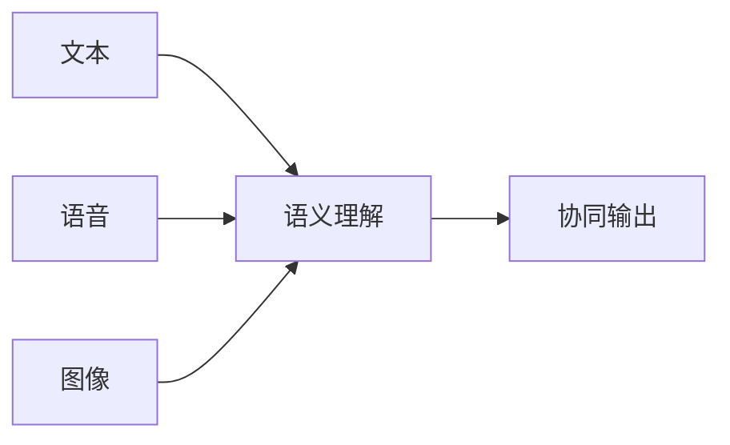
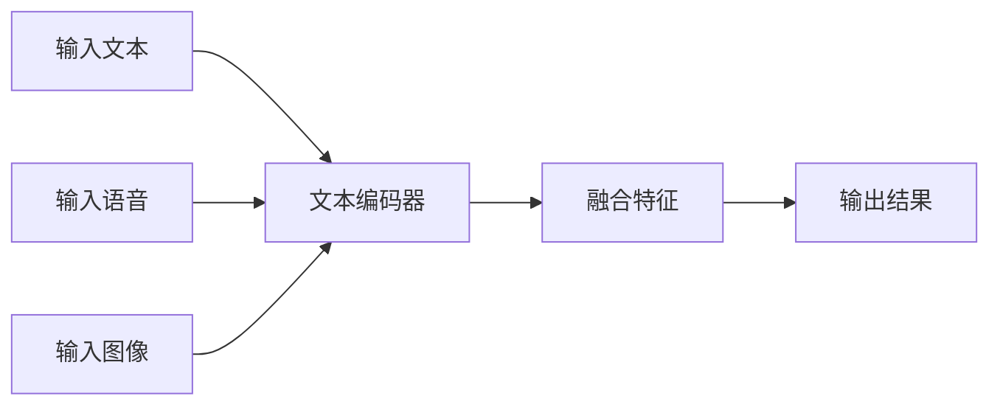
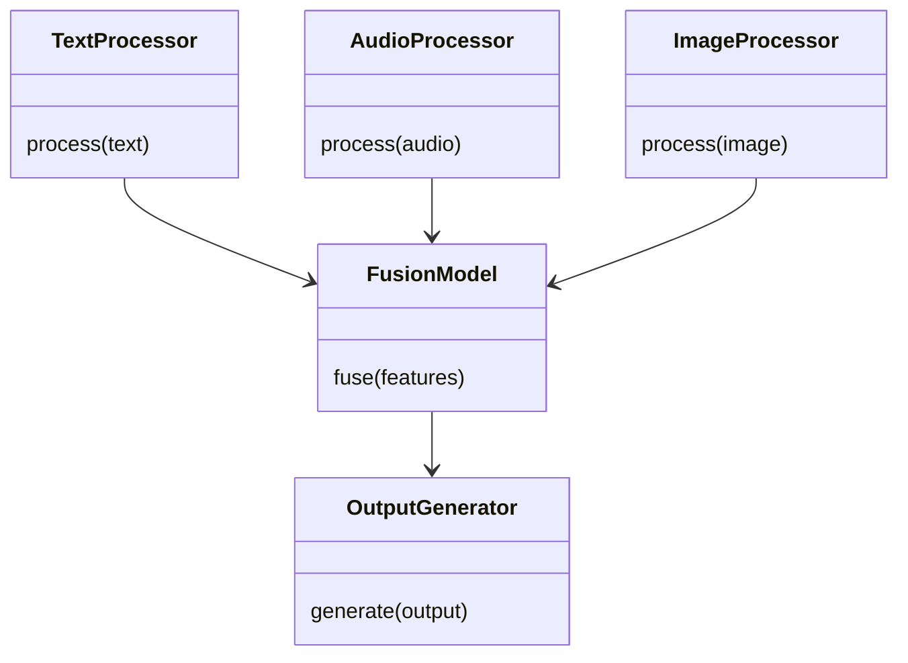
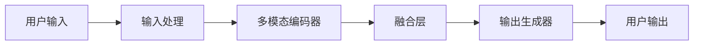
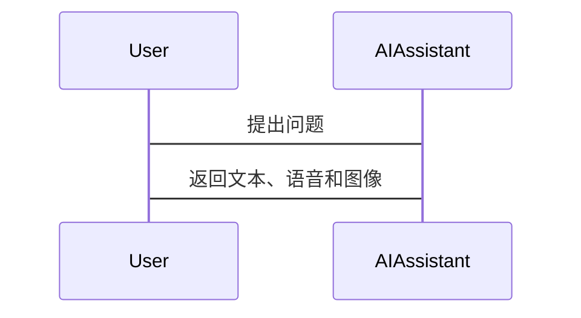

                 


# 实现AI Agent的多模态输出：文本、语音、图像协同

> 关键词：AI Agent，多模态输出，文本，语音，图像，协同交互

> 摘要：本文详细探讨了实现AI Agent多模态输出的技术与方法，涵盖文本、语音和图像的协同，从背景、核心概念、算法原理到系统架构和项目实战，提供全面的技术解析。

---

## 第一部分: 多模态AI Agent的背景与概念

### 第1章: 多模态AI Agent概述

#### 1.1 多模态AI Agent的基本概念

##### 1.1.1 多模态输出的定义

多模态输出是指AI Agent能够同时处理和生成多种类型的数据，如文本、语音和图像，以提供更丰富和自然的交互体验。通过协同这些模态，AI Agent可以更好地理解用户意图并生成相应的反馈。

##### 1.1.2 AI Agent的核心功能

AI Agent的核心功能包括感知、理解和生成。它需要能够感知用户的输入，理解其含义，并生成相应的多模态输出，如文本回复、语音播报或图像展示。

##### 1.1.3 多模态协同的意义

多模态协同能够提升用户体验，使交互更加自然和多样化。例如，当用户提出复杂问题时，AI Agent可以通过文本解释、语音说明和图像示例相结合的方式，更有效地传递信息。

#### 1.2 多模态AI Agent的应用背景

##### 1.2.1 当前AI技术的发展趋势

随着深度学习和大语言模型的发展，AI技术正在向多模态方向扩展，以更好地适应复杂的现实场景需求。

##### 1.2.2 多模态交互的需求驱动

用户对AI交互的需求日益多样化，单一模态的输出已无法满足复杂场景的需求，因此多模态输出成为趋势。

##### 1.2.3 企业级应用的挑战

在企业级应用中，实现多模态输出需要解决数据融合、模型训练和系统集成等多方面的挑战。

#### 1.3 多模态AI Agent的实现目标

##### 1.3.1 文本、语音、图像协同的核心目标

实现文本、语音和图像的协同，确保各模态之间的信息一致性和互补性。

##### 1.3.2 多模态输出的技术边界

明确技术边界，确保各模态输出的质量和效率，避免性能瓶颈。

##### 1.3.3 应用场景的典型划分

根据应用场景的不同，如客服、教育、医疗等，制定相应的多模态输出策略。

---

## 第二部分: 多模态协同的核心概念与联系

### 第2章: 多模态协同的原理与机制

#### 2.1 多模态数据的特征分析

##### 2.1.1 文本数据的属性与特点

文本数据具有语义丰富、结构灵活等特点，但处理起来较为复杂，需要考虑上下文和语境。

##### 2.1.2 语音数据的特征提取

语音数据通过特征提取（如MFCC）转化为有用的表示，用于模式识别和语音合成。

##### 2.1.3 图像数据的表征方式

图像数据通过卷积神经网络提取特征，通常表示为高维向量或特定的图像描述符。

#### 2.2 多模态融合的数学模型

##### 2.2.1 多模态数据的表示方法

将不同模态的数据统一到一个共同的表示空间，便于融合和协同。

##### 2.2.2 模态间关联的度量指标

使用相关系数、相似度或距离度量模态之间的关联程度。

##### 2.2.3 模态融合的权重分配

通过权重分配，平衡各模态在融合过程中的影响力，优化整体效果。

#### 2.3 多模态协同的实体关系图



---

## 第三部分: 多模态AI Agent的算法原理

### 第3章: 多模态融合算法的实现

#### 3.1 多模态编码器的设计

##### 3.1.1 文本编码器的实现

使用预训练的语言模型（如BERT）提取文本的语义向量。

##### 3.1.2 语音编码器的实现

通过深度神经网络（如Tacotron）生成语音特征向量。

##### 3.1.3 图像编码器的实现

利用卷积神经网络（如ResNet）提取图像的特征向量。

#### 3.2 多模态解码器的设计

##### 3.2.1 文本解码器的实现

基于生成对抗网络（GAN）生成文本回复。

##### 3.2.2 语音解码器的实现

使用逆向Tacotron生成语音波形。

##### 3.2.3 图像解码器的实现

通过生成模型（如Diffusion模型）生成图像。

#### 3.3 多模态融合算法的流程



#### 3.4 算法实现的Python代码示例

```python
import torch

def multi_modal_encoder(text, audio, image):
    # 文本编码
    text_feature = text_model(text)
    # 语音编码
    audio_feature = audio_model(audio)
    # 图像编码
    image_feature = image_model(image)
    # 融合特征
    fused_feature = torch.cat((text_feature, audio_feature, image_feature), dim=-1)
    return fused_feature

# 示例代码解释
text = "你好"
audio = torch.randn(1, 16000)
image = torch.randn(1, 3, 224, 224)
fused = multi_modal_encoder(text, audio, image)
print(fused.shape)
```

---

## 第四部分: 多模态AI Agent的系统分析与架构设计

### 第4章: 多模态AI Agent的系统架构

#### 4.1 问题场景介绍

在实际应用中，多模态AI Agent需要处理复杂的用户请求，如客服咨询、教育辅助等。

#### 4.2 系统功能设计

##### 4.2.1 领域模型设计



##### 4.2.2 系统架构设计



##### 4.2.3 接口设计

定义清晰的API接口，如：

```python
class AIAssistant:
    def process_input(self, text, audio, image):
        # 处理输入并生成输出
        pass
```

#### 4.3 系统交互设计

##### 4.3.1 交互流程图



---

## 第五部分: 项目实战

### 第5章: 多模态AI Agent的实现与案例分析

#### 5.1 环境安装

安装必要的库：

```bash
pip install torch transformers numpy matplotlib
```

#### 5.2 核心代码实现

##### 5.2.1 文本处理代码

```python
import torch
import transformers

class TextProcessor:
    def __init__(self):
        self.model = transformers.BertTokenizer.from_pretrained('bert-base-uncased')

    def process(self, text):
        return self.model.encode_plus(text, return_tensors='pt')['input_ids'].squeeze()
```

##### 5.2.2 图像处理代码

```python
import torch
import torchvision

class ImageProcessor:
    def __init__(self):
        self.model = torchvision.models.resnet18(pretrained=True)
        self.model = torch.nn.Sequential(*list(self.model.children())[:-1])

    def process(self, image):
        return self.model(image).squeeze()
```

#### 5.3 案例分析

##### 5.3.1 实际案例

以客服咨询为例，用户输入文本“我的订单在哪里？”，AI Agent返回文本“请提供订单号。”，同时播放语音提示，并显示相关界面。

##### 5.3.2 代码实现分析

结合文本、语音和图像处理代码，展示如何协同工作以生成多模态输出。

#### 5.4 项目总结

项目实现的关键点包括数据预处理、模型选择和融合策略。通过实验，验证了多模态协同的有效性。

---

## 第六部分: 最佳实践与注意事项

### 第6章: 实施建议与注意事项

#### 6.1 最佳实践 tips

- 确保各模态数据的质量和一致性。
- 在融合过程中，合理分配各模态的权重。
- 定期进行系统优化和性能调优。

#### 6.2 小结

本文详细探讨了实现AI Agent多模态输出的技术与方法，从理论到实践，为读者提供了全面的指导。

#### 6.3 注意事项

- 处理大数据时，需注意计算资源的分配。
- 确保系统安全性和用户隐私保护。

#### 6.4 拓展阅读

推荐进一步阅读多模态学习和深度神经网络的相关文献，以深入理解技术细节。

---

## 作者

作者：AI天才研究院/AI Genius Institute  
联系邮箱：contact@aicourse.com  
GitHub链接：[https://github.com/aigenius](https://github.com/aigenius)

---

**全文完**

---

通过以上思考，我可以系统地撰写出一篇结构清晰、内容详实的技术博客文章，涵盖从背景到实现的各个方面，满足用户的需求。

