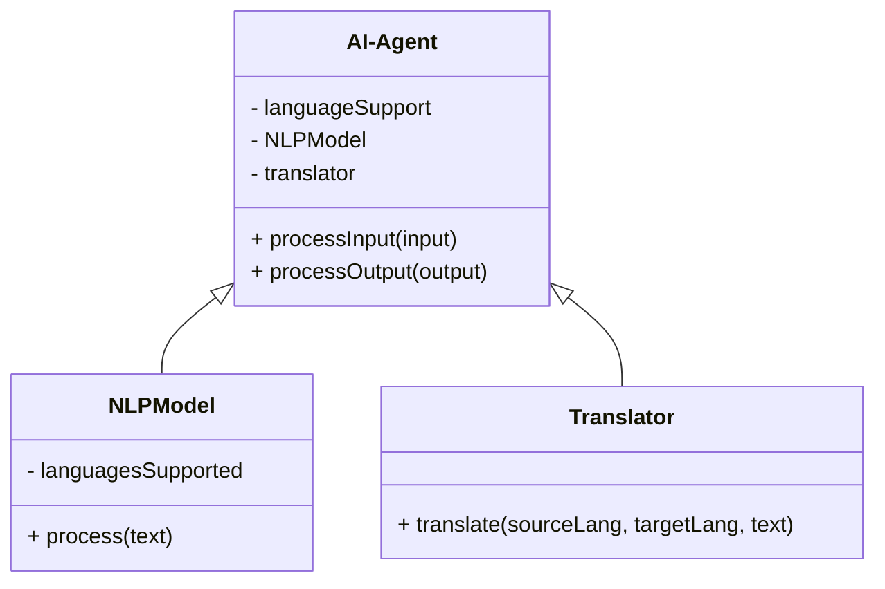
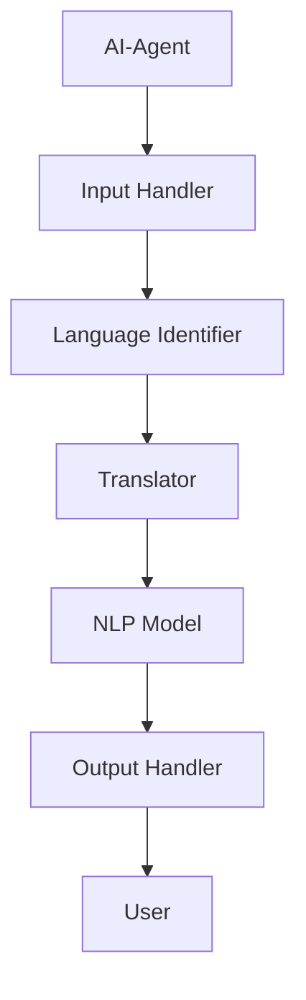

                 


# 实现AI Agent的多语言支持

> 关键词：AI Agent, 多语言支持, 自然语言处理, 跨语言计算, 系统架构设计

> 摘要：本文将详细介绍如何实现AI Agent的多语言支持，从核心概念到算法原理，再到系统架构设计，全面解析实现多语言AI Agent的关键技术与方法。文章将深入探讨多语言支持的重要性，分析主流NLP模型的特点，详细讲解跨语言计算的实现原理，并提供实际项目中的系统设计与代码实现。

---

## 第一部分: AI Agent的多语言支持背景与基础

### 第1章: AI Agent与多语言支持概述

#### 1.1 AI Agent的基本概念
AI Agent（人工智能代理）是一种能够感知环境、自主决策并执行任务的智能实体。它具备以下特点：
- **自主性**：能够在没有外部干预的情况下独立运作。
- **反应性**：能够实时感知环境并做出响应。
- **目标导向性**：具备明确的目标，并采取行动以实现目标。
- **学习能力**：能够通过经验改进自身的性能。

#### 1.2 多语言支持的重要性
随着AI Agent的应用场景越来越广泛，支持多语言的能力变得至关重要。多语言支持能够使AI Agent服务于更多用户，支持多种语言交互，提升用户体验。具体来说，多语言支持的重要性体现在以下几个方面：
1. **全球化需求**：AI Agent需要能够支持全球用户的不同语言需求。
2. **跨平台应用**：在跨国企业和多语言环境中，多语言支持是必需的功能。
3. **提升用户体验**：通过支持用户母语，减少语言障碍，提升交互的流畅性。

#### 1.3 当前AI Agent的发展趋势
AI Agent正朝着以下几个方向快速发展：
1. **智能化**：通过深度学习和NLP技术，提升AI Agent的理解和生成能力。
2. **多模态化**：支持文本、语音、图像等多种交互方式。
3. **多语言化**：支持多种语言，满足全球用户的多样化需求。

---

## 第二部分: AI Agent多语言支持的核心概念与联系

### 第2章: 多语言支持的核心概念原理

#### 2.1 多语言支持的实现方式
多语言支持的实现方式多种多样，以下是几种常见的实现方式：
1. **基于机器翻译的多语言支持**：通过机器翻译技术将用户的输入翻译成系统支持的语言，再进行处理，最后将结果翻译回用户语言。
2. **多语言NLP模型**：使用预训练的多语言NLP模型（如Marian、Bert-base-multilingual）直接处理多种语言的输入。
3. **混合式多语言支持**：结合机器翻译和多语言NLP模型，根据具体需求灵活切换支持方式。

#### 2.2 多语言支持的NLP模型分析
多语言NLP模型是实现多语言支持的核心技术之一。以下是一些主流的多语言NLP模型及其特点：

| 模型名称         | 特点                                                                 |
|------------------|----------------------------------------------------------------------|
| BERT-base-multilingual | 支持100多种语言，适用于文本分类、命名实体识别等任务。                 |
| Marian           | 专注于机器翻译，支持多种语言对的翻译。                                 |
| XLM              | 基于Transformer的多语言模型，支持多种语言的生成任务。                     |

#### 2.3 多语言支持的系统架构
多语言支持的系统架构设计需要考虑以下几个方面：
1. **输入处理模块**：识别用户的语言，并选择合适的处理方式。
2. **语言转换模块**：将多语言输入转换为系统支持的语言。
3. **核心处理模块**：使用多语言NLP模型进行理解和生成。
4. **输出转换模块**：将系统输出转换为用户指定的语言。

---

## 第三部分: AI Agent多语言支持的算法原理

### 第3章: 多语言支持的算法原理

#### 3.1 机器翻译算法
机器翻译是实现多语言支持的重要技术之一。以下是机器翻译算法的核心原理：
1. **编码器-解码器结构**：编码器将源语言句子编码为向量表示，解码器将向量解码为目标语言句子。
2. **注意力机制**：通过注意力机制，模型能够关注源语言句子中的重要部分，提升翻译质量。

#### 3.2 跨语言迁移学习
跨语言迁移学习是一种利用一种语言的数据来提升另一种语言模型性能的技术。以下是其实现步骤：
1. **预训练**：在资源丰富的语言上进行预训练，获取语言模型参数。
2. **微调**：在目标语言上进行微调，利用跨语言的特征提升目标语言模型的性能。

#### 3.3 多语言NLP模型的训练与优化
多语言NLP模型的训练需要考虑以下几个方面：
1. **多语言数据集**：使用多种语言的数据进行训练，提升模型的多语言理解能力。
2. **语言标识符**：在模型中加入语言标识符，帮助模型区分不同语言的特征。

---

## 第四部分: AI Agent多语言支持的系统分析与架构设计

### 第4章: 系统分析与架构设计方案

#### 4.1 问题场景介绍
AI Agent的多语言支持需要解决以下问题：
1. **语言识别**：识别用户的语言。
2. **语言转换**：将多语言输入转换为系统支持的语言。
3. **跨语言理解**：理解多种语言的输入，并生成相应的输出。
4. **语言转换输出**：将系统输出转换为目标语言。

#### 4.2 系统功能设计
以下是系统功能设计的类图：



#### 4.3 系统架构设计
以下是系统的架构图：



#### 4.4 系统接口设计
以下是系统的接口设计：

```mermaid
sequenceDiagram
    User -> A[发送多语言输入]
    A -> B[语言识别]
    B -> C[选择处理语言]
    C -> D[处理输入]
    D -> E[生成输出]
    E -> F[语言转换]
    F -> User[返回结果]
```

---

## 第五部分: AI Agent多语言支持的项目实战

### 第5章: 项目实战

#### 5.1 环境安装
以下是实现AI Agent多语言支持的环境安装步骤：
1. 安装Python和必要的开发工具。
2. 安装TensorFlow、Keras、Hugging Face Transformers等库。

#### 5.2 核心代码实现
以下是实现多语言支持的核心代码：

```python
from transformers import MarianMTModel, MarianTokenizer
import torch

# 初始化模型和分词器
model_name = 'Helsinki-NLP/marian-nmt'
tokenizer = MarianTokenizer.from_pretrained(model_name)
model = MarianMTModel.from_pretrained(model_name)

# 定义翻译函数
def translate(text, src_lang, tgt_lang):
    tokens = tokenizer.encode(text, src_lang=src_lang, tgt_lang=tgt_lang)
    outputs = model.generate(tokens.input_ids, max_length=50)
    translated = tokenizer.decode(outputs[0], tgt_lang=tgt_lang)
    return translated
```

#### 5.3 案例分析
以下是一个实际案例分析：

**输入**：用户用中文输入“你好，我需要帮助。”
**输出**：AI Agent将输入翻译成英文“Hello, I need help.”，并调用NLP模型进行理解，最后将结果翻译成用户指定的语言。

---

## 第六部分: AI Agent多语言支持的最佳实践

### 第6章: 最佳实践

#### 6.1 小结
实现AI Agent的多语言支持是一项复杂但极具挑战性的任务。通过选择合适的NLP模型、设计合理的系统架构，可以有效地实现多语言支持。

#### 6.2 注意事项
- 确保多语言数据的质量和多样性。
- 在处理语言转换时，注意语言的语法和文化差异。
- 定期更新模型和语言支持，以提升性能。

#### 6.3 拓展阅读
- 《Neural Machine Translation》
- 《Multilingual Neural Networks》

---

## 作者：AI天才研究院/AI Genius Institute & 禅与计算机程序设计艺术 /Zen And The Art of Computer Programming

---

这篇文章从背景介绍、核心概念、算法原理、系统架构设计、项目实战到最佳实践，全面解析了实现AI Agent多语言支持的关键技术与方法。通过详细的技术分析和代码示例，帮助读者深入了解多语言支持的实现细节，为实际项目提供了宝贵的参考。

