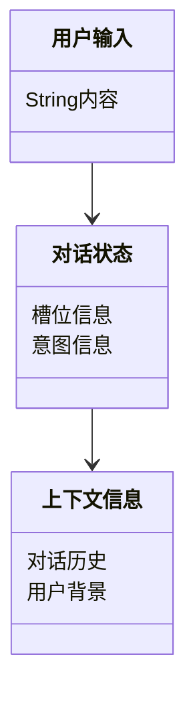
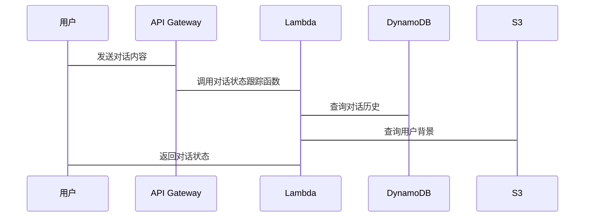

                 


# 实现AI Agent的多轮对话状态跟踪

## 关键词
- AI Agent
- 多轮对话
- 对话状态跟踪
- 自然语言处理
- 机器学习
- 深度学习

## 摘要
AI Agent的多轮对话状态跟踪是实现智能对话系统的核心技术之一。本文从背景介绍、核心概念、算法原理、系统架构设计、项目实战等多个方面详细讲解了多轮对话状态跟踪的实现方法。通过对对话状态表示、槽位填充、意图识别、上下文管理等核心概念的分析，结合HMM、DNN等算法的原理与实现，最终给出了一个完整的AI Agent多轮对话状态跟踪系统的设计方案。

---

# 第一部分: AI Agent的多轮对话状态跟踪背景介绍

## 第1章: 多轮对话状态跟踪的背景与问题

### 1.1 多轮对话的定义与特点
#### 1.1.1 什么是多轮对话
多轮对话是指用户与AI Agent之间通过多条消息交互完成一个任务或达到一个目标的对话形式。与单轮对话相比，多轮对话更接近人类自然交流的方式，能够处理复杂的上下文关系和语境信息。

#### 1.1.2 多轮对话的核心特征
- **上下文依赖性**：每一条消息都与之前的对话内容相关联。
- **动态性**：对话的状态会随着每一轮消息的输入而动态变化。
- **目标导向性**：对话的最终目的是完成一个任务或解决问题。

#### 1.1.3 多轮对话的应用场景
- **智能客服**：通过多轮对话帮助用户解决问题。
- **智能助手**：如Siri、Alexa等，通过多轮对话提供服务。
- **在线教育**：通过多轮对话为学生提供个性化的学习支持。

### 1.2 AI Agent的定义与作用
#### 1.2.1 AI Agent的基本概念
AI Agent（人工智能代理）是指能够感知环境、自主决策并执行任务的智能实体。它可以是一个软件程序，也可以是一个物理设备。

#### 1.2.2 AI Agent的核心功能
- **感知环境**：通过传感器或输入数据感知外部环境。
- **决策与规划**：基于感知的信息做出决策并制定执行计划。
- **执行任务**：根据决策结果执行具体任务。

#### 1.2.3 AI Agent与传统对话系统的区别
- **主动性**：AI Agent具有主动性，能够自主发起对话或任务。
- **智能性**：AI Agent具备更强的智能性，能够处理复杂任务。
- **适应性**：AI Agent能够根据环境变化动态调整行为。

### 1.3 对话状态跟踪的定义与重要性
#### 1.3.1 对话状态跟踪的定义
对话状态跟踪是指在多轮对话过程中，系统实时跟踪对话的状态，包括用户的意图、当前对话的上下文信息等。

#### 1.3.2 对话状态跟踪的关键作用
- **理解用户需求**：通过跟踪对话状态，系统能够准确理解用户的意图和需求。
- **保持对话连贯性**：通过跟踪上下文信息，系统能够保持对话的连贯性。
- **提高对话效率**：通过跟踪对话历史，系统能够快速找到相关信息，提高对话效率。

#### 1.3.3 对话状态跟踪的挑战与难点
- **上下文管理**：如何高效地管理对话过程中的上下文信息是一个难点。
- **意图识别**：用户的意图可能隐含或模糊，如何准确识别意图是对话状态跟踪的关键。
- **动态更新**：对话状态需要随着每一轮对话动态更新，这对系统的实时性提出了要求。

### 1.4 本章小结
本章主要介绍了多轮对话状态跟踪的背景、定义、核心概念以及在AI Agent中的重要性。通过本章的讲解，读者可以理解多轮对话状态跟踪的基本概念和其在智能对话系统中的作用。

---

# 第二部分: 多轮对话状态跟踪的核心概念与联系

## 第2章: 对话状态跟踪的核心概念

### 2.1 对话状态表示方法
#### 2.1.1 状态表示的定义
对话状态表示是指如何将对话中的信息转化为系统能够理解和处理的形式。常见的状态表示方法包括槽位填充、意图表示等。

#### 2.1.2 常见的状态表示方法
- **槽位填充**：将对话中的信息填充到预定义的槽位中，例如“时间”、“地点”、“人物”等。
- **意图表示**：将对话的意图转化为系统能够理解的标签或类别。
- **上下文表示**：通过某种形式表示对话的上下文信息，例如使用JSON格式存储。

#### 2.1.3 状态表示的选择与优化
选择合适的状态表示方法需要考虑以下因素：
- **任务需求**：不同的任务可能需要不同的状态表示方法。
- **数据量**：数据量越大，状态表示方法需要越复杂。
- **计算效率**：状态表示方法的计算效率也是一个重要考虑因素。

### 2.2 槽位填充与意图识别
#### 2.2.1 槽位填充的定义
槽位填充是指将用户输入的对话内容填充到预定义的槽位中，例如“时间”、“地点”、“人物”等。

#### 2.2.2 意图识别的定义
意图识别是指通过分析对话内容，识别出用户的意图或目标。

#### 2.2.3 槽位填充与意图识别的关系
槽位填充和意图识别是相辅相成的。槽位填充帮助系统理解对话的具体内容，意图识别帮助系统理解对话的目标。

### 2.3 上下文管理
#### 2.3.1 上下文的定义
上下文是指在对话过程中，与当前对话相关联的所有信息，包括对话历史、用户背景等。

#### 2.3.2 上下文的存储与更新
上下文可以通过数据库、缓存或其他存储方式来存储，并随着对话的进行动态更新。

#### 2.3.3 上下文在对话中的作用
- **保持对话连贯性**：通过上下文，系统可以理解对话的前后关系。
- **提高对话准确性**：通过上下文，系统可以更准确地理解用户的意图。

### 2.4 对话历史与状态更新
#### 2.4.1 对话历史的定义
对话历史是指在对话过程中，所有已经发生的对话内容。

#### 2.4.2 状态更新的机制
状态更新是指随着对话的进行，实时更新对话状态的过程。

#### 2.4.3 对话历史与状态更新的关系
对话历史是状态更新的基础，状态更新是对话历史的延续。

### 2.5 本章小结
本章详细讲解了对话状态跟踪的核心概念，包括状态表示、槽位填充、意图识别、上下文管理和对话历史等。通过本章的讲解，读者可以理解对话状态跟踪的基本原理和实现方法。

---

# 第三部分: 多轮对话状态跟踪的算法原理

## 第3章: 对话状态跟踪的算法原理

### 3.1 基于HMM的对话状态跟踪
#### 3.1.1 HMM的定义与原理
HMM（隐马尔可夫模型）是一种用于时间序列数据建模的概率模型，常用于语音识别、自然语言处理等领域。

#### 3.1.2 HMM在对话状态跟踪中的应用
HMM可以用于对话状态的序列建模，通过分析对话历史来预测当前对话的状态。

#### 3.1.3 HMM的优缺点
- **优点**：HMM能够处理时间序列数据，适合用于对话状态的序列建模。
- **缺点**：HMM假设观测数据与状态转移独立，可能无法捕捉复杂的对话关系。

### 3.2 基于DNN的对话状态跟踪
#### 3.2.1 DNN的定义与原理
DNN（深度神经网络）是一种多层神经网络，通过多层非线性变换来学习数据的特征。

#### 3.2.2 DNN在对话状态跟踪中的应用
DNN可以用于对话状态的表示和分类，通过学习对话历史和上下文信息来预测当前对话的状态。

#### 3.2.3 DNN的优缺点
- **优点**：DNN能够学习复杂的非线性关系，适合用于处理复杂的对话信息。
- **缺点**：DNN的计算复杂度较高，需要大量的训练数据。

### 3.3 基于注意力机制的对话状态跟踪
#### 3.3.1 注意力机制的定义与原理
注意力机制是一种用于模型在处理序列数据时，能够关注到重要的位置信息。

#### 3.3.2 注意力机制在对话状态跟踪中的应用
注意力机制可以用于对话历史的加权平均，通过关注重要的对话内容来提高对话状态的准确性。

#### 3.3.3 注意力机制的优缺点
- **优点**：注意力机制能够提高模型对重要信息的关注，适合用于处理复杂的对话信息。
- **缺点**：注意力机制需要额外的计算资源，可能会增加模型的复杂度。

### 3.4 算法对比与选择
#### 3.4.1 各种算法的优缺点对比
| 算法 | 优点 | 缺点 |
|------|------|------|
| HMM  | 处理时间序列数据能力强 | 无法捕捉复杂的对话关系 |
| DNN  | 学习能力强 | 计算复杂度高 |
| 注意力机制 | 提高对重要信息的关注 | 需要额外的计算资源 |

#### 3.4.2 算法选择的考虑因素
- **任务需求**：不同的任务可能需要不同的算法。
- **数据量**：数据量越大，DNN和注意力机制可能更适合。
- **计算资源**：计算资源有限的情况下，HMM可能更适合。

### 3.5 本章小结
本章详细讲解了对话状态跟踪的算法原理，包括HMM、DNN和注意力机制等方法。通过对比各种算法的优缺点，读者可以更好地理解如何选择合适的算法来实现对话状态跟踪。

---

# 第四部分: 系统分析与架构设计方案

## 第4章: 系统分析与架构设计

### 4.1 问题场景介绍
对话状态跟踪系统需要能够实时跟踪对话的状态，支持多轮对话，并能够根据对话内容动态更新对话状态。

### 4.2 系统功能设计
#### 4.2.1 领域模型
- **用户输入**：用户的对话内容。
- **对话状态**：当前对话的状态，包括意图、槽位信息等。
- **上下文信息**：对话的上下文信息，例如对话历史、用户背景等。

#### 4.2.2 领域模型Mermaid类图


### 4.3 系统架构设计
#### 4.3.1 系统架构Mermaid架构图
```mermaid
aws
    api Gateway
    Lambda
    DynamoDB
    S3
```

#### 4.3.2 系统接口设计
- **输入接口**：接收用户的对话内容。
- **输出接口**：返回对话状态和响应消息。

#### 4.3.3 系统交互Mermaid序列图


### 4.4 本章小结
本章详细讲解了对话状态跟踪系统的架构设计，包括问题场景、系统功能设计和系统架构设计等。通过Mermaid图的展示，读者可以清晰地理解系统的结构和交互流程。

---

# 第五部分: 项目实战

## 第5章: 项目实战

### 5.1 环境安装
- **Python 3.8+**
- **TensorFlow 2.0+**
- **Flask**

### 5.2 核心实现源代码
#### 5.2.1 对话状态跟踪函数
```python
def track_dialogue_state(user_input, dialogue_history):
    # 槽位填充
    slots = fill_slots(user_input)
    # 意图识别
    intent = recognize_intent(user_input, slots)
    # 更新对话状态
    dialogue_state = update_state(dialogue_history, slots, intent)
    return dialogue_state
```

#### 5.2.2 槽位填充函数
```python
def fill_slots(user_input):
    # 使用正则表达式提取槽位信息
    slots = {}
    pattern = r'\b(\w+)\b'
    matches = re.findall(pattern, user_input)
    for match in matches:
        slots[match] = True
    return slots
```

#### 5.2.3 意图识别函数
```python
def recognize_intent(user_input, slots):
    # 使用机器学习模型进行意图识别
    model = load_model()
    intent = model.predict(user_input, slots)
    return intent
```

#### 5.2.4 对话状态更新函数
```python
def update_state(dialogue_history, slots, intent):
    # 更新对话状态
    new_state = dialogue_history.copy()
    new_state.append(slots)
    new_state.append(intent)
    return new_state
```

### 5.3 代码应用解读与分析
- **槽位填充**：通过正则表达式提取用户输入中的关键词，填充到槽位中。
- **意图识别**：使用预训练的机器学习模型，根据用户输入和槽位信息识别意图。
- **对话状态更新**：将槽位信息和意图信息添加到对话历史中，更新对话状态。

### 5.4 实际案例分析
假设用户输入为“我需要预约明天的会议”，槽位填充为“时间：明天”，意图识别为“预约会议”。对话状态更新后，对话历史将包含槽位信息和意图信息。

### 5.5 本章小结
本章通过一个实际的项目案例，详细讲解了对话状态跟踪的实现过程，包括环境安装、核心代码实现、代码解读与分析等。通过本章的学习，读者可以掌握对话状态跟踪的具体实现方法。

---

# 第六部分: 最佳实践与总结

## 第6章: 最佳实践

### 6.1 最佳实践 tips
- **数据质量**：对话状态跟踪的效果依赖于数据质量，需要确保数据的准确性和完整性。
- **模型选择**：根据任务需求和数据量选择合适的模型，HMM适合小数据，DNN适合大数据。
- **上下文管理**：合理管理上下文信息，保持对话的连贯性和准确性。

### 6.2 本章小结
通过本文的讲解，读者可以全面了解AI Agent的多轮对话状态跟踪的实现方法。从背景介绍到算法原理，从系统架构设计到项目实战，本文为读者提供了完整的实现方案。

---

# 作者：AI天才研究院/AI Genius Institute & 禅与计算机程序设计艺术 /Zen And The Art of Computer Programming

