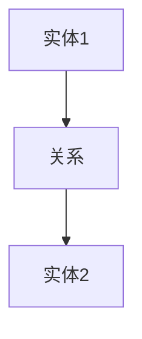
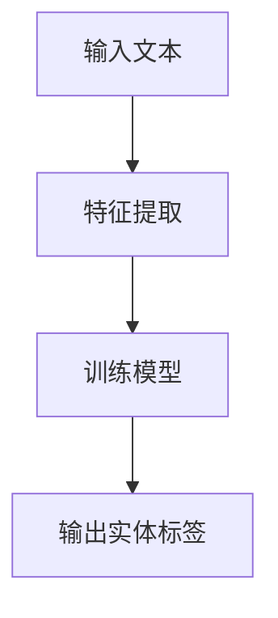
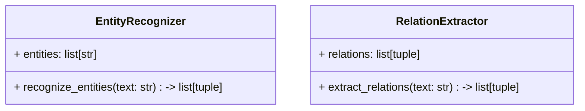
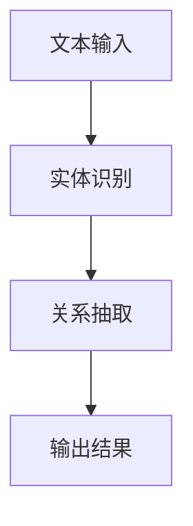

                 


# 实现AI Agent的实体识别与关系抽取

> 关键词：AI Agent，实体识别，关系抽取，自然语言处理，机器学习

> 摘要：实体识别（NER）和关系抽取（RE）是自然语言处理（NLP）中的两个核心任务，它们在AI Agent的实现中起着至关重要的作用。本文将详细探讨实体识别与关系抽取的技术原理、算法实现、系统架构设计以及实际应用案例。通过本文的讲解，读者将能够理解如何在AI Agent中有效地实现实体识别与关系抽取，从而提升智能系统的信息处理能力。

---

# 第1章 实体识别与关系抽取的背景与应用

## 1.1 问题背景与应用场景

### 1.1.1 实体识别与关系抽取的定义
- 实体识别（Named Entity Recognition, NER）：从文本中提取出特定的实体，如人名、地名、组织名、时间等。
- 关系抽取（Relation Extraction, RE）：识别文本中实体之间的关系，如“人名是组织的CEO”或“时间发生在地点”。

### 1.1.2 实体识别与关系抽取的应用场景
- **智能问答系统**：帮助用户快速找到所需信息。
- **知识图谱构建**：通过抽取实体和关系，构建语义网络。
- **智能推荐系统**：基于实体和关系进行个性化推荐。

### 1.1.3 AI Agent中的实体识别与关系抽取
- AI Agent需要理解用户输入的意图，并通过实体识别和关系抽取技术提取关键信息，从而做出智能决策。

## 1.2 实体识别与关系抽取的技术优势
### 1.2.1 提高信息处理效率
- 通过自动化提取实体和关系，减少人工处理时间。
### 1.2.2 支持智能决策
- 基于提取的信息，AI Agent可以做出更精准的决策。
### 1.2.3 降低人工干预成本
- 减少对人工解析的需求，降低成本。

## 1.3 实体识别与关系抽取的挑战
### 1.3.1 数据质量与多样性
- 数据中的噪声和歧义会影响提取的准确性。
### 1.3.2 知识图谱构建的复杂性
- 需要处理实体间复杂的语义关系。
### 1.3.3 模型训练与优化
- 需要大量的标注数据和高效的训练算法。

## 1.4 本章小结
- 本章介绍了实体识别与关系抽取的基本概念、应用场景及其在AI Agent中的重要性，同时指出了实现过程中可能面临的挑战。

---

# 第2章 实体识别与关系抽取的核心概念

## 2.1 实体识别（NER）的原理与实现

### 2.1.1 实体识别的基本原理
- 基于上下文信息，利用特征提取和模型训练，识别文本中的实体。

### 2.1.2 实体识别的特征提取
- 词性标注（POS tagging）
- 位置信息（如是否在开头、结尾）
- 前缀和后缀特征
- 词典匹配

### 2.1.3 实体识别的模型选择
- 基于规则的方法
- 基于统计的方法（如HMM、CRF）
- 基于深度学习的方法（如LSTM、BERT）

## 2.2 关系抽取（RE）的原理与实现

### 2.2.1 关系抽取的基本原理
- 通过分析实体之间的语义关系，识别出它们的关系类型（如“属于”、“是”等）。

### 2.2.2 关系抽取的特征提取
- 实体间的距离
- 实体间的修饰词
- 句法结构信息

### 2.2.3 关系抽取的模型选择
- 基于模板的方法
- 基于统计的方法（如CRF）
- 基于深度学习的方法（如LSTM、BERT）

## 2.3 实体识别与关系抽取的关系

### 2.3.1 实体识别与关系抽取的协同作用
- 实体识别为关系抽取提供基础，关系抽取则进一步丰富语义信息。

### 2.3.2 实体识别与关系抽取的对比表格
| 特性       | 实体识别（NER）          | 关系抽取（RE）          |
|------------|-------------------------|-------------------------|
| 目标       | 提取实体                | 提取实体间的关系        |
| 输入       | 文本段                  | 文本段                  |
| 输出       | 实体标签（如B-PER，I-PER）| 关系标签（如ORG-HEAD）   |
| 典型模型    | CRF，LSTM               | CRF，BERT               |

### 2.3.3 实体识别与关系抽取的ER图


## 2.4 本章小结
- 本章详细介绍了实体识别和关系抽取的核心概念、实现原理及其之间的关系。

---

# 第3章 实体识别与关系抽取的算法原理

## 3.1 实体识别（NER）的算法实现

### 3.1.1 基于CRF的NER算法
- **流程图**：

- **代码示例**：
```python
import CRF
model = CRF()
model.train(train_data)
predicted_labels = model.predict(test_data)
```
- **数学模型**：
$$ P(y|x) = \frac{\exp(f(x, y))}{Z} $$
其中，$Z$ 是归一化因子，$f(x, y)$ 是模型的分数函数。

## 3.2 关系抽取（RE）的算法实现

### 3.2.1 基于LSTM的RE算法
- **流程图**：

- **代码示例**：
```python
import LSTM
model = LSTM()
model.train(train_data)
predicted_relations = model.predict(test_data)
```
- **数学模型**：
$$ f(x_i, x_j) = \text{LSTM}(x_i, x_j) $$
其中，$x_i$ 和 $x_j$ 是实体的起始和结束位置。

## 3.3 实体识别与关系抽取的联合建模

### 3.3.1 联合建模的原理
- 同时优化NER和RE任务，共享部分特征。

### 3.3.2 联合建模的代码示例
```python
import JointModel
model = JointModel()
model.train(train_data)
predicted_ner, predicted_re = model.predict(test_data)
```

## 3.4 本章小结
- 本章详细讲解了NER和RE的算法实现，并介绍了联合建模的方法。

---

# 第4章 实体识别与关系抽取的系统架构设计

## 4.1 系统功能设计

### 4.1.1 领域模型


### 4.1.2 系统架构设计


## 4.2 系统接口设计

### 4.2.1 实体识别接口
```python
def recognize_entities(text: str) -> list[tuple]:
    pass
```

### 4.2.2 关系抽取接口
```python
def extract_relations(text: str) -> list[tuple]:
    pass
```

## 4.3 本章小结
- 本章详细介绍了实体识别与关系抽取系统的架构设计和接口设计。

---

# 第5章 实体识别与关系抽取的项目实战

## 5.1 项目环境搭建

### 5.1.1 环境要求
- Python 3.8+
- NLTK库、spaCy库、TensorFlow库

## 5.2 核心代码实现

### 5.2.1 实体识别代码
```python
import spacy

nlp = spacy.load("en_core_web_sm")
def recognize_entities(text):
    doc = nlp(text)
    entities = []
    for ent in doc.ents:
        entities.append((ent.start, ent.end, ent.label_))
    return entities
```

### 5.2.2 关系抽取代码
```python
from spacy.regression import LogisticRegression

nlp = spacy.load("en_core_web_sm")
model = LogisticRegression(nlp.vocab)
model.train(train_data)
def extract_relations(text):
    doc = nlp(text)
    relations = []
    for ent1 in doc.ents:
        for ent2 in doc.ents:
            if ent1.start < ent2.start and model.predict(ent1.text, ent2.text):
                relations.append((ent1.text, "related", ent2.text))
    return relations
```

## 5.3 案例分析

### 5.3.1 数据预处理
- 文本清洗、分词、去除停用词。

### 5.3.2 模型训练
- 使用训练数据训练NER和RE模型。

### 5.3.3 结果分析
- 分析模型的准确率、召回率和F1值。

## 5.4 本章小结
- 本章通过一个实际案例，详细讲解了实体识别与关系抽取的实现过程。

---

# 第6章 实体识别与关系抽取的最佳实践与总结

## 6.1 最佳实践

### 6.1.1 数据质量
- 数据清洗、标注和多样性。

### 6.1.2 模型优化
- 参数调优、模型融合、迁移学习。

## 6.2 本章总结

### 6.2.1 核心要点回顾
- 实体识别与关系抽取的重要性
- 各种算法的优缺点
- 系统架构设计的关键点

## 6.3 未来展望

### 6.3.1 多模态融合
- 结合图像、语音等多种模态信息。

### 6.3.2 预训练模型的应用
- 使用BERT、GPT等大模型提升效果。

## 6.4 本章小结
- 本章总结了实体识别与关系抽取的关键点，并展望了未来的研究方向。

---

# 总结

本文详细讲解了实体识别与关系抽取的实现过程，从理论到实践，为AI Agent的实现提供了坚实的基础。通过本文的学习，读者可以掌握NER和RE的核心技术，并能够在实际项目中灵活应用。

---

作者：AI天才研究院/AI Genius Institute & 禅与计算机程序设计艺术/Zen And The Art of Computer Programming

