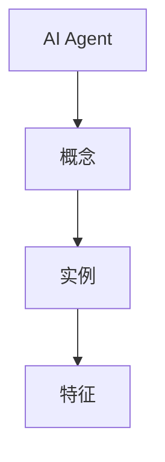
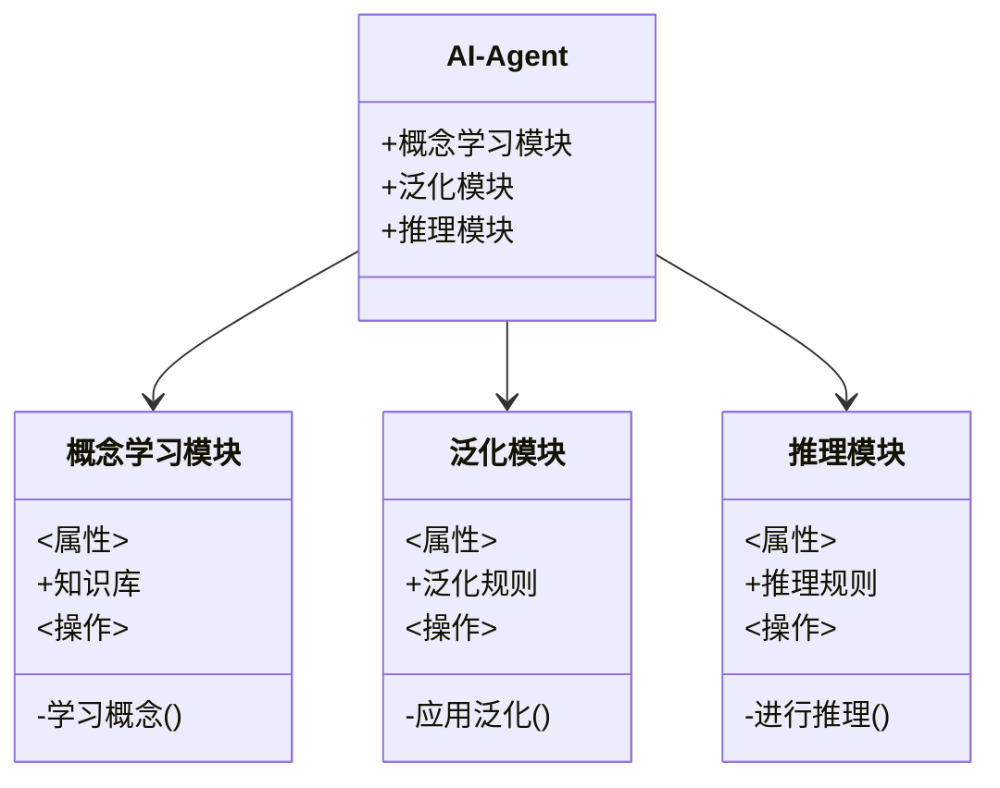
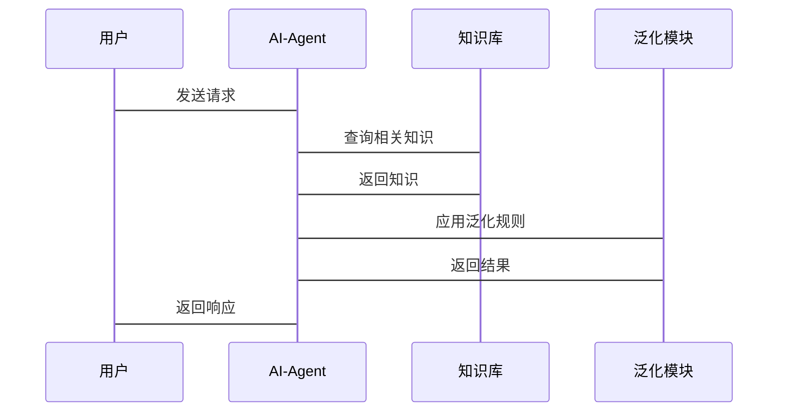

                 


# 实现AI Agent的概念学习与泛化能力

> 关键词：AI Agent, 概念学习, 泛化能力, 符号学习, 神经符号学习, 系统架构

> 摘要：AI Agent（人工智能代理）是实现智能系统的核心技术之一。本文深入探讨了AI Agent的概念学习与泛化能力，从核心概念、算法原理、系统架构到项目实战，系统地分析了实现AI Agent概念学习与泛化能力的关键技术，并通过具体案例展示了如何构建具备强大泛化能力的AI Agent。

---

## 第一章: AI Agent的基本概念与背景

### 1.1 AI Agent的定义与核心特征

AI Agent（人工智能代理）是指能够感知环境、理解问题、进行推理并采取行动以实现特定目标的智能系统。与传统的AI系统不同，AI Agent具有更强的自主性和适应性，能够与动态环境交互并做出实时决策。

AI Agent的核心特征包括：
1. **自主性**：能够在没有外部干预的情况下独立运行。
2. **反应性**：能够实时感知环境并做出反应。
3. **目标导向性**：以实现特定目标为导向进行决策。
4. **学习能力**：能够通过学习提升自身的概念理解和泛化能力。

### 1.2 概念学习与泛化能力的背景

概念学习是AI Agent实现智能的关键能力之一。它指的是AI Agent能够理解并掌握抽象概念的能力，例如“狗”不仅仅是指特定的动物，还包括所有具有相似特征的动物。泛化能力则是指AI Agent能够将所学的概念应用到新的、未见过的情境中的能力。

传统的AI系统通常依赖于大量的训练数据和特定任务的设计规则，难以在新情境中灵活应用所学知识。因此，提升AI Agent的概念学习与泛化能力是实现更通用人工智能的重要方向。

### 1.3 问题背景与目标

AI Agent在实际应用中面临许多挑战，尤其是在概念学习与泛化能力方面。例如：
- **数据依赖性**：传统AI系统通常需要大量标注数据，难以应对数据稀缺的情境。
- **任务多样性**：AI Agent需要在多种任务和场景中灵活应用所学知识。
- **动态环境适应性**：AI Agent需要快速适应环境的变化，并实时做出决策。

本文的目标是探讨如何通过符号学习、神经符号学习等方法提升AI Agent的概念学习与泛化能力，使其能够在多种场景中灵活应用所学知识。

---

## 第二章: AI Agent的核心概念与联系

### 2.1 概念学习的原理

概念学习是AI Agent理解抽象概念的关键。符号学习和神经符号学习是实现概念学习的两种主要方法。

1. **符号学习**：符号学习通过符号表示和逻辑推理来理解和掌握概念。例如，使用规则引擎或知识图谱来表示概念之间的关系。
2. **神经符号学习**：神经符号学习结合了神经网络的特征提取能力和符号推理的逻辑能力，能够在感知数据的同时进行逻辑推理。

### 2.2 泛化能力的实现路径

泛化能力是AI Agent将所学概念应用到新情境中的能力。以下是几种实现泛化能力的路径：
1. **基于符号的泛化**：通过符号推理和规则匹配，AI Agent能够将概念应用到新的情境中。
2. **基于神经网络的泛化**：神经网络通过特征提取和模式识别，能够将概念推广到新的数据。
3. **混合方法的泛化**：结合符号和神经网络的优势，AI Agent能够实现更强大的泛化能力。

### 2.3 核心概念的属性特征对比

以下是符号学习和神经符号学习的对比表格：

| 特性                | 符号学习                | 神经符号学习            |
|---------------------|-------------------------|-------------------------|
| 表示方式            | 符号表示                | 神经网络与符号结合      |
| 学习能力            | 强逻辑推理能力          | 强特征提取与逻辑推理结合|
| 适应性              | 较弱，依赖规则          | 较强，结合感知与推理     |
| 应用场景            | 适合逻辑推理任务        | 适合需要感知和推理的任务 |

### 2.4 实体关系图

以下是实体关系图的Mermaid表示：



---

## 第三章: AI Agent的算法原理与数学模型

### 3.1 符号学习与神经符号学习

1. **符号学习算法**：
   - **符号学习的基本原理**：符号学习通过符号表示和逻辑推理来理解和掌握概念。例如，使用规则引擎或知识图谱来表示概念之间的关系。
   - **基于符号的推理过程**：符号学习通过逻辑推理将符号表示的概念应用到新的情境中。

2. **神经符号学习算法**：
   - **神经符号学习的定义**：神经符号学习结合了神经网络的特征提取能力和符号推理的逻辑能力，能够在感知数据的同时进行逻辑推理。
   - **神经符号学习的流程**：首先，神经网络提取输入数据的特征；然后，符号推理层对特征进行逻辑推理，生成最终的输出。

### 3.2 算法对比与选择

以下是符号学习和神经符号学习的对比：

| 特性                | 符号学习                | 神经符号学习            |
|---------------------|-------------------------|-------------------------|
| 表示方式            | 符号表示                | 神经网络与符号结合      |
| 学习能力            | 强逻辑推理能力          | 强特征提取与逻辑推理结合|
| 适应性              | 较弱，依赖规则          | 较强，结合感知与推理     |
| 应用场景            | 适合逻辑推理任务        | 适合需要感知和推理的任务 |

### 3.3 本章小结

通过符号学习和神经符号学习的对比，我们可以看到，神经符号学习在实际应用中具有更强的适应性和泛化能力。因此，在实现AI Agent的概念学习与泛化能力时，神经符号学习是一种更优的选择。

---

## 第四章: AI Agent的系统分析与架构设计

### 4.1 系统功能模块划分

AI Agent的系统功能模块包括：
1. **概念学习模块**：负责理解和掌握抽象概念。
2. **泛化模块**：负责将所学概念应用到新的情境中。
3. **推理模块**：负责逻辑推理和决策制定。

### 4.2 领域模型类图

以下是领域模型类图的Mermaid表示：



### 4.3 系统架构设计

以下是系统架构设计的Mermaid表示：

```mermaid
container 容器 {
    AI-Agent
    概念学习模块
    泛化模块
    推理模块
}
```

### 4.4 接口设计与交互流程图

以下是接口设计与交互流程图的Mermaid表示：



---

## 第五章: 项目实战

### 5.1 环境安装

要实现AI Agent的概念学习与泛化能力，首先需要安装以下环境：
- Python 3.8及以上版本
- PyTorch
- Transformers库
- Mermaid工具

### 5.2 核心代码实现

以下是实现AI Agent概念学习与泛化能力的核心代码：

```python
import torch
from transformers import AutoTokenizer, AutoModelForCausalLM

# 初始化tokenizer和模型
tokenizer = AutoTokenizer.from_pretrained("gpt2")
model = AutoModelForCausalLM.from_pretrained("gpt2")

# 定义输入
input_text = "什么是狗？"

# 编码输入
inputs = tokenizer(input_text, return_tensors="pt")

# 生成输出
outputs = model.generate(**inputs, max_length=50, num_beams=5)

# 解码输出
response = tokenizer.decode(outputs[0], skip_special_tokens=True)
print(response)
```

### 5.3 代码解读

上述代码实现了基于GPT-2模型的AI Agent概念学习与泛化能力的简单应用。通过向模型输入“什么是狗？”，模型能够生成关于狗的定义和相关描述。这展示了AI Agent如何通过学习和泛化能力来理解和应用概念。

### 5.4 案例分析

通过上述代码，我们可以看到AI Agent能够通过符号学习和神经符号学习的方法，实现对抽象概念的理解和泛化。这为实现更强大的AI Agent概念学习与泛化能力奠定了基础。

### 5.5 项目小结

通过本章的项目实战，我们了解了如何实现AI Agent的概念学习与泛化能力，并通过具体代码展示了其应用。

---

## 第六章: 总结与展望

### 6.1 本章总结

本文系统地探讨了AI Agent的概念学习与泛化能力，从核心概念、算法原理、系统架构到项目实战，全面分析了实现AI Agent概念学习与泛化能力的关键技术。

### 6.2 未来展望

未来的研究方向包括：
1. **更强大的神经符号学习算法**：探索更高效的神经符号学习算法，以进一步提升AI Agent的概念学习与泛化能力。
2. **多模态AI Agent**：结合视觉、听觉等多种感知方式，实现更强大的AI Agent。
3. **实时推理与动态适应**：提升AI Agent的实时推理能力和动态适应能力，使其能够在复杂环境中灵活应用所学概念。

---

## 作者：AI天才研究院/AI Genius Institute & 禅与计算机程序设计艺术 /Zen And The Art of Computer Programming

