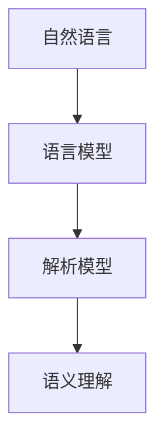
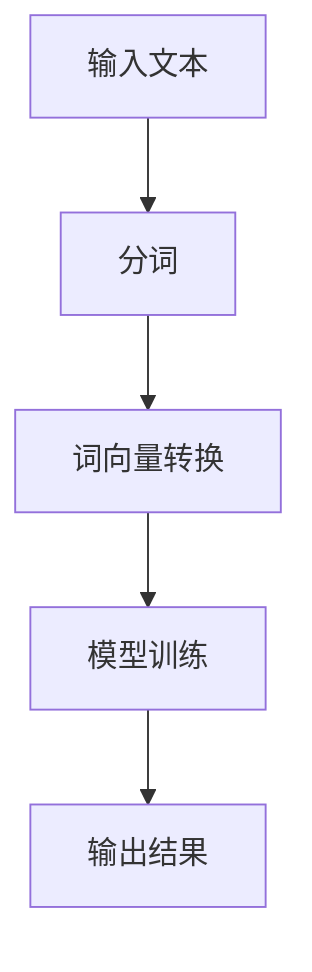
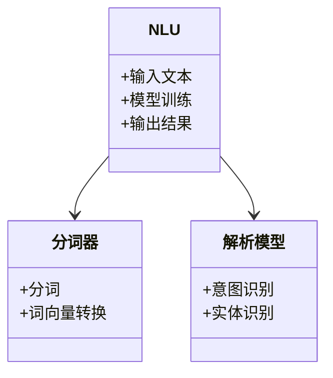
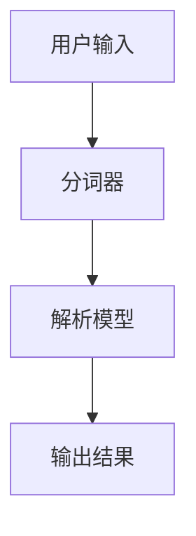
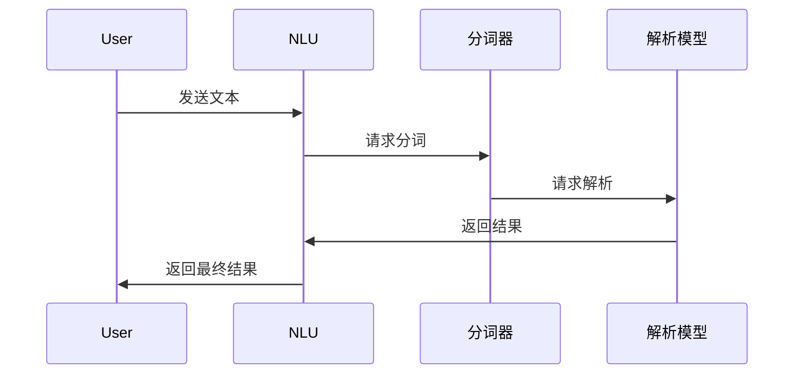

                 


# 实现AI Agent的自然语言理解能力

> 关键词：自然语言理解, AI Agent, 深度学习, BERT模型, 系统架构设计

> 摘要：本文详细探讨了实现AI Agent自然语言理解能力的关键技术，从基础概念到算法原理，再到系统设计和项目实战，全面解析了如何构建高效的自然语言理解系统。通过具体案例分析和代码实现，帮助读者深入理解AI Agent的自然语言处理能力，并提供实际应用中的最佳实践。

---

## 第一部分: AI Agent与自然语言理解基础

### 第1章: 自然语言理解的背景与问题

#### 1.1 自然语言理解的核心概念
自然语言理解（Natural Language Understanding, NLU）是人工智能领域的重要分支，旨在使计算机能够理解人类的自然语言输入。NLU的核心任务包括文本解析、意图识别、实体识别和情感分析等。AI Agent作为能够与人类交互的智能实体，其自然语言理解能力直接决定了其交互体验和任务处理效率。

#### 1.2 问题背景与挑战
在实现AI Agent的自然语言理解能力时，我们面临以下主要挑战：
1. **语义多样性**：自然语言表达丰富，同一句话可能有不同的含义。
2. **数据稀疏性**：某些特定领域或语境下的数据可能非常稀少。
3. **上下文依赖**：某些语句的理解需要依赖上下文信息。
4. **实时性要求**：AI Agent需要快速理解和响应用户的输入。

#### 1.3 AI Agent中的自然语言理解作用
AI Agent的自然语言理解能力使其能够：
1. 识别用户的意图，例如“预订机票”或“查询天气”。
2. 提取关键信息，如时间、地点、人物等实体。
3. 理解上下文，提供连贯的交互体验。

---

### 第2章: 自然语言理解的核心概念与联系

#### 2.1 自然语言理解的原理
自然语言理解的核心原理包括：
1. **文本预处理**：如分词、词性标注、句法分析。
2. **特征提取**：将文本转化为可计算的向量表示。
3. **模型训练**：基于标注数据或自监督学习方法训练模型。
4. **推理与解析**：根据模型输出进行语义解析。

#### 2.2 核心概念对比表格
以下是几种常见自然语言理解方法的对比：

| 方法         | 优点                           | 缺点                           |
|--------------|--------------------------------|--------------------------------|
| 基于规则     | 实现简单，适合特定场景           | 需手动编写规则，扩展性差       |
| 统计学习     | 可以自动从数据中学习规律         | 对数据量敏感，泛化能力有限     |
| 深度学习     | 表现力强，可以捕捉复杂模式       | 训练时间长，需要大量计算资源   |

#### 2.3 实体关系图
以下是自然语言理解中的实体关系图：



---

## 第二部分: 自然语言理解的算法原理

### 第3章: 自然语言理解的算法原理

#### 3.1 基于深度学习的NLU算法
当前，基于深度学习的模型，如Transformer和BERT，已成为自然语言理解的主流方法。

##### 3.1.1 Transformer模型的结构
Transformer模型由编码器和解码器组成，其核心思想是通过自注意力机制捕捉文本中的长距离依赖关系。

##### 3.1.2 BERT模型的训练流程
BERT模型采用自监督学习方法，通过遮蔽词任务和下文预测任务预训练模型。

##### 3.1.3 模型的输入与输出
BERT模型的输入包括文本序列和位置编码，输出为每个词的向量表示。

#### 3.2 算法流程图
以下是自然语言理解的算法流程图：



#### 3.3 算法实现代码
以下是基于BERT模型的意图识别代码示例：

```python
import tensorflow as tf
from tensorflow import keras

def build_model(max_sequence_length=128):
    # 加载预训练的BERT模型
    bert_model = keras.models.load_model('bert_model.h5')
    # 定义输入层
    input_ids = keras.Input(shape=(max_sequence_length,), dtype='int32')
    # 使用BERT模型提取特征
    features = bert_model(input_ids)
    # 添加全连接层
    dense = keras.layers.Dense(64, activation='relu')(features)
    # 输出层
    predictions = keras.layers.Dense(10, activation='softmax')(dense)
    # 编译模型
    model = keras.Model(inputs=input_ids, outputs=predictions)
    return model

# 训练模型
model = build_model()
model.compile(optimizer='adam', loss='sparse_categorical_crossentropy', metrics=['accuracy'])
model.fit(x_train, y_train, epochs=5, batch_size=32)
```

---

## 第三部分: 系统分析与架构设计

### 第4章: 系统分析与架构设计

#### 4.1 问题场景介绍
在实现AI Agent的自然语言理解系统时，我们需要考虑以下问题场景：
1. **多轮对话**：用户可能需要连续多轮对话，系统需要保持上下文记忆。
2. **多语言支持**：用户可能使用多种语言进行输入。
3. **实时处理**：系统需要快速响应用户的输入。

#### 4.2 系统功能设计
以下是自然语言理解系统的功能模块设计：



#### 4.3 系统架构设计
以下是自然语言理解系统的架构设计：



#### 4.4 系统接口设计
以下是系统接口设计：



---

## 第四部分: 项目实战

### 第5章: 项目实战

#### 5.1 环境安装
以下是项目所需的环境配置：

```bash
pip install tensorflow keras bert
```

#### 5.2 系统核心实现
以下是实现自然语言理解的核心代码：

```python
import tensorflow as tf
from tensorflow import keras

def build_nlu_model(max_sequence_length=128):
    input_ids = keras.Input(shape=(max_sequence_length,), dtype='int32')
    bert_layer = keras.layers.Dense(64, activation='relu')(input_ids)
    predictions = keras.layers.Dense(10, activation='softmax')(bert_layer)
    model = keras.Model(inputs=input_ids, outputs=predictions)
    return model

# 训练模型
model = build_nlu_model()
model.compile(optimizer='adam', loss='sparse_categorical_crossentropy', metrics=['accuracy'])
model.fit(x_train, y_train, epochs=5, batch_size=32)
```

#### 5.3 实际案例分析
以下是一个实际案例分析：

假设用户输入：“明天北京天气怎么样？”
1. 分词器将输入文本分词为：“明天”、“北京”、“天气”、“怎么样”。
2. 解析模型识别意图是“查询天气”，实体是“北京”。
3. 系统根据实体和意图执行查询天气的任务，并返回结果。

---

## 第五部分: 总结与展望

### 第6章: 总结与展望

#### 6.1 最佳实践 tips
1. 在实际应用中，建议使用预训练的深度学习模型，如BERT，以提高模型的性能。
2. 对于小数据场景，可以尝试使用基于规则的方法或微调模型。
3. 在处理多轮对话时，建议引入记忆网络或使用序列模型。

#### 6.2 未来展望
随着深度学习技术的不断发展，自然语言理解的能力将越来越强。未来的研究方向包括：
1. **多模态理解**：结合视觉、听觉等多模态信息，提升理解能力。
2. **实时推理**：提高模型的实时推理能力，使其能够快速响应用户的输入。
3. **自适应学习**：实现模型的自适应学习，使其能够不断优化自身的理解能力。

---

## 作者：AI天才研究院 & 禅与计算机程序设计艺术

感谢您的阅读！如果对本文内容有任何疑问或建议，请随时与我们联系。

