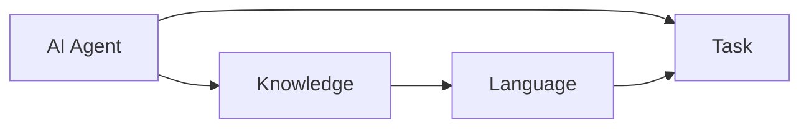
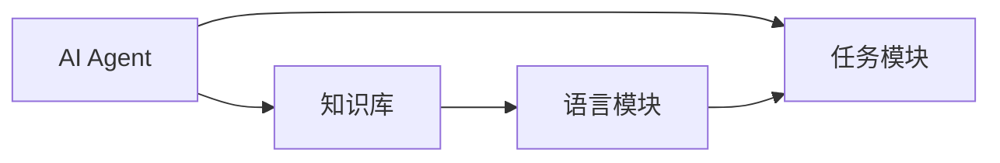
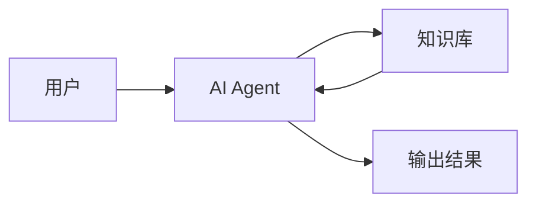

                 


# 实现AI Agent的跨语言知识迁移

> 关键词：AI Agent, 跨语言知识迁移, 多语言处理, 机器学习, 自然语言处理

> 摘要：本文详细探讨了AI Agent在跨语言知识迁移中的实现方法，从问题背景、核心概念、算法原理到系统设计和项目实战，层层剖析，旨在为读者提供全面的技术指导。

---

## 第一部分: AI Agent与跨语言知识迁移概述

### 第1章: 背景介绍

#### 1.1 问题背景
- **多语言环境中的知识表示问题**：在多语言环境中，AI Agent需要处理不同语言的信息，如何有效表示和迁移这些知识是关键。
- **AI Agent在跨语言场景中的挑战**：不同语言之间的语义差异导致知识迁移困难，需要找到有效的解决方法。
- **跨语言知识迁移的必要性**：通过跨语言迁移，AI Agent能够更高效地处理多语言任务。

#### 1.2 问题描述
- **AI Agent的定义与功能**：AI Agent是能够理解、推理和执行任务的智能体。
- **跨语言知识迁移的核心问题**：如何在不同语言之间迁移知识，保持语义一致性。
- **问题解决的路径与方法**：利用机器学习和自然语言处理技术，构建跨语言知识表示模型。

#### 1.3 问题解决
- **跨语言知识迁移的基本原理**：通过训练模型在多种语言间迁移知识，提升AI Agent的多语言处理能力。
- **AI Agent的知识表示与推理**：采用统一的知识表示框架，支持多语言推理。
- **跨语言迁移的具体实现方式**：利用预训练模型和迁移学习技术。

#### 1.4 边界与外延
- **跨语言知识迁移的边界条件**：明确适用范围和限制，避免超出技术能力。
- **相关概念的对比与区分**：区分跨语言迁移与多语言处理，明确技术边界。
- **技术的适用范围与限制**：分析技术在不同场景下的适用性和局限性。

#### 1.5 核心概念结构
- **核心要素组成**：包括AI Agent、知识表示、跨语言迁移等。
- **与其他技术的关系**：与自然语言处理、机器学习等技术密切相关。
- **系统架构的总体框架**：AI Agent为核心，结合知识库和迁移模型。

### 第2章: 核心概念与联系

#### 2.1 核心概念原理
- **跨语言知识迁移的数学模型**：构建统一的知识表示模型，支持多语言推理。
- **AI Agent的知识表示方法**：采用符号表示和分布表示相结合的方式。
- **跨语言迁移的核心算法**：利用预训练模型和自适应策略，实现跨语言知识迁移。

#### 2.2 概念属性特征对比
| 概念       | 特征1：知识表示 | 特征2：语言支持 | 特征3：迁移能力 |
|------------|----------------|----------------|----------------|
| AI Agent   | 统一知识库      | 多语言支持      | 跨语言迁移能力  |
| 跨语言迁移 | 语言中立表示     | 多语言适应性     | 跨语言推理能力  |

#### 2.3 ER实体关系图


## 第二部分: 算法原理讲解

### 第3章: 算法原理讲解

#### 3.1 算法流程


#### 3.2 核心算法代码
```python
def cross_language迁移(输入数据):
    特征提取(输入数据)
    知识表示(提取特征)
    跨语言迁移(知识表示)
    返回结果
```

#### 3.3 数学模型
- **知识表示模型**：$$y = f(x)$$
- **跨语言迁移模型**：$$z = g(y)$$

#### 3.4 举例说明
- **中文到英文的翻译**：使用神经机器翻译模型，实现跨语言知识迁移。
- **英文到中文的语义理解**：利用预训练的BERT模型，进行跨语言迁移。

## 第三部分: 系统分析与架构设计

### 第4章: 系统分析与架构设计

#### 4.1 应用场景
- **多语言客服系统**：AI Agent能够理解并处理多种语言的客户请求。
- **跨语言信息检索**：在不同语言间高效检索相关信息。

#### 4.2 系统功能设计
- **领域模型**：定义核心实体和关系，支持多语言处理。
- **系统架构**：采用微服务架构，支持模块化开发和扩展。

#### 4.3 系统架构图


#### 4.4 系统接口设计
- **输入接口**：接收多语言数据，进行预处理。
- **输出接口**：返回处理结果，支持多种语言输出。

#### 4.5 系统交互流程图


## 第四部分: 项目实战

### 第5章: 项目实战

#### 5.1 环境安装
- **安装Python和相关库**：如TensorFlow、Keras、Transformers。
- **安装依赖工具**：如Jupyter Notebook、虚拟环境管理工具。

#### 5.2 系统核心实现
```python
import tensorflow as tf
from transformers import BertTokenizer, BertModel

# 加载预训练模型
tokenizer = BertTokenizer.from_pretrained('bert-base-multilingual-cased')
model = BertModel.from_pretrained('bert-base-multilingual-cased')

# 定义输入
input_text_zh = "这是中文句子。"
input_text_en = "This is an English sentence."

# 分词处理
tokens_zh = tokenizer(input_text_zh, return_tensors='np')
tokens_en = tokenizer(input_text_en, return_tensors='np')

# 模型编码
outputs_zh = model(**tokens_zh)
outputs_en = model(**tokens_en)

# 获取隐藏层表示
last_hidden_state_zh = outputs_zh.last_hidden_state
last_hidden_state_en = outputs_en.last_hidden_state
```

#### 5.3 代码解读与分析
- **分词处理**：使用BertTokenizer对中文和英文句子进行分词。
- **模型编码**：利用预训练的多语言Bert模型，获取句子的隐藏层表示。
- **跨语言迁移**：通过比较和分析不同语言的隐藏层表示，实现跨语言知识迁移。

#### 5.4 实际案例分析
- **案例1**：中文到英文的翻译任务，使用神经机器翻译模型，实现跨语言迁移。
- **案例2**：英文到中文的语义理解，利用预训练的多语言模型，进行跨语言推理。

#### 5.5 项目小结
- **环境搭建**：安装必要的Python库和工具。
- **系统实现**：基于预训练模型，实现跨语言知识迁移的核心功能。
- **案例分析**：通过具体案例，验证系统的可行性和有效性。

## 第五部分: 总结与展望

### 第6章: 总结与展望

#### 6.1 最佳实践 tips
- **环境搭建**：确保安装正确的Python版本和依赖库。
- **代码实现**：合理利用预训练模型，简化开发流程。
- **系统测试**：进行全面的测试，确保系统的稳定性和准确性。

#### 6.2 小结
本文详细探讨了AI Agent在跨语言知识迁移中的实现方法，从背景、概念、算法到系统设计和项目实战，为读者提供了全面的技术指导。

#### 6.3 注意事项
- **数据预处理**：确保数据的多样性和平衡性，避免模型过拟合。
- **模型调优**：通过参数调节和模型优化，提升跨语言迁移的效果。

#### 6.4 拓展阅读
- **相关书籍**：《Deep Learning》、《Natural Language Processing with PyTorch》。
- **技术博客**：关注前沿技术博客，获取最新的跨语言知识迁移研究进展。

---

# 作者：AI天才研究院/AI Genius Institute & 禅与计算机程序设计艺术 /Zen And The Art of Computer Programming

