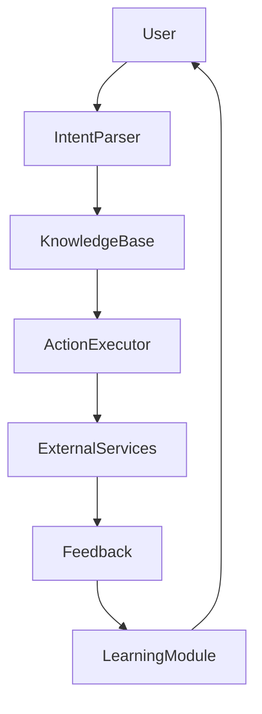
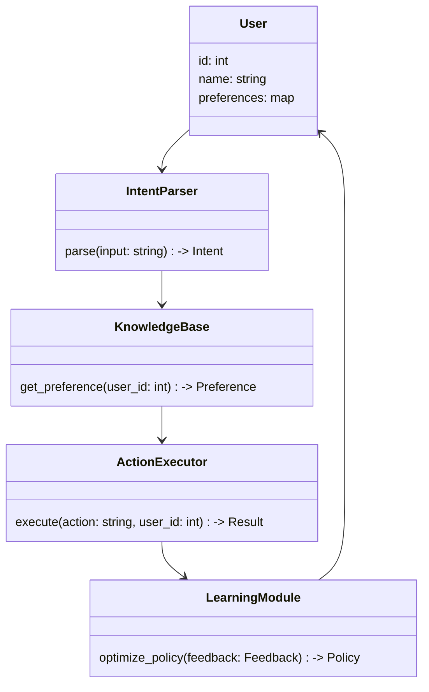
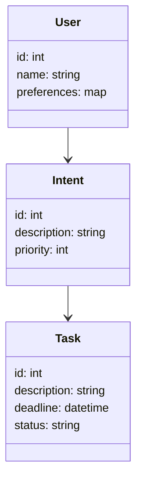
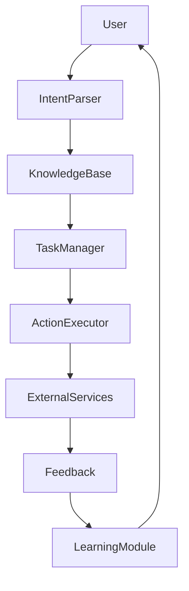

                 


# 实现基于AI Agent的个人助理系统

> 关键词：AI Agent, 个人助理系统, 多轮对话模型, 任务规划算法, 系统架构设计

> 摘要：本文将深入探讨基于AI Agent的个人助理系统的实现方法。从背景分析到核心概念，从算法原理到系统架构，从项目实战到进阶优化，全面解析如何构建一个高效、智能的个人助理系统。通过具体案例分析和代码实现，帮助读者掌握AI Agent的核心技术与实际应用。

---

# 第一部分: 基于AI Agent的个人助理系统背景与核心概念

## 第1章: 问题背景与需求分析

### 1.1 问题背景

#### 1.1.1 当前个人效率管理的痛点
在现代生活中，人们面临着日益复杂的任务管理和时间分配问题。传统的任务管理工具（如日历、待办事项列表）虽然能够帮助用户记录和跟踪任务，但缺乏智能化的决策支持。用户需要一个能够理解上下文、主动提供建议并执行任务的智能助手。

#### 1.1.2 AI技术在个人助理中的应用潜力
人工智能技术的快速发展，特别是自然语言处理（NLP）、机器学习（ML）和强化学习（RL）的进步，为实现智能个人助理提供了技术基础。AI Agent（智能体）能够通过理解用户意图、学习用户偏好，主动帮助用户完成任务。

#### 1.1.3 基于AI Agent的解决方案优势
与传统任务管理工具相比，基于AI Agent的个人助理具有以下优势：
1. **智能化**：能够理解用户的自然语言输入，并根据上下文提供个性化建议。
2. **主动性**：AI Agent可以主动发起任务，而不仅仅是在用户主动请求时响应。
3. **自适应性**：能够通过学习用户的偏好和行为模式，不断优化自身的服务策略。

### 1.2 需求分析

#### 1.2.1 用户需求层次分析
用户对个人助理系统的需求可以分为以下几个层次：
1. **基本功能需求**：任务提醒、信息查询、日历管理等。
2. **交互体验需求**：支持自然语言对话，界面友好，响应速度快。
3. **个性化需求**：根据用户的习惯和偏好，提供定制化服务。
4. **隐私与安全需求**：确保用户数据的安全性，保护用户隐私。

#### 1.2.2 系统功能需求分解
基于用户需求，我们可以将系统功能分解为以下几个模块：
1. **用户意图解析模块**：解析用户的自然语言输入，提取任务目标和优先级。
2. **知识库管理模块**：存储用户偏好、历史行为数据和任务相关信息。
3. **行动执行模块**：根据解析的任务目标，调用外部服务（如日历、邮件、天气预报等）完成任务。
4. **学习与优化模块**：通过强化学习优化AI Agent的行为策略。

#### 1.2.3 边界与外延定义
在实现过程中，我们需要明确系统的边界和外延：
1. **边界**：系统仅负责解析用户意图、执行任务和优化策略，不直接参与外部服务的实现（如日历、邮件服务）。
2. **外延**：系统可以通过API调用第三方服务，扩展功能（如天气查询、航班预订等）。

### 1.3 本章小结
本章从背景分析出发，阐述了基于AI Agent的个人助理系统的需求和技术优势，为后续的系统设计奠定了基础。

---

## 第2章: AI Agent的核心概念与系统架构

### 2.1 AI Agent的基本原理

#### 2.1.1 AI Agent的定义与特征
AI Agent是一种能够感知环境、自主决策并采取行动以实现目标的智能实体。其核心特征包括：
1. **自主性**：能够在没有外部干预的情况下运行。
2. **反应性**：能够实时感知环境并做出反应。
3. **主动性**：能够主动发起行动以实现目标。
4. **学习能力**：能够通过经验优化自身的决策策略。

#### 2.1.2 多智能体系统（Multi-Agent System）的概念
多智能体系统是指由多个相互作用的智能体组成的系统。在个人助理系统中，AI Agent需要与外部服务（如日历、邮件服务器）以及用户进行交互。

#### 2.1.3 基于AI Agent的个人助理系统架构
基于AI Agent的个人助理系统架构可以分为以下几个部分：
1. **用户意图解析模块**：解析用户的自然语言输入，生成任务描述。
2. **知识库管理模块**：存储用户偏好、历史行为数据等。
3. **行动执行模块**：根据任务描述，调用外部服务完成任务。
4. **学习与优化模块**：通过强化学习优化AI Agent的行为策略。

### 2.2 实体关系与系统架构图

#### 2.2.1 实体关系图


#### 2.2.2 系统架构图


### 2.3 核心概念对比分析

#### 2.3.1 AI Agent与传统任务自动化工具的对比
| 特性                | AI Agent                  | 传统任务自动化工具 |
|---------------------|---------------------------|---------------------|
| **自主性**          | 高                         | 低                   |
| **学习能力**        | 高                         | 无                   |
| **交互方式**        | 支持自然语言对话           | 基于固定界面或命令行 |

#### 2.3.2 基于规则的AI Agent与基于模型的AI Agent的对比
| 特性                | 基于规则的AI Agent         | 基于模型的AI Agent  |
|---------------------|---------------------------|---------------------|
| **灵活性**          | 低                         | 高                   |
| **可扩展性**        | 低                         | 高                   |
| **学习能力**        | 无                         | 有                   |

#### 2.3.3 单体AI Agent与分布式AI Agent的对比
| 特性                | 单体AI Agent               | 分布式AI Agent      |
|---------------------|---------------------------|---------------------|
| **计算能力**        | 依赖单台设备               | 分散到多台设备       |
| **扩展性**          | 有限                       | 较高                 |
| **容错性**          | 低                         | 高                   |

### 2.4 本章小结
本章详细介绍了AI Agent的核心概念和系统架构，为后续的算法设计和系统实现奠定了理论基础。

---

# 第二部分: AI Agent的算法原理与数学模型

## 第3章: 多轮对话模型

### 3.1 基于Transformer的对话模型

#### 3.1.1 Transformer模型的基本结构
Transformer模型由编码器（Encoder）和解码器（Decoder）组成，每个编码器和解码器层包含多头自注意力机制（Multi-Head Attention）和前馈神经网络（Feed-Forward Network）。

#### 3.1.2 基于Transformer的对话生成机制
在对话生成过程中，解码器通过自注意力机制捕捉上下文信息，并结合编码器输出的语义信息生成响应。

#### 3.1.3 多轮对话的上下文处理
多轮对话需要处理上下文信息，确保每次对话都能保持一致性和连贯性。可以通过在解码器中引入位置编码（Positional Encoding）来实现。

### 3.2 对话策略优化算法

#### 3.2.1 基于强化学习的对话策略优化
强化学习（Reinforcement Learning）通过定义奖励函数（Reward Function）来优化对话策略。常用的强化学习算法包括Q-Learning和Deep Q-Network（DQN）。

#### 3.2.2 基于监督学习的对话策略优化
监督学习（Supervised Learning）通过训练数据中的正确响应来优化对话策略。常用的算法包括最大似然估计（Maximum Likelihood Estimation, MLE）和对抗训练（Adversarial Training）。

#### 3.2.3 基于混合学习的对话策略优化
混合学习（Hybrid Learning）结合了强化学习和监督学习的优点，通过在训练过程中同时优化奖励函数和损失函数来提高对话质量。

### 3.3 对话模型的数学公式

#### 3.3.1 Transformer的自注意力机制
$$\text{Attention}(Q, K, V) = \text{softmax}\left(\frac{QK^T}{\sqrt{d_k}}\right)V$$

其中：
- $Q$是查询向量
- $K$是键向量
- $V$是值向量
- $d_k$是键向量的维度

#### 3.3.2 基于强化学习的奖励函数
$$R(s, a) = r_1 \cdot f_1(s, a) + r_2 \cdot f_2(s, a) + \dots + r_n \cdot f_n(s, a)$$

其中：
- $r_i$是特征$f_i$的权重
- $f_i(s, a)$是特征$f_i$的计算函数

### 3.4 本章小结
本章详细介绍了多轮对话模型的实现方法，重点分析了基于Transformer的对话生成机制和对话策略优化算法。

---

## 第4章: 任务规划与执行算法

### 4.1 任务规划的基本原理

#### 4.1.1 基于图搜索的任务规划方法
图搜索（Graph Search）是一种经典的任务规划方法，适用于任务空间较小的情况。常用的算法包括广度优先搜索（BFS）和深度优先搜索（DFS）。

#### 4.1.2 基于强化学习的任务规划方法
强化学习（Reinforcement Learning）通过定义奖励函数来优化任务规划策略。常用的算法包括Q-Learning和Deep Q-Network（DQN）。

#### 4.1.3 基于分解的任务规划方法
任务分解（Task Decomposition）是一种将复杂任务分解为子任务的方法，适用于任务空间较大的情况。常用的分解方法包括层次任务分解（Hierarchical Task Decomposition）和马尔可夫决策过程（MDP）。

### 4.2 任务执行的数学模型

#### 4.2.1 基于马尔可夫决策过程的任务规划
$$V(s) = \max_{a} \left[ r(s,a) + \gamma V(s') \right]$$

其中：
- $s$是当前状态
- $a$是动作
- $r(s,a)$是奖励函数
- $\gamma$是折扣因子
- $s'$是下一个状态

#### 4.2.2 基于强化学习的任务执行策略
$$\pi(a|s) = \text{softmax}(Q(s,a))$$

其中：
- $Q(s,a)$是状态-动作值函数
- $\pi(a|s)$是动作$a$在状态$s$下的概率

### 4.3 本章小结
本章重点分析了任务规划与执行的算法原理，介绍了基于图搜索、强化学习和任务分解的实现方法。

---

# 第三部分: 系统分析与架构设计

## 第5章: 系统功能设计

### 5.1 功能模块划分

#### 5.1.1 用户意图解析模块
用户意图解析模块负责解析用户的自然语言输入，生成任务描述和优先级。

#### 5.1.2 知识库管理模块
知识库管理模块负责存储和管理用户的偏好、历史行为数据和任务相关信息。

#### 5.1.3 行动执行模块
行动执行模块负责根据任务描述，调用外部服务完成任务。

#### 5.1.4 学习与优化模块
学习与优化模块负责通过强化学习优化AI Agent的行为策略。

### 5.2 领域模型设计

#### 5.2.1 用户实体关系图


#### 5.2.2 系统功能流程图


### 5.3 本章小结
本章详细描述了系统的功能模块划分和领域模型设计，为后续的系统架构设计奠定了基础。

---

## 第6章: 系统架构设计

### 6.1 系统架构设计

#### 6.1.1 分层架构设计
系统的分层架构包括以下几个层次：
1. **表现层**：负责与用户的交互，包括自然语言处理和图形界面展示。
2. **业务逻辑层**：负责解析用户意图、调用外部服务和管理任务。
3. **数据访问层**：负责与知识库和外部服务进行交互。

#### 6.1.2 微服务架构设计
微服务架构是一种将系统功能分解为多个独立服务的设计方法。每个服务负责特定的功能模块，如用户管理、任务管理、外部服务调用等。

#### 6.1.3 分布式架构设计
分布式架构通过将系统功能分布在多个节点上，提高系统的可扩展性和容错性。常用的分布式架构包括服务网格（Service Mesh）和无服务器架构（Serverless Architecture）。

### 6.2 系统接口设计

#### 6.2.1 用户意图解析接口
```python
class IntentParser:
    def parse_intent(self, input: str) -> Intent:
        pass
```

#### 6.2.2 任务管理接口
```python
class TaskManager:
    def create_task(self, task: Task) -> bool:
        pass
    def update_task(self, task_id: int, status: str) -> bool:
        pass
    def get_task(self, task_id: int) -> Task:
        pass
```

#### 6.2.3 外部服务调用接口
```python
class ActionExecutor:
    def execute_action(self, action: str, user_id: int) -> Result:
        pass
```

### 6.3 系统交互流程图

#### 6.3.1 用户发起请求

```mermaid
sequenceDiagram
    User ->> IntentParser: 发起请求
    IntentParser ->> KnowledgeBase: 解析意图
    KnowledgeBase ->> TaskManager: 生成任务
    TaskManager ->> ActionExecutor: 执行任务
    ActionExecutor ->> ExternalServices: 调用外部服务
    ExternalServices ->> ActionExecutor: 返回结果
    ActionExecutor ->> User: 返回反馈
```


### 6.4 本章小结
本章详细描述了系统的架构设计和接口设计，为后续的系统实现奠定了基础。

---

## 第7章: 项目实战

### 7.1 环境安装

#### 7.1.1 Python环境配置
安装Python 3.8及以上版本，安装pip工具。

#### 7.1.2 安装依赖库
安装所需的依赖库，如TensorFlow、Keras、Flask、NLTK等。

```bash
pip install tensorflow.keras
pip install flask
pip install python-dotenv
```

### 7.2 系统核心实现

#### 7.2.1 用户意图解析模块
```python
class IntentParser:
    def __init__(self):
        self.model = load_model('intent_model.h5')
    
    def parse_intent(self, input: str) -> Intent:
        intent = self.model.predict(input)
        return Intent(description=intent['intent'], priority=intent['priority'])
```

#### 7.2.2 任务管理模块
```python
class TaskManager:
    def __init__(self, db_connection):
        self.db = db_connection
    
    def create_task(self, task: Task) -> bool:
        # 在数据库中创建任务
        pass
    
    def update_task(self, task_id: int, status: str) -> bool:
        # 更新任务状态
        pass
    
    def get_task(self, task_id: int) -> Task:
        # 获取任务详情
        pass
```

#### 7.2.3 行动执行模块
```python
class ActionExecutor:
    def __init__(self):
        self.calendar = CalendarAPI()
        self.mail = MailAPI()
    
    def execute_action(self, action: str, user_id: int) -> Result:
        if action == 'schedule Meeting':
            return self.calendar.schedule_meeting(user_id)
        elif action == 'send Email':
            return self.mail.send_email(user_id)
        # 其他动作...
```

### 7.3 代码应用解读与分析

#### 7.3.1 用户意图解析模块
用户意图解析模块是系统的核心模块之一，负责解析用户的自然语言输入，生成任务描述和优先级。

#### 7.3.2 任务管理模块
任务管理模块负责与数据库交互，管理任务的创建、更新和查询。

#### 7.3.3 行动执行模块
行动执行模块负责根据任务描述，调用外部服务完成任务，如日历管理、邮件发送等。

### 7.4 项目小结
本章通过具体的代码实现，展示了基于AI Agent的个人助理系统的实现过程，为读者提供了实践参考。

---

## 第8章: 进阶优化与注意事项

### 8.1 系统优化建议

#### 8.1.1 模型优化
- 使用更复杂的模型（如GPT-3、T5）提高对话质量。
- 优化训练数据，减少过拟合和欠拟合问题。

#### 8.1.2 系统性能优化
- 使用分布式架构提高系统的可扩展性和容错性。
- 优化数据库查询性能，减少响应时间。

### 8.2 开发注意事项

#### 8.2.1 数据隐私与安全
- 确保用户数据的安全性，防止数据泄露。
- 遵守相关法律法规，保护用户隐私。

#### 8.2.2 系统可维护性
- 设计清晰的模块划分，便于后续维护和升级。
- 使用版本控制工具（如Git）管理代码。

#### 8.2.3 系统可扩展性
- 设计灵活的接口，便于后续功能扩展。
- 使用插件机制，支持第三方服务的集成。

### 8.3 本章小结
本章总结了系统优化建议和开发注意事项，为读者提供了宝贵的实践经验。

---

## 第9章: 总结与展望

### 9.1 总结
本文详细介绍了基于AI Agent的个人助理系统的实现方法，从背景分析到核心概念，从算法原理到系统架构，从项目实战到进阶优化，全面解析了如何构建一个高效、智能的个人助理系统。

### 9.2 展望
随着人工智能技术的不断发展，基于AI Agent的个人助理系统将更加智能化和个性化。未来的研究方向包括：
1. **更复杂的对话模型**：如基于Transformer的变体模型（如T5、GPT-3）。
2. **更高效的任务规划算法**：如基于强化学习的分布式任务规划。
3. **更安全的数据处理机制**：如隐私保护技术（如联邦学习、同态加密）。

---

## 作者：AI天才研究院/AI Genius Institute & 禅与计算机程序设计艺术 /Zen And The Art of Computer Programming

---

以上是文章的完整目录和内容概要。希望这篇文章能够为读者提供有价值的参考和启发。

