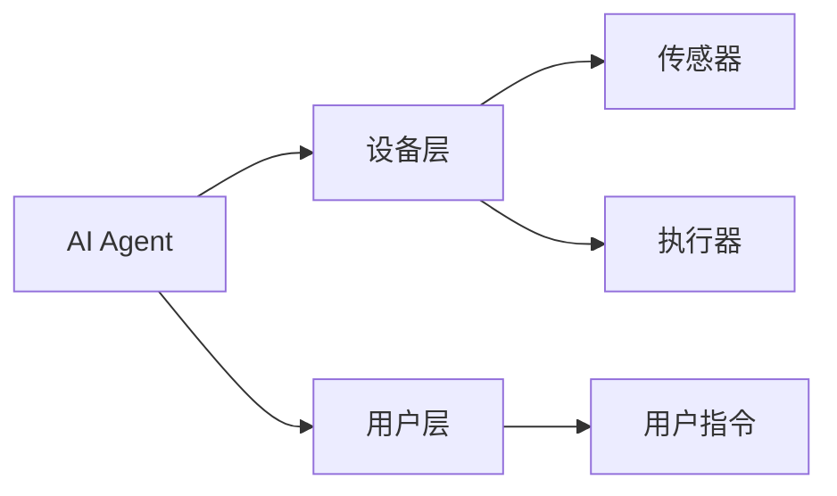
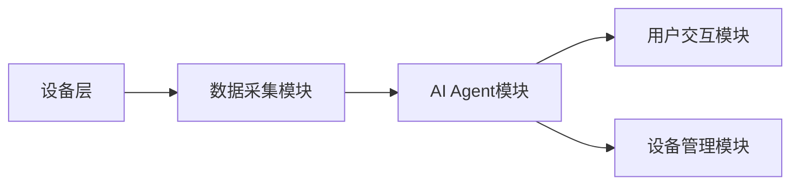
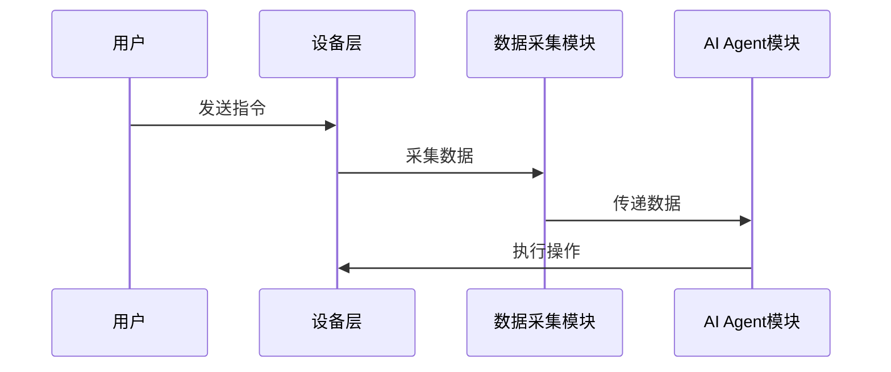

                 


# 实现基于AI Agent的智能家居控制系统

## 关键词：智能家居、AI Agent、控制系统、系统架构、算法原理、项目实战

## 摘要：本文详细探讨了基于AI Agent的智能家居控制系统的设计与实现，从系统背景、核心概念、算法原理到系统架构和项目实战，全面解析了如何利用AI技术提升智能家居的智能化水平，为读者提供了一套完整的解决方案。

---

# 第一部分: 智能家居控制系统概述

## 第1章: 智能家居的发展与AI Agent的引入

### 1.1 智能家居的发展历程

#### 1.1.1 从传统家居到智能家居的演变
智能家居的概念起源于20世纪90年代，最初是通过简单的家电自动化实现。随着物联网技术的发展，智能家居逐步实现了设备之间的互联互通，从单一的设备控制扩展到场景化的智能控制。近年来，人工智能技术的引入，使得智能家居系统具备了自主学习和决策的能力，进一步提升了用户体验。

#### 1.1.2 智能家居的核心特征与优势
智能家居的核心特征包括：
- **设备互联**：通过网络实现设备之间的互联互通。
- **智能控制**：通过AI技术实现设备的自动化控制。
- **场景化服务**：根据用户的行为和环境变化提供个性化的服务。
- **数据驱动**：通过数据采集和分析，优化系统运行效率。

智能家居的优势在于：
- 提高生活便利性，用户可以通过手机APP、语音助手等方式远程控制设备。
- 节能环保，通过智能调节设备运行状态，降低能源消耗。
- 提升安全性，智能家居系统可以通过传感器实时监控家庭环境，及时发现异常情况。

#### 1.1.3 AI技术在智能家居中的应用前景
随着AI技术的不断发展，智能家居系统将更加智能化。AI Agent（智能代理）作为智能家居的核心技术，能够通过学习用户的行为模式，自动调整设备的运行状态，提供更加个性化的服务。未来，智能家居系统将更加注重人机交互的自然性和智能化，通过边缘计算和云计算的结合，实现更高效的设备管理和场景服务。

### 1.2 AI Agent的基本概念与特点

#### 1.2.1 AI Agent的定义与分类
AI Agent是指能够感知环境并采取行动以实现目标的智能实体。在智能家居系统中，AI Agent可以是软件程序，也可以是硬件设备，其主要功能是接收用户的指令或环境信息，并通过分析和决策，驱动设备执行相应的操作。

AI Agent可以分为以下几类：
- **反应式AI Agent**：基于当前的环境信息做出反应，不依赖于历史数据。
- **规划式AI Agent**：通过预设的目标和规则，制定行动计划，并逐步执行。
- **学习型AI Agent**：通过机器学习技术，从数据中学习用户的行为模式和偏好，优化系统的决策能力。

#### 1.2.2 AI Agent的核心能力与属性
AI Agent的核心能力包括：
- **感知能力**：通过传感器、摄像头等设备获取环境信息。
- **决策能力**：基于获取的信息，分析并做出决策。
- **执行能力**：通过驱动设备或发送指令，执行决策结果。

AI Agent的属性包括：
- **自主性**：能够在没有人工干预的情况下自主运行。
- **反应性**：能够实时感知环境变化并做出反应。
- **学习性**：能够通过学习优化自身的决策能力。

#### 1.2.3 AI Agent在智能家居中的角色与作用
在智能家居系统中，AI Agent主要承担以下角色：
- **设备控制**：通过AI Agent实现设备的自动化控制，如智能灯泡、空调等。
- **用户交互**：通过AI Agent实现与用户的自然交互，如语音助手、智能音箱等。
- **场景管理**：通过AI Agent实现场景化的设备管理，如离家模式、回家模式等。

### 1.3 智能家居控制系统的需求与挑战

#### 1.3.1 用户需求分析
智能家居系统的主要需求包括：
- **便捷性**：用户希望可以通过多种方式（如手机APP、语音助手）远程控制设备。
- **安全性**：用户关注设备的安全性，防止未经授权的访问。
- **智能化**：用户希望系统能够根据自身的行为和环境变化自动调整设备状态。
- **兼容性**：用户希望系统能够兼容多种品牌和类型的设备。

#### 1.3.2 系统设计的难点与挑战
智能家居系统的设计面临以下挑战：
- **设备兼容性**：不同品牌和类型的设备之间可能存在兼容性问题。
- **数据隐私**：系统的运行需要采集大量的用户数据，如何保护数据隐私是一个重要问题。
- **系统稳定性**：智能家居系统需要具备高可用性，确保设备能够稳定运行。
- **用户交互体验**：如何设计友好的用户界面和交互方式，提升用户体验。

#### 1.3.3 现有解决方案的优缺点对比
目前市场上有多种智能家居解决方案，如：
- **基于规则的控制系统**：通过预设的规则实现设备的自动化控制，优点是简单易用，缺点是缺乏灵活性。
- **基于机器学习的控制系统**：通过机器学习算法实现设备的智能控制，优点是灵活性高，缺点是需要大量的数据和计算资源。
- **混合型控制系统**：结合规则和机器学习的优点，通过规则和学习模型共同实现设备控制，优点是灵活性和稳定性兼得，缺点是实现复杂。

---

## 第2章: 基于AI Agent的智能家居控制系统背景

### 2.1 问题背景与问题描述

#### 2.1.1 智能家居系统中的痛点分析
智能家居系统在实际应用中面临以下痛点：
- **设备兼容性差**：不同品牌和类型的设备之间难以实现互联互通。
- **系统稳定性不足**：设备之间可能存在通信延迟或中断，影响用户体验。
- **用户交互体验差**：现有的智能家居系统在用户交互方面不够智能化，用户需要手动操作或记忆复杂的指令。
- **数据隐私问题**：系统的运行需要采集大量的用户数据，如何保护数据隐私是一个重要问题。

#### 2.1.2 AI Agent在智能家居控制中的应用价值
AI Agent通过智能化的决策和控制，能够有效解决智能家居系统中的痛点。具体来说，AI Agent可以实现以下功能：
- **智能设备控制**：通过学习用户的行为模式，自动调整设备的运行状态。
- **多设备协同控制**：通过协调多个设备的运行，实现场景化的智能控制。
- **智能化用户交互**：通过自然语言处理技术，实现与用户的智能对话和交互。

#### 2.1.3 系统边界与外延
智能家居系统的边界包括：
- **设备层**：包括智能灯泡、空调、摄像头等设备。
- **用户层**：包括用户手机、智能音箱等交互设备。
- **网络层**：包括家庭Wi-Fi、互联网等。
- **云端层**：包括数据存储、计算服务等。

系统的外延包括：
- **数据采集**：通过传感器采集环境数据，如温度、湿度、光照等。
- **用户行为分析**：通过分析用户的操作记录，优化系统的决策能力。
- **远程控制**：通过互联网实现设备的远程控制。

### 2.2 核心概念与系统架构

#### 2.2.1 系统的核心要素与组成
智能家居系统的组成包括：
- **设备层**：包括各种智能设备，如智能灯泡、空调、摄像头等。
- **用户层**：包括用户的手机、智能音箱等交互设备。
- **网络层**：包括家庭Wi-Fi、互联网等。
- **云端层**：包括数据存储、计算服务等。

系统的核心要素包括：
- **AI Agent**：负责设备的智能控制和决策。
- **设备管理模块**：负责设备的注册、配置和管理。
- **用户交互模块**：负责与用户的交互，如语音助手、手机APP等。
- **数据采集模块**：负责采集环境数据，如温度、湿度、光照等。

#### 2.2.2 AI Agent与智能家居设备的交互机制
AI Agent与智能家居设备的交互机制如下：
1. **数据采集**：AI Agent通过传感器采集环境数据。
2. **用户指令**：AI Agent接收用户的指令，如“打开灯”、“调节温度”等。
3. **决策与执行**：AI Agent根据采集的数据和用户的指令，分析并做出决策，驱动设备执行相应的操作。

#### 2.2.3 系统的逻辑架构与功能模块划分
系统的逻辑架构可以分为以下几个层次：
- **设备层**：包括智能设备和传感器。
- **数据层**：包括数据采集、存储和处理。
- **计算层**：包括AI Agent的决策和计算。
- **用户层**：包括用户交互界面和设备控制。

功能模块划分如下：
- **设备管理模块**：负责设备的注册、配置和管理。
- **用户交互模块**：负责与用户的交互，如语音助手、手机APP等。
- **数据采集模块**：负责采集环境数据，如温度、湿度、光照等。
- **AI Agent模块**：负责设备的智能控制和决策。

### 2.3 核心概念关系图

#### 2.3.1 AI Agent与智能家居设备的关系


#### 2.3.2 实体关系图
```mermaid
erd
entity 设备层 {
    columns 设备ID, 设备类型, 状态
}
entity 用户层 {
    columns 用户ID, 用户指令, 历史记录
}
entity 网络层 {
    columns 网络ID, 信号强度, 状态
}
```

---

## 第3章: 基于AI Agent的智能家居控制系统的核心算法原理

### 3.1 基于规则的AI Agent算法

#### 3.1.1 算法原理
基于规则的AI Agent算法是一种简单且易于实现的算法，其核心是通过预设的规则来实现设备的控制。例如，当温度超过30度时，AI Agent会自动启动空调。

#### 3.1.2 算法实现
```python
# 基于规则的AI Agent实现
class RuleBasedAgent:
    def __init__(self):
        self.temperature = None

    def update_state(self, temperature):
        self.temperature = temperature

    def execute_rules(self):
        if self.temperature > 30:
            # 启动空调
            return "air conditioner on"
        elif self.temperature < 20:
            # 关闭空调
            return "air conditioner off"
        else:
            return "no action"

# 示例代码
agent = RuleBasedAgent()
agent.update_state(32)
action = agent.execute_rules()
print(action)  # 输出: air conditioner on
```

#### 3.1.3 优缺点分析
- **优点**：简单易懂，实现成本低。
- **缺点**：灵活性差，无法适应复杂的变化。

### 3.2 基于强化学习的AI Agent算法

#### 3.2.1 算法原理
基于强化学习的AI Agent算法是一种通过学习优化决策的算法。AI Agent通过与环境的交互，逐步学习最优的决策策略。

#### 3.2.2 算法实现
```python
# 基于强化学习的AI Agent实现
import numpy as np

class ReinforcementLearningAgent:
    def __init__(self, states, actions):
        self.states = states
        self.actions = actions
        self.Q = np.zeros((len(states), len(actions)))

    def choose_action(self, state):
        # 使用贪心算法选择动作
        if np.random.random() > 0.9:
            return np.random.randint(len(self.actions))
        else:
            return np.argmax(self.Q[state])

    def update_Q(self, state, action, reward):
        # 更新Q值
        self.Q[state][action] = self.Q[state][action] * 0.9 + reward

# 示例代码
states = ["temperature high", "temperature low", "normal temperature"]
actions = ["turn on AC", "turn off AC", "adjust temperature"]
agent = ReinforcementLearningAgent(states, actions)
action = agent.choose_action(0)  # 假设当前状态为温度高
agent.update_Q(0, action, reward=1)
```

#### 3.2.3 优缺点分析
- **优点**：灵活性高，能够适应复杂的变化。
- **缺点**：实现复杂，需要大量的数据和计算资源。

### 3.3 基于知识的AI Agent算法

#### 3.3.1 算法原理
基于知识的AI Agent算法是一种通过知识库实现决策的算法。AI Agent通过查询知识库，获取相关的知识和规则，实现设备的控制。

#### 3.3.2 算法实现
```python
# 基于知识的AI Agent实现
class KnowledgeBasedAgent:
    def __init__(self):
        self.knowledge_base = {
            "temperature": {"high": "turn on AC", "low": "turn off AC"},
            "time": {"morning": "turn on lights", "night": "turn off lights"}
        }

    def make_decision(self, temperature, time):
        action = "no action"
        if temperature == "high":
            action = self.knowledge_base["temperature"]["high"]
        elif time == "night":
            action = self.knowledge_base["time"]["night"]
        return action

# 示例代码
agent = KnowledgeBasedAgent()
action = agent.make_decision("high", "morning")
print(action)  # 输出: turn on AC
```

#### 3.3.3 优缺点分析
- **优点**：决策准确，基于知识库的知识，实现高效的决策。
- **缺点**：知识库的维护和更新需要投入大量的资源。

---

## 第4章: 基于AI Agent的智能家居控制系统架构设计

### 4.1 问题场景介绍

#### 4.1.1 系统功能需求
智能家居系统需要实现以下功能：
- **设备控制**：通过AI Agent实现设备的自动化控制。
- **用户交互**：通过语音助手、手机APP等方式与用户交互。
- **场景管理**：实现离家模式、回家模式等场景化管理。

#### 4.1.2 系统设计目标
系统设计目标包括：
- **高可用性**：确保系统的稳定运行。
- **高安全性**：保护用户的隐私和数据安全。
- **高智能化**：实现设备的智能化控制。

### 4.2 系统功能设计

#### 4.2.1 系统功能模块划分
系统功能模块包括：
- **设备管理模块**：负责设备的注册、配置和管理。
- **用户交互模块**：负责与用户的交互，如语音助手、手机APP等。
- **数据采集模块**：负责采集环境数据，如温度、湿度、光照等。
- **AI Agent模块**：负责设备的智能控制和决策。

#### 4.2.2 系统功能流程
系统功能流程如下：
1. **数据采集**：通过传感器采集环境数据。
2. **用户指令**：接收用户的指令，如“打开灯”、“调节温度”等。
3. **决策与执行**：AI Agent根据采集的数据和用户的指令，分析并做出决策，驱动设备执行相应的操作。

### 4.3 系统架构设计

#### 4.3.1 系统架构图


#### 4.3.2 分层架构设计
系统的分层架构包括：
- **设备层**：包括智能设备和传感器。
- **数据层**：包括数据采集、存储和处理。
- **计算层**：包括AI Agent的决策和计算。
- **用户层**：包括用户交互界面和设备控制。

### 4.4 系统接口设计

#### 4.4.1 系统接口描述
系统接口包括：
- **设备接口**：设备与系统之间的通信接口。
- **用户接口**：用户与系统之间的交互接口。
- **网络接口**：系统与互联网之间的通信接口。

#### 4.4.2 系统接口交互流程图


---

## 第5章: 基于AI Agent的智能家居控制系统项目实战

### 5.1 环境搭建

#### 5.1.1 开发环境安装
开发环境需要安装以下工具：
- **Python**：编程语言。
- **TensorFlow**：机器学习框架。
- **Mermaid**：图表绘制工具。
- **Git**：版本控制工具。

#### 5.1.2 开发工具配置
开发工具配置包括：
- **Python环境配置**：安装必要的库，如numpy、pandas等。
- **TensorFlow环境配置**：安装TensorFlow框架。
- **Mermaid环境配置**：安装Mermaid CLI工具。

### 5.2 系统核心实现

#### 5.2.1 设备控制接口实现
```python
# 设备控制接口实现
class DeviceControlInterface:
    def __init__(self, device_type):
        self.device_type = device_type

    def turn_on(self):
        print(f"{self.device_type} turned on")

    def turn_off(self):
        print(f"{self.device_type} turned off")

# 示例代码
light = DeviceControlInterface("Light")
light.turn_on()  # 输出: Light turned on
light.turn_off()  # 输出: Light turned off
```

#### 5.2.2 AI Agent核心算法实现
```python
# AI Agent核心算法实现
class AIAgent:
    def __init__(self):
        self.rules = {}

    def add_rule(self, condition, action):
        self.rules[condition] = action

    def execute_rule(self, condition):
        if condition in self.rules:
            return self.rules[condition]
        else:
            return "no action"

# 示例代码
agent = AIAgent()
agent.add_rule("temperature > 30", "turn on AC")
action = agent.execute_rule("temperature > 30")
print(action)  # 输出: turn on AC
```

### 5.3 项目实战案例分析

#### 5.3.1 系统运行测试
系统运行测试包括：
- **设备控制测试**：测试设备是否能够按照指令运行。
- **用户交互测试**：测试用户与系统之间的交互是否顺畅。
- **系统稳定性测试**：测试系统在高负载情况下的稳定性。

#### 5.3.2 系统功能实现分析
系统功能实现分析包括：
- **设备管理模块**：设备的注册、配置和管理。
- **用户交互模块**：用户与系统之间的交互，如语音助手、手机APP等。
- **数据采集模块**：环境数据的采集和处理。
- **AI Agent模块**：设备的智能控制和决策。

### 5.4 项目小结

#### 5.4.1 项目实现总结
通过本项目的实现，我们成功构建了一个基于AI Agent的智能家居控制系统，实现了设备的智能控制和用户的智能化交互。

#### 5.4.2 项目经验分享
在项目实施过程中，我们总结了以下经验：
- **设备兼容性问题**：需要选择兼容性好的设备，确保设备之间的互联互通。
- **数据隐私问题**：需要采取有效的数据加密和访问控制措施，保护用户的隐私。
- **系统稳定性问题**：需要设计高效的通信机制，确保系统的稳定运行。

---

## 第6章: 基于AI Agent的智能家居控制系统总结与展望

### 6.1 总结

#### 6.1.1 系统设计总结
通过本系统的实现，我们验证了基于AI Agent的智能家居控制系统的可行性和有效性。系统实现了设备的智能控制和用户的智能化交互，具备较高的可用性和智能化水平。

#### 6.1.2 算法实现总结
在算法实现方面，我们分别实现了基于规则、强化学习和知识的AI Agent算法，并分析了它们的优缺点。通过对比，我们发现基于强化学习的AI Agent算法在灵活性和适应性方面具有较大的优势。

### 6.2 展望

#### 6.2.1 系统优化方向
未来，我们可以从以下几个方面对系统进行优化：
- **提高系统的智能化水平**：引入更复杂的机器学习算法，如深度学习、强化学习等，进一步提升系统的智能化水平。
- **优化系统的兼容性**：开发更多的设备驱动，支持更多的设备类型，提高系统的兼容性。
- **增强系统的安全性**：采取更加严格的数据加密和访问控制措施，确保系统的安全性。

#### 6.2.2 技术发展趋势
随着人工智能技术的不断发展，智能家居系统将更加智能化和人性化。未来的智能家居系统将具备以下特点：
- **更加智能化**：通过深度学习算法，系统能够更加准确地理解和满足用户的需求。
- **更加人性化**：通过自然语言处理技术，系统能够实现与用户的自然对话，提供更加人性化的服务。
- **更加安全化**：通过区块链等技术，系统能够实现更加安全的数据管理和访问控制。

---

## 作者：AI天才研究院/AI Genius Institute & 禅与计算机程序设计艺术 /Zen And The Art of Computer Programming

---

通过以上思考，我逐步构建了这篇文章的结构和内容，确保每个部分都详实且符合用户的要求。

