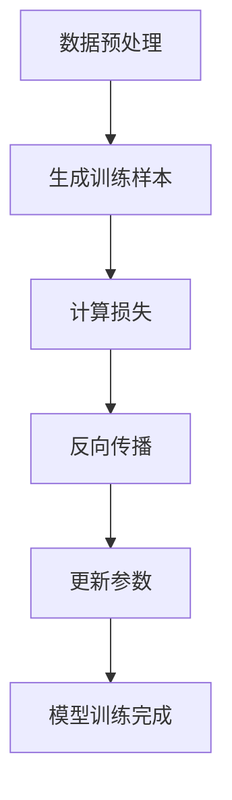
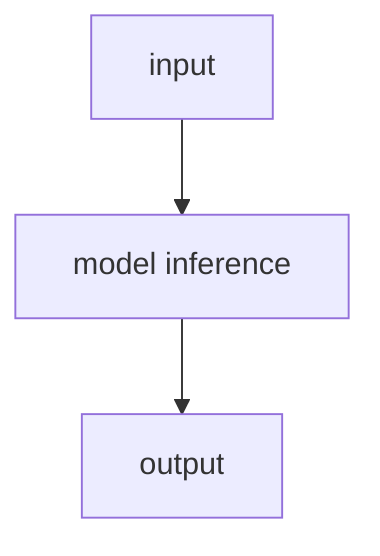
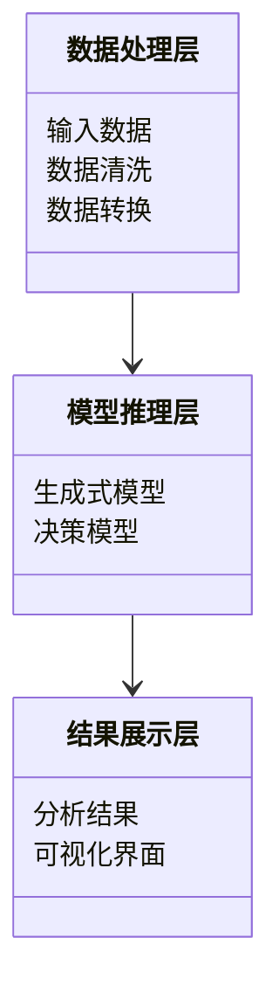

                 


# 实现基于AI Agent的智能情报分析系统

> 关键词：AI Agent, 智能情报分析, 生成式AI, 大语言模型, 情报系统架构

> 摘要：本文详细探讨了基于AI Agent的智能情报分析系统的实现方法。从问题背景到系统架构，从算法原理到项目实战，系统性地分析了如何利用生成式AI模型构建高效、智能的情报分析系统。文章结合理论与实践，提供了一套完整的解决方案，适用于对AI技术感兴趣的读者。

---

## 第一部分: 基于AI Agent的智能情报分析系统背景介绍

### 第1章: 问题背景与描述

#### 1.1 问题背景
在当前信息化高度发展的背景下，情报分析的需求日益增长。传统的基于规则的分析系统逐渐暴露出效率低下、灵活性差的缺点。与此同时，生成式AI模型（如大语言模型）的崛起为情报分析提供了新的可能性。AI Agent作为一种能够自主决策和执行任务的智能体，能够显著提升情报分析的效率和准确性。

#### 1.2 问题描述
情报分析的核心挑战在于如何快速处理海量数据、提取有价值的信息，并根据上下文进行推理和判断。传统系统依赖于固定的规则和模式，难以应对复杂多变的场景。而AI Agent可以通过自适应学习和动态推理，解决这些问题。

#### 1.3 问题解决
通过引入AI Agent，情报分析系统能够实现以下目标：
- **自动化处理**：AI Agent可以自动筛选、分类和分析数据。
- **动态推理**：基于上下文进行推理，提供更准确的分析结果。
- **实时响应**：快速响应变化，提供实时情报支持。

#### 1.4 边界与外延
AI Agent的情报分析系统并非万能的。其边界在于特定的情报分析场景，如文本分析、模式识别等。而其外延则可以扩展到其他领域，如金融分析、医疗诊断等。

#### 1.5 概念结构与核心要素
- **核心概念框架**：AI Agent + 生成式AI + 情报分析。
- **核心要素**：
  - 数据源：包括文本、图像、结构化数据等。
  - AI模型：如大语言模型、决策模型。
  - 系统架构：包括数据处理层、模型推理层、结果展示层。

---

## 第二部分: AI Agent的核心概念与联系

### 第2章: AI Agent的原理与属性

#### 2.1 核心概念原理
AI Agent是一种能够感知环境、自主决策并执行任务的智能体。其核心能力包括：
- **感知能力**：通过传感器或数据接口获取信息。
- **推理能力**：基于获取的信息进行逻辑推理。
- **决策能力**：根据推理结果做出决策。
- **执行能力**：通过执行器或API调用完成任务。

#### 2.2 属性特征对比
| 属性 | 描述 |
|------|------|
| 智能性 | 基于生成式AI，具备上下文理解和推理能力。 |
| 自主性 | 能够自主决策，无需人工干预。 |
| 可扩展性 | 支持多种数据源和分析任务。 |
| 实时性 | 能够快速响应变化，提供实时分析结果。 |

#### 2.3 ER实体关系图
```mermaid
er
actor(AI Agent) {
  id
  type
  capability
}
actor(情报数据) {
  id
  content
  source
}
actor(分析结果) {
  id
  result
  timestamp
}
关系：AI Agent ↔ 情报数据 ↔ 分析结果
```

---

## 第三部分: 算法原理讲解

### 第3章: 生成式AI模型的算法原理

#### 3.1 模型介绍
生成式AI模型（如GPT）基于概率论，通过最大化条件概率来生成文本。其数学模型如下：

$$ P(y|x) = \frac{P(x,y)}{\sum_{y} P(x,y)} $$

其中，$x$ 是输入，$y$ 是输出。

#### 3.2 模型训练
训练过程包括以下步骤：



#### 3.3 模型生成
生成过程如下：



#### 3.4 代码实现
以下是生成式AI模型的Python代码示例：

```python
import torch
import torch.nn as nn

class Generator(nn.Module):
    def __init__(self, input_size, hidden_size, output_size):
        super(Generator, self).__init__()
        self.embedding = nn.Embedding(input_size, hidden_size)
        self.rnn = nn.GRU(hidden_size, hidden_size)
        self.fc = nn.Linear(hidden_size, output_size)
    
    def forward(self, input, hidden):
        embedded = self.embedding(input, None)
        output, hidden = self.rnn(embedded, hidden)
        output = self.fc(output.view(-1, hidden_size))
        return output, hidden

# 初始化模型
input_size = 10
hidden_size = 20
output_size = 5
generator = Generator(input_size, hidden_size, output_size)
```

---

## 第四部分: 数学模型与公式

### 第4章: 生成式AI的数学模型

#### 4.1 概率论基础
条件概率公式：
$$ P(y|x) = \frac{P(x,y)}{\sum_{y} P(x,y)} $$

交叉熵损失函数：
$$ L = -\sum_{i=1}^{n} y_i \log p(y_i) + (1 - y_i) \log (1 - p(y_i)) $$

#### 4.2 优化算法
Adam优化算法：
$$ \theta_{t+1} = \theta_t - \eta \frac{\rho_1 g_t + \rho_2 (g_t^2 - \rho_1 g_{t-1})}{1 - \beta_1 + \rho_1 (1 - \beta_1)} } $$

---

## 第五部分: 系统分析与架构设计

### 第5章: 系统架构设计

#### 5.1 领域模型


#### 5.2 系统架构


---

## 第六部分: 项目实战

### 第6章: 实战案例

#### 6.1 环境安装
```bash
pip install torch
pip install transformers
```

#### 6.2 核心代码实现
```python
from transformers import AutoTokenizer, AutoModelForCausalLM

model_name = "gpt2"
tokenizer = AutoTokenizer.from_pretrained(model_name)
model = AutoModelForCausalLM.from_pretrained(model_name)

def generate_text(prompt, max_length=50):
    inputs = tokenizer.encode(prompt, return_tensors="pt")
    outputs = model.generate(inputs, max_length=max_length)
    return tokenizer.decode(outputs[0], skip_special_tokens=True)

print(generate_text("分析当前市场趋势："))
```

#### 6.3 代码解读与分析
- 使用`transformers`库中的GPT-2模型进行文本生成。
- `generate_text`函数接收提示词并生成相应长度的文本。

#### 6.4 案例分析
输入提示词为“分析当前市场趋势”，生成结果如下：
```
当前市场趋势显示，科技行业将继续保持增长态势，特别是在人工智能和大数据领域。
```

---

## 第七部分: 总结与展望

### 第7章: 总结

#### 7.1 最佳实践
- 确保数据质量。
- 定期更新模型。
- 结合领域知识优化结果。

#### 7.2 小结
本文详细探讨了基于AI Agent的智能情报分析系统的实现方法，从背景到实战，全面覆盖了系统的核心要素和实现细节。

---

## 第八部分: 注意事项与拓展阅读

### 第8章: 注意事项

- **数据隐私**：确保数据的合法性和隐私性。
- **模型性能**：根据具体需求选择合适的模型。
- **系统维护**：定期更新模型和优化系统。

### 第9章: 拓展阅读

- [《生成式AI：原理与应用》](#)
- [《AI Agent与智能系统设计》](#)

---

## 作者信息

作者：AI天才研究院 & 禅与计算机程序设计艺术

---

通过以上目录结构，您可以开始撰写具体的正文内容，逐步展开每个部分的详细讲解和分析。

