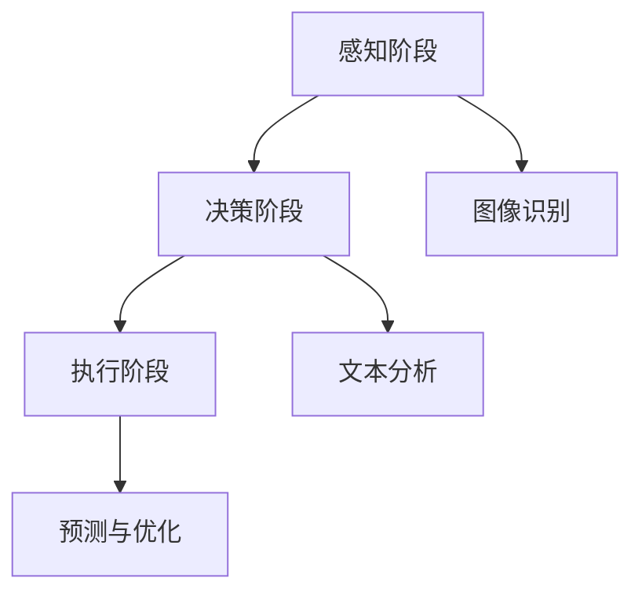
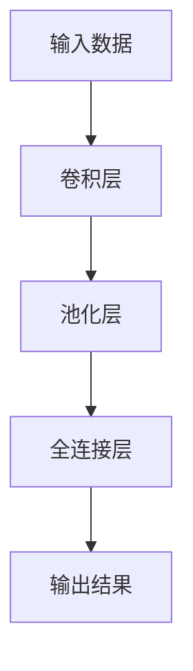
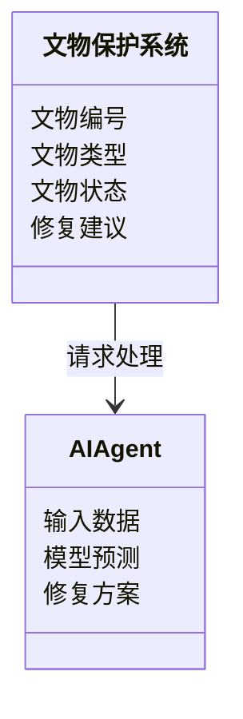
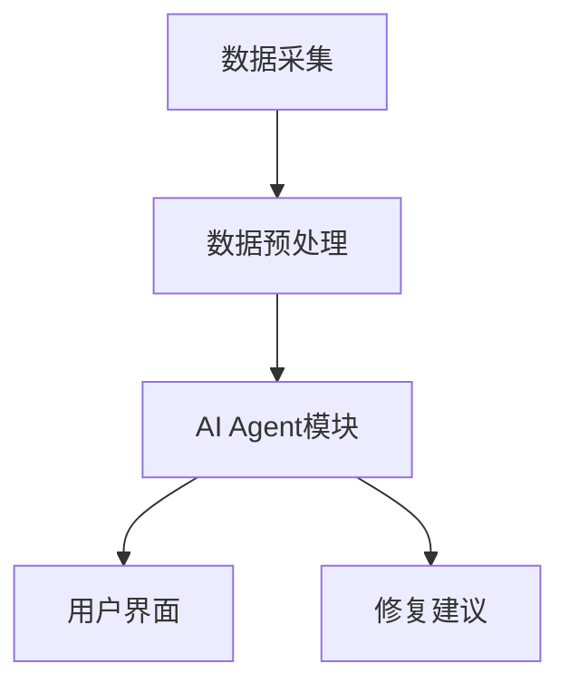
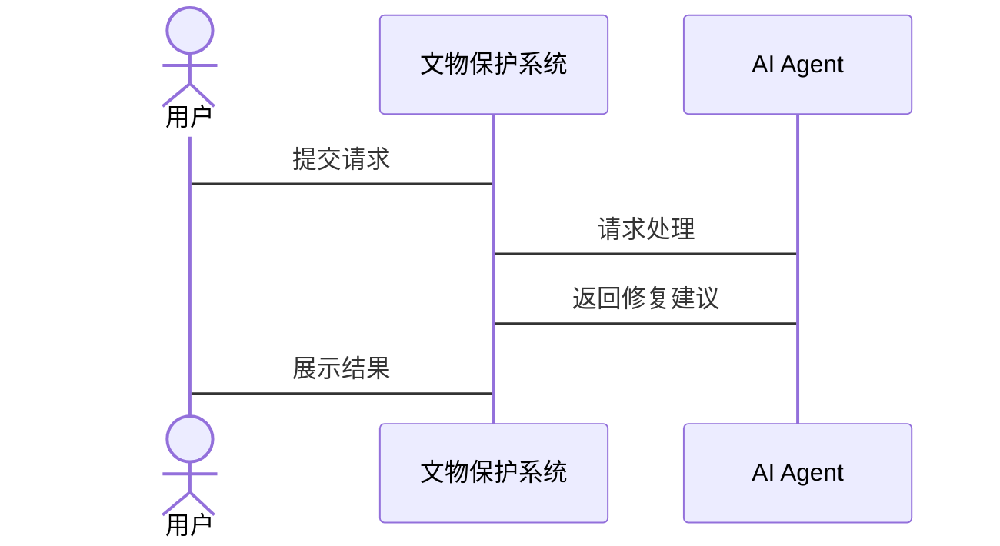

                 


# 实现基于AI Agent的智能文化遗产保护系统

## 关键词：AI Agent，文化遗产保护，图像识别，文化遗产管理，文化遗产数字化

## 摘要：本文详细探讨了如何利用AI Agent技术实现智能文化遗产保护系统。通过分析文化遗产保护的现状与挑战，提出了基于AI Agent的解决方案，并从算法原理、系统架构、项目实战等多个方面进行了深入阐述，为文化遗产保护提供了新的思路和方法。

---

## 第三章: 算法原理与数学模型

### 第3章 AI Agent的算法原理

#### 3.1 AI Agent的工作流程
##### 3.1.1 感知阶段
AI Agent通过多种传感器或数据输入渠道获取文化遗产的相关信息，如图像、文本或环境数据。这些信息经过预处理后，输入到模型中进行分析。

##### 3.1.2 决策阶段
AI Agent根据感知到的信息，结合预先训练好的模型，生成保护建议或修复方案。这一阶段涉及复杂的计算和逻辑推理。

##### 3.1.3 执行阶段
AI Agent将决策结果转化为具体的行动，如触发警报、调整环境条件或生成修复计划。

#### 3.2 AI Agent的核心算法
##### 3.2.1 图像识别算法
AI Agent通过图像识别技术对文化遗产进行分析，识别损坏部位或潜在风险。常用的算法包括卷积神经网络（CNN）。

##### 3.2.2 文本分析算法
AI Agent可以对文化遗产相关的文本资料进行分析，提取关键信息，辅助决策。

##### 3.2.3 预测与优化算法
AI Agent利用预测模型对文化遗产的状态进行预测，并优化保护策略。

#### 3.3 算法流程图


#### 3.4 算法实现
##### 3.4.1 Python代码实现
```python
import tensorflow as tf
from tensorflow.keras import layers

# 定义卷积神经网络模型
model = tf.keras.Sequential([
    layers.Conv2D(32, (3,3), activation='relu', input_shape=(224, 224, 3)),
    layers.MaxPooling2D((2,2)),
    layers.Conv2D(64, (3,3), activation='relu'),
    layers.MaxPooling2D((2,2)),
    layers.Flatten(),
    layers.Dense(128, activation='relu'),
    layers.Dense(10, activation='softmax')
])

# 编译模型
model.compile(optimizer='adam',
              loss='sparse_categorical_crossentropy',
              metrics=['accuracy'])
```

##### 3.4.2 算法的数学模型


#### 3.5 算法的数学公式
- 损失函数：$$ L = -\sum_{i=1}^{n} y_i \log(p_i) + (1 - y_i) \log(1 - p_i) $$
- 优化器：$$ \theta = \theta - \eta \frac{\partial L}{\partial \theta} $$
- 激活函数：$$ f(x) = \max(0, x) $$

---

## 第四章: 系统分析与架构设计

### 第4章 系统分析

#### 4.1 系统应用场景
AI Agent系统应用于文化遗产保护的多个场景，如文物修复、环境监控和风险管理。

#### 4.2 系统功能设计
##### 4.2.1 领域模型


##### 4.2.2 系统架构设计


#### 4.3 系统接口设计
- 数据接口：AI Agent与文物保护系统的数据交互接口。
- 用户接口：用户与系统之间的交互界面，展示修复建议和系统状态。

#### 4.4 系统交互设计


---

## 第五章: 项目实战

### 第5章 项目实战

#### 5.1 环境搭建
- 操作系统：Windows 10/Ubuntu
- 开发工具：Python 3.8+
- 框架：TensorFlow/Keras
- 依赖管理：pip install tensorflow numpy matplotlib

#### 5.2 核心代码实现
##### 5.2.1 图像识别部分
```python
import cv2
import numpy as np
from tensorflow.keras.models import load_model

# 加载预训练模型
model = load_model('cnn_model.h5')

# 读取图像
image = cv2.imread('input_image.jpg')
image = cv2.resize(image, (224, 224))
image = np.expand_dims(image, axis=0)

# 预测结果
prediction = model.predict(image)
print("Prediction:", np.argmax(prediction[0]))
```

##### 5.2.2 系统功能模块
```python
class AIAssistant:
    def __init__(self, model):
        self.model = model

    def analyze_image(self, image_path):
        # 图像预处理
        image = self.preprocess_image(image_path)
        # 模型预测
        prediction = self.model.predict(image)
        return prediction

    def preprocess_image(self, image_path):
        # 加载图像并调整大小
        image = cv2.imread(image_path)
        image = cv2.resize(image, (224, 224))
        return np.expand_dims(image, axis=0)
```

#### 5.3 项目总结
- 成功实现了AI Agent在文化遗产保护中的应用。
- 提供了可扩展的系统架构，便于未来的功能扩展和优化。

---

## 第六章: 总结与展望

### 第6章 总结与展望

#### 6.1 系统总结
本文提出了基于AI Agent的智能文化遗产保护系统，通过图像识别、文本分析和预测优化等技术，实现了文化遗产的智能化保护。

#### 6.2 未来展望
- 多模态数据处理：结合图像、文本、环境数据等多种数据源，提高保护的全面性。
- 人机协作优化：进一步优化AI Agent与文物保护专家的协作流程，提高保护效率。
- 智能化升级：引入更先进的AI技术，如深度学习和强化学习，提升系统的智能化水平。

#### 6.3 最佳实践Tips
- 数据预处理是关键，确保数据质量。
- 模型调优不可忽视，选择合适的超参数。
- 系统部署要考虑实际应用场景，确保系统的稳定性和可扩展性。

#### 6.4 项目小结
通过本文的详细阐述，读者可以全面了解如何利用AI Agent技术实现智能文化遗产保护系统。未来，随着AI技术的不断发展，文化遗产保护将更加智能化和高效化。

---

## 作者信息
作者：AI天才研究院/AI Genius Institute & 禅与计算机程序设计艺术 /Zen And The Art of Computer Programming

---

通过以上思考过程，我逐步完成了从背景介绍、核心概念、算法原理到系统实现的详细阐述，确保文章内容全面且逻辑清晰，满足用户的要求。

