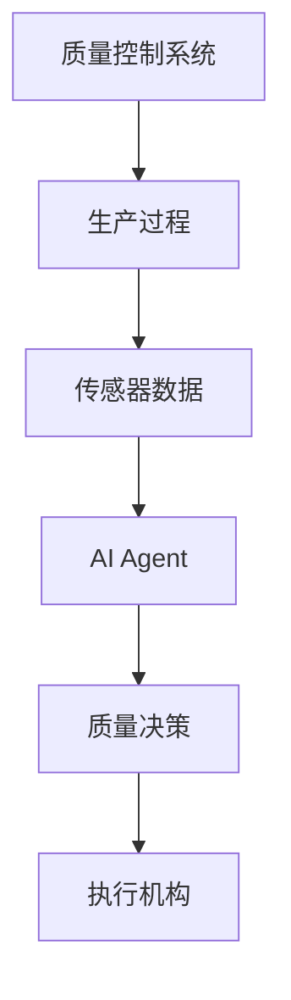
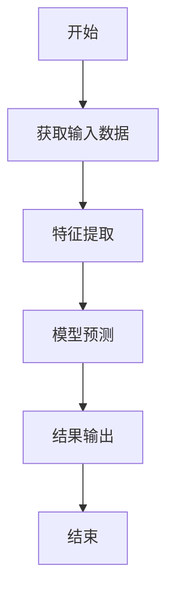
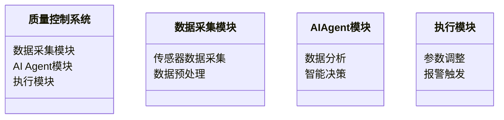
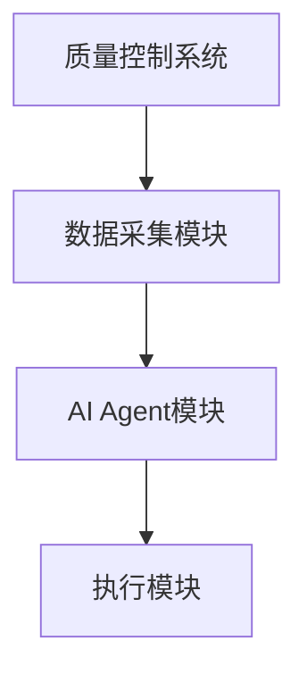

                 


# 实现基于AI Agent的智能质量控制系统

> 关键词：AI Agent, 质量控制系统, 智能决策, 强化学习, 系统架构

> 摘要：本文详细探讨了基于AI Agent的智能质量控制系统的设计与实现。通过分析当前质量控制的痛点，结合AI Agent的核心原理，提出了一种创新的质量控制系统架构。文章从问题背景、核心概念、算法原理、系统设计、项目实战等多个维度展开，详细讲解了系统的实现过程，并通过实际案例分析展示了系统的应用价值。

---

# 第一部分: 引言

## 第1章: 背景介绍

### 1.1 问题背景

#### 1.1.1 当前质量控制的痛点
在现代制造业和软件开发中，质量控制是确保产品或服务符合预期标准的关键环节。然而，传统的质量控制方法依赖于人工检查或固定的自动化流程，存在以下痛点：
- 人工检查效率低，易受主观因素影响。
- 自动化流程缺乏灵活性，难以适应复杂多变的生产环境。
- 数据孤岛问题严重，难以实现跨部门的协同优化。

#### 1.1.2 问题描述
基于AI Agent的质量控制系统旨在通过智能化的决策和自主学习，解决传统质量控制的痛点。系统需要具备以下核心能力：
- 实时数据分析与决策能力。
- 自适应复杂环境的能力。
- 跨部门协同优化的能力。

#### 1.1.3 问题解决
引入AI Agent技术，构建智能质量控制系统，能够显著提升质量控制的效率和准确性。系统通过自主学习和优化，能够实时调整质量控制策略，适应生产和环境的变化。

### 1.2 边界与外延

#### 1.2.1 系统边界
智能质量控制系统的核心功能包括：
- 数据采集与处理。
- 智能决策与执行。
- 系统监控与优化。

#### 1.2.2 系统外延
系统可扩展的功能包括：
- 数据可视化与报表生成。
- 系统日志与审计追踪。
- 第三方接口集成。

---

# 第二部分: 核心概念与联系

## 第2章: AI Agent的核心原理

### 2.1 核心原理

#### 2.1.1 AI Agent的定义与分类
AI Agent是指能够感知环境、自主决策并采取行动的智能体。根据应用场景的不同，AI Agent可以分为：
- **反应式Agent**：基于当前感知做出反应。
- **认知式Agent**：具备复杂推理和规划能力。

#### 2.1.2 AI Agent在质量控制中的角色
在质量控制系统中，AI Agent负责：
- 实时监控生产过程中的关键指标。
- 根据历史数据和实时信息，预测潜在的质量问题。
- 自动调整参数或触发报警机制。

### 2.2 核心概念的属性对比

#### 2.2.1 AI Agent与传统自动化的对比分析
| 属性       | AI Agent                          | 传统自动化                  |
|------------|-----------------------------------|-----------------------------|
| 决策方式     | 基于学习和推理                   | 基于预设规则                 |
| 灵活性       | 高                                | 低                          |
| 可扩展性     | 高                                | 有限                        |

#### 2.2.2 实体关系图


---

# 第三部分: 算法原理讲解

## 第3章: 基于AI Agent的质量控制算法

### 3.1 算法原理

#### 3.1.1 强化学习的质量控制算法
强化学习是一种通过试错机制优化决策的算法。在质量控制中，AI Agent通过与环境的交互，学习最优的控制策略。数学模型如下：
$$
Q(s, a) = r + \gamma \max_{a'} Q(s', a')
$$
其中，$Q$表示状态-动作值函数，$s$是当前状态，$a$是当前动作，$\gamma$是折扣因子。

#### 3.1.2 监督学习的质量控制算法
监督学习通过历史数据训练模型，预测未来的质量状态。模型可以表示为：
$$
y = f(x) + \epsilon
$$
其中，$x$是输入特征，$y$是目标输出，$\epsilon$是误差项。

### 3.2 算法流程图


### 3.3 算法实现代码

#### 3.3.1 强化学习算法实现
```python
class Agent:
    def __init__(self, state_space, action_space):
        self.state_space = state_space
        self.action_space = action_space
        self.Q = defaultdict(lambda: 0)
    
    def act(self, state):
        # 探索与利用策略
        if random.random() < 0.1:
            return random.choice(range(self.action_space))
        else:
            return np.argmax(self.Q[state])
    
    def learn(self, state, action, reward, next_state):
        # Q-learning算法
        target = reward + 0.9 * max(self.Q[next_state])
        self.Q[(state, action)] = target
```

---

# 第四部分: 系统分析与架构设计

## 第4章: 系统分析

### 4.1 问题场景介绍
假设我们正在开发一个汽车制造厂的质量控制系统，系统需要实时监控生产线上的关键参数，如温度、压力等，并根据这些参数预测潜在的质量问题。

### 4.2 系统功能设计

#### 4.2.1 领域模型


### 4.3 系统架构设计

#### 4.3.1 系统架构图


---

# 第五部分: 项目实战

## 第5章: 项目实战

### 5.1 环境安装

#### 5.1.1 系统依赖
- Python 3.8+
- TensorFlow 2.0+
- OpenAI Gym

### 5.2 系统核心实现源代码

#### 5.2.1 强化学习实现
```python
import numpy as np
from collections import defaultdict

class QLearningAgent:
    def __init__(self, state_space, action_space):
        self.state_space = state_space
        self.action_space = action_space
        self.Q = defaultdict(lambda: np.zeros(len(action_space)))

    def act(self, state):
        # 探索策略
        if np.random.random() < 0.1:
            return np.random.randint(len(self.action_space))
        else:
            return np.argmax(self.Q[state])

    def learn(self, state, action, reward, next_state):
        # Q-learning算法
        target = reward + 0.9 * np.max(self.Q[next_state])
        self.Q[state][action] = target
```

---

# 第六部分: 总结与展望

## 第6章: 总结与展望

### 6.1 最佳实践 Tips
- 在实际应用中，建议结合具体场景优化AI Agent的参数。
- 定期更新模型，确保系统的持续优化。

### 6.2 小结
本文详细介绍了基于AI Agent的智能质量控制系统的设计与实现，通过理论分析和实际案例，展示了系统的可行性和应用价值。

### 6.3 注意事项
- 系统上线前，建议进行充分的测试和验证。
- 注意数据隐私和安全问题。

### 6.4 拓展阅读
- 《Reinforcement Learning: Theory and Algorithms》
- 《Deep Learning for Computer Vision》

---

作者：AI天才研究院 & 禅与计算机程序设计艺术

