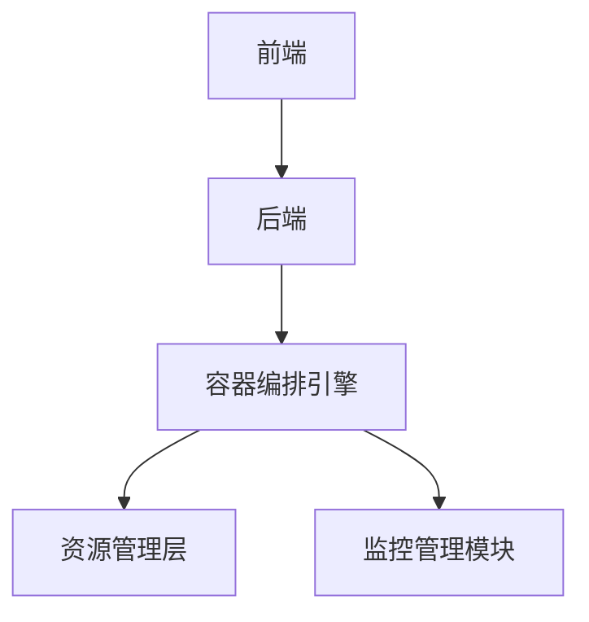

                 


# 容器化部署：简化AI Agent的运维管理

> **关键词**：容器化部署，AI Agent，运维管理，Docker，Kubernetes，自动化运维  
> **摘要**：本文深入探讨了容器化部署在AI Agent运维管理中的应用，通过分析容器化技术的核心概念、算法原理、系统架构设计以及项目实战，详细阐述了如何利用容器化技术简化AI Agent的部署与管理，提高系统的稳定性和可扩展性。

---

## 第1章：容器化部署与AI Agent背景介绍

### 1.1 容器化技术的背景与现状
#### 1.1.1 传统应用部署的挑战
在传统的软件开发中，部署应用通常需要复杂的环境配置和资源管理。不同的操作系统、依赖版本和网络设置可能导致部署失败或性能问题。此外，传统部署方式难以快速响应业务需求的变化，尤其是在AI Agent这种需要频繁迭代的场景下，传统部署方式显得效率低下。

#### 1.1.2 容器化技术的兴起与发展
容器化技术的兴起解决了传统部署方式的诸多痛点。通过将应用程序及其依赖封装在轻量级的容器中，开发者可以确保应用程序在不同的环境中一致运行。Docker的推出进一步推动了容器化技术的普及，而Kubernetes等容器编排工具的出现则使大规模容器化应用的管理变得更加高效和灵活。

#### 1.1.3 容器化在AI领域的应用前景
AI Agent作为一种需要实时响应、处理复杂任务的应用，其部署和运维对环境一致性、资源利用率和快速迭代提出了更高的要求。容器化技术凭借其轻量、灵活和可扩展的特点，成为AI Agent部署的理想选择。

### 1.2 AI Agent的定义与特点
#### 1.2.1 AI Agent的基本概念
AI Agent（人工智能代理）是一种能够感知环境、自主决策并执行任务的智能实体。它可以是一个软件程序，也可以是一个硬件设备，通过与外部环境交互完成特定任务。

#### 1.2.2 AI Agent的核心功能与优势
AI Agent的核心功能包括感知环境、决策制定和执行任务。其优势在于能够通过机器学习、自然语言处理等技术实现复杂场景下的智能化操作。

#### 1.2.3 AI Agent与传统软件的区别
与传统软件相比，AI Agent具有更强的自主性和适应性，能够根据环境变化动态调整行为。此外，AI Agent通常需要处理大量数据和复杂逻辑，对计算资源的需求较高。

### 1.3 容器化部署在AI Agent中的应用价值
#### 1.3.1 提高部署效率
容器化部署通过统一的镜像管理和快速启动特性，显著提高了AI Agent的部署效率。

#### 1.3.2 降低运维成本
容器化技术简化了运维流程，通过自动化编排和资源弹性扩展，降低了运维成本。

#### 1.3.3 支持快速迭代
容器化部署支持快速迭代和版本回滚，使AI Agent能够快速响应市场需求和技术更新。

---

## 第2章：容器化部署的核心概念与联系

### 2.1 容器化部署的核心概念
#### 2.1.1 容器与容器运行时
容器是一种轻量级的虚拟化技术，通过封装应用程序及其依赖，提供一致的运行环境。容器运行时负责管理和运行容器，例如Docker runtime。

#### 2.1.2 容器编排与 orchestration
容器编排是指通过工具（如Kubernetes）管理多个容器，实现自动化的部署、扩缩容和负载均衡。

#### 2.1.3 容器网络与存储管理
容器网络和存储管理确保容器之间的通信和数据持久化。容器网络通常使用-overlay networks实现跨主机通信，而存储管理则通过持久化卷实现数据的持久存储。

### 2.2 AI Agent与容器化部署的关系
#### 2.2.1 AI Agent的运行环境需求
AI Agent通常需要高性能计算资源和丰富的依赖库，容器化部署能够满足其对环境一致性和资源隔离的需求。

#### 2.2.2 容器化部署对AI Agent的支持
容器化部署通过提供一致的运行环境和高效的资源管理，支持AI Agent的快速部署和弹性扩展。

#### 2.2.3 容器化部署的灵活性与扩展性
容器化部署的灵活性使其能够适应AI Agent的复杂需求，而其扩展性则确保了AI Agent能够处理大规模任务。

### 2.3 核心概念原理
#### 2.3.1 容器运行时的工作原理
容器运行时通过隔离操作系统资源，为应用程序提供一个独立的运行环境。容器之间的资源通过Namespace和Cgroups实现隔离。

#### 2.3.2 容器编排算法的实现原理
容器编排算法通过负载均衡、资源分配和任务调度实现容器的高效管理。例如，Kubernetes的Scheduler负责任务调度，而其自动扩缩容功能则通过节点亲和性和资源利用率优化容器部署。

#### 2.3.3 容器网络通信机制
容器网络通过Overlay网络实现跨主机通信，使用CNI插件管理网络接口和路由表。

---

## 第3章：容器化部署的算法原理

### 3.1 容器编排算法
#### 3.1.1 负载均衡算法
负载均衡算法通过将请求分发到不同的容器实例，实现负载均衡。常用算法包括随机轮询（Round-Robin）、加权轮询（Weighted Round-Robin）和最小连接数（Least Connections）。

#### 3.1.2 容器调度算法
容器调度算法通过评估节点资源和任务需求，选择最优的节点部署容器。常用算法包括随机调度（Random）、最短队列调度（Shortest Queue）和资源利用率调度（Resource Utilization）。

#### 3.1.3 容器资源分配算法
容器资源分配算法通过动态调整资源配额，优化容器性能。例如，Kubernetes的垂直扩展（Vertical Scaling）和水平扩展（Horizontal Scaling）机制。

### 3.2 容器编排算法的实现
#### 3.2.1 基于Kubernetes的容器编排流程
1. **Pod 创建**：用户提交Pod spec，Kubernetes Scheduler选择节点。
2. **Pod 调度**：Scheduler根据资源需求和节点状态选择最优节点。
3. **Pod 启动**：kubelet负责创建和监控Pod。
4. **负载均衡**：Service通过Ingress或Load Balancer实现流量分发。

#### 3.2.2 基于Docker Swarm的容器编排流程
1. **任务提交**：用户提交服务或任务到Swarm。
2. **任务调度**：Swarm Scheduler选择节点。
3. **任务启动**：节点上的Docker daemon启动容器。
4. **负载均衡**：Swarm通过虚拟IP实现流量分发。

### 3.3 容器编排算法的数学模型
#### 3.3.1 负载均衡的数学模型
$$ \text{负载均衡} = \frac{\sum_{i=1}^{n} \text{请求数}_i}{\text{容器实例数}} $$

#### 3.3.2 资源分配的数学模型
$$ \text{资源利用率} = \frac{\sum_{i=1}^{m} \text{资源使用量}_i}{\text{总资源量}} $$

#### 3.3.3 容器调度的优化算法
$$ \text{调度决策} = \argmin_{j} \left( \text{节点}_j.\text{资源剩余} - \text{任务}_i.\text{资源需求} \right) $$

---

## 第4章：系统分析与架构设计方案

### 4.1 问题场景介绍
#### 4.1.1 AI Agent的部署需求
AI Agent需要在多个环境中运行，包括开发、测试和生产环境。

#### 4.1.2 容器化部署的挑战
容器化部署需要解决资源隔离、网络通信和依赖管理等问题。

#### 4.1.3 系统设计的目标
设计一个高效的容器化部署方案，支持AI Agent的快速部署、弹性扩展和故障恢复。

### 4.2 系统功能设计
#### 4.2.1 领域模型设计
领域模型设计包括AI Agent的功能模块（如感知模块、决策模块）、容器化部署模块（如镜像构建、编排调度）和监控管理模块（如资源监控、日志管理）。

#### 4.2.2 功能模块划分
1. **感知模块**：负责环境感知和数据采集。
2. **决策模块**：基于感知数据进行决策。
3. **执行模块**：执行决策指令。
4. **容器化部署模块**：负责镜像构建、编排调度和资源管理。

#### 4.2.3 系统架构设计
使用Mermaid架构图展示系统架构，包括前端、后端、容器编排引擎和资源管理层。

### 4.3 系统架构设计



---

## 第5章：项目实战

### 5.1 环境安装
#### 5.1.1 安装Docker
```bash
sudo apt-get update
sudo apt-get install docker.io
```

#### 5.1.2 安装Kubernetes
```bash
sudo apt-get install kubectl
```

### 5.2 系统核心实现
#### 5.2.1 AI Agent镜像构建
```dockerfile
FROM ubuntu:20.04
WORKDIR /app
COPY requirements.txt .
RUN pip install -r requirements.txt
COPY app.py .
CMD ["python", "app.py"]
```

#### 5.2.2 容器编排实现
```yaml
apiVersion: apps/v1
kind: Deployment
metadata:
  name: aientity-deployment
spec:
  replicas: 3
  selector:
    matchLabels:
      app: aientity
  template:
    metadata:
      labels:
        app: aientity
    spec:
      containers:
      - name: aientity
        image: aientity-agent:v1
        ports:
        - containerPort: 5000
```

### 5.3 案例分析与详细解读
通过实际部署案例，展示如何利用容器化技术实现AI Agent的快速部署和弹性扩展。

### 5.4 项目小结
总结项目实施过程中的经验教训，提出改进建议。

---

## 第6章：最佳实践与注意事项

### 6.1 最佳实践
1. **镜像优化**：精简基础镜像，减少依赖冲突。
2. **资源限制**：合理设置容器资源配额，避免资源争抢。
3. **监控与日志**：配置完善的监控和日志系统，便于问题排查。

### 6.2 小结
容器化部署通过提供一致的运行环境和高效的资源管理，显著简化了AI Agent的运维管理。

### 6.3 注意事项
- 容器化部署需要考虑网络延迟和资源隔离。
- 容器编排算法的选择应结合实际场景和资源需求。

### 6.4 拓展阅读
推荐相关书籍和资源，帮助读者深入学习容器化部署和AI Agent技术。

---

## 作者：AI天才研究院/AI Genius Institute & 禅与计算机程序设计艺术 /Zen And The Art of Computer Programming

