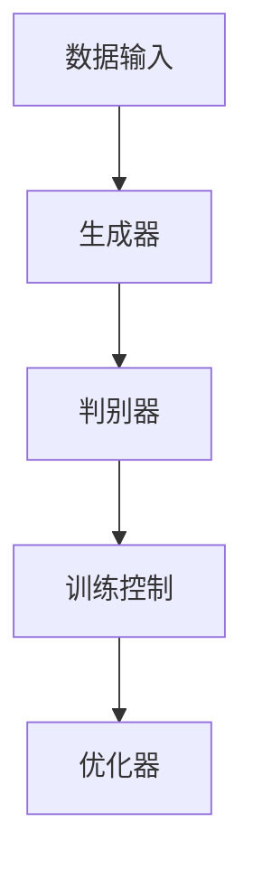

                 


# 对抗训练：提高AI Agent的鲁棒性

## 关键词：
- 对抗训练
- AI Agent
- 鲁棒性
- 生成对抗网络
- 深度学习
- 模型优化

## 摘要：
对抗训练是一种通过生成器和判别器的对抗过程来提高AI Agent鲁棒性的技术。本文详细介绍了对抗训练的基本原理、算法实现、系统架构设计以及实际案例，帮助读者全面理解如何通过对抗训练提升AI系统的鲁棒性。

---

## 第一部分：对抗训练背景与核心概念

### 第1章：对抗训练的背景与问题描述

#### 1.1 对抗训练的背景
- **AI Agent的发展现状**：AI Agent在各个领域中广泛应用，但其鲁棒性仍是一个关键挑战。
- **鲁棒性的重要性**：鲁棒性指AI系统在面对异常输入或干扰时仍能保持正常功能的能力。
- **对抗训练的起源与应用**：对抗训练最初应用于图像生成，现扩展到NLP、强化学习等领域。

#### 1.2 问题背景与描述
- **AI Agent面临的挑战**：数据偏差、对抗攻击等问题影响AI系统的可靠性。
- **对抗训练的目标与意义**：通过生成对抗网络（GAN）提高AI Agent的鲁棒性。
- **鲁棒性在实际应用中的体现**：增强模型对噪声和攻击的抵抗能力。

---

### 第2章：对抗训练的核心概念与原理

#### 2.1 对抗训练的核心机制
- **生成器与判别器的角色**：生成器生成样本，判别器判断样本真实性。
- **对抗过程的数学模型**：生成器和判别器通过损失函数进行优化。
- **损失函数的作用**：衡量生成样本与真实样本的差异。

#### 2.2 对抗训练的数学模型
- **生成器的损失函数**：$$ L_G = \mathbb{E}_{z \sim P_z}[\log(1 - D(G(z)))] $$
- **判别器的损失函数**：$$ L_D = \mathbb{E}_{x \sim P_{data}}[\log D(x)] + \mathbb{E}_{z \sim P_z}[\log(1 - D(G(z)))] $$
- **联合优化目标**：生成器和判别器交替优化，最终达到纳什均衡。

---

## 第二部分：对抗训练的算法实现

### 第3章：生成对抗网络（GAN）的实现

#### 3.1 GAN的架构设计
- **生成器网络结构**：使用卷积层或全连接层生成样本。
- **判别器网络结构**：通过卷积层提取特征并判断真实性。
- **网络参数初始化**：合理初始化参数以避免梯度消失或爆炸。

#### 3.2 GAN的训练流程
- **生成器的训练步骤**：计算生成样本的损失，更新参数。
- **判别器的训练步骤**：计算真实样本和生成样本的损失，更新参数。
- **模型的联合优化**：交替优化生成器和判别器，逐步提高生成质量。

---

## 第三部分：系统分析与架构设计

### 第4章：AI Agent的对抗训练架构

#### 4.1 系统功能设计
- **数据输入模块**：接收输入数据并预处理。
- **生成器模块**：生成对抗样本。
- **判别器模块**：判断样本真实性。
- **训练控制模块**：协调生成器和判别器的训练过程。

#### 4.2 系统架构图


---

## 第四部分：项目实战与案例分析

### 第5章：对抗训练的项目实现

#### 5.1 环境安装与配置
- **安装Python与深度学习库**：安装Python 3.8以上版本，TensorFlow或PyTorch。
- **安装其他依赖**：安装Matplotlib、Seaborn等可视化库。

#### 5.2 代码实现
- **生成器代码示例**：
  ```python
  import tensorflow as tf
  from tensorflow.keras import layers

  def generator():
      model = tf.keras.Sequential()
      model.add(layers.Dense(256, activation='relu', input_shape=(100,)))
      model.add(layers.Dense(784, activation='sigmoid'))
      return model
  ```

- **判别器代码示例**：
  ```python
  def discriminator():
      model = tf.keras.Sequential()
      model.add(layers.Dense(256, activation='relu', input_shape=(784,)))
      model.add(layers.Dense(1, activation='sigmoid'))
      return model
  ```

- **训练循环代码**：
  ```python
  generator = generator()
  discriminator = discriminator()
  optimizer = tf.keras.optimizers.Adam(0.0002)

  for epoch in range(epochs):
      for _ in range(n_critic):
          noise = np.random.randn(batch_size, 100)
          gen_imgs = generator.predict(noise)
          real_imgs = # 获取真实数据
          # 判别器训练
          d_loss_real = discriminator.train_on_batch(real_imgs, np.ones((batch_size, 1)))
          d_loss_fake = discriminator.train_on_batch(gen_imgs, np.zeros((batch_size, 1)))
          d_loss = 0.5 * np.add(d_loss_real, d_loss_fake)
      # 生成器训练
      noise = np.random.randn(batch_size, 100)
      g_loss = generator.train_on_batch(noise, np.ones((batch_size, 1)))
  ```

#### 5.3 案例分析
- **图像生成案例**：使用GAN生成手写数字，提高生成样本的质量。
- **文本生成案例**：训练生成器生成连贯的文本段落。
- **应用效果评估**：通过混淆矩阵和生成样本的质量评估模型性能。

---

## 第五部分：最佳实践与总结

### 第6章：对抗训练的实践总结

#### 6.1 最佳实践
- **选择合适的生成器和判别器结构**：根据任务选择适合的网络架构。
- **调整超参数**：合理设置学习率、批量大小等参数。
- **防止模式崩溃**：使用 Wasserstein GAN 等变体避免生成样本多样性不足。
- **监控训练过程**：定期检查生成样本和损失函数的变化。

#### 6.2 小结
对抗训练通过生成器和判别器的对抗过程，有效提高了AI Agent的鲁棒性。生成对抗网络（GAN）在多个领域展现出了强大的应用潜力，为AI系统的安全性提供了重要保障。

#### 6.3 注意事项
- **数据质量**：确保训练数据多样化且无偏见。
- **模型稳定性**：防止生成器或判别器主导训练过程。
- **计算资源**：对抗训练需要大量计算资源，建议使用GPU加速。

#### 6.4 拓展阅读
- **推荐书籍**：《生成对抗网络：理论与实践》。
- **推荐论文**：Goodfellow的GAN论文《Generative Adversarial Nets》。
- **在线课程**：Coursera上的深度学习专项课程。

---

## 作者：AI天才研究院

---

通过以上内容，您可以全面理解对抗训练在提高AI Agent鲁棒性中的应用。对抗训练不仅提升了模型的泛化能力，还为AI系统的安全性提供了重要保障。

