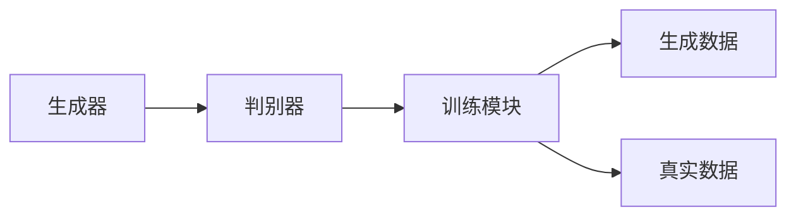
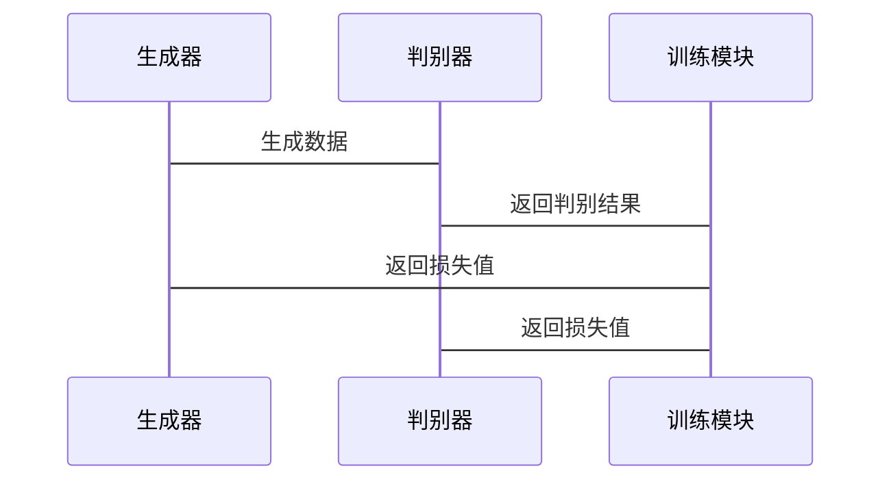

                 


# 对抗训练：提高AI Agent的鲁棒性

## 关键词：  
- 对抗训练  
- AI Agent  
- 鲁棒性  
- 生成器  
- 判别器  
- WGAN  

## 摘要：  
对抗训练是一种通过生成器和判别器的博弈过程来提高模型鲁棒性的方法。本文将详细探讨对抗训练的核心概念、数学模型、算法原理、系统设计、项目实战及最佳实践，帮助读者全面理解如何通过对抗训练提升AI Agent的鲁棒性。

---

# 第一部分: 对抗训练的背景与基础

## 第1章: 对抗训练的核心概念

### 1.1 对抗训练的背景与问题背景

#### 1.1.1 传统AI训练的局限性  
传统AI模型的训练通常依赖于监督学习，即通过大量标注数据进行训练。然而，这种方法存在以下问题：  
1. 数据依赖性强：需要大量高质量的标注数据，获取成本高。  
2. 对噪声和对抗样本的鲁棒性不足：模型容易受到噪声或对抗样本的干扰，导致性能下降。  
3. 泛化能力有限：模型在面对未见数据或复杂场景时表现不佳。  

#### 1.1.2 对抗训练的提出与目标  
为了解决上述问题，对抗训练（Adversarial Training）提出了一种新的训练方法。其核心思想是通过生成器（Generator）和判别器（Discriminator）的博弈过程，逐步提高模型的鲁棒性和泛化能力。  
对抗训练的目标是：  
1. 训练出一个强大的生成器，能够生成逼真的数据。  
2. 训练出一个敏锐的判别器，能够准确区分生成数据与真实数据。  
3. 通过生成器和判别器的交替优化，最终实现模型对噪声和对抗样本的鲁棒性。  

#### 1.1.3 对抗训练的核心问题描述  
对抗训练的核心问题可以描述为：在生成器和判别器的博弈过程中，如何通过优化各自的损失函数，使得生成器生成的数据越来越接近真实数据，同时判别器的识别能力也越来越强。  

### 1.2 对抗训练的核心概念与联系

#### 1.2.1 生成器与判别器的关系  
生成器和判别器是两个相互对抗的网络，生成器的目标是生成数据使得判别器无法区分其与真实数据的不同，而判别器的目标是尽可能准确地区分生成数据和真实数据。  

#### 1.2.2 对抗训练的博弈过程  
对抗训练的博弈过程可以分为以下几个阶段：  
1. 初始阶段：生成器生成低质量的数据，判别器能够轻松区分生成数据和真实数据。  
2. 优化阶段：生成器通过不断调整参数，生成越来越接近真实数据的样本，而判别器也在不断优化，以提高识别能力。  
3. 平衡阶段：生成器和判别器达到某种平衡，生成器生成的样本与真实数据难以区分，判别器的识别概率接近0.5。  

#### 1.2.3 对抗训练的数学模型与公式  
对抗训练的数学模型主要由生成器的损失函数和判别器的损失函数组成：  
- 生成器的损失函数：  
  $$ \mathcal{L}_G = -\mathbb{E}_{z}[\log D(G(z))] $$  
  其中，$z$ 是生成器的输入噪声，$G$ 是生成器网络，$D$ 是判别器网络。  
- 判别器的损失函数：  
  $$ \mathcal{L}_D = -\mathbb{E}_{x}[\log D(x)] - \mathbb{E}_{z}[\log (1 - D(G(z)))] $$  
  其中，$x$ 是真实数据，$z$ 是生成器的输入噪声。  

---

## 第2章: 对抗训练的数学模型与算法原理

### 2.1 对抗训练的数学模型

#### 2.1.1 生成器的损失函数  
生成器的损失函数表示生成器试图让判别器误判生成数据为真实数据。通过不断优化生成器的参数，生成器能够生成越来越逼真的数据。  

#### 2.1.2 判别器的损失函数  
判别器的损失函数表示判别器试图准确区分生成数据和真实数据。通过不断优化判别器的参数，判别器能够更准确地识别生成数据和真实数据。  

#### 2.1.3 对抗训练的联合优化目标  
对抗训练的最终目标是同时优化生成器和判别器的参数，使得生成器生成的样本越来越接近真实数据，而判别器的识别能力也越来越强。  

### 2.2 对抗训练的算法流程

#### 2.2.1 生成器与判别器的交替训练  
对抗训练的训练过程通常包括以下步骤：  
1. 初始化生成器和判别器的参数。  
2. 训练判别器：使用真实数据和生成数据，优化判别器的参数，使得判别器能够准确区分生成数据和真实数据。  
3. 训练生成器：使用生成数据，优化生成器的参数，使得生成器生成的样本越来越接近真实数据。  
4. 重复步骤2和3，直到生成器和判别器的损失函数达到某种平衡。  

#### 2.2.2 梯度下降与优化策略  
对抗训练通常采用梯度下降方法优化生成器和判别器的参数。为了提高训练效率，可以采用以下优化策略：  
1. 动量优化（如Adam优化器）。  
2. 学习率调整。  
3. 模型正则化（如Dropout）。  

#### 2.2.3 对抗训练的收敛性分析  
对抗训练的收敛性分析是一个复杂的数学问题，通常需要借助博弈论和优化理论。生成器和判别器的损失函数可以通过交替优化达到某种均衡状态，即纳什均衡。  

### 2.3 对抗训练的改进方法

#### 2.3.1 WGAN的改进  
Wasserstein GAN（WGAN）是一种改进的对抗训练方法，通过引入Wasserstein距离作为损失函数，避免了传统GAN训练中的一些问题，如模式坍缩。  

#### 2.3.2 Wasserstein距离的引入  
Wasserstein距离的引入使得对抗训练的损失函数更加稳定，能够更好地衡量生成数据和真实数据之间的距离。  

#### 2.3.3 标准化层的加入  
为了提高生成器和判别器的泛化能力，可以在网络中加入标准化层（如Batch Normalization）。  

---

## 第3章: 对抗训练的系统架构与设计

### 3.1 对抗训练的系统架构

#### 3.1.1 生成器与判别器的网络结构  
生成器和判别器的网络结构可以根据具体任务进行调整。例如，在图像生成任务中，生成器可以采用卷积神经网络（CNN），而判别器也可以采用CNN。  

#### 3.1.2 系统功能设计  
1. 生成器模块：负责生成逼真的数据。  
2. 判别器模块：负责区分生成数据和真实数据。  
3. 训练模块：负责交替优化生成器和判别器的参数。  

#### 3.1.3 系统架构图  
以下是系统架构图的Mermaid代码：  


#### 3.1.4 系统交互序列图  
以下是系统交互序列图的Mermaid代码：  


---

## 第4章: 对抗训练的项目实战

### 4.1 环境安装

#### 4.1.1 安装Python
需要安装Python 3.6或更高版本。

#### 4.1.2 安装TensorFlow或PyTorch
可以选择安装TensorFlow或PyTorch框架，用于实现对抗训练。

#### 4.1.3 安装其他依赖
安装必要的库，如numpy、matplotlib等。

### 4.2 系统核心实现源代码

#### 4.2.1 生成器代码
以下是生成器的代码示例：  
```python
import tensorflow as tf
from tensorflow import keras

def generator():
    model = keras.Sequential([
        keras.layers.Dense(256, activation='relu', input_shape=(100,)),
        keras.layers.Dense(784, activation='sigmoid')
    ])
    return model
```

#### 4.2.2 判别器代码
以下是判别器的代码示例：  
```python
def discriminator():
    model = keras.Sequential([
        keras.layers.Dense(256, activation='relu', input_shape=(784,)),
        keras.layers.Dense(1, activation='sigmoid')
    ])
    return model
```

#### 4.2.3 训练模块代码
以下是训练模块的代码示例：  
```python
def train(generator, discriminator, epochs=100, batch_size=128):
    optimizer = tf.keras.optimizers.Adam(0.0002, 0.5)
    
    for epoch in range(epochs):
        for _ in range(100):
            noise = np.random.normal(0, 1, (batch_size, 100))
            generated = generator.predict(noise)
            
            real_data = np.random.uniform(0, 1, (batch_size, 784))
            combined = np.concatenate([real_data, generated])
            
            labels = np.ones((2 * batch_size, 1))
            labels[batch_size:] = 0
            
            discriminator.trainable = True
            discriminator.train_on_batch(combined, labels)
            
            noise = np.random.normal(0, 1, (batch_size, 100))
            labels = np.ones((batch_size, 1))
            
            discriminator.trainable = False
            generator.train_on_batch(noise, labels)
    
    return generator, discriminator
```

### 4.3 实际案例分析

#### 4.3.1 对抗训练在图像生成中的应用  
通过对抗训练，生成器可以生成逼真的图像，而判别器可以准确区分生成图像和真实图像。通过不断优化生成器和判别器的参数，可以提高生成图像的质量和判别器的识别能力。  

#### 4.3.2 对抗训练在游戏AI中的应用  
在游戏AI中，生成器可以生成多种游戏场景，而判别器可以帮助AI识别这些场景，从而提高其适应不同环境的能力。  

### 4.4 项目小结  
通过实际案例的分析，可以发现对抗训练在提高AI Agent的鲁棒性方面具有显著优势。生成器和判别器的博弈过程不仅可以提高模型的泛化能力，还可以增强模型对噪声和对抗样本的鲁棒性。

---

## 第5章: 最佳实践与小结

### 5.1 最佳实践

#### 5.1.1 生成器和判别器的设计  
生成器和判别器的设计需要根据具体任务进行调整。例如，在图像生成任务中，生成器和判别器通常采用卷积神经网络（CNN）。  

#### 5.1.2 对抗训练的优化策略  
为了提高对抗训练的效率，可以采用以下优化策略：  
1. 使用动量优化（如Adam优化器）。  
2. 调整学习率。  
3. 加入模型正则化（如Dropout）。  

#### 5.1.3 训练过程的监控与调整  
在训练过程中，需要定期监控生成器和判别器的损失函数值，确保训练过程的稳定性和收敛性。  

### 5.2 小结  
对抗训练是一种通过生成器和判别器的博弈过程来提高模型鲁棒性的方法。通过对抗训练，生成器可以生成逼真的数据，而判别器可以准确区分生成数据和真实数据。通过不断优化生成器和判别器的参数，可以提高模型的泛化能力和对噪声的鲁棒性。

---

# 作者：AI天才研究院 & 禅与计算机程序设计艺术

