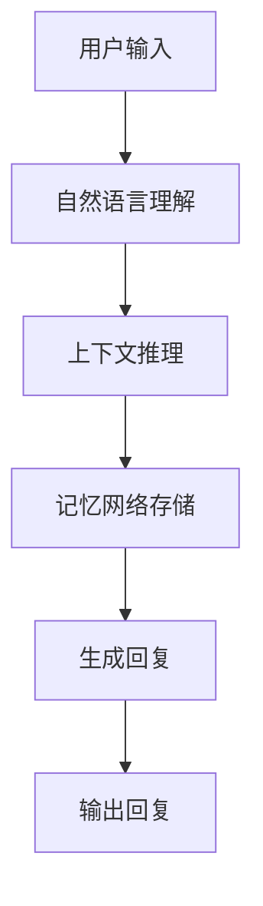
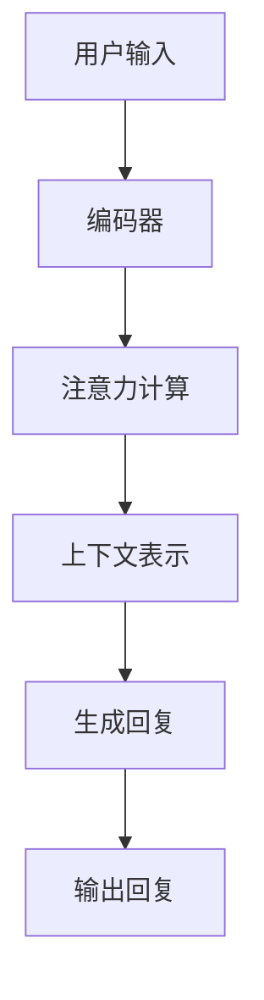
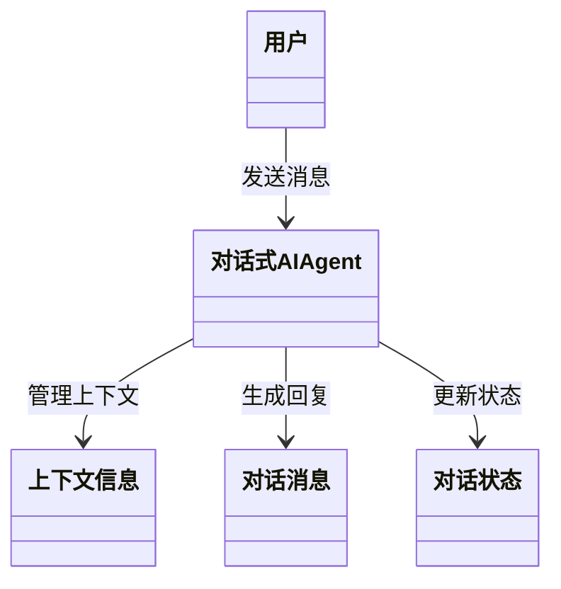
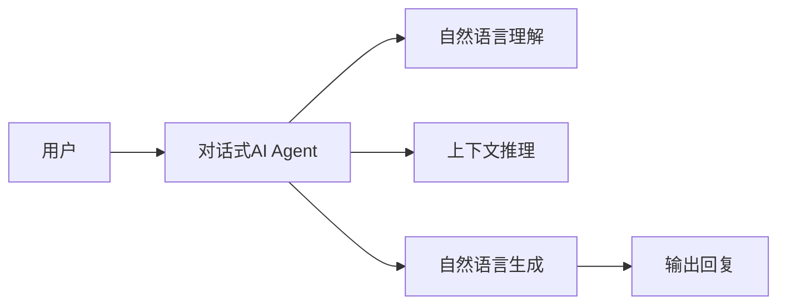
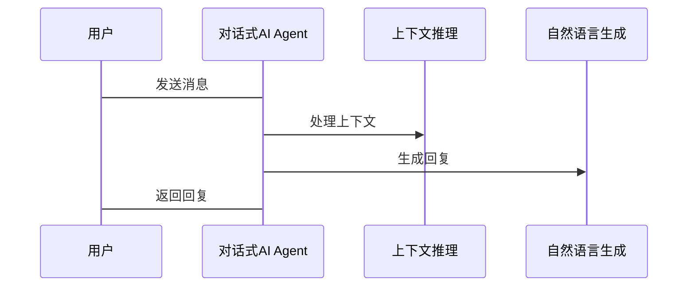

                 


# 对话式AI Agent的上下文管理技巧

## 关键词：对话式AI Agent, 上下文管理, 人工智能, 自然语言处理, 计算机科学

## 摘要：  
对话式AI Agent的上下文管理是实现智能对话系统的核心技术之一。本文从背景介绍、核心概念、算法原理、系统架构到项目实战，全面解析对话式AI Agent的上下文管理技巧。通过详细分析上下文管理的基本原理、实现方法以及实际应用，帮助读者掌握如何构建高效、智能的对话系统。

---

## 第1章: 对话式AI Agent与上下文管理概述

### 1.1 上下文管理的基本概念

#### 1.1.1 什么是对话式AI Agent  
对话式AI Agent（以下简称为“Agent”）是一种能够理解和生成自然语言的智能系统，能够通过对话与用户交互，提供服务或解决问题。Agent的核心能力包括理解用户意图、维护对话上下文、推理对话逻辑以及生成自然的回复。

#### 1.1.2 上下文管理的定义与作用  
上下文管理是指在对话过程中，系统对当前对话状态、用户意图和历史信息的跟踪与管理。它帮助Agent理解对话的背景和语境，从而生成更准确和连贯的回复。

#### 1.1.3 对话式AI Agent的核心要素  
对话式AI Agent的核心要素包括：  
1. **自然语言理解（NLU）**：解析用户的输入，提取意图和实体。  
2. **对话状态管理**：跟踪对话的上下文信息，包括用户的目标和历史对话内容。  
3. **自然语言生成（NLG）**：根据上下文信息生成自然的回复。  
4. **知识库**：存储对话所需的知识和数据，支持Agent的理解和推理。  

---

### 1.2 对话式AI Agent的背景与应用

#### 1.2.1 对话式AI Agent的发展历程  
对话式AI Agent的发展可以追溯到20世纪90年代的专家系统。随着自然语言处理（NLP）技术的进步，近年来，基于深度学习的对话系统逐渐成为主流。

#### 1.2.2 当前对话式AI Agent的应用场景  
对话式AI Agent目前广泛应用于以下领域：  
1. **智能客服**：通过对话系统为用户提供支持和服务。  
2. **智能助手**：如Siri、Alexa等，帮助用户完成日常任务。  
3. **教育辅助**：为学生提供个性化的学习指导。  
4. **医疗咨询**：提供健康建议和疾病信息查询。  

#### 1.2.3 上下文管理在对话式AI Agent中的重要性  
上下文管理是对话式AI Agent的核心技术，它直接影响对话的连贯性和用户体验。通过上下文管理，Agent能够理解用户意图、维护对话历史，并根据上下文生成合适的回复。

---

### 1.3 本章小结  
本章介绍了对话式AI Agent的基本概念、核心要素及其应用场景，重点突出了上下文管理在对话系统中的重要性。接下来，我们将深入探讨上下文管理的核心原理和实现方法。

---

## 第2章: 对话式AI Agent的上下文管理核心概念

### 2.1 上下文管理的原理与机制

#### 2.1.1 上下文信息的采集与处理  
上下文信息的采集主要通过自然语言理解（NLU）技术实现，包括关键词提取、意图识别和实体识别。处理后的信息会被存储在对话状态中。

#### 2.1.2 上下文信息的存储与检索  
对话状态通常以JSON格式存储，包含当前对话的意图、实体和历史信息。检索时，系统根据关键词或条件过滤上下文信息。

#### 2.1.3 上下文信息的关联与推理  
通过关联规则和推理算法，系统能够将上下文信息与知识库中的知识进行匹配，生成合理的对话回复。

---

### 2.2 对话式AI Agent中的上下文管理特点

#### 2.2.1 实时性与动态性  
上下文信息需要实时更新，确保对话的连贯性和准确性。

#### 2.2.2 上下文信息的多模态特征  
上下文信息可以是文本、语音、图像等多种形式，系统需要能够处理多种数据类型。

#### 2.2.3 上下文管理的可解释性  
为了提高用户体验和系统的可信度，上下文管理需要具备一定的可解释性，即用户能够理解系统如何利用上下文信息生成回复。

---

### 2.3 核心概念对比分析

#### 2.3.1 上下文管理与知识图谱的对比  
| 对比维度 | 上下文管理 | 知识图谱 |
|----------|------------|----------|
| 数据来源 | 当前对话 | 预定义知识库 |
| 存储方式 | 动态存储 | 静态存储 |
| 用途 | 支持对话生成 | 支持推理和查询 |

#### 2.3.2 上下文管理与对话状态管理的对比  
| 对比维度 | 上下文管理 | 对话状态管理 |
|----------|------------|-------------|
| 范围 | 全局上下文 | 当前对话状态 |
| 更新频率 | 动态更新 | 随对话进行 |
| 依赖 | 知识库 | 对话历史 |

#### 2.3.3 上下文管理与记忆机制的对比  
| 对比维度 | 上下文管理 | 记忆机制 |
|----------|------------|----------|
| 目的 | 管理对话上下文 | 存储和检索信息 |
| 依赖 | 对话历史 | 内存或数据库 |
| 作用 | 支持对话生成 | 支持推理和决策 |

---

### 2.4 ER实体关系图

```mermaid
er
actor: 用户
agent: 对话式AI Agent
context: 上下文信息
message: 对话消息
status: 对话状态
```

---

### 2.5 本章小结  
本章详细介绍了对话式AI Agent上下文管理的核心概念和实现特点，并通过对比分析和实体关系图，帮助读者更好地理解上下文管理的原理和作用。

---

## 第3章: 对话式AI Agent上下文管理的算法原理

### 3.1 基于记忆网络的上下文管理

#### 3.1.1 记忆网络的基本原理  
记忆网络（Memory Network）是一种用于处理上下文信息的模型，通过存储和检索外部记忆来生成回复。

#### 3.1.2 基于记忆网络的上下文推理  


#### 3.1.3 记忆网络的优缺点分析  
优点：能够处理长距离依赖关系；  
缺点：训练复杂，计算成本高。

---

### 3.2 基于注意力机制的上下文管理

#### 3.2.1 注意力机制的基本原理  
注意力机制通过计算输入序列中每个位置的权重，生成更关注重要信息的上下文表示。

#### 3.2.2 基于注意力机制的上下文推理  


#### 3.2.3 注意力机制的优缺点分析  
优点：能够捕捉到上下文中的关键信息；  
缺点：对长序列的处理能力有限。

---

### 3.3 本章小结  
本章介绍了基于记忆网络和注意力机制的上下文管理算法，分析了它们的优缺点和适用场景，帮助读者理解如何选择合适的算法实现上下文管理。

---

## 第4章: 对话式AI Agent上下文管理的系统架构

### 4.1 系统功能设计

#### 4.1.1 领域模型类图  


#### 4.1.2 系统架构图  


#### 4.1.3 接口设计  
- 输入接口：接收用户消息和系统反馈。  
- 输出接口：生成回复并返回给用户。  

#### 4.1.4 交互序列图  


---

### 4.2 本章小结  
本章通过系统架构图和交互序列图，详细描述了对话式AI Agent上下文管理的系统结构和工作流程，帮助读者理解如何从整体上设计和实现对话系统。

---

## 第5章: 对话式AI Agent上下文管理的项目实战

### 5.1 环境安装

#### 5.1.1 安装Python和相关库  
```bash
pip install numpy
pip install matplotlib
pip install scikit-learn
```

#### 5.1.2 安装深度学习框架  
```bash
pip install tensorflow
pip install keras
```

---

### 5.2 系统核心实现

#### 5.2.1 自然语言理解模块  
```python
import tensorflow as tf
from tensorflow.keras import layers

class NLUModel:
    def __init__(self):
        self.model = self.build_model()
    
    def build_model(self):
        model = tf.keras.Sequential()
        model.add(layers.Embedding(input_dim=10000, output_dim=50))
        model.add(layers.LSTM(64))
        model.add(layers.Dense(1, activation='sigmoid'))
        return model
```

#### 5.2.2 上下文推理模块  
```python
class ContextInference:
    def __init__(self):
        self.memory = []
    
    def add_context(self, context):
        self.memory.append(context)
    
    def get_context(self, index):
        return self.memory[index]
```

#### 5.2.3 自然语言生成模块  
```python
class NLGModel:
    def __init__(self):
        self.model = self.build_model()
    
    def build_model(self):
        model = tf.keras.Sequential()
        model.add(layers.Embedding(input_dim=10000, output_dim=50))
        model.add(layers.LSTM(64))
        model.add(layers.Dense(100, activation='softmax'))
        return model
```

---

### 5.3 代码解读与分析  
- **NLUModel**：基于LSTM的自然语言理解模型，用于提取用户意图和实体。  
- **ContextInference**：上下文推理模块，用于存储和检索上下文信息。  
- **NLGModel**：基于LSTM的自然语言生成模型，用于生成回复。

---

### 5.4 案例分析与详细讲解  
假设用户输入“我需要订一张从北京到上海的机票”，系统会通过NLU模块提取意图“订票”和实体“北京”、“上海”。上下文推理模块会将这些信息存储到上下文中，并调用NLG模块生成回复：“请提供具体的日期和舱位要求。”

---

### 5.5 本章小结  
本章通过实际项目的环境安装和代码实现，详细展示了如何在对话式AI Agent中实现上下文管理。通过案例分析，帮助读者理解上下文管理的实际应用。

---

## 第6章: 对话式AI Agent上下文管理的最佳实践

### 6.1 设计原则

#### 6.1.1 简单性与高效性  
上下文管理的设计应尽量简单，减少不必要的复杂性，提高处理效率。

#### 6.1.2 可扩展性  
系统应具备良好的可扩展性，能够支持新功能的添加和优化。

#### 6.1.3 可解释性  
上下文管理的决策过程应具有可解释性，方便调试和优化。

---

### 6.2 上下文管理的优化方法

#### 6.2.1 使用更先进的算法  
尝试使用Transformer架构替代LSTM，提高上下文推理的准确性。

#### 6.2.2 增强数据预处理  
通过数据增强技术，提升模型对不同场景的适应能力。

#### 6.2.3 加强模型评估  
引入更多的评估指标，如BLEU、ROUGE等，全面衡量模型的性能。

---

### 6.3 未来趋势

#### 6.3.1 多模态上下文管理  
未来的上下文管理将更加注重多模态数据的处理，如图像、语音等。

#### 6.3.2 自适应上下文管理  
通过自适应算法，动态调整上下文管理的策略，提升系统的灵活性和适应性。

---

### 6.4 本章小结  
本章总结了对话式AI Agent上下文管理的设计原则、优化方法和未来趋势，为读者提供了宝贵的实践经验。

---

## 作者：AI天才研究院/AI Genius Institute & 禅与计算机程序设计艺术 /Zen And The Art of Computer Programming

---

通过以上内容，您已经掌握了对话式AI Agent上下文管理的核心技巧。从理论到实践，从算法到系统架构，全面深入地了解了如何实现高效的上下文管理。希望本文能为您提供有价值的参考和启发！

