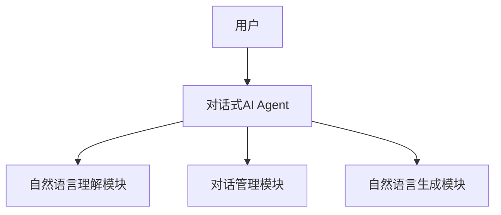
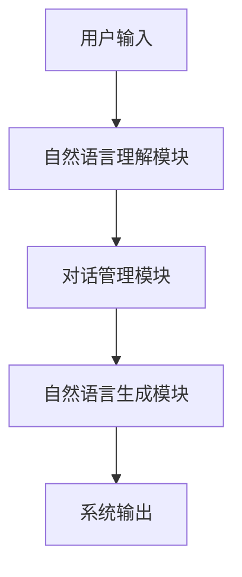
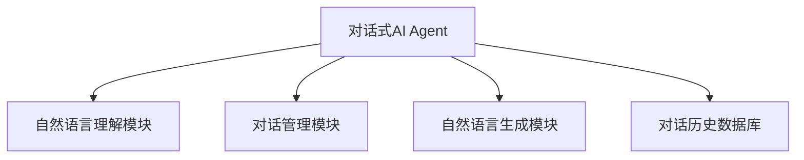
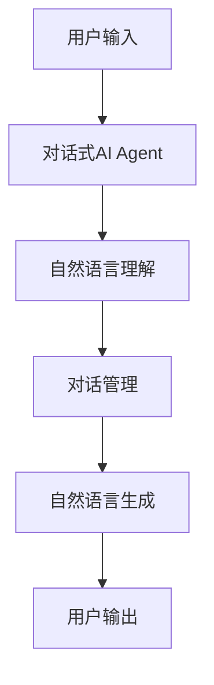

                 


# 对话式AI Agent：提升用户交互体验

> 关键词：对话式AI Agent，自然语言处理，对话生成，系统架构，项目实战

> 摘要：对话式AI Agent是一种结合了自然语言处理和人工智能技术的交互系统，旨在通过模拟人类对话的方式，提供更智能化、个性化的用户体验。本文将从对话式AI Agent的背景与概念出发，深入探讨其核心原理、算法实现、系统架构设计，以及实际项目中的应用案例，最后总结其最佳实践和未来发展方向。

---

## 第一部分：对话式AI Agent的背景与概念

### 第1章：对话式AI Agent的背景与发展

#### 1.1 自然语言处理技术的演进
自然语言处理（NLP）是对话式AI Agent的核心技术之一。从早期的基于规则的系统到现在的深度学习模型，NLP技术经历了多次变革。例如，从简单的关键词匹配到复杂的上下文理解，每一次技术的进步都为对话式AI Agent的发展奠定了基础。

#### 1.2 AI Agent的基本概念
AI Agent是一种能够感知环境并采取行动以实现目标的智能实体。对话式AI Agent通过自然语言处理技术，能够理解用户的输入，并以自然语言的形式进行回应，从而实现与用户的交互。

#### 1.3 对话式AI Agent的定义与特征
对话式AI Agent是一种结合了自然语言处理和人工智能技术的交互系统，其核心特征包括：
- **智能化**：能够理解用户的意图并生成自然的回复。
- **个性化**：根据用户的历史行为和偏好提供个性化的服务。
- **实时性**：能够实时响应用户的需求。

### 第2章：对话式AI Agent的核心概念与联系

#### 2.1 对话式AI Agent的核心原理
对话式AI Agent的核心原理包括：
1. **信息抽取与理解**：通过自然语言理解技术，提取用户的意图和实体信息。
2. **对话上下文管理**：维护对话的历史信息，确保每次回复都与上下文相关。
3. **响应生成与优化**：基于上下文和用户意图，生成合适的回复，并通过优化算法提升回复的质量。

#### 2.2 对话式AI Agent的实体关系图


#### 2.3 对话式AI Agent的流程图


---

## 第二部分：对话式AI Agent的算法原理

### 第3章：自然语言处理算法

#### 3.1 Transformer模型
Transformer模型是一种基于自注意力机制的深度学习模型，广泛应用于自然语言处理任务中。其核心公式如下：
$$ \text{Attention}(Q, K, V) = \text{softmax}\left(\frac{QK^T}{\sqrt{d_k}}\right)V $$

#### 3.2 BERT模型
BERT（Bidirectional Encoder Representations from Transformers）是一种预训练语言模型，通过双向Transformer结构，能够更好地理解上下文信息。

#### 3.3 GPT模型
GPT（Generative Pre-trained Transformer）是一种基于Transformer的生成模型，能够生成连贯且自然的文本。

### 第4章：对话生成算法

#### 4.1 Seq2Seq模型
Seq2Seq模型是一种基于编码器-解码器结构的对话生成模型，其核心公式如下：
$$ P(y_{t+1}|y_{1}, ..., y_{t}, x) = \text{softmax}(O_{\text{dec}}[y_t]) $$

#### 4.2 基于注意力机制的对话生成
通过引入自注意力机制，对话生成模型能够更好地捕捉上下文信息，生成更相关的回复。

#### 4.3 基于强化学习的对话生成
强化学习通过引入奖励机制，优化对话生成模型的回复质量。例如，可以使用以下公式：
$$ R = \sum_{t=1}^{T} r(y_t) $$

---

## 第三部分：对话式AI Agent的系统分析与架构设计

### 第5章：系统功能设计

#### 5.1 用户输入处理
用户输入处理模块负责接收用户的输入，并将其转化为系统可以理解的形式。例如，可以通过以下步骤实现：
1. 对输入文本进行分词。
2. 提取文本中的实体信息。
3. 理解用户的意图。

#### 5.2 对话上下文管理
对话上下文管理模块负责维护对话的历史信息，包括用户的历史输入和系统的回复。可以通过以下方式实现：
- 使用数据库记录对话历史。
- 使用内存缓存技术临时存储对话信息。

### 第6章：系统架构设计

#### 6.1 系统架构图


#### 6.2 系统接口设计
系统接口设计需要考虑以下几个方面：
- **输入接口**：接收用户的输入文本。
- **输出接口**：返回系统的回复。
- **状态管理接口**：维护对话的状态信息。

### 第7章：系统交互设计

#### 7.1 交互流程图


---

## 第四部分：项目实战

### 第8章：对话式AI Agent的实现

#### 8.1 环境安装
实现对话式AI Agent需要安装以下环境：
- Python 3.6+
- TensorFlow或PyTorch
- NLTK或spaCy

#### 8.2 核心实现代码
以下是一个简单的对话式AI Agent实现示例：

```python
class DialogAgent:
    def __init__(self):
        self.nlu = NLU()
        self.dm = DM()
        self.nlg = NLG()

    def process_input(self, input_text):
        intent = self.nlu.predict_intent(input_text)
        response = self.dm.generate_response(intent)
        return self.nlg.generate_output(response)
```

#### 8.3 案例分析
通过一个智能客服系统的案例，展示对话式AI Agent的实际应用。例如，当用户输入“我的订单在哪里”，系统会理解用户的意图，并返回订单信息。

### 第9章：项目总结

#### 9.1 项目小结
通过项目实战，我们了解了对话式AI Agent的实现过程，包括环境搭建、核心模块开发和系统集成。

---

## 第五部分：最佳实践与未来展望

### 第10章：最佳实践

#### 10.1 技术建议
- 使用预训练语言模型（如BERT、GPT）提升系统的自然语言处理能力。
- 引入强化学习优化对话生成质量。

#### 10.2 用户体验优化
- 提供多语言支持，提升用户体验。
- 实现个性化服务，根据用户偏好提供定制化回复。

### 第11章：未来展望

对话式AI Agent未来的发展方向包括：
- 更加智能化的对话生成技术。
- 更加个性化的用户体验设计。
- 更广泛的应用场景拓展。

---

## 作者信息

作者：AI天才研究院/AI Genius Institute & 禅与计算机程序设计艺术 /Zen And The Art of Computer Programming

---

通过以上结构化的内容，我们可以系统地了解对话式AI Agent的核心概念、技术原理和实际应用。希望这篇文章能够为读者提供有价值的技术见解和实践指导。

