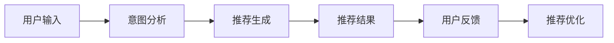
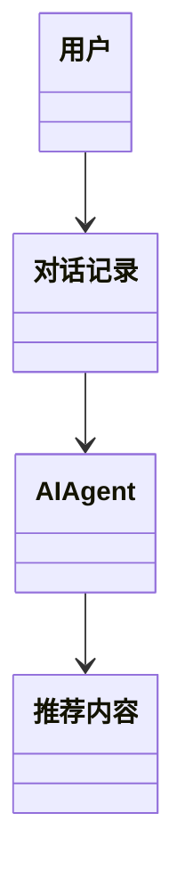
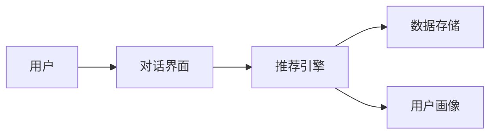
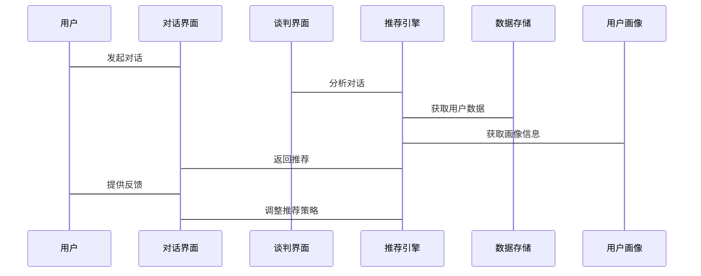

                 


# 对话式推荐：个性化AI Agent的建议

---

## 关键词：
对话式推荐、个性化AI Agent、自然语言处理、推荐系统、AI代理

---

## 摘要：
本文探讨了对话式推荐和个性化AI Agent的核心概念、算法原理、系统架构及实际应用。通过分析对话式推荐与个性化AI Agent的结合，展示了如何利用自然语言处理和机器学习技术，构建一个动态、精准的推荐系统。文章还提供了具体的实现案例，帮助读者理解如何在实际项目中应用这些技术。

---

## 目录大纲：

# 第一部分：对话式推荐与个性化AI Agent的背景介绍

## 第1章：对话式推荐与个性化AI Agent的定义与背景

### 1.1 对话式推荐的定义与核心概念

#### 1.1.1 对话式推荐的定义
对话式推荐是一种基于实时对话上下文的动态推荐方式，通过自然语言处理技术，分析用户意图并生成推荐内容。

#### 1.1.2 对话式推荐的核心要素
- 实时性：根据对话历史动态调整推荐。
- 互动性：通过对话不断优化推荐结果。
- 上下文理解：理解对话中的隐含意图和背景信息。

#### 1.1.3 对话式推荐的演进历程
从基于规则的推荐到协同过滤，再到深度学习模型的推荐。

### 1.2 个性化AI Agent的定义与特点

#### 1.2.1 AI Agent的基本概念
AI Agent是一种能够感知环境、执行任务并做出决策的智能实体。

#### 1.2.2 个性化AI Agent的核心特征
- 自主性：无需外部干预，自主决策。
- 适应性：根据环境变化调整行为。
- 个性化：根据用户需求提供定制化服务。

#### 1.2.3 个性化AI Agent与传统推荐系统的区别
个性化AI Agent结合了推荐系统和自主决策能力，能够主动与用户互动并提供服务。

### 1.3 对话式推荐与个性化AI Agent的结合

#### 1.3.1 对话式推荐的优势
- 实时互动：根据对话动态调整推荐。
- 高准确性：通过上下文理解提供更精准的推荐。

#### 1.3.2 个性化AI Agent的优势
- 自主决策：无需外部指令，主动提供服务。
- 个性化服务：根据用户需求定制推荐内容。

#### 1.3.3 两者的结合与应用前景
结合对话式推荐和个性化AI Agent，可以在教育、医疗、电子商务等领域提供更智能的服务。

### 1.4 本章小结
对话式推荐和个性化AI Agent的结合，为推荐系统带来了更高的实时性和个性化，具有广泛的应用前景。

---

## 第2章：对话式推荐的核心原理

### 2.1 对话式推荐的原理概述

#### 2.1.1 对话式推荐的基本流程
1. 用户发起对话请求。
2. 系统分析对话内容，理解用户意图。
3. 根据意图生成推荐内容。
4. 返回推荐结果并继续互动。

#### 2.1.2 对话式推荐的关键技术
- 自然语言处理（NLP）：理解对话内容。
- 机器学习：分析用户行为和偏好。
- 知识图谱：提供丰富的推荐内容。

### 2.2 对话式推荐与自然语言处理的关系

#### 2.2.1 NLP在对话式推荐中的应用
- 文本理解：解析用户的需求。
- 文本生成：生成自然的回复。

#### 2.2.2 对话式推荐中的文本理解与生成
- 文本理解：使用BERT等模型分析用户意图。
- 文本生成：利用GPT生成回复。

### 2.3 对话式推荐的实现框架

#### 2.3.1 对话式推荐的实现流程
1. 用户输入：获取对话内容。
2. 意图分析：理解用户需求。
3. 推荐生成：根据意图生成推荐。
4. 反馈处理：根据用户反馈调整推荐策略。

#### 2.3.2 对话式推荐的实现框架图


---

## 第三部分：算法原理

### 第3章：对话式推荐的算法实现

#### 3.1 基于协同过滤的推荐算法

##### 3.1.1 协同过滤的基本原理
基于用户相似性进行推荐。

##### 3.1.2 协同过滤的实现步骤
1. 收集用户行为数据。
2. 计算用户相似度。
3. 根据相似用户的行为生成推荐。

##### 3.1.3 协同过滤的数学模型
- 用户相似度计算：$$\text{sim}(u, v) = \frac{\sum_{i} u_i v_i}{\sqrt{\sum u_i^2} \sqrt{\sum v_i^2}}$$

#### 3.2 基于深度学习的推荐模型

##### 3.2.1 基于Transformer的推荐模型
利用Transformer结构处理对话序列。

##### 3.2.2 Transformer的结构
- 编码器：处理输入对话。
- 解码器：生成推荐内容。

##### 3.2.3 Transformer的数学模型
- 编码器：$$\text{Encoder}(x) = \text{Self-attention}(x)$$
- 解码器：$$\text{Decoder}(y) = \text{Self-attention}(y) + \text{Cross-attention}(y, x)$$

#### 3.3 对话式推荐算法的实现代码

##### 3.3.1 协同过滤推荐的Python实现
```python
def collaborative_filtering(user_id, user_items, user_similarities):
    similar_users = user_similarities[user_id]
   推荐物品 = []
    for user in similar_users:
        推荐物品.extend(user_items[user])
    return 推荐物品
```

##### 3.3.2 基于Transformer的推荐模型实现
```python
import torch
class Transformer(nn.Module):
    def __init__(self, embed_dim):
        super().__init__()
        self.encoder = Encoder(embed_dim)
        self.decoder = Decoder(embed_dim)
    def forward(self, input_seq):
        enc_output = self.encoder(input_seq)
        dec_output = self.decoder(enc_output, input_seq)
        return dec_output
```

---

## 第四部分：系统分析与架构设计

### 第4章：对话式推荐系统的架构设计

#### 4.1 系统功能设计

##### 4.1.1 领域模型类图


#### 4.2 系统架构设计

##### 4.2.1 系统架构图


#### 4.3 系统接口设计

##### 4.3.1 接口描述
- 用户输入接口：接收用户输入。
- 推荐引擎接口：处理对话内容，生成推荐。

#### 4.4 系统交互流程

##### 4.4.1 交互流程图


---

## 第五部分：项目实战

### 第5章：对话式推荐系统的实现

#### 5.1 环境安装

##### 5.1.1 安装Python和必要的库
```bash
pip install numpy pandas torch transformers
```

#### 5.2 系统核心实现源代码

##### 5.2.1 推荐引擎代码
```python
import torch
import torch.nn as nn

class SimpleRecommender:
    def __init__(self):
        self.user_items = {}
        self.item_factors = {}

    def train(self, data):
        # 训练模型
        pass

    def recommend(self, user, items):
        # 生成推荐
        pass
```

##### 5.2.2 对话界面代码
```python
def chat_interface():
    recommender = SimpleRecommender()
    while True:
        user_input = input("请输入你的需求：")
        recommendations = recommender.recommend(user, user_input)
        print("推荐内容：", recommendations)
```

#### 5.3 实际案例分析与代码解读

##### 5.3.1 案例分析
分析一个购物推荐的案例，展示如何根据对话内容推荐商品。

##### 5.3.2 代码解读
解读推荐引擎和对话界面的代码，展示如何实现推荐功能。

#### 5.4 项目总结

##### 5.4.1 项目成果
成功实现了一个基于对话的推荐系统。

##### 5.4.2 经验总结
- 对话式推荐需要实时处理用户输入。
- 系统架构设计要合理，确保高效运行。

---

## 第六部分：最佳实践与总结

### 第6章：最佳实践与注意事项

#### 6.1 最佳实践

##### 6.1.1 对话式推荐的设计原则
- 保持对话的流畅性。
- 确保推荐的实时性和准确性。

##### 6.1.2 个性化AI Agent的设计原则
- 保证自主性和适应性。
- 确保数据的安全性和隐私性。

#### 6.2 小结

##### 6.2.1 对话式推荐的优势
- 更高的用户参与度。
- 更精准的推荐结果。

##### 6.2.2 个性化AI Agent的优势
- 更高的自动化水平。
- 更强的适应性。

#### 6.3 注意事项

##### 6.3.1 对话式推荐的挑战
- 对话的上下文理解难度大。
- 实时处理需要高效的算法。

##### 6.3.2 个性化AI Agent的挑战
- 数据隐私问题。
- 系统的可解释性问题。

#### 6.4 拓展阅读

##### 6.4.1 推荐的书籍和资源
推荐相关书籍和论文，供读者深入学习。

---

## 作者：AI天才研究院/AI Genius Institute & 禅与计算机程序设计艺术/Zen And The Art of Computer Programming

---

通过以上结构，文章详细讲解了对话式推荐和个性化AI Agent的核心概念、算法原理、系统架构和实际应用。从背景介绍到项目实战，帮助读者全面理解并掌握相关技术。

