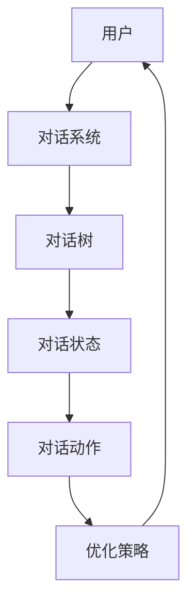
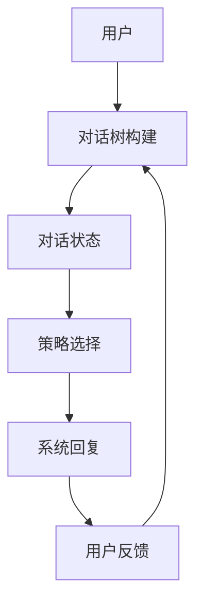
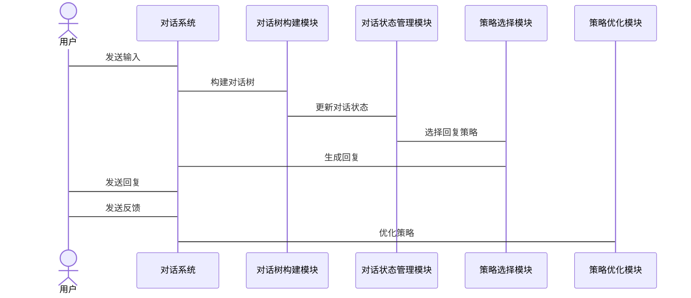

                 


# 对话策略优化：提升AI Agent的交互质量

## 关键词：对话策略优化、AI Agent、交互质量、自然语言处理、机器学习、对话系统

## 摘要：对话策略优化是提升AI Agent交互质量的关键，本文从背景、概念、算法、系统架构、实战案例等方面详细探讨了对话策略优化的实现与应用，通过具体的技术分析和案例展示，帮助读者全面理解对话策略优化的核心原理和实践方法。

---

# 第一部分: 对话策略优化的背景与概念

## 第1章: 对话策略优化的背景与问题描述

### 1.1 对话策略优化的背景
#### 1.1.1 人工智能与对话系统的演进
人工智能技术的快速发展推动了对话系统从简单的关键词匹配向复杂的语义理解转变。早期的对话系统基于规则，依赖预定义的对话树，而现在则更多地采用深度学习模型，能够理解上下文和用户意图。

#### 1.1.2 当前对话系统的主要挑战
尽管对话系统取得了显著进步，但仍面临以下挑战：
- **上下文理解不足**：难以处理多轮对话中的复杂上下文关系。
- **用户意图识别不准**：用户可能表达模糊或有歧义，导致系统理解错误。
- **对话策略单一**：在某些场景下，系统可能缺乏灵活性，无法应对多样化的用户需求。
- **反馈机制缺失**：缺乏有效的用户反馈收集和处理机制，难以持续优化对话策略。

#### 1.1.3 对话策略优化的必要性
对话策略优化通过对对话过程的分析和调整，能够提升对话的准确性和流畅性，从而提高用户体验和任务完成度。优化后的对话系统能够更好地理解用户需求，提供更精准的回复，减少用户重复输入和纠正的次数，显著提升交互效率。

---

### 1.2 对话策略优化的核心问题
#### 1.2.1 对话策略的定义与目标
对话策略是指系统在对话过程中选择合适的回复或行为的规则和方法。其目标是通过优化这些规则，使对话更加自然、高效，并能够更好地满足用户需求。

#### 1.2.2 用户需求与对话目标的匹配
用户需求可能包括获取信息、解决问题或完成任务。对话策略优化需要确保系统能够准确识别用户需求，并选择合适的回复来满足这些需求。

#### 1.2.3 对话策略优化的边界与外延
对话策略优化的边界在于如何在有限的上下文中做出最优选择，而外延则涉及如何将优化策略扩展到不同的对话场景和用户群体。

---

### 1.3 对话策略优化的核心要素
#### 1.3.1 对话树的构建与管理
对话树是一种树状结构，用于描述对话的可能路径。每个节点代表一个对话状态，叶子节点代表最终的回复。构建高效的对话树需要考虑用户可能的输入和系统可能的回复。

#### 1.3.2 上下文管理的重要性
上下文管理是指在对话过程中维护当前对话的上下文信息，以便系统能够根据上下文理解用户意图并生成合适的回复。

#### 1.3.3 多轮对话的连续性与一致性
多轮对话需要保持连续性，即系统在每一步的回复都与前一步的内容相关联。一致性则要求系统在对话过程中保持主题和语气的一致性。

---

### 1.4 对话策略优化的场景与应用
#### 1.4.1 智能客服中的对话优化
智能客服需要处理大量用户咨询，通过优化对话策略可以提高用户满意度和问题解决效率。

#### 1.4.2 智能助手的对话优化
智能助手如Siri、Alexa等需要通过优化对话策略来提供更自然和流畅的交互体验。

#### 1.4.3 聊天机器人的对话优化
聊天机器人需要在娱乐、社交等场景中提供多样化的对话内容，优化对话策略可以提升用户体验。

---

## 1.5 本章小结
本章介绍了对话策略优化的背景、核心问题、核心要素以及应用场景。通过这些内容，读者可以理解对话策略优化的重要性和复杂性，为后续章节的学习打下基础。

---

# 第二部分: 对话策略优化的核心概念与联系

## 第2章: 对话策略优化的核心概念

### 2.1 对话策略的核心概念
#### 2.1.1 对话树的结构与特点
对话树是一种树状结构，由节点和边组成，每个节点代表一个对话状态，边代表可能的回复路径。对话树的特点包括层次性、可扩展性和动态性。

#### 2.1.2 对话状态的定义与表示
对话状态是指当前对话的上下文信息，通常包括用户输入、系统回复以及可能的选项。对话状态可以用JSON、XML或图结构等方式表示。

#### 2.1.3 对话动作的定义与分类
对话动作是指系统在对话过程中执行的行为，包括生成回复、确认需求、引导用户等。对话动作可以根据功能分为信息提供型、确认型和引导型。

---

### 2.2 对话策略优化的关键属性
#### 2.2.1 精确性与多样性的平衡
精确性是指系统能够准确理解用户意图并生成正确的回复，多样性则指系统能够提供多样的回复以应对不同的用户需求。

#### 2.2.2 及时性与连贯性的优化
及时性要求系统能够快速响应用户输入，连贯性则要求对话过程逻辑清晰，回复与前文相关联。

#### 2.2.3 用户满意度与任务完成度的关联
用户满意度是衡量对话策略优化效果的重要指标，任务完成度则是对话策略优化的核心目标。

---

### 2.3 对话策略优化的实体关系图


---

### 2.4 对话策略优化的概念对比表
| 概念 | 定义 | 特性 | 示例 |
|------|------|------|------|
| 对话树 | 对话的结构化表示 | 层次性、可扩展性 | 根节点是初始对话，叶子节点是最终回复 |
| 对话状态 | 当前对话的上下文 | 唯一性、动态性 | 用户当前输入的内容 |
| 对话动作 | 系统的响应行为 | 目标性、多样性 | 提供信息、确认需求 |

---

## 2.5 本章小结
本章通过定义和对比对话策略优化的核心概念，帮助读者建立了对话策略优化的基本知识框架，为后续章节的深入分析奠定了基础。

---

# 第三部分: 对话策略优化的算法原理

## 第3章: 基于决策树的对话策略优化

### 3.1 决策树的基本原理
决策树是一种树状结构，用于分类和回归问题。在对话策略优化中，决策树可以用来选择最优的回复路径。

#### 3.1.1 决策树的构建过程
1. **特征选择**：选择能够区分不同对话状态的特征。
2. **分裂策略**：根据特征将数据集分割成子集。
3. **剪枝处理**：避免过拟合，提高泛化能力。

#### 3.1.2 决策树的优势与不足
- **优势**：直观、易于解释、适用于多分类问题。
- **不足**：对噪声数据敏感，容易过拟合。

---

### 3.2 基于决策树的对话策略优化算法
#### 3.2.1 算法流程
1. **数据准备**：收集用户对话数据，包括输入、输出和标签。
2. **特征提取**：提取对话中的关键词、情感倾向等特征。
3. **模型训练**：使用决策树算法训练模型。
4. **策略优化**：根据模型预测结果优化对话策略。

#### 3.2.2 算法实现
以下是一个简单的决策树实现示例：
```python
from sklearn.tree import DecisionTreeClassifier
from sklearn.model_selection import train_test_split
import pandas as pd

# 数据准备
data = pd.read_csv('dialogue_data.csv')
X = data.drop('label', axis=1)
y = data['label']

# 数据分割
X_train, X_test, y_train, y_test = train_test_split(X, y, test_size=0.2)

# 模型训练
model = DecisionTreeClassifier()
model.fit(X_train, y_train)

# 模型预测
y_pred = model.predict(X_test)
```

---

## 3.3 基于强化学习的对话策略优化

### 3.3.1 强化学习的基本原理
强化学习是一种通过试错机制来优化决策的算法。在对话策略优化中，强化学习可以用来优化回复策略，以最大化用户满意度。

#### 3.3.2 算法流程
1. **状态表示**：将对话状态表示为环境状态。
2. **动作选择**：根据当前状态选择回复动作。
3. **奖励机制**：根据用户反馈给予奖励，调整策略。

#### 3.3.3 算法实现
以下是一个简单的强化学习实现示例：
```python
import numpy as np
from collections import deque

# 状态空间和动作空间
state_space = ['intent1', 'intent2', 'intent3']
action_space = ['reply1', 'reply2', 'reply3']

# 策略网络
class Policy:
    def __init__(self):
        self.parameters = np.random.randn(1, len(action_space))
    
    def predict(self, state):
        return self.parameters[state]

# 奖励机制
def reward_fn(action, state):
    if action == 'reply1' and state == 'intent1':
        return 1
    elif action == 'reply2' and state == 'intent2':
        return 1
    elif action == 'reply3' and state == 'intent3':
        return 1
    else:
        return -1

# 强化学习训练
policy = Policy()
for _ in range(100):
    state = np.random.choice(state_space)
    action = policy.predict(state)
    r = reward_fn(action, state)
    policy.parameters[state] += r
```

---

## 3.4 对话策略优化的数学模型

### 3.4.1 概率论中的贝叶斯定理
贝叶斯定理用于计算在给定观察数据的条件下，某个假设的概率：
$$ P(A|B) = \frac{P(B|A) \cdot P(A)}{P(B)} $$

### 3.4.2 动态规划中的损失函数
损失函数用于衡量预测值与真实值之间的差异：
$$ \text{损失} = \frac{1}{N} \sum_{i=1}^{N} (y_i - \hat{y}_i)^2 $$

---

## 3.5 本章小结
本章详细介绍了基于决策树和强化学习的对话策略优化算法，并通过数学模型解释了其原理。这些算法为对话策略优化提供了理论基础和实现方法。

---

# 第四部分: 对话策略优化的系统分析与架构设计

## 第4章: 对话优化系统的架构设计

### 4.1 系统功能设计
#### 4.1.1 对话树构建模块
负责构建对话树，包括节点和边的定义。

#### 4.1.2 上下文管理模块
负责维护当前对话的上下文信息，确保回复与上下文相关联。

#### 4.1.3 策略选择模块
根据对话状态选择最优的回复策略。

#### 4.1.4 用户反馈模块
收集用户反馈，优化对话策略。

---

### 4.2 系统架构设计


---

## 4.3 系统接口设计
- **输入接口**：接收用户输入和系统回复。
- **输出接口**：生成回复并返回给用户。

---

## 4.4 系统交互流程


---

## 4.5 本章小结
本章通过系统功能设计、架构设计和交互流程图，详细描述了对话优化系统的整体架构，为后续章节的实战部分奠定了基础。

---

# 第五部分: 对话策略优化的项目实战

## 第5章: 对话策略优化的实战案例

### 5.1 项目背景与需求分析
#### 5.1.1 项目背景
以电商客服对话优化为例，分析对话策略优化的实际需求。

#### 5.1.2 项目目标
通过优化对话策略，提高用户满意度和问题解决效率。

---

### 5.2 项目环境配置
- **工具安装**：安装Python、Scikit-learn、TensorFlow等工具。
- **数据准备**：收集用户对话数据，清洗和预处理。

---

### 5.3 系统核心实现
#### 5.3.1 对话树构建
```python
class DialogTree:
    def __init__(self):
        self.tree = {}
    
    def add_node(self, node, parent=None):
        if parent is None:
            self.tree[node] = []
        else:
            self.tree[parent].append(node)
```

#### 5.3.2 上下文管理
```python
class ContextManager:
    def __init__(self):
        self.context = {}
    
    def update_context(self, key, value):
        self.context[key] = value
```

#### 5.3.3 策略选择
```python
class StrategySelector:
    def __init__(self, strategies):
        self.strategies = strategies
    
    def select_strategy(self, context):
        for strategy in self.strategies:
            if strategy.match(context):
                return strategy
        return None
```

---

### 5.4 代码实现与解读
```python
# 对话树构建
dialog_tree = DialogTree()
dialog_tree.add_node('greeting', None)
dialog_tree.add_node('help', 'greeting')
dialog_tree.add_node('product_info', 'help')
dialog_tree.add_node('order_status', 'help')
```

---

### 5.5 案例分析与优化
通过具体案例分析，展示对话策略优化的效果，并总结优化过程中的经验和教训。

---

## 5.6 项目总结
总结项目实施过程中的关键点，提出改进建议，并展望未来的发展方向。

---

# 第六部分: 对话策略优化的最佳实践与小结

## 第6章: 最佳实践与小结

### 6.1 最佳实践
- **数据质量**：确保数据的多样性和代表性。
- **模型选择**：根据具体场景选择合适的算法。
- **反馈机制**：持续收集用户反馈，优化对话策略。

### 6.2 小结
对话策略优化是一项复杂但极具挑战性的任务，需要结合算法、系统架构和实际场景进行综合考虑。

---

## 6.3 注意事项
- **数据隐私**：注意用户数据的隐私保护。
- **系统性能**：优化系统性能，确保快速响应。
- **用户体验**：以用户体验为中心，持续改进对话策略。

---

## 6.4 拓展阅读
建议读者阅读相关领域的最新研究论文和技术博客，深入理解对话策略优化的前沿技术。

---

# 作者信息

作者：AI天才研究院/AI Genius Institute & 禅与计算机程序设计艺术 /Zen And The Art of Computer Programming

---

通过以上结构，您可以逐步完成整篇技术博客文章的撰写，确保内容详实、逻辑清晰，并涵盖对话策略优化的各个方面。

