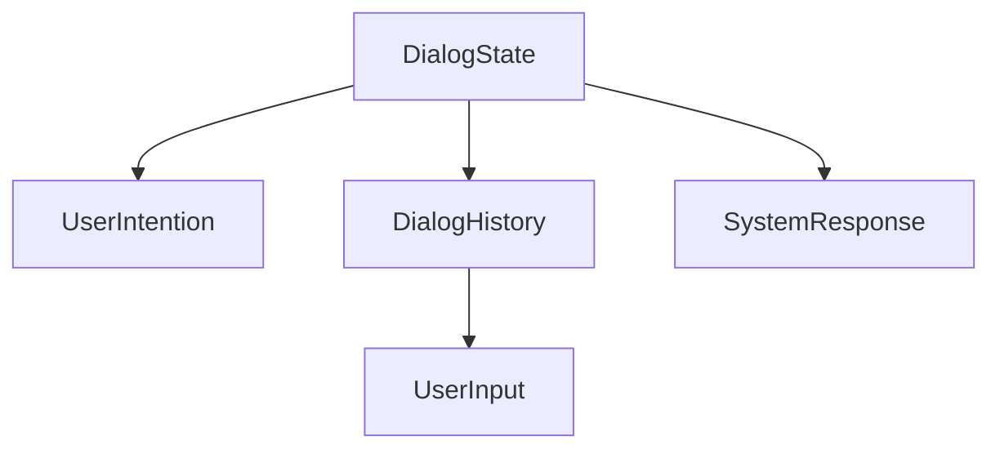
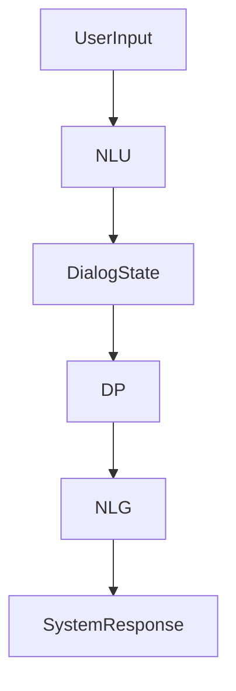

                 


# 对话管理系统：构建流畅自然的人机交互

---

## 关键词：
- 对话管理
- 人机交互
- 自然语言处理
- 对话系统
- 算法原理

---

## 摘要：
对话管理系统是实现人机交互的核心技术，旨在通过自然语言处理和智能算法，构建流畅、自然的对话流程。本文从对话管理的基本概念出发，系统性地分析对话状态表示、对话策略选择和对话生成的算法原理，结合实际案例，详细讲解对话系统的架构设计与实现方法。通过理论与实践相结合的方式，帮助读者全面掌握对话管理系统的构建与优化技巧。

---

# 第1章: 对话管理系统的背景与概念

## 1.1 对话管理的基本概念
### 1.1.1 对话管理的定义与作用
对话管理（Dialog Management）是指通过算法和规则，控制对话流程，确保对话的连贯性和目标性。它是实现人机交互的核心技术，能够理解用户意图、维护对话上下文，并生成合适的系统响应。

### 1.1.2 对话管理的核心问题与挑战
对话管理面临以下核心问题：
- 对话状态表示：如何准确捕捉和表示当前对话的状态？
- 对话策略选择：如何选择最优的对话策略以实现目标？
- 对话生成：如何生成自然、流畅的对话内容？

挑战包括：
- 对话的不确定性：用户输入可能有歧义。
- 对话的动态性：对话状态需要实时更新。
- 对话的上下文依赖性：对话内容受历史信息影响。

### 1.1.3 对话管理的边界与外延
对话管理的边界包括：
- 输入：用户输入的自然语言文本。
- 输出：系统生成的自然语言回复。
- 上下文：对话历史和相关知识库。

外延包括：
- 自然语言理解（NLU）：解析用户输入。
- 自然语言生成（NLG）：生成系统回复。
- 知识库：提供对话所需的信息支持。

---

## 1.2 对话管理系统的应用场景
### 1.2.1 智能客服对话
对话管理系统广泛应用于智能客服，通过自动解析用户问题并生成回复，提升服务效率和用户体验。

### 1.2.2 智能音箱与智能家居
在智能音箱和智能家居中，对话管理系统负责处理用户的语音指令，实现设备控制和信息查询。

### 1.2.3 虚拟助手与人机交互
对话管理系统是虚拟助手（如Siri、Alexa）的核心技术，支持用户与设备进行自然对话。

---

## 1.3 对话管理系统的价值与意义
### 1.3.1 提升用户体验的核心作用
对话管理系统通过理解用户意图和上下文，提供个性化的对话服务，显著提升用户体验。

### 1.3.2 降低开发成本的技术优势
通过标准化的对话管理框架，减少人工干预，降低开发和维护成本。

### 1.3.3 未来人机交互的发展趋势
随着AI技术的进步，对话管理系统将更加智能化，推动人机交互向更自然、更智能的方向发展。

---

## 1.4 本章小结
本章从对话管理的基本概念出发，介绍了对话管理的核心问题与挑战，以及其在智能客服、智能音箱和虚拟助手等场景中的应用价值。

---

# 第2章: 对话管理系统的核心概念与联系

## 2.1 对话状态表示
### 2.1.1 对话状态的定义与表示方法
对话状态表示（Dialog State Representation）是对话管理的基础，用于记录当前对话的上下文信息。常见的表示方法包括：
- **基于槽位的表示法**：将对话状态表示为槽位（slot）和值（value）的组合。
- **基于向量的表示法**：将对话状态表示为向量形式，便于与深度学习模型结合。

### 2.1.2 对话状态表示的特征对比
| 特征         | 基于槽位的表示法 | 基于向量的表示法 |
|--------------|-----------------|-----------------|
| 表达能力     | 精确但缺乏语义关联 | 具备语义关联，表达能力强 |
| 实现难度     | 较低             | 较高             |
| 适用场景     | 结构化任务       | 非结构化任务     |

### 2.1.3 对话状态表示的ER实体关系图



---

## 2.2 对话策略与生成
### 2.2.1 对话策略的定义与分类
对话策略（Dialog Policy）是指系统在给定对话状态下选择下一步行动的规则或模型。常见的分类包括：
- **基于规则的策略**：通过预定义的规则进行决策。
- **基于模型的策略**：利用机器学习模型进行预测和决策。

### 2.2.2 对话生成的原理与方法
对话生成（Dialog Generation）是通过算法生成符合用户意图的回复。常用方法包括：
- **模板生成法**：基于预定义模板生成回复。
- **生成模型法**：利用深度学习模型（如Transformer）生成回复。

### 2.2.3 对话策略与生成的对比表格

| 对比维度       | 对话策略             | 对话生成             |
|----------------|----------------------|----------------------|
| 目标           | 选择最优行动         | 生成回复内容         |
| 方法           | 基于规则或模型       | 基于模板或生成模型   |
| 输出           | 动作或行为           | 文本回复             |

---

## 2.3 对话系统的整体架构
### 2.3.1 对话系统的模块划分
对话系统通常包括以下模块：
- **自然语言理解（NLU）**：解析用户输入。
- **对话状态管理（DST）**：维护对话状态。
- **对话策略管理（DP）**：选择对话策略。
- **自然语言生成（NLG）**：生成系统回复。

### 2.3.2 对话系统的整体流程图



---

## 2.4 本章小结
本章详细讲解了对话状态表示、对话策略和对话生成的核心概念，并通过对比分析和流程图展示了它们之间的联系。

---

# 第3章: 对话管理系统的算法原理

## 3.1 对话状态表示的算法
### 3.1.1 基于向量的对话状态表示方法
基于向量的表示方法通过将对话状态映射到向量空间，便于与深度学习模型结合。例如，使用Word2Vec将槽位值映射为向量。

### 3.1.2 基于图结构的对话状态表示
基于图结构的表示方法通过构建知识图谱，表示对话状态中的实体关系。例如，使用图嵌入（Graph Embedding）技术。

### 3.1.3 对话状态表示的数学模型
对话状态表示的数学模型可以表示为：
$$
S = \{s_1, s_2, ..., s_n\}
$$
其中，$s_i$ 表示槽位，$S$ 表示对话状态集合。

---

## 3.2 对话策略选择的算法
### 3.2.1 基于规则的对话策略
基于规则的策略通过预定义规则进行决策。例如，当用户输入“订单查询”，系统选择“查询订单”动作。

### 3.2.2 基于强化学习的对话策略
基于强化学习的策略通过训练一个模型，使其在对话过程中不断优化策略。常用的算法包括：
- **Q-Learning**：通过状态-动作对更新Q值。
- **Deep Q-Network (DQN)**：使用深度神经网络近似Q值函数。

### 3.2.3 对话策略选择的数学模型
对话策略选择的数学模型可以表示为：
$$
a = \arg\max_{a} Q(s, a)
$$
其中，$s$ 是对话状态，$a$ 是动作，$Q(s, a)$ 是Q值。

---

## 3.3 对话生成的算法
### 3.3.1 基于模板的对话生成
基于模板的生成方法通过匹配用户输入到预定义模板中，生成回复。例如：
```
if意图 == '问候':
    return '您好！有什么可以帮助您的吗？'
```

### 3.3.2 基于生成模型的对话生成
基于生成模型的对话生成方法通过训练模型生成回复。常用的模型包括：
- **Seq2Seq模型**：基于编码器-解码器结构。
- **Transformer模型**：利用自注意力机制生成回复。

### 3.3.3 对话生成的数学模型
对话生成的数学模型可以表示为：
$$
P(y|x) = \prod_{i=1}^{n} P(y_i|x, y_{<i})
$$
其中，$x$ 是输入，$y$ 是生成的回复。

---

## 3.4 本章小结
本章详细讲解了对话状态表示、对话策略选择和对话生成的算法原理，并通过数学公式和流程图展示了它们的实现方法。

---

接下来的章节将围绕对话系统的具体实现、项目实战和优化方法展开，帮助读者全面掌握对话管理系统的构建与优化技巧。

